# Les 1.1: Introductie Unity en Projectstructuur

## Wat Ga Je Leren?

In deze allereerste les maak je kennis met Unity en leer je de basis van hoe een Unity project werkt. Je gaat:

- Unity installeren en je eerste project maken
- De Unity interface leren kennen
- Begrijpen wat GameObjects en Scenes zijn
- Je eerste GameObject maken en bewerken
- Leren hoe Unity projecten zijn georganiseerd

---

## Wat is Unity?

Unity is een **game engine** - een programma waarmee je games kunt maken zonder alles vanaf nul te bouwen.


### Waarom Unity?

- **Beginner vriendelijk**: Je hoeft niet alles zelf te programmeren
- **Visueel**: Je sleept en plaatst objecten in plaats van alleen code typen
- **Krachtig**: Wordt gebruikt voor professionele games
- **Gratis**: De basis versie kost niets
- **Multi-platform**: Maak een game en publiceer op PC, mobiel, console, web

### Populaire Unity Games

Unity wordt gebruikt voor bekende games zoals:

- **Hearthstone** (Blizzard)
- **Pokémon GO** (Niantic)
- **Ori and the Blind Forest** (Moon Studios)
- **Cities: Skylines** (Colossal Order)
- **Cuphead** (Studio MDHR)

---

## Unity Installeren

### Stap 1: Unity Hub Downloaden

1. Ga naar [unity.com/downloads](https://unity.com/Downloads)
2. Download **Unity Hub** (dit beheert al je Unity versies)
3. Installeer Unity Hub

### Stap 2: Unity Editor Installeren

1. Open Unity Hub
2. Ga naar **"Installs"** tab
3. Klik **"Install Editor"**
4. Kies de laatste **LTS** versie van **Unity 6** (LTS = Long Term Support)
5. Selecteer deze modules:
   - **Visual Studio Community** (voor code schrijven)
   - **Android Build Support** (optioneel voor mobiele games)
   - **WebGL Build Support** (optioneel voor browser games)

**Tip:** LTS versies zijn stabieler en worden langer ondersteund!

---

## Je Eerste Unity Project

### Stap 1: Nieuw Project Maken

1. Open Unity Hub
2. Klik **"New Project"**
3. Kies **"Universal 2D"** template
4. Geef je project een naam: `MijnEersteGame`
5. Kies een locatie op je computer
6. Klik **"Create Project"**

Unity opent nu en laadt je nieuwe project!

### Stap 2: Eerste Indruk

Je ziet nu de Unity Editor - dit is waar alle magie gebeurt! Het kan even duren voordat alles geladen is.

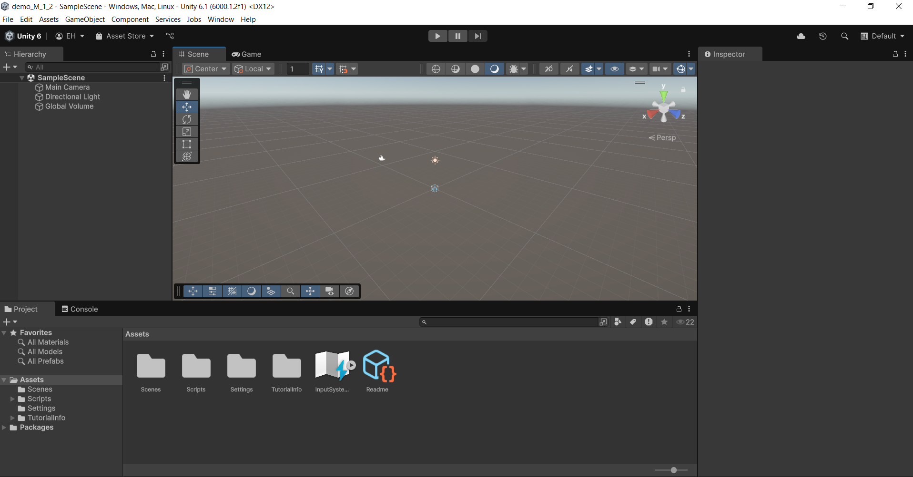

---

## Unity Interface Verkennen

De Unity interface bestaat uit verschillende **vensters** (windows). Elke heeft een specifieke functie:

### 1. Scene View (Midden)

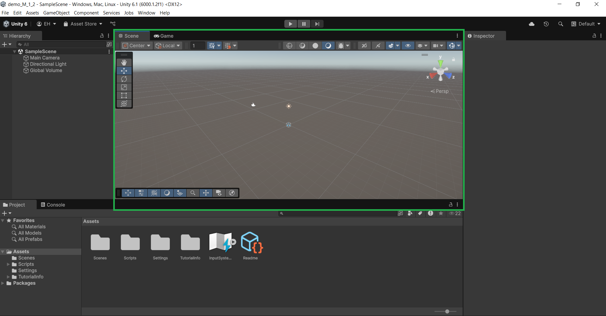

**Wat is dit?**

- Dit is je **werkruimte** waar je je game bouwt
- Hier plaats en beweeg je alle objecten
- Het is zoals een 3D/2D studio waar je je film opneemt

**Belangrijke knoppen:**

- **Hand Tool** (Q): Beweeg de camera
- **Move Tool** (W): Verplaats objecten
- **Rotate Tool** (E): Draai objecten
- **Scale Tool** (R): Maak objecten groter/kleiner

### 2. Game View (Tab naast Scene)

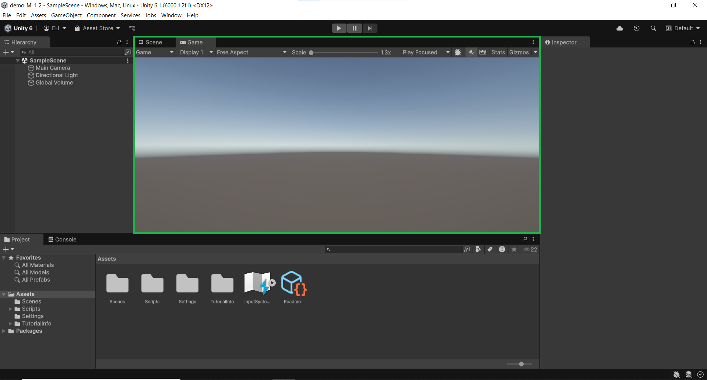

**Wat is dit?**

- Dit toont hoe je game eruit ziet voor de speler
- Klik op **Play** ▶️ om je game te testen
- De camera bepaalt wat de speler ziet

### 3. Hierarchy Window (Links)

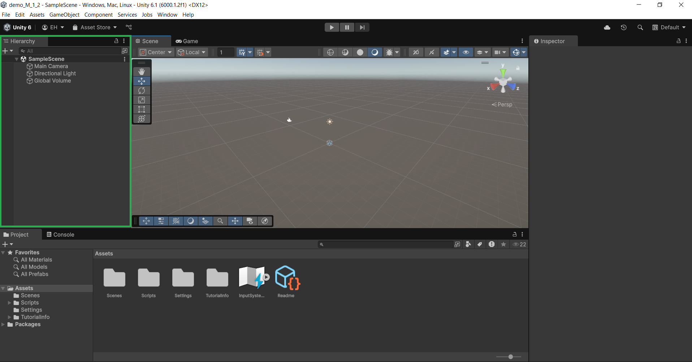

**Wat is dit?**

- Een **lijst van alle objecten** in je huidige scene
- Elk object heeft een naam
- Je kunt objecten selecteren door erop te klikken

**Standaard objecten:**

- **Main Camera**: De "ogen" van de speler
- **Global Volume**: Regelt visuele effecten en belichting voor je hele scene
- **Directional Light**: Verlicht je scene (in 3D)

### 4. Inspector Window (Rechts)

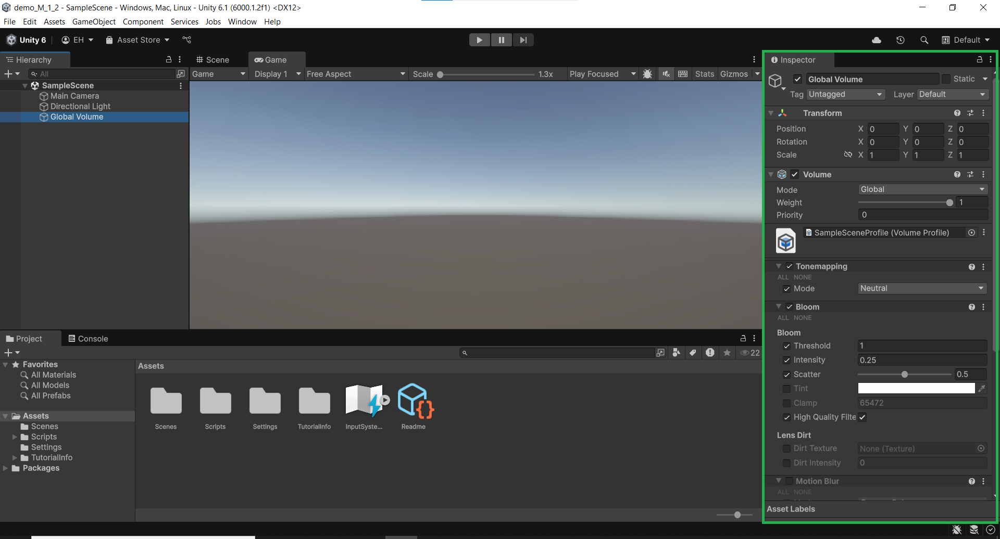

**Wat is dit?**

- Toont **eigenschappen** van het geselecteerde object
- Hier kun je alles aanpassen: positie, grootte, kleur, etc.
- Het is zoals de "instellingen" van elk object

**Voorbeeld: Als je Global Volume selecteert:**

- Je ziet instellingen voor visuele effecten
- Zoals kleurfilters, contrasten en speciale effecten
- Deze zijn standaard ingesteld, maar je kunt ze later aanpassen

### 5. Project Window (Onderin)

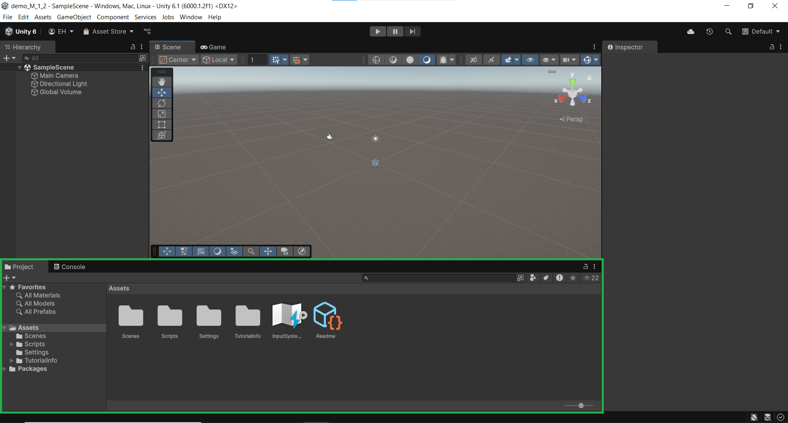

**Wat is dit?**

- Je **"gereedschapskist"** met alle bestanden
- Hier staan scripts, plaatjes, geluiden, etc.
- Zoals de mappen op je computer

**Tip: Show in Explorer:**

Als je rechts klikt in in het project window krijg je de optie **"Show in Explorer"**.

Klik daar maar eens op en je vind netjes de locatie van je unity project terug op je PC.

### 6. Console Window (Tab naast Project)

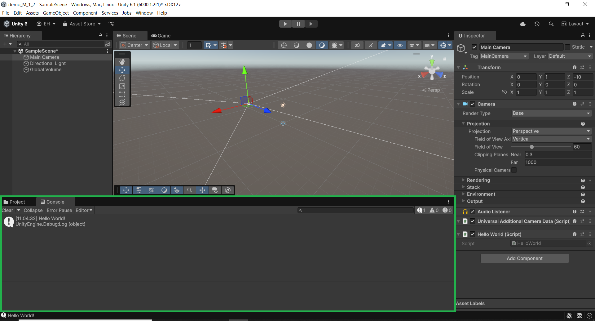

**Wat is dit?**

- Toont **berichten** van je code
- Foutmeldingen verschijnen hier ook
- Heel belangrijk voor het debuggen van code!

---

## Wat Zijn GameObjects?

### Het Belangrijkste Concept

**Alles in Unity is een GameObject!**

- Een speler = GameObject
- Een vijand = GameObject
- Een muur = GameObject
- Een pickup item = GameObject
- Zelfs de camera = GameObject

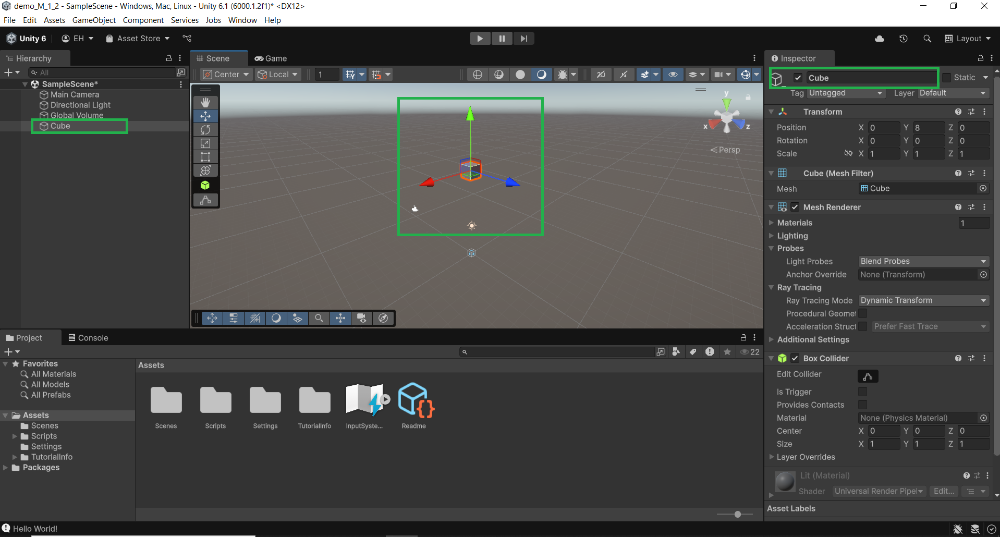

### Eigenschappen van GameObjects

1. **Name**: Elke GameObject heeft een naam
2. **Transform**: Positie, rotatie en grootte
3. **Components**: Onderdelen die functionaliteit toevoegen

**Vergelijking:**
Een GameObject is zoals een **LEGO blokje**. Op zichzelf doet het niet veel, maar je kunt er onderdelen (components) aan vastmaken om het speciaal te maken!

Dus de components die op een gameobject zitten bepalen de mogelijkheden en gedrag van het gameobject

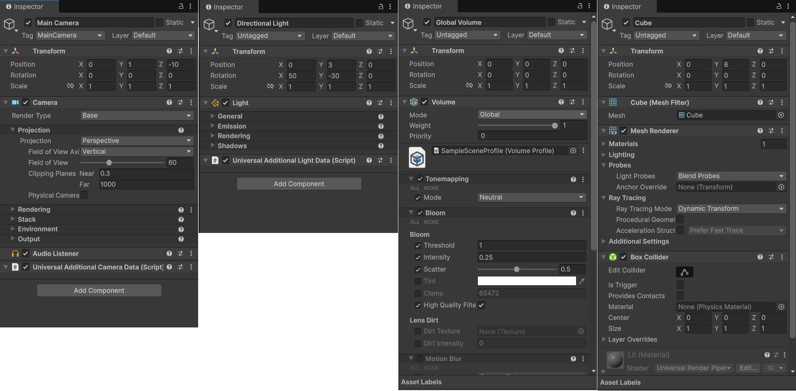

---

## Je Eerste GameObject Maken

### Stap 1: Een Cube Maken

1. **Rechtsklik** in de Hierarchy
2. Kies **3D Object → Cube**
3. Een nieuwe cube verschijnt in je scene!

### Stap 2: De Cube Bewerken

1. **Selecteer** de cube in de Hierarchy of de Scene
2. Kijk naar de **Inspector** (rechts)
3. Probeer deze instellingen te veranderen:

**Transform Component:**

- **Position**: Verplaats de cube (x, y, z coördinaten)
- **Rotation**: Draai de cube
- **Scale**: Maak de cube groter of kleiner

**Wauw!** Je kubus valt nu naar beneden door zwaartekracht!

**Experimenten:**

- Zet Position X op 2
- Zet Rotation Z op 45
- Zet Scale Y op 3

**Tips:**

- Gebruik de controls in de Scene view om gameobjecten te manipuleren
- Houd de **rechtermuisknop** in om de scene view te **draaien**
- Houd de **scrollknop** in om de scene view te **pannen**
- Gebruik de scrollknop om in en uit te zoomen
- Dubbelklik op je gameobject in de hierarchy om de scene view weer te focussen op het object

## 

### Local vs Global Transform Modes

In de Scene View zie je bovenin een toggle knop tussen **Local** en **Global**. Dit bepaalt hoe Unity je GameObjects manipuleert:

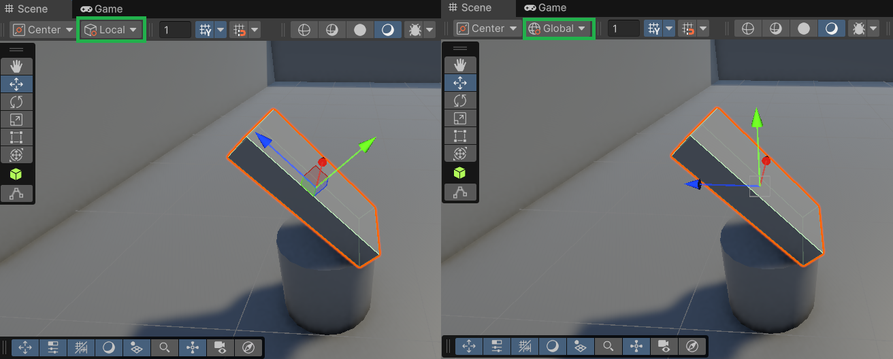

#### Global Mode

- **Wereldcoördinaten** - alles relatief aan de scene
- **X-as** wijst altijd naar rechts (rood)
- **Y-as** wijst altijd omhoog (groen)
- **Z-as** wijst altijd vooruit (blauw)
- Handig voor: Objecten precies plaatsen in de wereld

#### Local Mode

- **Object coördinaten** - relatief aan het object zelf
- **Assen draaien mee** met je GameObject
- Handig voor: Objecten ten opzichte van zichzelf bewegen

## Wat Zijn Scenes?

### Scene = Een Level

Een **Scene** is zoals een **level** in je game:

- **Menu Scene**: Het hoofdmenu
- **Level1 Scene**: Het eerste level
- **GameOver Scene**: Het game over scherm

### Scene Beheren

**Nieuwe Scene maken:**

1. **Rechtsklikken in het project window → Create → Scene → Scene**
2. **Verander de naam**

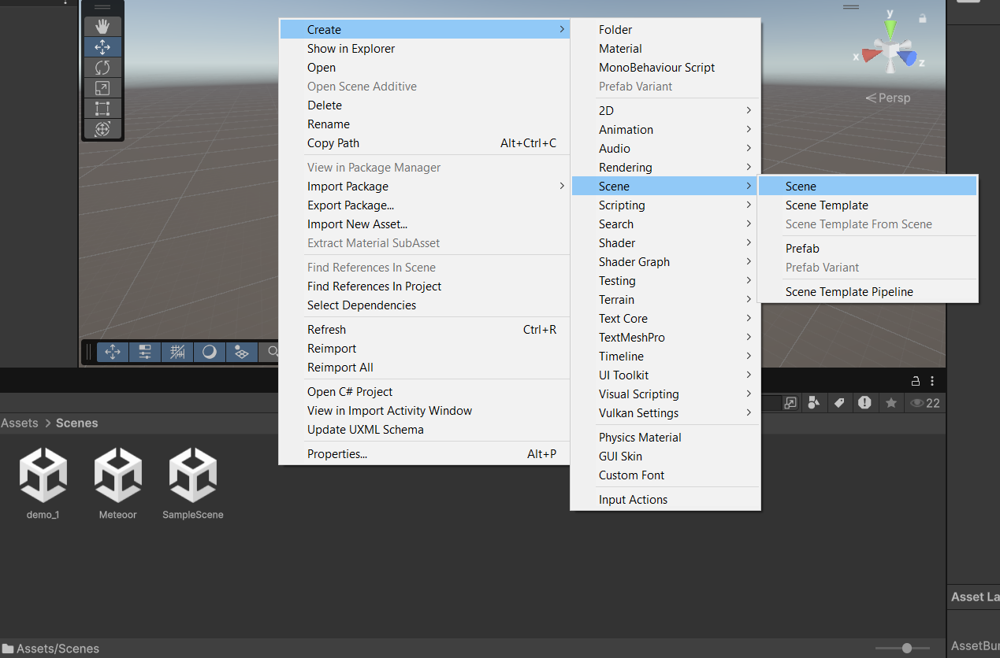

**Scene laden:**

1. **Dubbelklik op een scene in je project window**

**Tip:** Je kunt meerdere scenes hebben en ertussen schakelen!

---

## Project Organisatie

### Mappenstructuur

Een goed georganiseerd project ziet er zo uit:

```
Assets/
├── Scripts/        (Al je code bestanden)
├── Scenes/         (Je levels)
├── Sprites/        (2D plaatjes)
├── Materials/      (3D materialen en kleuren)
├── Audio/          (Geluidsbestanden)
└── Prefabs/        (Herbruikbare objecten)
```

### Mappen Maken

1. **Rechtsklik** in Project window
2. **Create → Folder**
3. Geef de map een naam

**Opdracht:** Maak deze mappen aan in je project!

---

## Je Eerste Scene Bouwen

### Mini Opdracht: Bouw een Simpele Scene

**Doel:** Maak een eenvoudige scene met verschillende objecten

**Stappen:**

1. Voeg 3-5 verschillende GameObjects toe
2. Geef ze verschillende posities
3. Verander hun grootte en rotatie
4. Geef ze logische namen in de Hierarchy
5. Sla je scene op als "MijnEersteScene"

**Extra uitdaging:**

- Verander de kleuren van objecten (via Materials)
- Probeer objecten in elkaar te plaatsen
- Maak een "toren" van objecten

---

## Play Mode - Je Game Testen

### De Play Knop

**▶️ Play Button:**

- Klik hierop om je game te testen
- De Game View toont wat de speler ziet
- Klik nogmaals om te stoppen

### Belangrijke Waarschuwing!

**LET OP:** Alle veranderingen die je maakt tijdens Play Mode gaan verloren wanneer je stopt!

**Tip:** Verander de playmode tint zodat je het altijd duidelijk ziet wanneer Unity op playmode staat.

**Edit → Preferences → Colors → Playmode Tint**

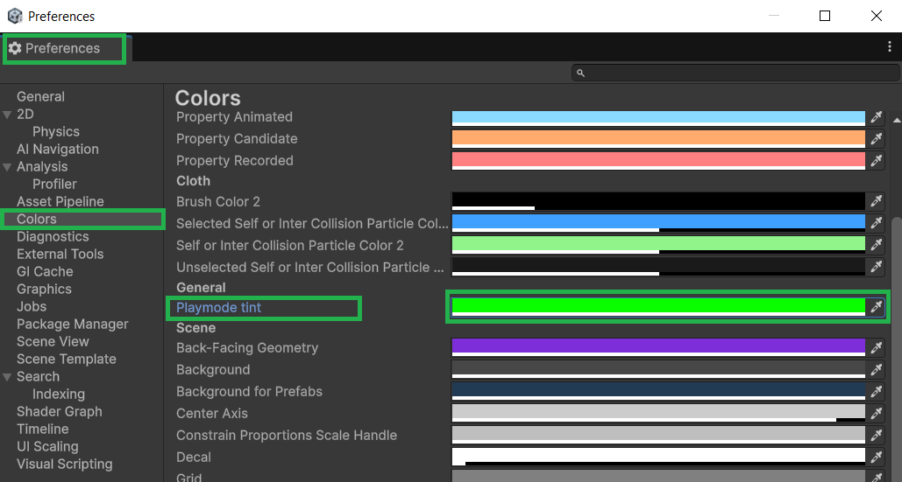

---

## Camera Basics

### De Main Camera

De **Main Camera** bepaalt wat de speler ziet:

- **Position**: Waar de camera staat
- **Rotation**: Welke kant de camera op kijkt
- **Field of View**: Hoe "wijd" de camera kijkt (zoals een zoomlens)

### Camera Bewegen

1. Selecteer de **Main Camera**
2. Verander de **Position** in de Inspector
3. Druk op **Play** om het effect te zien

**Experiment:**

- Zet de camera hoger (Y = 5)
- Laat de camera naar beneden kijken (Rotation X = 45)

---

## Aantekeningen maken

Maak aantekeningen over de behandelde stof in de les. Schrijf het nu zo op zodat je het later makkelijk begrijpt als je het terugleest.

**Belangrijke punten om te noteren:**

- Wat zijn GameObjects en wat kun je ermee?
- Wat is het verschil tussen Scene View en Game View?
- Welke belangrijkste vensters (windows) heeft Unity?
- Hoe maak je een nieuwe GameObject?
- Wat doet de Transform component?

Schrijf ook op wat je niet hebt begrepen uit deze les. Dan kun je hier later nog vragen over stellen aan de docent.

Bewaar al je aantekeningen goed! Deze moet je aan het einde van de periode inleveren.


## Oefeningen uitvoeren

Doe nu minimaal 1 oefening naar keuze voor les 1.1
De oefeningen vind je [hier](../Oefeningen/oefeningen_1_1.md) terug


## Wat Heb Je Geleerd?

### Checklist

- [ ] Je hebt Unity geïnstalleerd en je eerste project gemaakt
- [ ] Je kent de belangrijkste Unity vensters (Scene, Game, Hierarchy, Inspector, Project)
- [ ] Je weet wat GameObjects zijn en hoe je ze maakt
- [ ] Je begrijpt wat de Transform component doet (Position, Rotation, Scale)
- [ ] Je weet wat Scenes zijn en hoe je ze opslaat
- [ ] Je kunt objecten plaatsen en bewerken in je scene
- [ ] Je hebt je eerste scene gebouwd met meerdere objecten
- [ ] Je weet hoe je Play Mode gebruikt om je game te testen

### Volgende Stap

In Les 1.2 gaan we onze eerste code schrijven! Dan leren we hoe we GameObjects kunnen besturen met C# scripts.

---

## Veelgestelde Vragen

### Q: Unity crash of werkt traag op mijn computer?

**A:**

- Sluit andere programma's af om geheugen vrij te maken
- Kies lagere graphics instellingen in je project
- Zorg dat je computer voldoet aan Unity's minimum requirements

### Q: Ik kan de Game View niet vinden?

**A:** Ga naar **Window → General → Game** om het venster te openen. Je kunt vensters ook verplaatsen door ze te slepen.

### Q: Mijn objecten zijn verdwenen!

**A:**

- Check of ze nog in de Hierarchy staan
- Misschien staan ze buiten de camera view - selecteer het object en druk **F** om erop in te zoomen
- Reset de Position naar (0, 0, 0)

### Q: Ik heb per ongeluk iets verwijderd!

**A:** Gebruik **Ctrl + Z** om de laatste actie ongedaan te maken. Unity onthoudt veel stappen!

### Q: Waarom ziet mijn Game View er anders uit dan Scene View?

**A:** De Game View toont alleen wat de camera ziet. Beweeg de camera of verander de camera instellingen om meer/minder te zien.

### Q: Mijn schermen staan niet meer op zijn plaats en ik kan ze niet meer terugvinden?

**A:** Je schermen kun je zelf een nieuwe indeling geven. Wellicht heb je hem per ongeluk verwijderd of op een onhandige plek gezet. Je kunt altijd via **Window → Layouts → Reset All Layouts** alle schermen weer terugzetten op hun originele plek.

---
