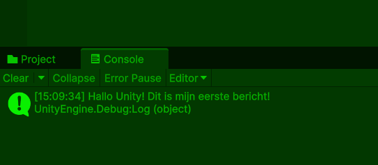

# Les 1.2: Introductie Scripting in C#

## Wat Ga Je Leren?

In deze les leer je de allereerste stappen van programmeren in Unity. Je gaat:

- Je eerste script schrijven
- Begrijpen wat code eigenlijk is
- Debug.Log() gebruiken om berichten te tonen
- Comments toevoegen aan je code
- De basisstructuur van een C# script begrijpen

---

## Wat is Programmeren?

Programmeren is eigenlijk heel simpel: **het is het geven van instructies aan de computer**.

Stel je voor dat je een recept schrijft voor het maken van pannenkoeken:

1. Pak een kom
2. Doe bloem in de kom
3. Voeg melk toe
4. Roer het mengsel
5. Bak de pannenkoek

Programmeren werkt precies zo! Je schrijft stap-voor-stap instructies die de computer kan volgen.

### Waarom Programmeren in Games?

In games gebruik je code om:

- Een speler te laten bewegen
- Vijanden te laten reageren
- Geluid af te spelen
- Explosies te maken
- Punten bij te houden
- En nog veel meer

Eigenlijk wordt al het gedrag in je game bestuurd door code.

---

## Je Eerste Script Maken

### Stap 1: Maak een Nieuw Script

1. **Rechtsklik** in je Project window (onderin Unity)
2. Kies **Create → C# Script**
3. Noem je script `MijnEersteScript`
4. **Dubbelklik** op het script om het te openen

### Stap 2: Wat Zie Je?

Als je script opent in de code editor (meestal Visual Studio), zie je dit:

```csharp
using System.Collections;
using System.Collections.Generic;
using UnityEngine;

public class MijnEersteScript : MonoBehaviour
{
    // Start is called before the first frame update
    void Start()
    {

    }

    // Update is called once per frame
    void Update()
    {

    }
}
```

**😱 Geen paniek!** Dit ziet er ingewikkeld uit, maar het is eigenlijk heel logisch.

---

## De Basisstructuur Uitgelegd

Laten we dit stap voor stap uitleggen:

### Using Statements (De Bibliotheek)

```csharp
using System.Collections;
using System.Collections.Generic;
using UnityEngine;
```

**Wat doet dit?**

- Dit zijn zoals "gereedschapskisten" die je opent
- Je zegt tegen de computer: "Ik wil deze tools kunnen gebruiken"
- `UnityEngine` geeft je toegang tot alle Unity methoden

**Vergelijking:**
Het is alsof je in een keuken bent en zegt: "Ik wil de messen, pannen én kruiden kunnen gebruiken."

### De Class (De blauwdruk)

```csharp
public class MijnEersteScript : MonoBehaviour
{
    // Hier komt al je code
}
```

**Wat doet dit?**

- `class` = Dit is een **blauwdruk** bijv. van een vliegtuig - het beschrijft hoe het werkt, maar kan zelf niet vliegen
- `MijnEersteScript` = De naam van je blauwdruk (altijd hetzelfde als je bestandsnaam!)
- `MonoBehaviour` = Dit zegt dat je blauwdruk gebruikt kan worden om echte vliegtuigen te maken die aan GameObjects kunnen worden gehangen
- De `{ }` = Dit zijn de grenzen van je blauwdruk waar alle instructies in staan

**Vergelijking:**
Een class is zoals een **blauwdruk van een vliegtuig**. De blauwdruk zelf kan niet vliegen, maar je kunt er wel echte vliegtuigen mee bouwen. Wanneer je dit script aan een GameObject hangt, maak je een **echte instantie** (een echt vliegtuig) dat wel kan "vliegen" in je game!


### Start Functie (De Voorbereiding)

```csharp
void Start()
{
    // Deze code wordt 1 keer uitgevoerd aan het begin
}
```

**Wat doet dit?**

- Start wordt **één keer** uitgevoerd wanneer je game begint
- Perfect voor dingen die je wilt instellen
- Zoals het inladen van een level of het zetten van startwaarden

**Vergelijking:**
Dit is zoals de voorbereiding voor een toneelstuk - je zet alles klaar voordat het echte werk begint.

### Update Functie (De Hoofdlus)

```csharp
void Update()
{
    // Deze code wordt elke frame herhaald
}
```

**Wat doet dit?**

- Update wordt **elke frame** herhaald (meestal 60 keer per seconde!)
- Perfect voor dingen die constant moeten gebeuren
- Zoals beweging, input controleren, of animaties

**Vergelijking:**
Dit is zoals elke nieuwe foto of schets in een flipbook - het gebeurt super snel en continu.


---

## Debug.Log() - Je Eerste Code!

### Wat is Debug.Log()?

`Debug.Log()` is zoals een megafoon voor je code. Het laat je berichten zien in Unity's Console window.

### Je Eerste Bericht

Vervang je Start functie met dit:

```csharp
void Start()
{
    Debug.Log("Hallo Unity! Dit is mijn eerste bericht!");
}
```



### Probeer Het Uit!

1. **Sla je script op** (Ctrl + S)
2. **Ga terug naar Unity**
3. **Sleep je script op een GameObject** (bijvoorbeeld de Main Camera)
4. **Druk op Play** ▶️

**Gefeliciteerd!** Je hebt je eerste code geschreven!

### Experimenten

Probeer deze verschillende berichten:

```csharp
void Start()
{
    Debug.Log("Welkom bij mijn game!");
    Debug.Log("De game is gestart!");
    Debug.Log("Ik ben een programmeur!");
}
```

**Fun Fact:** Je kunt ook cijfers en berekeningen loggen:

```csharp
void Start()
{
    Debug.Log(5 + 3); // Dit toont: 8
    Debug.Log("Mijn leeftijd is: " + 16);
}
```

---

## Comments - Notities in Je Code

### Wat Zijn Comments?

Comments zijn **notities voor jezelf** in je code. De computer (compiler) negeert ze compleet, maar jij kunt ze lezen om te onthouden wat je code doet.

### Twee Soorten Comments

#### 1. Enkele Lijn Comment

```csharp
// Dit is een comment op één regel
Debug.Log("Hallo!"); // Je kunt ook achter code commenten
```

#### 2. Meerdere Regels Comment

```csharp
/*
Dit is een comment
over meerdere regels.
Handig voor lange uitleg!
*/
```

### Waarom Comments Gebruiken?

Comments gebruik je vooral voor jezelf en later als je gaat samenwerken voor je teamleden. Je geeft kort maar krachtig uitleg over hoe je code werkt, zodat je het later snel weer begrijpt als er iets moet worden aangepast.

**Zo ziet het eruit met comments:**

```csharp
void Start()
{
    // Welkomstbericht voor de speler
    Debug.Log("Game started");

    // Laat zien hoeveel tijd er verstreken is
    Debug.Log(Time.time);
}
```

### Comment Tips

**Goede comments:**

```csharp
// Controleer of de speler springt
// Bereken de afstand tot de vijand
// Sla de highscore op
```

**Slechte comments:**

```csharp
// Debug.Log uitvoeren
Debug.Log("test"); // Dit is duidelijk genoeg zonder comment
```

---

## Aantekeningen maken

Maak aantekeningen over de behandelde stof in de les. Schrijf het nu zo op zodat je het later makkelijk begrijpt als je het terugleest.

Schrijf ook op wat je niet hebt begrepen uit deze les. Dan kun je hier later nog vragen over stellen aan de docent.

Bewaar al je aantekeningen goed!. Deze moet je aan het einde van de periode inleveren.


## Oefeningen uitvoeren

Doe nu minimaal 1 oefening naar keuze voor les 1.2
De oefeningen vind je [hier](../Oefeningen/oefeningen_1_2.md) terug


## Wat Heb Je Geleerd?

### Checklist

- [ ] Je weet wat programmeren is (instructies geven aan de computer)
- [ ] Je kunt een nieuw C# script aanmaken
- [ ] Je begrijpt de basisstructuur van een script
- [ ] Je weet wat `Start()` en `Update()` doen
- [ ] Je kunt `Debug.Log()` gebruiken om berichten te tonen
- [ ] Je weet hoe je comments toevoegt met `//` en `/* */`
- [ ] Je hebt je eerste werkende script gemaakt!

### Volgende Stap

In Les 2.1 gaan we GameObjects leren besturen met onze code. Dan wordt het pas echt interessant!

---

## Veelgestelde Vragen

### Q: Waarom krijg ik rode lijntjes in mijn code?

**A:** Rode lijntjes betekenen fouten. Meestal vergeet je een `;` of heb je een spellingsfout. Unity helpt je door de fout uit te leggen.

### Q: Waarom zie ik mijn Debug.Log berichten niet?

**A:**

1. Zorg dat je script op een GameObject staat
2. Druk op Play ▶️
3. Open het Console window (Window → General → Console)

### Q: Wat als ik een fout maak?

**A:** Fouten maken is normaal en zelfs goed! Je leert het meest van fouten. Unity vertelt je altijd wat er mis is.

### Q: Moet ik alles onthouden?

**A:** Nee! Zelfs professionele programmeurs zoeken dingen op. Het belangrijkste is dat je begrijpt hoe het werkt. Maak ook aantekeningen die je later zelf weer makkelijk kunt begrijpen!

---
