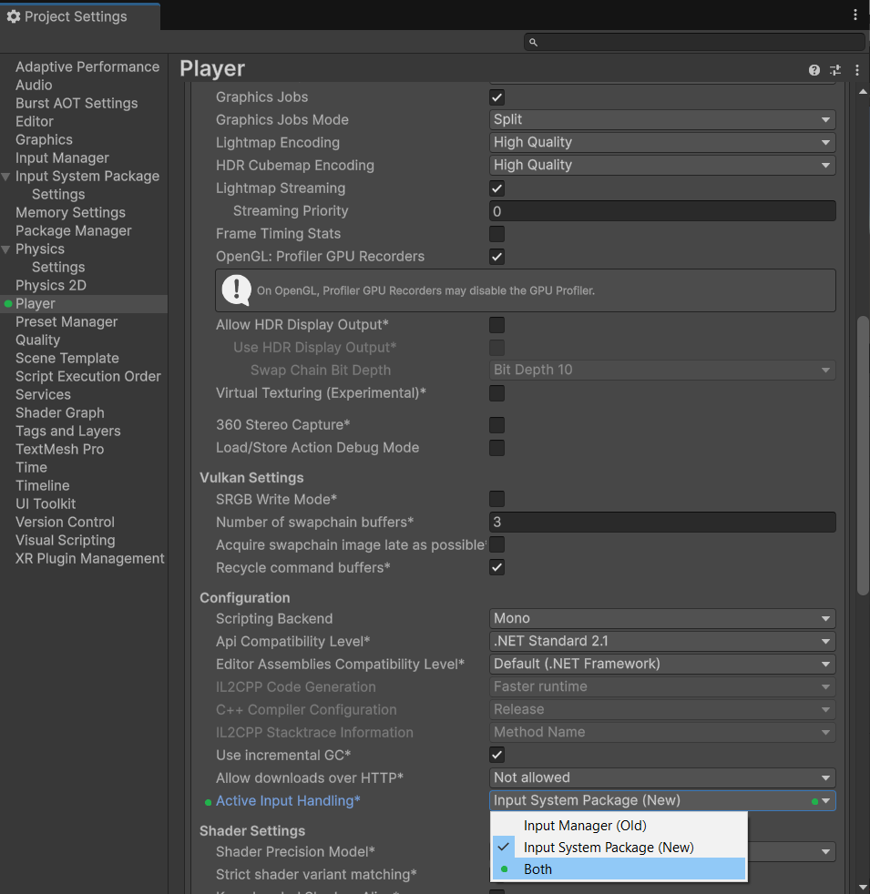
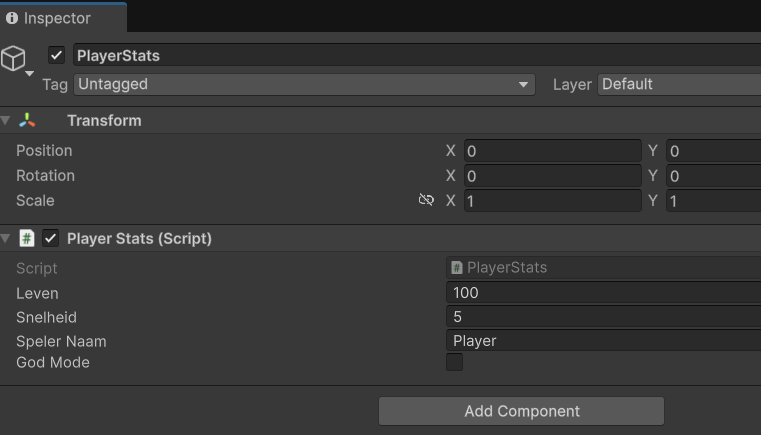
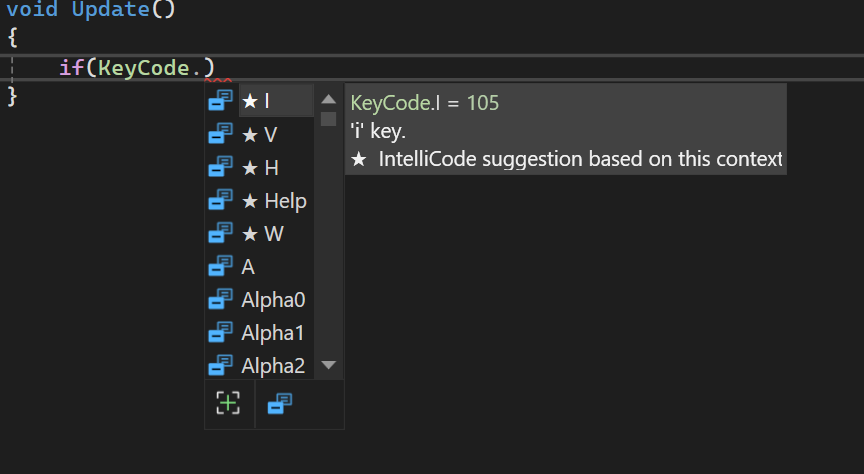

# Les 2.2: Datatypes, Variabelen en Input

## Wat Ga Je Leren?

In deze les leer je hoe je informatie kunt opslaan en gebruiken in je code. Je gaat:

- Begrijpen wat variabelen zijn en waarom ze handig zijn
- Verschillende datatypes leren kennen (int, float, string, bool)
- Je eerste variabelen aanmaken en gebruiken
- Input van het toetsenbord verwerken
- Een eenvoudig bewegingssysteem maken

---

## Wat Zijn Variabelen?

Variabelen zijn zoals **dozen met labels** waarin je informatie kunt bewaren voor later gebruik.

Stel je voor dat je verschillende dozen hebt:

**"Naam"** → bevat "Jan"  
**"Leeftijd"** → bevat 16  
**"Leven"** → bevat 100  
**"IsGameOver"** → bevat false

In programmeren noemen we deze dozen **variabelen**.


### Waarom Variabelen in Games?

In games gebruik je variabelen om te onthouden:

- **Speler positie** → waar staat de speler?
- **Health/leven** → hoeveel leven heeft de speler?
- **Score** → hoeveel punten heeft de speler?
- **Snelheid** → hoe snel beweegt de speler?
- **Game staat** → is het game over?

---

## Datatypes - Verschillende Soorten Dozen

Net zoals je verschillende soorten dozen hebt (schoenendoos, pizzadoos, etc.), zijn er verschillende **datatypes** voor verschillende soorten informatie.

### 1. Int (Gehele Getallen)

```csharp
int leven = 100;
int score = 1250;
int vijanden = 5;
```

**Gebruik voor:**

- Aantal items
- Score/punten
- Leven/health
- Level nummer

### 2. Float (Kommagetallen, maar dan met een punt)

```csharp
float snelheid = 5.5f;
float tijd = 12.34f;
float temperatuur = 98.6f;
```

**Belangrijk:**

- Zet altijd een `f` achter float getallen! (staat voor 'float')
- Gebruik geen komma maar een punt!

**Gebruik voor:**

- Snelheid
- Tijd
- Posities
- Percentages

### 3. String (Tekst)

```csharp
string spelerNaam = "SuperGamer";
string bericht = "Level Complete!";
string wapen = "Zwaard";
```

**Belangrijk:** Zet tekst altijd tussen aanhalingstekens `""`!

**Gebruik voor:**

- Namen
- Berichten
- Dialoog
- Item beschrijvingen

### 4. Bool (Waar/Onwaar)

```csharp
bool isGameOver = false;
bool heeftSleutel = true;
bool kanSpringen = false;
```

**Gebruik voor:**

- Game staten
- Aan/uit schakelaars
- Voorwaarden
- Flags

---

## Je Eerste Variabelen Maken

### Stap 1: Variabelen Declareren

Maak een nieuw script `VariabelenTest` en probeer dit:

```csharp
void Start()
{
    // Variabelen aanmaken
    int mijnLeeftijd = 16;
    float mijnLengte = 1.75f;
    string mijnNaam = "Alex";
    bool hebIkHonger = true;

    // Variabelen gebruiken in Debug.Log
    Debug.Log("Mijn naam is: " + mijnNaam);
    Debug.Log("Ik ben " + mijnLeeftijd + " jaar oud");
    Debug.Log("Mijn lengte is: " + mijnLengte + " meter");
    Debug.Log("Heb ik honger? " + hebIkHonger);
}
```

### Stap 2: Variabelen Veranderen

```csharp
void Start()
{
    int score = 0;
    Debug.Log("Start score: " + score);

    // Score verhogen
    score = 100;
    Debug.Log("Nieuwe score: " + score);

    // Score nog meer verhogen
    score = score + 50;
    Debug.Log("Score na bonus: " + score);
}
```

### Experimenten

Probeer deze verschillende voorbeelden:

```csharp
void Start()
{
    // Rekenen met variabelen
    int getal1 = 10;
    int getal2 = 5;
    int totaal = getal1 + getal2;

    Debug.Log(getal1 + " + " + getal2 + " = " + totaal);

    // Tekst combineren
    string voornaam = "Jan";
    string achternaam = "Jansen";
    string volledigeNaam = voornaam + " " + achternaam;

    Debug.Log("Volledige naam: " + volledigeNaam);
}
```

---

## Input van Toetsenbord

Nu gaan we kijken hoe je kunt reageren op toetsenbordinvoer. Dit doen we in de `Update()` functie omdat we elke frame willen controleren of er een toets wordt ingedrukt.

### Wat is een If Statement?

Voordat we input gaan gebruiken, moeten we eerst begrijpen wat een **if statement** is.

Een if statement is zoals een **vraag stellen** aan de computer:

```csharp
if (voorwaarde)
{
    // Doe dit als de voorwaarde waar is
}
```

**Vergelijking:**
Het is net zoals wanneer je moeder vraagt: "Als het regent, neem dan een paraplu mee."

- **Als** het regent (voorwaarde)
- **Dan** neem je een paraplu mee (actie)

In code ziet dat er zo uit:

```csharp
if (hetRegent == true)
{
    Debug.Log("Neem een paraplu mee!");
}
```


### Input.GetKey() - Toets Ingedrukt Houden

Nu kunnen we if statements gebruiken om te controleren of een toets wordt ingedrukt:

```csharp
void Update()
{
    // Controleer of de spatiebalk wordt ingedrukt gehouden
    if (Input.GetKey(KeyCode.Space))
    {
        Debug.Log("Spatiebalk wordt ingedrukt!");
    }

    // Controleer WASD toetsen
    if (Input.GetKey(KeyCode.W))
    {
        Debug.Log("W toets - Omhoog!");
    }

    if (Input.GetKey(KeyCode.S))
    {
        Debug.Log("S toets - Omlaag!");
    }

    if (Input.GetKey(KeyCode.A))
    {
        Debug.Log("A toets - Links!");
    }

    if (Input.GetKey(KeyCode.D))
    {
        Debug.Log("D toets - Rechts!");
    }
}
```

**Wat gebeurt er hier?**

- `Input.GetKey(KeyCode.Space)` geeft **true** terug als de spatiebalk ingedrukt wordt
- `Input.GetKey(KeyCode.Space)` geeft **false** terug als de spatiebalk NIET ingedrukt wordt
- Het if statement controleert: "Is dit true?"
- Als het true is, wordt de code tussen de `{ }` uitgevoerd

### Input.GetKeyDown() - Toets Eenmalig Indrukken

```csharp
void Update()
{
    // Wordt alleen getriggerd op het moment dat je de toets indrukt
    if (Input.GetKeyDown(KeyCode.Space))
    {
        Debug.Log("Spatiebalk werd ingedrukt (eenmalig)!");
    }

    if (Input.GetKeyDown(KeyCode.Return))
    {
        Debug.Log("Enter werd ingedrukt!");
    }
}
```

### Het Verschil Tussen GetKey en GetKeyDown

- **`GetKey()`** → Wordt elke frame getriggerd zolang de toets ingedrukt wordt (goed voor beweging)
- **`GetKeyDown()`** → Wordt alleen getriggerd op het moment dat je de toets indrukt (goed voor acties zoals springen)


### Input.GetAxis() - Vloeiende Beweging

Naast individuele toetsen controleren, heeft Unity ook een handige manier om beweging af te handelen met **Input.GetAxis()**:

```csharp
void Update()
{
    // Horizontale beweging (A/D toetsen of pijltjes links/rechts)
    float horizontaal = Input.GetAxis("Horizontal");

    // Verticale beweging (W/S toetsen of pijltjes omhoog/omlaag)
    float verticaal = Input.GetAxis("Vertical");

    Debug.Log("Horizontaal: " + horizontaal);
    Debug.Log("Verticaal: " + verticaal);
}
```

**Wat gebeurt er:**

- `Input.GetAxis("Horizontal")` geeft een waarde tussen **-1** en **1**
- **-1** = links (A toets of pijl links)
- **0** = geen input
- **1** = rechts (D toets of pijl rechts)

**Voordelen van GetAxis():**

- Werkt automatisch met WASD én pijltjestoetsen
- Geeft vloeiende waarden (niet alleen 0 of 1)
- Makkelijker om gamepad controllers later toe te voegen
  

### Active Input Handling

Unity heeft 2 manieren om de input van gebruikers te registreren en te verweken. Het **oude** inputsysteem (**Input Manager**) en het **nieuwe** input systeem (**Input System Package**).

Het nieuwe systeem is flexibeler en meer geschikt om later snel wijzigingen aan controls mee te maken. Echter is dit systeem wel complexer om op te zetten voor beginners.

Wij maken voor deze lessen dus voorlopig nog gebruik van het oude input systeem.

Unity 6 stelt standaard het nieuwe input systeem in voor gebruik. Dus om het oude systeem te kunnen gebruiken moeten wij dat zelf even instellen:

Edit → Project Settings → Player → Other Settings → Active Input Handling → **Input Manager (Old) / Both**


Als je de wijziging hebt gemaakt start unity opnieuw op en kun je het oude input systeem gebruiken.

Als je in je code gebruik probeert te maken van `Input.GetKeyDown()` of `Input.GetKey()` zul je een Error krijgen als je niet het juiste inputsysteem hebt ingesteld.

---

## Een Simpel Bewegingssysteem

Nu gaan we alles combineren: variabelen én input om een GameObject te laten bewegen!

### Stap 1: Basis Movement Script

Maak een script `SimpleMovement`:

```csharp
public class SimpleMovement : MonoBehaviour
{
    // Variabelen voor beweging
    float snelheid = 5.0f;

    void Update()
    {
        // Huidige positie opslaan
        Vector3 positie = transform.position;

        // Input controleren en positie aanpassen
        if (Input.GetKey(KeyCode.W))
        {
            positie.y = positie.y + snelheid * Time.deltaTime; // Omhoog
        }

        if (Input.GetKey(KeyCode.S))
        {
            positie.y = positie.y - snelheid * Time.deltaTime; // Omlaag
        }

        if (Input.GetKey(KeyCode.A))
        {
            positie.x = positie.x - snelheid * Time.deltaTime; // Links
        }

        if (Input.GetKey(KeyCode.D))
        {
            positie.x = positie.x + snelheid * Time.deltaTime; // Rechts
        }

        // Nieuwe positie toepassen
        transform.position = positie;
    }
}
```

### Stap 2: Het Testen

1. **Maak een 2D GameObject** (GameObject → 2D Object → Sprite)
2. **Sleep het script** op de Sprite
3. **Druk op Play** en test de WASD toetsen!

### Wat Gebeurt Er?

- `transform.position` → De positie van je GameObject
- `Time.deltaTime` → Zorgt voor vloeiende beweging (onafhankelijk van framerate)
- `Vector3` → Een 3D positie (x, y, z coördinaten) - ook voor 2D bruikbaar!
- **Y-as** → Voor 2D games is dit omhoog/omlaag beweging
- **X-as** → Voor 2D games is dit links/rechts beweging

---

## Variabelen in de Inspector

Je kunt variabelen ook **zichtbaar maken** in Unity's Inspector window!

### Public Variabelen

```csharp
public class PlayerStats : MonoBehaviour
{
    // Deze variabelen zijn zichtbaar in de Inspector
    public int leven = 100;
    public float snelheid = 5.0f;
    public string spelerNaam = "Player";
    public bool godMode = false;

    void Start()
    {
        Debug.Log("Speler: " + spelerNaam);
        Debug.Log("Leven: " + leven);
        Debug.Log("Snelheid: " + snelheid);
        Debug.Log("God Mode: " + godMode);
    }
}
```

**Cool!** Nu kun je deze waarden aanpassen in Unity zonder de code te veranderen!



---

## Handige Input Tips

### Veel Gebruikte KeyCodes

```csharp
KeyCode.Space        // Spatiebalk
KeyCode.Return       // Enter
KeyCode.Escape       // Escape
KeyCode.LeftShift    // Linker Shift
KeyCode.Alpha1       // Cijfer 1
KeyCode.Alpha2       // Cijfer 2
KeyCode.Mouse0       // Linker muisknop
KeyCode.Mouse1       // Rechter muisknop
```

### Pijltjestoetsen

```csharp
if (Input.GetKey(KeyCode.UpArrow))    // Pijl omhoog
if (Input.GetKey(KeyCode.DownArrow))  // Pijl omlaag
if (Input.GetKey(KeyCode.LeftArrow))  // Pijl links
if (Input.GetKey(KeyCode.RightArrow)) // Pijl rechts
```

### Editor en Unity Reference

Uiteraard hoef je niet alle keycodes uit je hoofd te weten.
Als je code editor goed is ingesteld doet deze suggesties voor de keycodes.


Maar je kunt ze ook altijd opzoeken via de [Unity API reference](https://docs.unity3d.com/6000.1/Documentation/ScriptReference/KeyCode.html)

---

## Aantekeningen maken

Maak aantekeningen over de behandelde stof in de les. Schrijf het nu zo op zodat je het later makkelijk begrijpt als je het terugleest.

**Belangrijke punten om te noteren:**

- Wat zijn variabelen en waarom gebruik je ze?
- Wat zijn de 4 belangrijkste datatypes?
- Wat is het verschil tussen GetKey() en GetKeyDown()?
- Hoe maak je variabelen zichtbaar in de Inspector?

Schrijf ook op wat je niet hebt begrepen uit deze les. Dan kun je hier later nog vragen over stellen aan de docent.

Bewaar al je aantekeningen goed! Deze moet je aan het einde van de periode inleveren.


## Oefeningen uitvoeren

Doe nu minimaal 1 oefening naar keuze voor les 2.2
De oefeningen vind je [hier](../Oefeningen/oefeningen_2_2.md) terug


## Wat Heb Je Geleerd?

### Checklist

- [ ] Je weet wat variabelen zijn (dozen voor informatie)
- [ ] Je kent de 4 belangrijkste datatypes (int, float, string, bool)
- [ ] Je kunt variabelen aanmaken en gebruiken
- [ ] Je weet hoe je Input.GetKey() gebruikt voor toetsenbordinvoer
- [ ] Je begrijpt het verschil tussen GetKey() en GetKeyDown()
- [ ] Je kunt een simpel bewegingssysteem maken
- [ ] Je weet hoe je variabelen zichtbaar maakt in de Inspector
- [ ] Je eerste interactieve script werkt!

### Volgende Stap

In Les 3.1 gaan we physics toevoegen aan onze GameObjects. Dan krijgen we echte zwaartekracht en botsingen!

---

## Veelgestelde Vragen

### Q: Waarom moet ik 'f' achter float getallen zetten?

**A:** Zonder 'f' denkt C# dat het een 'double' is (een ander datatype). De 'f' vertelt dat het een float is.

### Q: Mijn beweging is veel te snel of langzaam?

**A:** Pas de `snelheid` variabele aan! Probeer waarden tussen 1.0f en 10.0f.

### Q: Waarom gebruik ik Time.deltaTime?

**A:** Time.deltaTime zorgt ervoor dat beweging vloeiend is, ongeacht de framerate. Zonder deltaTime beweegt alles anders snel op verschillende computers.

### Q: Kan ik andere toetsen gebruiken?

**A:** Ja! Probeer KeyCode.Q, KeyCode.E, of zelfs KeyCode.Mouse0 voor de linker muisknop.

### Q: Mijn variabelen zijn niet zichtbaar in de Inspector?

**A:** Zet `public` voor je variabele. Bijvoorbeeld: `public float snelheid = 5.0f;`

### Q: Wat als ik een fout maak met datatypes?

**A:** Unity vertelt je altijd wat er mis is. Veelvoorkomende fouten:

- Vergeten 'f' achter floats
- Vergeten aanhalingstekens rond strings
- Verkeerde datatype gebruiken

---
