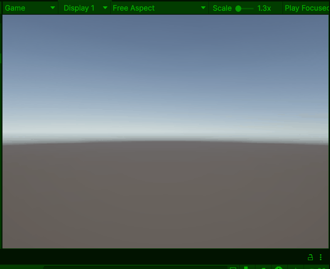
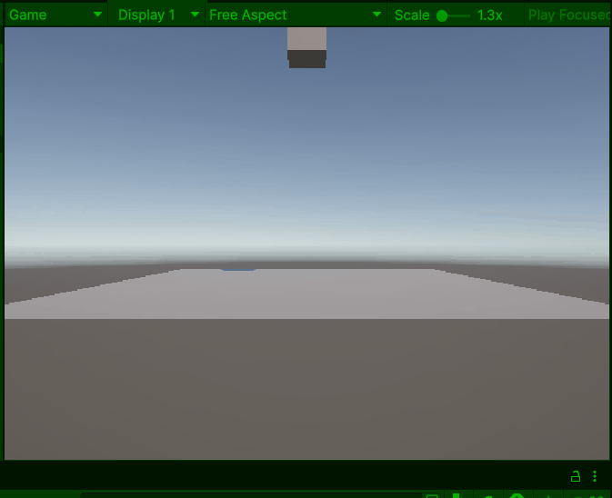
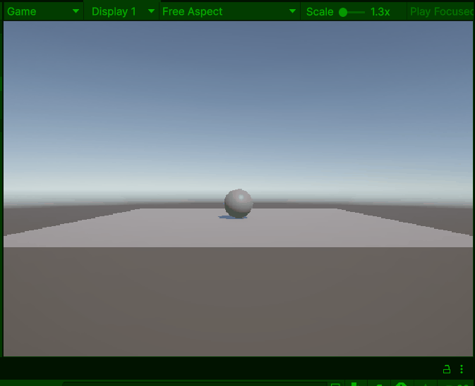
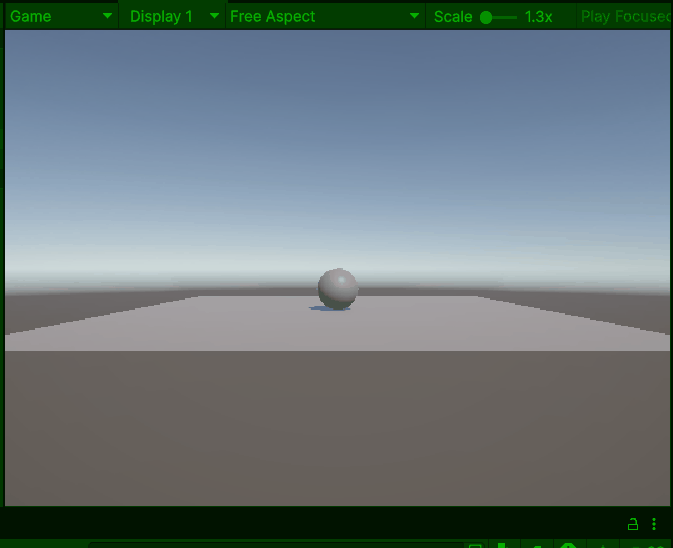

# Les 3.1: Physics-componenten en Botsingen

## Wat Ga Je Leren?

In deze les leer je hoe je realistische physics toevoegt aan je GameObjects. Je gaat:

- Begrijpen wat physics in Unity betekent
- Rigidbody componenten gebruiken voor zwaartekracht en krachten
- Colliders instellen voor botsingsdetectie
- Je eerste physics-object maken dat valt en botst
- Physics krachten toepassen met code

---

## Wat is Physics in Unity?

Tot nu toe hebben we GameObjects **handmatig** laten bewegen met `transform.position`. Maar in de echte wereld bewegen objecten door **natuurkrachten** zoals:

- **Zwaartekracht** → dingen vallen naar beneden
- **Botsingen** → objecten stuiteren tegen elkaar
- **Wrijving** → objecten remmen af op oppervlaktes
- **Krachten** → duwen en trekken aan objecten

Unity's **Physics System** simuleert deze natuurlijke krachten automatisch!


### Physics vs Scriptmatige Beweging

**Scriptmatige beweging (Les 2.1):**

```csharp
// Jij bestuurt alles handmatig
transform.position += Vector3.right * snelheid * Time.deltaTime;
```

**Physics beweging (Les 3.1):**

```csharp
// Unity's physics engine neemt over
rigidbody.AddForce(Vector3.right * kracht);
```

---

## Rigidbody Component - Echte Physics

### Wat is een Rigidbody?

Een **Rigidbody** is het component dat een GameObject **physics eigenschappen** geeft:

- **Massa** → hoe zwaar is het object?
- **Zwaartekracht** → valt het naar beneden?
- **Botsingen** → reageert het op andere objecten?
- **Krachten** → kun je het duwen en trekken?

**Zonder Rigidbody:** GameObject is "statisch" - beweegt alleen door scripts
**Met Rigidbody:** GameObject wordt "dynamisch" - reageert op physics

### Je Eerste Physics Object

#### Stap 1: Maak een Vallende Kubus

1. **Maak een Cube** (GameObject → 3D Object → Cube)
2. **Selecteer de Cube** in de Hierarchy
3. **Voeg Rigidbody toe:** Add Component → Rigidbody
4. **Druk op Play** ▶️

**Wauw!** Je kubus valt nu naar beneden door zwaartekracht!



#### Stap 2: Maak een Grond

1. **Maak een Plane** (GameObject → 3D Object → Plane)
2. **Verplaats hem onder de kubus** (Position Y = -1)
3. **Druk op Play** ▶️

Nu botst je kubus op de grond en stopt!

### Rigidbody Eigenschappen

Selecteer je kubus en kijk naar het **Rigidbody component** in de Inspector:

**Belangrijke instellingen:**

- **Mass**: Hoe zwaar het object is (1 = standaard)
- **Drag**: Luchtweerstand (0 = geen weerstand)
- **Angular Drag**: Rotatie weerstand
- **Use Gravity**: Of zwaartekracht werkt (meestal true)
- **Is Kinematic**: Of het object reageert op physics (false = reageert wel)

**Experimenten:**

- Zet Mass op 10 → object valt zwaarder
- Zet Drag op 5 → object valt langzamer
- Zet Use Gravity uit → object valt niet meer

---

## Colliders - Botsingsdetectie

### Wat Zijn Colliders?

**Colliders** bepalen de **vorm** van je GameObject voor physics berekeningen. Ze zijn **onzichtbaar** maar zorgen ervoor dat objecten tegen elkaar botsen.



### Soorten Colliders

**Basis Colliders (meest gebruikt):**

- **Box Collider**: Voor kubussen, muren, kisten
- **Sphere Collider**: Voor ballen, planeten
- **Capsule Collider**: Voor spelers, vijanden
- **Mesh Collider**: Voor complexe vormen (duur!)

### Collider Eigenschappen

**Belangrijke instellingen:**

- **Is Trigger**: Of het object "door elkaar heen" kan (we leren dit in Les 4.1)
- **Material**: Physics materiaal (hoe stuiterig/glad)
- **Size/Radius**: Afmetingen van de collider

**Tip:** Als meerdere objecten een rigidbody hebben hebben ze invloed op elkaars bewegingen.



---

## Physics Krachten Toepassen

### Met Code Physics Besturen

Nu gaan we physics besturen met code! Maak een script `PhysicsController`:

```csharp
public class PhysicsController : MonoBehaviour
{
    private Rigidbody rb;
    public float springKracht = 500.0f;

    void Start()
    {
        // Krijg referentie naar Rigidbody component
        rb = GetComponent<Rigidbody>();

        if (rb == null)
        {
            Debug.Log("Geen Rigidbody gevonden! Voeg er een toe.");
        }
    }

    void Update()
    {
        // Spring omhoog als je Space indrukt
        if (Input.GetKeyDown(KeyCode.Space))
        {
            Debug.Log("Spring!");
            rb.AddForce(Vector3.up * springKracht);
        }
    }
}
```

#### Test Het Script

1. **Sleep het script** op je kubus (die een Rigidbody heeft)
2. **Druk op Play** ▶️
3. **Druk op Space** om te springen!

### Verschillende Soorten Krachten

#### 1. AddForce() - Geleidelijke Kracht

```csharp
// Duw het object geleidelijk
rb.AddForce(Vector3.right * 10.0f);
```

#### 2. AddForce() met ForceMode

```csharp
// Verschillende manieren van kracht toepassen
rb.AddForce(Vector3.up * 500, ForceMode.Force);        // Geleidelijk
rb.AddForce(Vector3.up * 500, ForceMode.Impulse);      // Directe klap
rb.AddForce(Vector3.up * 10, ForceMode.VelocityChange); // Directe snelheidsverandering
```

#### 3. Velocity Directe Snelheid

```csharp
// Zet directe snelheid
rb.velocity = new Vector3(5, 0, 0); // Beweeg 5 units/sec naar rechts
```

### Praktisch Voorbeeld: Bestuurbare Bal

```csharp
public class BallController : MonoBehaviour
{
    private Rigidbody rb;
    public float bewegingsKracht = 10.0f;
    public float springKracht = 300.0f;

    void Start()
    {
        rb = GetComponent<Rigidbody>();
    }

    void Update()
    {
        // WASD beweging met physics
        float horizontal = Input.GetAxis("Horizontal"); // A/D toetsen
        float vertical = Input.GetAxis("Vertical");     // W/S toetsen

        // Voeg krachten toe in X en Z richting
        Vector3 beweging = new Vector3(horizontal, 0, vertical);
        rb.AddForce(beweging * bewegingsKracht);

        // Spring met Space
        if (Input.GetKeyDown(KeyCode.Space))
        {
            rb.AddForce(Vector3.up * springKracht);
        }

        // Toon huidige snelheid
        Debug.Log("Snelheid: " + rb.velocity.magnitude);
    }
}
```

---

## Physics Materials - Verschillende Oppervlaktes

### Wat Zijn Physics Materials?

**Physics Materials** bepalen hoe objecten **reageren** bij botsingen:

- **Bounciness** → hoe stuiterig (0 = niet, 1 = perfect stuiterend)
- **Friction** → hoe glad/ruw (0 = ijsglad, 1 = zeer ruw)

### Physics Material Maken

1. **Rechtsklik** in Project window
2. **Create → Physics Material**
3. **Noem het "SuperBouncy"**
4. **Pas instellingen aan:**
   - Dynamic Friction: 0.1
   - Static Friction: 0.1
   - Bounciness: 0.9
   - Friction Combine: Minimum
   - Bounce Combine: Maximum

### Material Toepassen

1. **Selecteer je GameObject** met collider
2. **Sleep het Physics Material** naar het **Material veld** in de Collider
3. **Test het effect** in Play Mode

**Experimenten:**

- Maak een super stuiterige bal (Bounciness 1.0)
- Maak een ijsglad oppervlak (Friction 0.0)
- Maak een kleverig oppervlak (Friction 1.0)

---

## Physics Best Practices

### Do's - Goed

```csharp
// Gebruik FixedUpdate voor physics code
void FixedUpdate()
{
    rb.AddForce(movement * speed);
}

// Check of Rigidbody bestaat
if (rb != null)
{
    rb.AddForce(force);
}

// Gebruik AddForce voor natuurlijke beweging
rb.AddForce(Vector3.forward * thrust);
```

### Don'ts - Slecht

```csharp
// Verander niet handmatig position van physics objecten
transform.position = newPosition; // Dit verstoort physics!

// Gebruik geen Update voor physics
void Update() // Beter: FixedUpdate
{
    rb.AddForce(force);
}

// Vergeet niet Rigidbody toe te voegen
GetComponent<Rigidbody>(); // Kan null zijn!
```

### Debugging Physics

```csharp
public class PhysicsDebugger : MonoBehaviour
{
    private Rigidbody rb;

    void Start()
    {
        rb = GetComponent<Rigidbody>();
    }

    void Update()
    {
        if (rb != null)
        {
            Debug.Log("Snelheid: " + rb.velocity);
            Debug.Log("Massa: " + rb.mass);
        }
    }
}
```

---

## Aantekeningen maken

Maak aantekeningen over de behandelde stof in de les. Schrijf het nu zo op zodat je het later makkelijk begrijpt als je het terugleest.

**Belangrijke punten om te noteren:**

- Wat doet een Rigidbody component?
- Wat zijn Colliders en waarom heb je ze nodig?
- Wat is het verschil tussen AddForce() en velocity?
- Hoe maak je een Physics Material?
- Wanneer gebruik je FixedUpdate() in plaats van Update()?

Schrijf ook op wat je niet hebt begrepen uit deze les. Dan kun je hier later nog vragen over stellen aan de docent.

Bewaar al je aantekeningen goed! Deze moet je aan het einde van de periode inleveren.


## Oefeningen uitvoeren

Doe nu minimaal 1 oefening naar keuze voor les 3.1
De oefeningen vind je [hier](../Oefeningen/oefeningen_3_1.md) terug


## Wat Heb Je Geleerd?

### Checklist

- [ ] Je begrijpt wat physics in Unity betekent
- [ ] Je kunt een Rigidbody component toevoegen en configureren
- [ ] Je weet wat Colliders zijn en hoe ze werken
- [ ] Je kunt krachten toepassen met AddForce()
- [ ] Je begrijpt het verschil tussen verschillende ForceMode types
- [ ] Je kunt Physics Materials maken en toepassen
- [ ] Je hebt een bestuurbaar physics object gemaakt
- [ ] Je weet wanneer je FixedUpdate() moet gebruiken

### Volgende Stap

In Les 3.2 gaan we leren over functies, argumenten en return types. Dan kunnen we onze code beter organiseren en herbruiken!

---

## Veelgestelde Vragen

### Q: Mijn object valt door de grond heen!

**A:**

- Check of beide objecten (vallend object én grond) Colliders hebben
- Zorg dat de grond groot genoeg is
- Check of "Is Trigger" uitstaat op beide Colliders

### Q: Mijn object beweegt niet met AddForce()?

**A:**

- Check of het object een Rigidbody heeft
- Check of "Is Kinematic" uitstaat in de Rigidbody
- Probeer een grotere kracht waarde

### Q: Waarom wordt mijn object steeds sneller?

**A:** AddForce() voegt kracht toe, het vervangt geen snelheid. Gebruik `rb.velocity =` om snelheid direct in te stellen, of voeg drag toe om het object af te remmen.

### Q: Hoe stop ik een bewegend physics object?

**A:**

```csharp
rb.velocity = Vector3.zero;      // Stop beweging
rb.angularVelocity = Vector3.zero; // Stop rotatie
```

### Q: Mijn object gedraagt zich raar tijdens botsingen?

**A:**

- Check de Scale van je GameObjects (probeer Scale 1,1,1)
- Zorg dat Colliders de juiste grootte hebben
- Vermijd zeer kleine of zeer grote massa waardes

### Q: Wanneer gebruik ik FixedUpdate() in plaats van Update()?

**A:** Gebruik FixedUpdate() voor alle physics gerelateerde code (AddForce, velocity checks, etc.). Unity's physics draait op een vaste tijdsinterval, en FixedUpdate() synchroniseert hiermee.

---
