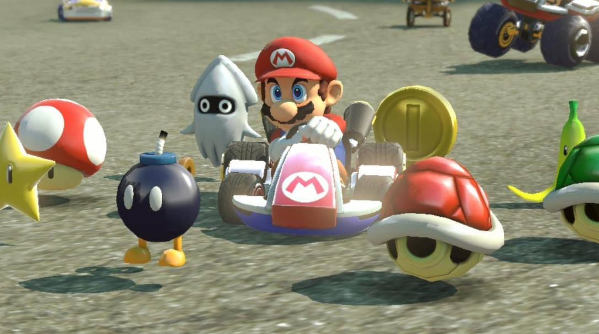
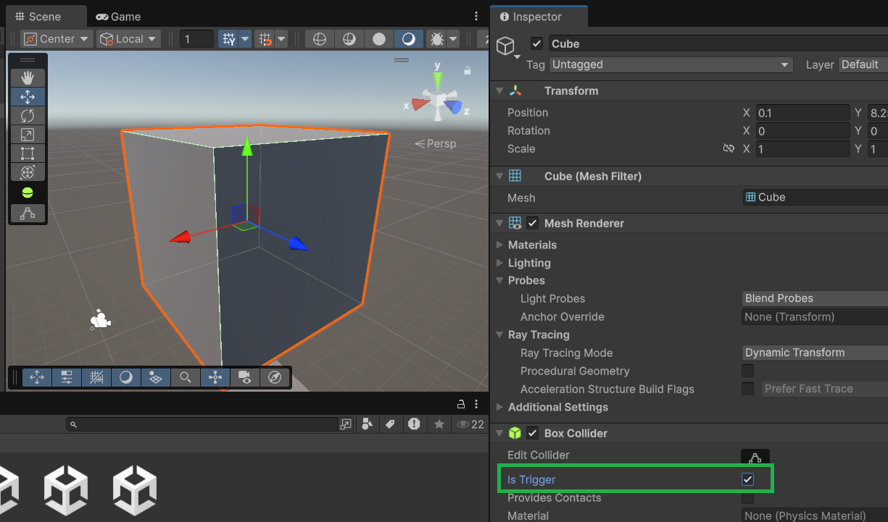
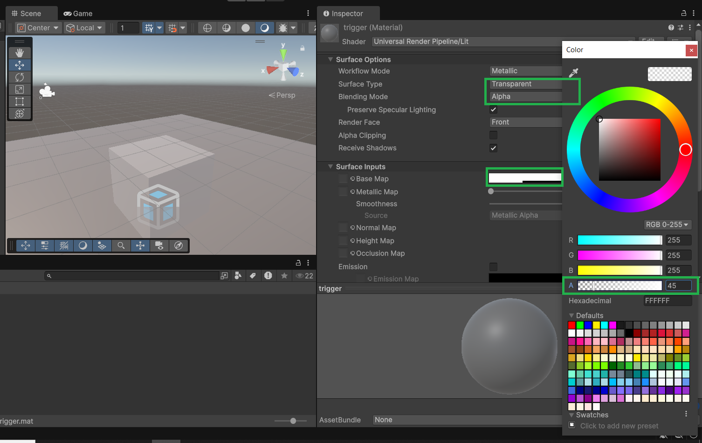
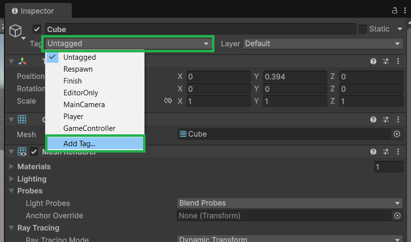
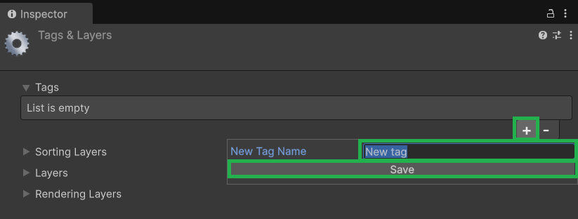
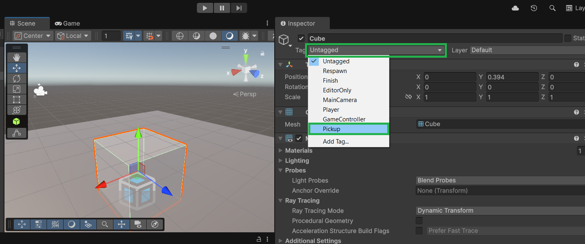
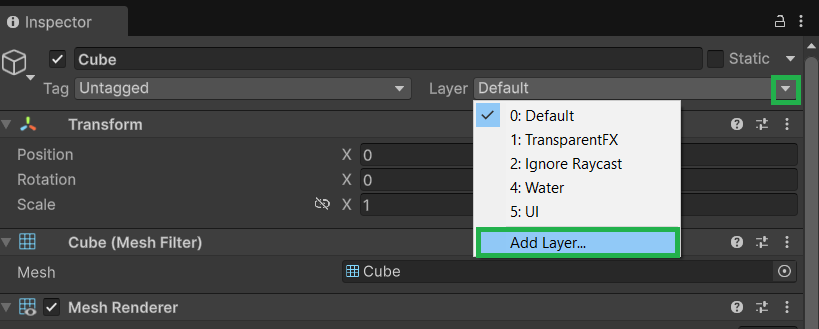
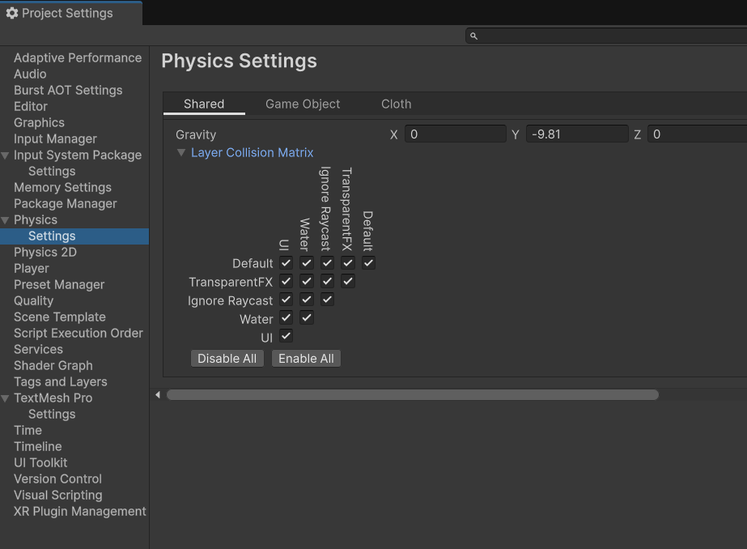

# Les 4.1: Colliders, Triggers en Tags

## Wat Ga Je Leren?

In deze les leer je hoe GameObjects met elkaar kunnen "praten" en reageren op contact. Je gaat:

- Begrijpen wat Colliders en Triggers zijn
- Het verschil leren tussen Physics Colliders en Trigger Colliders
- Tags gebruiken om objecten te identificeren
- Je eerste detectie systemen maken
- Objecten laten reageren op aanraking

---

## Colliders Revisited - Meer dan alleen Physics

In Les 3.1 heb je Colliders leren kennen voor **physics botsingen**. Maar Colliders kunnen nog veel meer!

### Twee Soorten Colliders

**1. Physics Colliders (Is Trigger = false)**

- Objecten botsen **fysiek** tegen elkaar
- Gebruikt voor muren, grond, echte botsingen
- Objecten kunnen niet door elkaar heen

**2. Trigger Colliders (Is Trigger = true)**

- Objecten gaan **door elkaar heen**
- Detecteert alleen **wanneer** objecten elkaar raken
- Perfect voor pickup items, checkpoints, detectie zones



---

## Trigger Colliders Maken

### Stap 1: Een Trigger Object Maken

1. **Maak een Cube** (GameObject → 3D Object → Cube)
2. **Selecteer de Cube** in de Hierarchy
3. **Kijk naar de Box Collider** in de Inspector
4. **Vink "Is Trigger" aan** ✅



**Nu is je Cube een Trigger!** Andere objecten kunnen er doorheen lopen, maar het detecteert wel contact.

### Stap 2: Trigger Transparant Maken

1. **Rechtsklik in Project** → Create → Material
2. **Noem het "TriggerMaterial"**
3. **Zet Surface Type op "Transparent"**
4. **Verlaag de Alpha waarde**
5. **Sleep het materiaal op je trigger object**



---

## Tags - GameObjects Labelen

### Wat Zijn Tags?

**Tags** zijn zoals **labels** die je op GameObjects plakt om ze te identificeren.

**Vergelijking:**  
Het is zoals naamplaatjes op een feest - je weet meteen wie wie is!


### Tags Maken en Gebruiken

#### Stap 1: Een Tag Maken

1. **Selecteer een GameObject**
2. **Klik op "Tag" dropdown** (bovenin Inspector)
3. **Kies "Add Tag..."**
4. **Klik het + icoontje**
5. **Type een tag naam** bijvoorbeeld: "Player", "Enemy", "Pickup"




#### Stap 2: Tag Toewijzen

1. **Selecteer je GameObject**
2. **Klik op Tag dropdown**
3. **Kies je nieuwe tag**



### Veelgebruikte Tags

```
Player          // De speler
Enemy           // Vijanden
Pickup          // Verzamelt items
Wall            // Muren
Ground          // Grond
Checkpoint      // Save punten
PowerUp         // Special items
```

---

## Trigger Detection in Unity

### Wat Gebeurt Er Bij Contact?

Wanneer een GameObject met een Trigger Collider contact maakt met een ander GameObject, kan Unity dit detecteren en er automatisch op reageren.

**Belangrijke voorwaarden voor triggers:**

- Minimaal één object moet een **Rigidbody** hebben
- Minimaal één object moet een **Collider** hebben met **"Is Trigger" aangevinkt**
- Beide objecten moeten **actief** zijn in de scene

### Rigidbody en Triggers

**Wat is een Rigidbody?**
Een Rigidbody component geeft een GameObject physics eigenschappen. Voor triggers hoef je geen volledige physics - je kunt een **Kinematic Rigidbody** gebruiken:

1. **Voeg Rigidbody toe** aan je bewegende object (Add Component → Physics → Rigidbody)
2. **Vink "Is Kinematic" aan** (geen zwaartekracht, maar wel trigger detectie)


### Praktisch Voorbeeld: Pickup System Setup

**Stap 1: Maak de Player**

1. Maak een **Capsule** (GameObject → 3D Object → Capsule)
2. Hernoem naar **"Player"**
3. Geef tag **"Player"**
4. Voeg **Rigidbody** toe (Add Component → Physics → Rigidbody)

**Stap 2: Maak een Pickup Item**

1. Maak een **Sphere** (GameObject → 3D Object → Sphere)
2. Hernoem naar **"Coin"**
3. Geef tag **"Pickup"**
4. Ga naar **Sphere Collider** in Inspector
5. **Vink "Is Trigger" aan** ✅

**Stap 3: Test de Setup**

- Beweeg de Player naar de Coin in Scene View
- Ze gaan door elkaar heen (omdat het een trigger is)

---

## Collider Types en Hun Gebruik

### Box Collider

**Beste voor:**

- Kubussen, muren, platformes
- Rechthoekige objecten
- Pickup boxes

**Instellingen:**

- **Center**: Verschuif het midden van de collider
- **Size**: Maak groter/kleiner onafhankelijk van het object

### Sphere Collider

**Beste voor:**

- Ballen, planeten, explosies
- Ronde pickup items
- Detection zones rond objecten

**Instellingen:**

- **Center**: Verschuif het midden
- **Radius**: Grootte van de bol

### Capsule Collider

**Beste voor:**

- Spelers, vijanden (humanoid vorm)
- Pilaren, bomen
- Lange cilindervormige objecten

**Instellingen:**

- **Center**: Midden van capsule
- **Radius**: Breedte
- **Height**: Hoogte
- **Direction**: X, Y, of Z-as

### Mesh Collider

**Beste voor:**

- Complexe 3D modellen
- Terrein, landschappen
- Objecten met rare vormen

**⚠️ Waarschuwing:** Mesh Colliders zijn **duur** voor performance. Gebruik alleen als echt nodig!

---

## Physics en Trigger Interactie

### Kinematic vs Non-Kinematic

**Non-Kinematic Rigidbody:**

- Reageert op **zwaartekracht**
- Kan **duwen en geduwd** worden
- Physics bepaalt beweging

**Kinematic Rigidbody:**

- **Geen zwaartekracht**
- Kan **niet geduwd** worden
- Jij bestuurt beweging via code
- **Wel trigger detectie**

### Trigger Combinaties

**Scenario 1: Player loopt over pickup**

- Player: Rigidbody (kinematic) + Capsule Collider
- Pickup: Sphere Collider (Is Trigger ✅)
- **Resultaat**: Trigger detectie werkt

**Scenario 2: Vallende objecten in detectie zone**

- Object: Rigidbody (non-kinematic) + Collider
- Zone: Box Collider (Is Trigger ✅)
- **Resultaat**: Objects vallen door zone, trigger detecteert

**Scenario 3: Twee statische objecten**

- Object A: Alleen Collider
- Object B: Alleen Collider (Is Trigger ✅)
- **Resultaat**: Geen trigger detectie (geen Rigidbody!)

---

## Layer en Tag Systemen

### Collision Layers (Geavanceerd)

Unity heeft ook een **Layer** systeem naast Tags:

**Verschil tussen Tags en Layers:**

- **Tags**: Identificatie ("Wat ben je?")
- **Layers**: Interactie regels ("Met wie kun je botsen?")

**Layer Example:**

- Player (Layer 8)
- Enemies (Layer 9)
- Player Projectiles (Layer 10)

Je kunt zelf layers toevoegen via de inspector



Via **Project Settings → Physics → Settings** kun je bepalen welke layers met elkaar kunnen botsen.



---

## Veelvoorkomende Problemen en Oplossingen

### "Mijn trigger werkt niet"

**Checklist:**

1. ✅ Is "Is Trigger" aangevinkt?
2. ✅ Heeft één object een Rigidbody?
3. ✅ Zijn beide objecten actief (not disabled)?
4. ✅ Overlappen de colliders daadwerkelijk?
5. ✅ Staat het script op het juiste object?

### "Objects vallen door de grond"

**Probleem:** Je grond heeft waarschijnlijk "Is Trigger" aanstaan.
**Oplossing:** Zet "Is Trigger" uit voor de grond collider.

### "Performance problemen"

**Oorzaken:**

- Te veel Mesh Colliders
- Te veel OnTriggerStay events
- Complexe collider shapes

**Oplossingen:**

- Gebruik Box/Sphere/Capsule colliders waar mogelijk
- Beperk OnTriggerStay gebruik
- Gebruik Layers om onnodige checks te vermijden

---

## Aantekeningen maken

Maak aantekeningen over de behandelde stof in de les. Schrijf het nu zo op zodat je het later makkelijk begrijpt als je het terugleest.

**Belangrijke punten om te noteren:**

- Wat is het verschil tussen normale Colliders en Trigger Colliders?
- Wat zijn Tags en waarom gebruik je ze?
- Welke soorten Colliders zijn er en wanneer gebruik je welke?
- Wat doet een Rigidbody en wanneer heb je er een nodig?
- Wat is het verschil tussen Kinematic en Non-Kinematic Rigidbodies?
- Hoe maak je triggers visueel herkenbaar?
- Welke voorwaarden zijn er voor trigger detectie?

Schrijf ook op wat je niet hebt begrepen uit deze les. Dan kun je hier later nog vragen over stellen aan de docent.

Bewaar al je aantekeningen goed! Deze moet je aan het einde van de periode inleveren.


## Wat Heb Je Geleerd?

### Checklist

- [ ] Je begrijpt het verschil tussen Physics en Trigger Colliders
- [ ] Je kunt Tags maken en toewijzen aan GameObjects
- [ ] Je kent de verschillende Collider types (Box, Sphere, Capsule, Mesh)
- [ ] Je weet wat een Rigidbody doet en wanneer je het nodig hebt
- [ ] Je begrijpt Kinematic vs Non-Kinematic Rigidbodies
- [ ] Je kunt triggers visueel herkenbaar maken met materials
- [ ] Je kunt veelvoorkomende trigger problemen oplossen

### Volgende Stap

In Les 4.2 gaan we leren hoe we met code kunnen reageren op trigger events met OnTriggerEnter() en hoe we botsingen kunnen afvangen met OnCollisionEnter()!

---

## Veelgestelde Vragen

### Q: Wat is het verschil tussen een Collider en een Trigger?

**A:** Een normale Collider zorgt voor fysieke botsingen (objecten kunnen niet door elkaar heen). Een Trigger laat objecten door elkaar heen gaan maar detecteert wel wanneer ze contact maken.

### Q: Wanneer gebruik ik welk type Collider?

**A:**

- **Box**: Voor kubussen, muren, platforms
- **Sphere**: Voor ballen, planeten, ronde objecten
- **Capsule**: Voor spelers, humanoids, cilinders
- **Mesh**: Alleen voor complexe vormen (duur!)

### Q: Waarom heb ik een Rigidbody nodig voor triggers?

**A:** Unity's physics engine heeft een Rigidbody nodig om beweging en contact te detecteren. Zonder Rigidbody kan Unity niet weten wanneer objecten elkaar raken.

### Q: Wat is het verschil tussen Kinematic en Non-Kinematic?

**A:**

- **Non-Kinematic**: Reageert op zwaartekracht en physics krachten
- **Kinematic**: Jij bestuurt de beweging, geen zwaartekracht, maar wel trigger detectie

### Q: Mijn triggers werken soms wel, soms niet. Waarom?

**A:** Dit komt vaak door timing. Als objecten te snel bewegen kunnen ze door colliders heen "teleporteren". Gebruik kleinere Time.deltaTime stappen of Continuous collision detection.

### Q: Kan ik meerdere tags per GameObject hebben?

**A:** Nee, Unity ondersteunt één tag per GameObject. Gebruik parent-child hierarchies of custom scripts voor meerdere identificaties.

### Q: Hoe maak ik een trigger zone die alleen spelers detecteert?

**A:** Gebruik Layer filtering of check in code: `if(other.CompareTag("Player"))`. Dit is efficiënter dan alle objecten checken.

---
