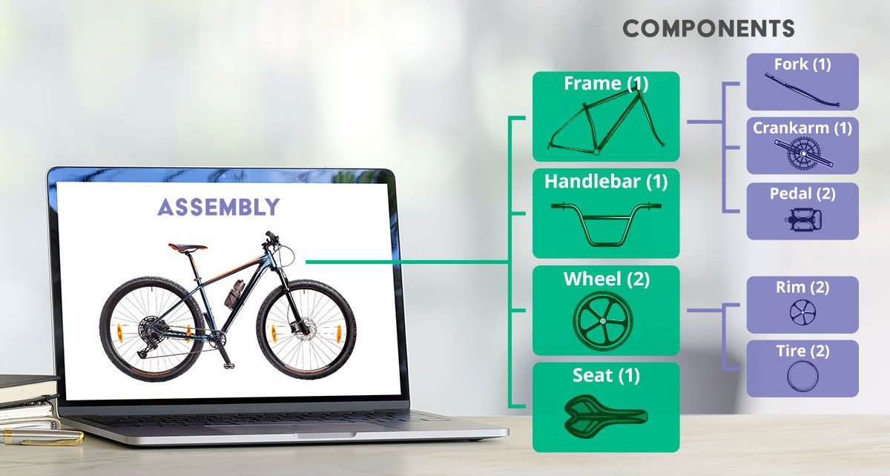

# Les 5.2: Logica Combineren met Botsingen en Input

## Wat Ga Je Leren?

In deze les combineer je eenvoudige logica met collision detection en input. Je gaat:

- If-statements gebruiken bij collision detection (Les 4.2 + 5.1)
- Input controleren met logische voorwaarden (Les 2.2 + 5.1)
- De `GetComponent<Type>()` functie gebruiken.
- Eenvoudige interaction systemen maken
- Alles wat je hebt geleerd samenvoegen

---

## Herinnering: Wat Heb Je Al Geleerd?

**Les 2.2:** Input verwerken

```csharp
if (Input.GetKeyDown(KeyCode.Space))
{
    Debug.Log("Space pressed!");
}
```

**Les 4.2:** Collision detection

```csharp
void OnTriggerEnter(Collider other)
{
    if (other.CompareTag("Player"))
    {
        Debug.Log("Player touched me!");
    }
}
```

**Les 5.1:** If-statements en logica

```csharp
if (health > 0 && hasKey)
{
    Debug.Log("Player is alive AND has key!");
}
```

**Nu gaan we deze combineren!**

---

## Input met Voorwaarden

### Alleen Reageren Wanneer Het Mag

In Les 2.2 reageerde je altijd op input. Nu gaan we **slimmer** zijn:

```csharp
public class SmartPlayer : MonoBehaviour
{
    public int health = 100;
    public bool hasKey = false;

    void Update()
    {
        // Normale input uit Les 2.2
        if (Input.GetKeyDown(KeyCode.Space))
        {
            Jump(); // Altijd springen
        }

        // NIEUWE manier - springen met voorwaarden!
        if (Input.GetKeyDown(KeyCode.Space) && health > 0)
        {
            Jump(); // Alleen springen als je leeft
        }

        // Gebruik sleutel alleen als je er een hebt
        if (Input.GetKeyDown(KeyCode.E) && hasKey)
        {
            UseKey(); // Uit Les 3.2: functies maken
        }
    }

    void Jump() // Functie uit Les 3.2
    {
        Debug.Log("Player jumped!");
    }

    void UseKey() // Functie uit Les 3.2
    {
        Debug.Log("Key used!");
        hasKey = false; // Sleutel is op
    }
}
```

**Wat is er nieuw?**

- **Les 2.2**: `if (Input.GetKeyDown(KeyCode.Space))`
- **Les 5.1**: `&& health > 0` (EN operator)
- **Combinatie**: `if (Input.GetKeyDown(KeyCode.Space) && health > 0)`

### Meerdere Voorwaarden

```csharp
public class PlayerMovement : MonoBehaviour
{
    public float speed = 5f;
    public bool canMove = true;
    public bool isAlive = true;

    void Update()
    {
        // Beweging uit Les 2.1, maar nu met voorwaarden uit Les 5.1
        if (canMove && isAlive) // Beide moeten waar zijn
        {
            // WASD beweging uit Les 2.2
            if (Input.GetKey(KeyCode.W))
            {
                transform.position += Vector3.up * speed * Time.deltaTime;
            }

            if (Input.GetKey(KeyCode.S))
            {
                transform.position += Vector3.down * speed * Time.deltaTime;
            }
        }

        // Reset knop - werkt altijd
        if (Input.GetKeyDown(KeyCode.R))
        {
            ResetPlayer();
        }
    }

    void ResetPlayer()
    {
        transform.position = Vector3.zero; // Terug naar 0,0,0
        isAlive = true;
        canMove = true;
        Debug.Log("Player reset!");
    }
}
```

---

## GetComponent



GetComponent is een belangrijke Unity functie die je gebruikt om componenten (scripts, colliders, etc.) van een GameObject op te halen. Het werkt als een "zoekfunctie" op een GameObject.

```csharp
// Basis gebruik:
Rigidbody rb = GetComponent<Rigidbody>();        // Haalt Rigidbody van DIT object
Collider col = GetComponent<Collider>();         // Haalt Collider van DIT object

// Gebruik op andere objecten:
PlayerScript playerScript = other.GetComponent<PlayerScript>();  // Haalt PlayerScript van ANDER object, bijvoorbeeld na een collision.
```

**Belangrijke punten:**

- Je moet het type component tussen `< >` zetten
- Geeft `null` terug als de component niet bestaat
- Werkt voor alle Unity componenten én je eigen scripts
- Is handig voor communicatie tussen scripts

## Collision Detection met Logica

### Slimme Pickup Items

In Les 4.2 pakte je alles op. Nu worden we selectief:

```csharp
public class SmartPickup : MonoBehaviour
{
    public string itemType = "Coin";
    public int value = 10;

    void Start()
    {
        GetComponent<Collider>().isTrigger = true; // Les 4.1: trigger maken
    }

    void OnTriggerEnter(Collider other) // Les 4.2: collision detection
    {
        if (other.CompareTag("Player")) // Les 4.1: tag checking
        {
            //Haal het script van de player op!
            PlayerScript player = other.GetComponent<PlayerScript>();

            // Switch uit Les 5.1 + collision uit Les 4.2
            switch (itemType)
            {
                case "Coin":
                    Debug.Log("Coin collected!");
                    Destroy(gameObject);
                    break;

                case "HealthPotion":
                    // Alleen oppakken als je schade hebt
                    if (player.health < 100)
                    {
                        player.health += value;
                        Debug.Log("Health restored!");
                        Destroy(gameObject);
                    }
                    else
                    {
                        Debug.Log("Health already full!");
                    }
                    break;

                case "Key":
                    if (!player.hasKey) // Als je nog geen sleutel hebt
                    {
                        player.hasKey = true;
                        Debug.Log("Key found!");
                        Destroy(gameObject);
                    }
                    break;
            }
        }
    }
}
```

### Interactieve Deur

```csharp
public class SimpleDoor : MonoBehaviour
{
    public bool needsKey = true;
    public bool isOpen = false;

    private bool playerNearby = false; // Bijhouden of speler dichtbij is

    void Start()
    {
        GetComponent<Collider>().isTrigger = true; // Les 4.1
    }

    void Update()
    {
        // Input uit Les 2.2 + logica uit Les 5.1
        if (playerNearby && Input.GetKeyDown(KeyCode.E))
        {
            TryOpenDoor(); // Functie uit Les 3.2
        }
    }

    void OnTriggerEnter(Collider other) // Les 4.2
    {
        if (other.CompareTag("Player"))
        {
            playerNearby = true;
            ShowHint(); // Functie uit Les 3.2
        }
    }

    void OnTriggerExit(Collider other) // Les 4.2
    {
        if (other.CompareTag("Player"))
        {
            playerNearby = false;
            Debug.Log(""); // Clear hint
        }
    }

    void TryOpenDoor() // Functie uit Les 3.2
    {
        //Zoek de player in de scene op basis van zijn tag en pak het script. Let op dit is een zware functie. Dus gebruik deze niet zomaar in je update
        PlayerScript player = GameObject.FindWithTag("Player").GetComponent<PlayerScript>();

        // If-else uit Les 5.1
        if (needsKey)
        {
            if (player.hasKey) // Heeft speler een sleutel?
            {
                OpenDoor();
                player.hasKey = false; // Sleutel gebruiken
            }
            else
            {
                Debug.Log("Need a key!");
            }
        }
        else
        {
            OpenDoor(); // Geen sleutel nodig
        }
    }

    void OpenDoor()
    {
        isOpen = true;
        Debug.Log("Door opened!");

        // Simpele beweging uit Les 2.1
        transform.position += Vector3.up * 3f;
    }

    void ShowHint()
    {
        if (needsKey)
        {
            Debug.Log("Press E to open (needs key)");
        }
        else
        {
            Debug.Log("Press E to open");
        }
    }
}
```

---

## Aantekeningen maken

Maak aantekeningen over de behandelde stof in de les. Schrijf het nu zo op zodat je het later makkelijk begrijpt als je het terugleest.

**Belangrijke punten om te noteren:**

- Hoe combineer je input (Les 2.2) met if-statements (Les 5.1)?
- Hoe gebruik je switch statements (Les 5.1) in collision detection (Les 4.2)?
- Hoe organiseer je je code met functies (Les 3.2)?
- Welke patronen zie je terugkomen in alle voorbeelden?

Schrijf ook op wat je niet hebt begrepen uit deze les. Dan kun je hier later nog vragen over stellen aan de docent.

Bewaar al je aantekeningen goed! Deze moet je aan het einde van de periode inleveren.


## Oefeningen uitvoeren

Doe nu minimaal 1 oefening naar keuze voor les 5.2
De oefeningen vind je [hier](../Oefeningen/oefeningen_5_2.md) terug


## Wat Heb Je Geleerd?

### Checklist

- [ ] Je kunt input (Les 2.2) combineren met if-statements (Les 5.1)
- [ ] Je gebruikt switch statements (Les 5.1) in collision detection (Les 4.2)
- [ ] Je organiseert code met functies (Les 3.2)
- [ ] Je maakt slimme pickup systemen
- [ ] Je bouwt interactieve deuren
- [ ] Je hebt een eenvoudig game state system gemaakt
- [ ] Je combineert alles in één complete player script

### Volgende Stap

In Les 6.1 gaan we lijsten en arrays leren! Dan kunnen we meerdere objecten tegelijk beheren.

---

## Veelgestelde Vragen

### Q: Hoe weet ik wanneer ik welke les technieken moet gebruiken?

**A:**

- **Les 2.2**: Voor basis input en beweging
- **Les 4.2**: Voor objecten die elkaar raken
- **Les 5.1**: Voor beslissingen en keuzes
- **Combineer ze**: Voor slimme, interactieve systemen

### Q: Mijn code wordt te ingewikkeld, wat nu?

**A:** Gebruik **functies** (Les 3.2)! Deel grote stukken code op in kleine, begrijpelijke functies.

### Q: Wanneer gebruik ik switch vs if-else?

**A:**

- **Switch**: Voor één variabele met veel mogelijke waarden (zoals game states of item types)
- **If-else**: Voor complexere voorwaarden met meerdere variabelen

### Q: Kan ik dit allemaal onthouden?

**A:** Hoeft niet! Het belangrijkste is dat je begrijpt HOE het werkt. Je kunt altijd terug kijken naar eerdere lessen voor voorbeelden.

---
