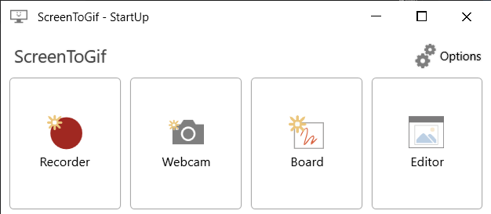
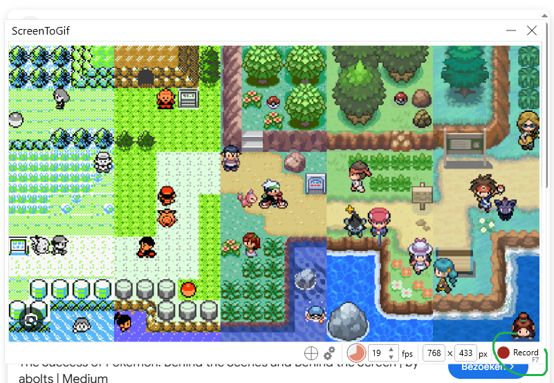
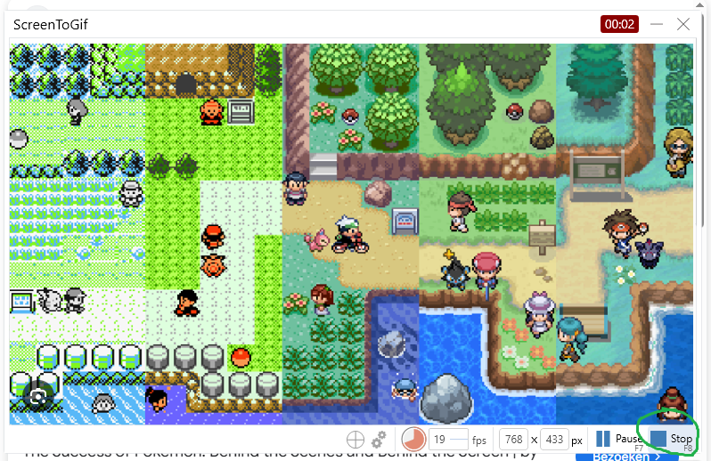
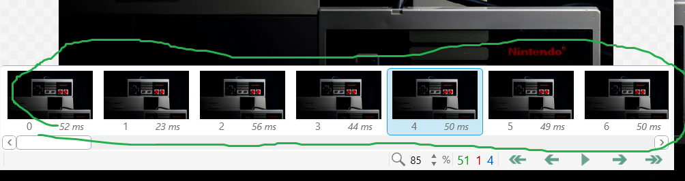
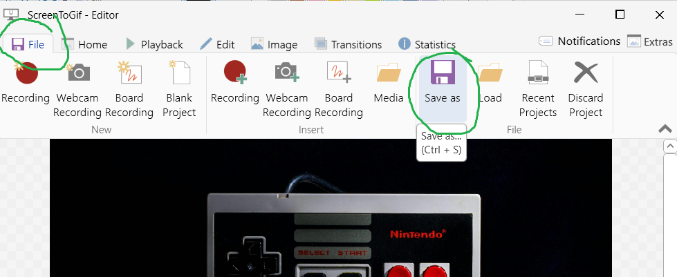

# Les 7: Je Werk Presenteren met een README

## Wat Ga Je Leren?

Een goede README laat zien **wat je hebt gemaakt** en **waarom**. Recruiters, docenten en klasgenoten lezen je README voordat ze je code bekijken. In deze les leer je:

- Structuur aanbrengen met koppen
- Uitleg schrijven over je opdracht
- Screenshots en GIF's toevoegen
- Links plaatsen (inclusief relatieve links)
- Code snippets tonen
- GIF's opnemen met Screen2Gif

---

## 1. Structuur met Koppen

Maak een nieuw bestand aan in je en noem die `README.md`

In **visual studio code** kun

Gebruik `#` voor koppen. Hoe meer hekjes, hoe kleiner de kop.

```markdown
# Hoofdtitel (gebruik dit één keer bovenaan)

## Sectie (grote onderdelen)

### Subsectie (onderdelen binnen een sectie)
```

**Voorbeeld voor een opdracht:**

```markdown
# Mijn Endless Runner

## Over dit project

## Hoe werkt het?

## Screenshots

## Wat heb ik geleerd?
```

---

## 2. Uitleg Schrijven

Zet bovenaan je README altijd:

1. **Wat heb je gemaakt?** – Beschrijf het spel of de opdracht in één of twee zinnen.
2. **Wat was het doel?** – Wat moest je leren of bouwen?
3. **Hoe werkt het?** – Leg kort uit wat de speler kan doen.

**Voorbeeld:**

```markdown
## Over dit project

Voor deze opdracht heb ik een Endless Runner gebouwd in Unity.
Het doel was om te oefenen met Physics, prefabs en score bijhouden.

De speler springt over obstakels en verzamelt munten.
De snelheid neemt elke 10 seconden toe.
```

---

## 3. Screenshots Plaatsen

Zet je afbeelding in een map naast je README, bijvoorbeeld in een map `images/`.

**Syntax:**

```markdown

```

- De tekst tussen `[ ]` is de alt-tekst (kort beschrijven wat er te zien is).
- Het pad tussen `( )` is relatief ten opzichte van je README-bestand.

**Relatief vs. absoluut pad:**

```markdown
<!-- Relatief: verwijst naar een bestand binnen je eigen repo -->


<!-- Absoluut: verwijst naar een volledige URL op internet -->


```

Gebruik **altijd een relatief pad** als de afbeelding in je eigen repository staat. Zo werkt de link ook als iemand je repo downloadt of de naam van je repository verandert.

**Voorbeeld:**

```markdown
## Screenshots


```

---

## 4. GIF's Plaatsen

Een GIF werkt precies hetzelfde als een afbeelding:

```markdown

```

GIF's zijn ideaal om te laten zien **hoe je spel beweegt**, want een stilstaand screenshot geeft dat niet.

---

## 5. GIF's Opnemen met Screen2Gif

Download Screen2Gif via: [https://screentogif.en.softonic.com/download](https://screentogif.en.softonic.com/download)

**Stappen:**



1. Open Screen2Gif en kies **Recorder**
2. Sleep het opnamevenster over je spelscherm
3. Druk op **Record** (of `F7`) om te starten
   

4. Speel even je spel
5. Druk op **Stop** (of `F8`) om te stoppen
   
6. Verwijder de onnodige frames door ze te selecteren en te deleten
   

7. Sla op als `.gif` in je `images/` map
   

**Tip:** Hou de GIF kort (5–15 seconden) zodat het bestand niet te groot wordt. Github geeft problemen bij bestanden die groter zijn dan 50 mb!

---

## 6. Links Plaatsen

**Externe link** (naar een website):

```markdown
[Tekst die je ziet](https://www.voorbeeld.com)
```

**Relatieve link** (naar een bestand in je eigen repository):

```markdown
[Bekijk de broncode](src/Player.cs)

[Ga naar de scripts map](scripts/)
```

Een relatief pad begint vanuit de locatie van je README. Gebruik `/` als mapscheider.

**Voorbeeld:**

```markdown
## Meer informatie

- [Unity documentatie over Physics](https://docs.unity3d.com/Manual/Physics2DReference.html)
- [Bekijk mijn PlayerController script](Assets/Scripts/PlayerController.cs)
- [Terug naar de hoofdpagina](../../README.md)
```

---

## 7. Code Snippets Plaatsen

Gebruik drie backticks (` ``` `) om een codeblok te openen en te sluiten. Zet de taal erachter voor kleuring.

````markdown
```csharp
void Update()
{
    transform.Translate(Vector3.right * speed * Time.deltaTime);
}
```
````

**Resultaat:**

```csharp
void Update()
{
    transform.Translate(Vector3.right * speed * Time.deltaTime);
}
```

Voor één woord of een korte term in een zin gebruik je één backtick:

```markdown
De variabele `speed` bepaalt hoe snel het object beweegt.
```

---

## Voorbeeld: Volledige README

Hieronder zie je een voorbeeld van hoe een README er uit kan zien:

````markdown
# Endless Runner

## Over dit project

Een eindeloos lopend platformspel gebouwd in Unity als afsluiting van module 1.
Het doel was om te oefenen met prefabs, Physics en een score systeem.

## Hoe werkt het?

- **Springen**: Spatiebalk
- **Obstakels**: Worden random gespawnt
- **Score**: Stijgt met de tijd, bonus voor munten

## Screenshots


## Interessant stukje code

De speler springt alleen als hij de grond raakt:

```csharp
void Jump()
{
    if (isGrounded)
    {
        rb.AddForce(Vector2.up * jumpForce, ForceMode2D.Impulse);
    }
}
```
````
