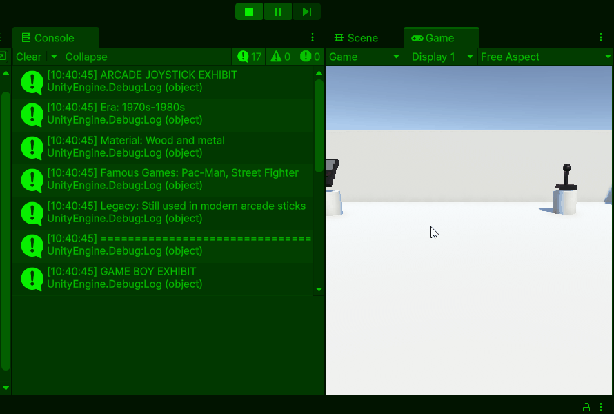

# Combi Oefeningen Les 1: Unity Interface & Scripting

Kies 1 van de volgende oefeningen en voer die uit. Je mag er ook meer maken als je dat leuk vind en daar ook tijd voor over hebt.

## Inleveren werk

De oefeningen moeten jullie inleveren via een zogenaamde README.md file op Github.

Voor alle oefeningen geldt dat je een titel met de opdracht plaatst. Een korte omschrijving van wat je hebt gedaan, een gifje met daarin je werk goed in beeld gebracht en een link naar de code die bij de opdracht hoort.

[gebruik dit als template](../README.md#voorbeeld-readme-opdracht-format)

## Oefening 1.3A: Interactive Gaming Museum

### Doel

Combineer Unity GameObject creation met scripting door een gaming museum te bouwen waar elk object zijn eigen verhaal vertelt.

### Wat ga je doen?

Bouw een museum scene met gaming artifacts die informatie tonen via scripts.

### Stappen

#### Deel 1: Museum Scene Bouwen (Les 1.1 skills)

1. **Maak een nieuw project** genaamd "GamingMuseum"
2. **Bouw de museum layout:**

   - **Vloer:** 1 grote platte cube (Scale Y = 0.1)
   - **Muren:** 4 cubes rondom de vloer
   - **Pedestals:** 6 kleine cubes als tentoonstellingszuilen
   - **Artifacts:** Plaats op elke pedestal een GameObject:
     - Cube (voor een Game Boy)
     - Sphere (voor een klassieke joystick knop)
     - Cylinder (voor een cartridge)
     - etc.

3. **Organiseer je Hierarchy:**
   ```
   GamingMuseum
   ├── Museum_Structure
   │   ├── Floor
   │   ├── Wall_North
   │   ├── Wall_South
   │   └── etc...
   ├── Exhibits
   │   ├── GameBoy_Exhibit
   │   │   ├── Pedestal_1
   │   │   └── GameBoy_Model
   │   ├── Joystick_Exhibit
   │   └── etc...
   └── Lighting
   ```

#### Deel 2: Interactive Scripts Toevoegen (Les 1.2 skills)

4. **Maak voor elk artifact een script:**

   **GameBoyInfo.cs:**

   ```csharp
   void Start()
   {
       Debug.Log("GAME BOY EXHIBIT");
       Debug.Log("Year Released: 1989");
       Debug.Log("Creator: Nintendo");
       Debug.Log("Fun Fact: Tetris was the killer app!");
       Debug.Log("Impact: Made portable gaming mainstream");
       Debug.Log("===============================");
   }
   ```

   **JoystickInfo.cs:**

   ```csharp
   void Start()
   {
       /*
       Classic Arcade Joystick Information Display
       This script shows info about arcade gaming history
       */
       Debug.Log("ARCADE JOYSTICK EXHIBIT");
       Debug.Log("Era: 1970s-1980s");
       Debug.Log("Material: Wood and metal");
       Debug.Log("Famous Games: Pac-Man, Street Fighter");
       Debug.Log("Legacy: Still used in modern arcade sticks");
       Debug.Log("===============================");
   }
   ```

5. **Voeg scripts toe aan de juiste GameObjects:**
   - Sleep elk script op het bijbehorende artifact
   - Test door Play te drukken en Console te checken

#### Deel 3: Museum Guide System

6. **Maak een hoofdscript** `MuseumGuide.cs`:

   ```csharp
   void Start()
   {
       // Museum opening announcement
       Debug.Log("WELCOME TO THE GAMING MUSEUM!");
       Debug.Log("Featuring the history of gaming");
       Debug.Log("Your digital tour guide is starting...");
       Debug.Log("Please observe the following exhibits:");
       Debug.Log("Use WASD to walk around the museum");
       Debug.Log("");
   }

   void Update()
   {
       // Later kunnen we hier input toevoegen voor interactie
   }
   ```

   

#### Deel 4: Interactive Camera System (Bonus , Niet verplicht!)

7. **Maak een camera movement script** `MuseumCameraController.cs`:

   ```csharp
   public class MuseumCameraController : MonoBehaviour
   {
       /*
       Museum Camera Controller
       Allows the player to walk through the museum
       */

       public float walkSpeed = 3.0f;
       public float lookSpeed = 2.0f;

       void Start()
       {
           Debug.Log("Museum Camera System Active");
           Debug.Log("Use WASD to move around");
           Debug.Log("Move mouse to look around");
       }

       void Update()
       {
           HandleMovement();
           HandleMouseLook();
       }

       void HandleMovement()
       {
           // Get input from WASD keys
           float horizontal = Input.GetAxis("Horizontal"); // A/D
           float vertical = Input.GetAxis("Vertical");     // W/S

           // Calculate movement direction
           Vector3 movement = new Vector3(horizontal, 0, vertical);

           // Move the camera
           transform.position += movement * walkSpeed * Time.deltaTime;
       }

       void HandleMouseLook()
       {
           // Simple mouse look (optional - kan complex zijn voor beginners)
           if (Input.GetKey(KeyCode.Mouse1)) // Right mouse button
           {
               float mouseX = Input.GetAxis("Mouse X");
               transform.Rotate(0, mouseX * lookSpeed, 0);
           }
       }
   }
   ```

8. **Maak proximity detection scripts voor exhibits:**
   **ProximityExhibit.cs** (plaats dit op elk artifact):

   ```csharp
   public class ProximityExhibit : MonoBehaviour
   {
       /*
       Proximity Exhibit System
       Shows information when player camera gets close
       */

       public string exhibitName = "Gaming Artifact";
       public float detectionRange = 3.0f;
       private bool hasShownInfo = false;
       private Transform playerCamera;

       void Start()
       {
           // Find the main camera (our museum visitor)
           playerCamera = Camera.main.transform;

           if (playerCamera == null)
           {
               Debug.Log("No camera found for " + exhibitName);
           }
       }

       void Update()
       {
           CheckPlayerDistance();
       }

       void CheckPlayerDistance()
       {
           if (playerCamera == null) return;

           // Calculate distance between camera and this exhibit
           float distance = Vector3.Distance(transform.position, playerCamera.position);

           // If player is close and hasn't seen info yet
           if (distance < detectionRange && !hasShownInfo)
           {
               ShowExhibitInfo();
               hasShownInfo = true;
           }

           // Reset if player moves far away
           if (distance > detectionRange * 1.5f)
           {
               hasShownInfo = false;
           }
       }

       void ShowExhibitInfo()
       {
           Debug.Log("APPROACHING: " + exhibitName);
           Debug.Log("Information display activated...");

           // Call the specific exhibit script
           SendMessage("ShowInfo", SendMessageOptions.DontRequireReceiver);
       }
   }
   ```

9. **Update je artifact scripts** om met proximity te werken:

   **Nieuwe GameBoyInfo.cs:**

   ```csharp
   public class GameBoyInfo : MonoBehaviour
   {
       void ShowInfo() // Changed from Start() to ShowInfo()
       {
           Debug.Log("GAME BOY EXHIBIT");
           Debug.Log("Year Released: 1989");
           Debug.Log("Creator: Nintendo");
           Debug.Log("Fun Fact: Tetris was the killer app!");
           Debug.Log("Impact: Made portable gaming mainstream");
           Debug.Log("Move away and come back to see info again!");
           Debug.Log("===============================");
       }
   }
   ```

#### Deel 5: Setup Instructions (Bonus , Niet verplicht!)

10. **Museum setup voor interactivity:**

    **Camera Setup:**

    - Selecteer de **Main Camera**
    - Voeg het **MuseumCameraController** script toe
    - Zet Position op Y = 1.5 (eye level)

    **Exhibit Setup (voor elk artifact):**

    - Voeg **ProximityExhibit** script toe
    - Voeg je info script toe (GameBoyInfo, JoystickInfo, etc.)
    - Pas **exhibitName** aan in ProximityExhibit
    - Test de **detectionRange** (3.0f is meestal goed)


---

## Oefening 1.3B: Esports Tournament Setup

### Doel

Bouw een esports arena met commentator scripts die de tournament progress loggen.

### Wat ga je doen?

Maak een tournament venue met gaming setups die tournament informatie broadcasten.

### Stappen

#### Deel 1: Arena Construction (Les 1.1)

1. **Maak nieuwe Scene** "EsportsTournament"
2. **Bouw de arena:**

   - **Main Stage:** Grote platte cube in het midden
   - **Gaming Stations:** 8 kleine bureaus (cubes) rondom stage
   - **Monitors:** Dunne cubes op elke station
   - **Player Chairs:** Cubes achter elke monitor
   - **Audience Seating:** Rijen van kleine cubes
   - **Big Screen:** Grote verticale cube achter stage

3. **Organiseer per team:**
   ```
   EsportsArena
   ├── Stage_Setup
   ├── Team_Red
   │   ├── Player1_Setup
   │   ├── Player2_Setup
   │   └── etc...
   ├── Team_Blue
   │   ├── Player1_Setup
   │   └── etc...
   ├── Audience_Area
   └── Broadcasting_Equipment
   ```

#### Deel 2: Tournament Broadcasting Scripts (Les 1.2)

4. **Maak commentator script** `TournamentCommentator.cs`:

   ```csharp
   void Start()
   {
       /*
       Esports Tournament Commentary System
       Simulates live tournament broadcasting
       */
       Debug.Log("LIVE FROM GAMING ARENA!");
       Debug.Log("CHAMPIONSHIP TOURNAMENT 2024");
       Debug.Log("===============================");

       // Tournament info
       Debug.Log("NOW LIVE: Team Red vs Team Blue");
       Debug.Log("Game: League of Legends");
       Debug.Log("Match Time: 00:00");
       Debug.Log("Spectators: 50,000 online");

       Debug.Log("===============================");
       Debug.Log("Commentator: Welcome everyone!");
       Debug.Log("This is going to be EPIC!");
   }
   ```

5. **Maak team scripts** `TeamRedSetup.cs`:

   ```csharp
   void Start()
   {
       // Team Red gaming setup initialization
       Debug.Log("TEAM RED SETUP COMPLETE");
       Debug.Log("Player 1: ProGamer2024 - Online");
       Debug.Log("Player 2: EliteSniper - Online");
       Debug.Log("Player 3: MasterTank - Online");
       Debug.Log("All monitors: 240Hz ready");
       Debug.Log("Audio check: Clear");
       Debug.Log("System status: All green");
       Debug.Log("TEAM RED READY FOR BATTLE!");
   }
   ```

6. **Maak soortgelijke script voor Team Blue** `TeamBlueSetup.cs`

#### Deel 3: Match Progression System

7. **Maak match update script** `MatchUpdater.cs`:

   ```csharp
   void Start()
   {
       Debug.Log("MATCH UPDATES STARTING...");
   }

   void Update()
   {
       // Dit wordt elke frame aangeroepen
       // Later kunnen we hier real-time updates toevoegen
   }
   ```

### Bonus Uitdagingen

- **Voeg sponsor banners toe** met eigen info scripts
- **Maak camera positions** voor verschillende angles
- **Simuleer prize pool updates**
- **Voeg "technical difficulties" simulation toe**

---

## Oefening 1.3C: Gaming Café Manager

### Doel

Bouw een gaming café en maak management scripts die de café operations simuleren.

### Wat ga je doen?

Ontwerp een gaming café met workstations die hun status rapporteren via code.

### Stappen

#### Deel 1: Café Layout Design (Les 1.1)

1. **Nieuwe scene:** "GamingCafeManager"
2. **Bouw het café:**

   - **Reception Desk:** Grote cube bij de ingang
   - **Gaming Stations:** 12 setups verdeeld over ruimte
     - Bureau (platte cube)
     - Gaming PC (cube)
     - Monitor (dunne cube)
     - Gaming chair (2 cubes)
   - **VIP Gaming Pods:** 3 speciale setups met extra ruimte
   - **Snack Counter:** Lange cube langs de muur
   - **Chill Area:** Sofa's (meerdere cubes) met console setup

3. **Organisatie per zone:**
   ```
   GamingCafe
   ├── Reception
   ├── Regular_Gaming_Area
   │   ├── Station_01
   │   ├── Station_02
   │   └── etc...
   ├── VIP_Gaming_Pods
   │   ├── VIP_Pod_Alpha
   │   └── etc...
   ├── Console_Lounge
   ├── Snack_Bar
   └── Management_Office
   ```

#### Deel 2: Café Management Scripts (Les 1.2)

4. **Hoofd management script** `CafeManager.cs`:

   ```csharp
   void Start()
   {
       /*
       Gaming Café Management System v2.0
       Monitors all café operations and customer status
       */
       Debug.Log("GAMING CAFÉ OPENING SEQUENCE");
       Debug.Log("Time: 10:00 AM - Opening Time!");
       Debug.Log("Lights: ON");
       Debug.Log("AC: 21°C - Perfect gaming temperature");
       Debug.Log("Background music: Lo-fi gaming beats");
       Debug.Log("Coffee machines: Ready");
       Debug.Log("All gaming stations: Booting up...");
       Debug.Log("===============================");
   }
   ```

5. **Gaming station script** `GamingStation.cs`:

   ```csharp
   void Start()
   {
       // Individual gaming station status
       Debug.Log("GAMING STATION STATUS");
       Debug.Log("PC: Booted successfully");
       Debug.Log("Controllers: 2x Connected");
       Debug.Log("Headset: Audio test OK");
       Debug.Log("Internet: 1000Mbps - Excellent");
       Debug.Log("Chair: Adjusted for comfort");

       // Current customer simulation
       Debug.Log("Customer: Anonymous_Gamer_47");
       Debug.Log("Playing: Valorant");
       Debug.Log("Session time: 2 hours remaining");
       Debug.Log("Order: Energy drink + chips");
       Debug.Log("Station Status: OCCUPIED");
   }
   ```

6. **VIP Pod script** `VIPPod.cs`:

   ```csharp
   void Start()
   {
       /*
       VIP Gaming Pod - Premium Experience
       Enhanced features and monitoring
       */
       Debug.Log("VIP POD ALPHA STATUS");
       Debug.Log("Dual Monitor Setup: Active");
       Debug.Log("Noise-canceling headphones: Connected");
       Debug.Log("Pro gaming peripherals: Ready");
       Debug.Log("Mini-fridge: Stocked");
       Debug.Log("RGB lighting: Party mode ON");
       Debug.Log("Gaming chair: Massage mode available");

       Debug.Log("VIP Customer: ProStreamer_2024");
       Debug.Log("Streaming: YES - 1,200 viewers");
       Debug.Log("Session rate: €25/hour");
       Debug.Log("Status: PREMIUM OCCUPIED");
   }
   ```

### Bonus Uitdagingen

- **Tournament mode script** voor speciale events
- **Snack bar inventory** tracking script
- **Customer queue management** simulation
- **Revenue tracking** per station
- **Maintenance alerts** voor defecte equipment

---
