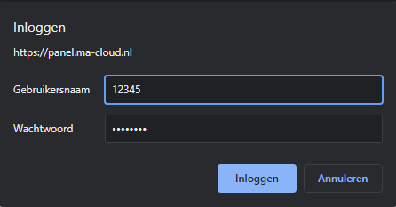
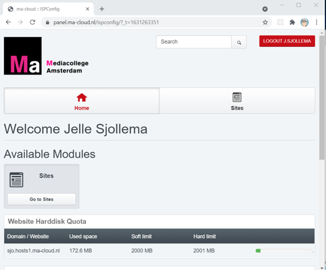

# 1-Skill inrichten werkomgeving

## Doelstelling
kan de werkomgeving nodig voor eerstejaars lessen SD inrichten
 
## Context
Downloaden en installeren van de programma's 
 
## inrichten werkomgeving
1. ma-cloud
2. De ftp-client: FileZilla 
3. Printen op school
Check (wordt ook behandeld bij andere lessen)
4. Adobe Creative Cloud
5. Visual Studio Code

## Ma-cloud

Ga in de browser naar: [Ma Cloud](https://panel.ma-cloud.nl) 

log in met studentennummer en password

Daarna verschijnt jouw Panel:

