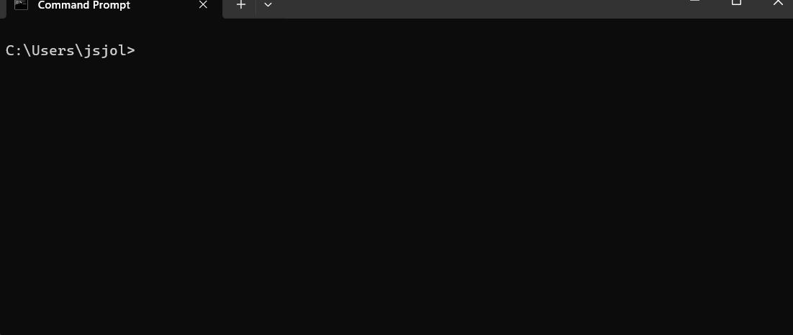
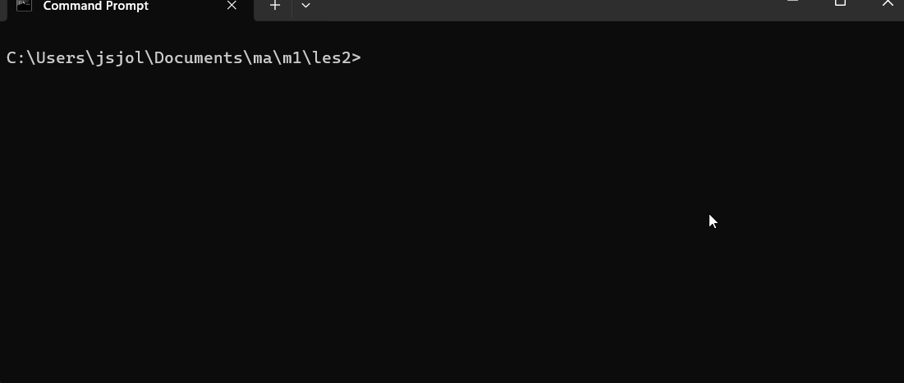
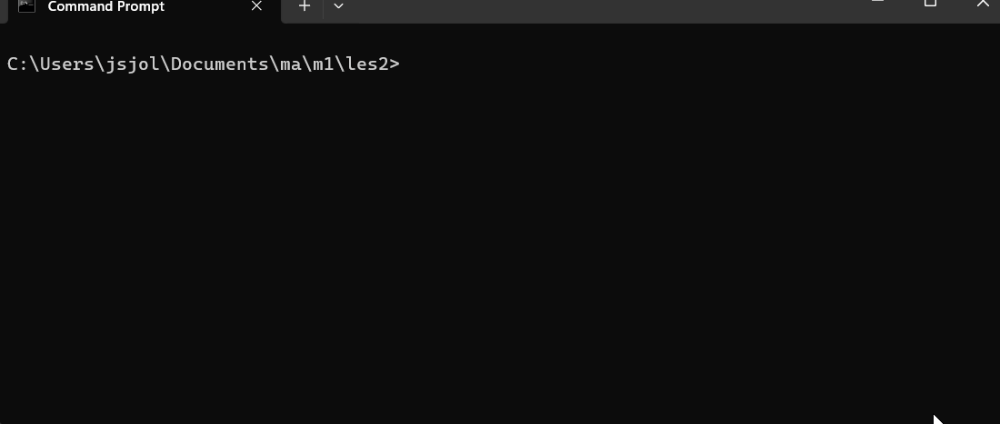
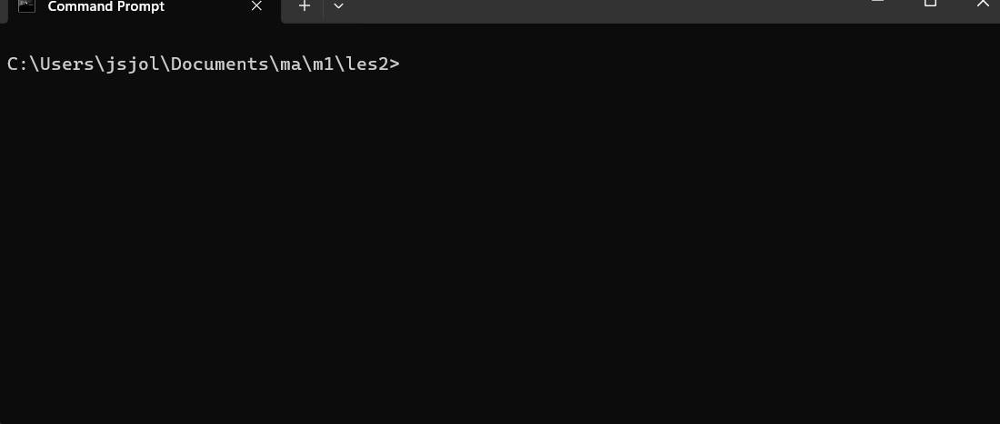
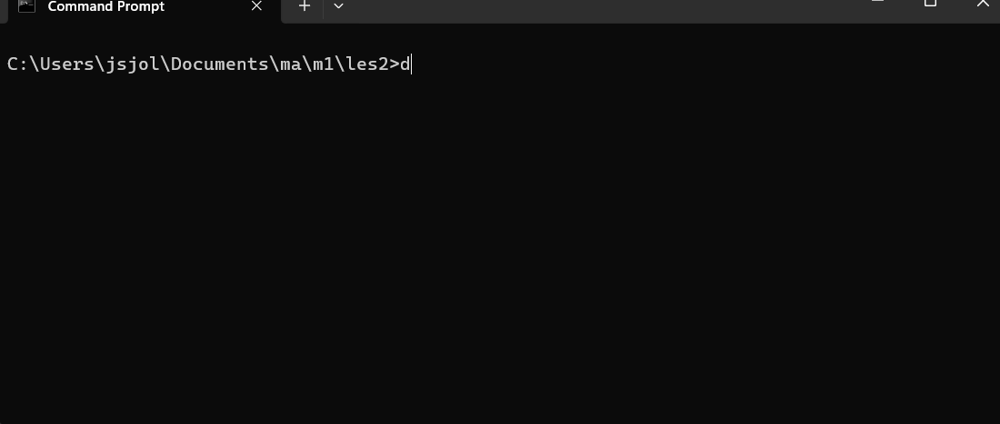
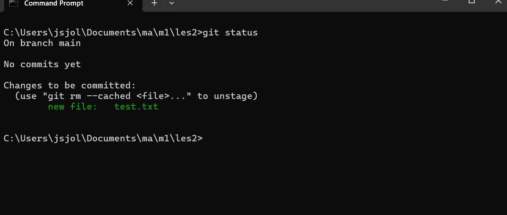

# Les 02 -- Git: Versiebeheer

### Extra

-   Voor Mac-gebruikers:
    [instructies](https://blanken5.home.xs4all.nl/webSlidesPresentaties/git.html)\
-   Terugblik: les 03 -- Hosting\
-   Bonusvraag: Zijn QR-codes altijd veilig?\
-   Overzicht volgende les: les 04

------------------------------------------------------------------------

## Inhoud

-   Wat is versiebeheer en waarom is dat handig?\
-   Kennismaken met versiebeheer in Git\
-   Git installeren en configureren\
-   Een repository maken\
-   Bestanden toevoegen aan een repository\
-   Veelgebruikte Git-commando's leren

------------------------------------------------------------------------

## Wat is Git?

-   Houdt veranderingen in (code) bij\
-   Elke verandering wordt opgeslagen als een **nieuwe versie**\
-   Je kunt teruggaan naar eerdere versies\
-   Samenwerken met meerdere developers\
-   Logboek: wie heeft wat gewijzigd, en wanneer

------------------------------------------------------------------------

## Repository

-   Bevat alle geschiedenis en versies van je code\
-   Maak je aan bij de start van een project\
-   Alles wordt hierin bijgehouden

------------------------------------------------------------------------

## Git installeren

1.  Download en installeer Git\
2.  Kies overal de **recommended settings**\
3.  Open een terminal:
    -   **Windows**: `cmd`\
    -   **Mac**: `terminal`

------------------------------------------------------------------------

## Eerste stappen

-   Navigeer naar de juiste map (bijv. `./documents/skill-github/les2/`)\
-   Controleer de actieve map met `ls` en `cd`

------------------------------------------------------------------------

## Git configureren

``` bash
git config --global init.defaultBranch main
git config --global user.name "Jouw Naam"
git config --global user.email studentnummer@ma-web.nl
```

------------------------------------------------------------------------
## Git status controleren

``` bash
git status
```

------------------------------------------------------------------------

## Initialiseren van Git

``` bash
git init
```

Resultaat: *Initialized empty Git repository*

------------------------------------------------------------------------

## nogmaals Git status controleren

``` bash
git status
```

------------------------------------------------------------------------

## Eerste bestand toevoegen

1.  Maak een bestand aan (`test.txt`)

    -   Windows: `notepad test.txt`\
    -   Mac: `touch test.txt`\

2.  Voeg tekst toe en sla op\

3.  Controleer status:

    ``` bash
    git status
    ```

------------------------------------------------------------------------

## Terminologie

-   **Staging area**: tijdelijke plek voor wijzigingen\
-   **Commit**: definitief vastleggen van wijzigingen in de repository

------------------------------------------------------------------------

## nogmaals Git status controleren

``` bash
git status
```

------------------------------------------------------------------------

## Bestand toevoegen aan staging area

``` bash
git add test.txt
```


------------------------------------------------------------------------

## nogmaals Git status controleren

``` bash
git status
```


------------------------------------------------------------------------

## Eerste commit maken

``` bash
git commit -m "eerste test"
git status
```

------------------------------------------------------------------------

## Bestand aanpassen

-   Open `test.txt` en wijzig de inhoud\

-   Status controleren:

    ``` bash
    git status
    ```

-   Toevoegen en committen:

    ``` bash
    git add test.txt
    git commit -m "tweede test"
    ```

------------------------------------------------------------------------

## inhoud van de commit bekijken

    ``` bash
    git show --name-only
    ```
------------------------------------------------------------------------
## Logs bekijken

-   Volledige log:

    ``` bash
    git log
    ```

-   Verkorte log:

    ``` bash
    git log --oneline
    ```

------------------------------------------------------------------------

## Grafisch overzicht

``` bash
gitk
```

------------------------------------------------------------------------

## Opdracht

1.  maak een map **Les2b** \
2.  Maak een nieuw tekstbestand (eigen naam)\
3.  Voeg command-line commando's toe aan dit bestand\
4.  Maak **na elke wijziging een commit**\
5.  Vraag een log op (liefst verkorte log)
6.  Maak een screenshot van de log en lever deze in op simulise

------------------------------------------------------------------------

## Samenvatting

Je kunt nu: - Een Git repository aanmaken\
- Bestanden toevoegen aan de staging area\
- Een commit maken met message\
- De status opvragen\
- Een log van commits bekijken

------------------------------------------------------------------------

## Verder lezen

-   [Git Tutorial -- Backlog](https://backlog.com/git-tutorial/)
