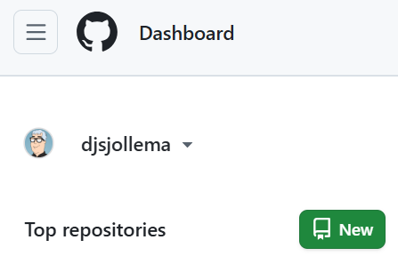
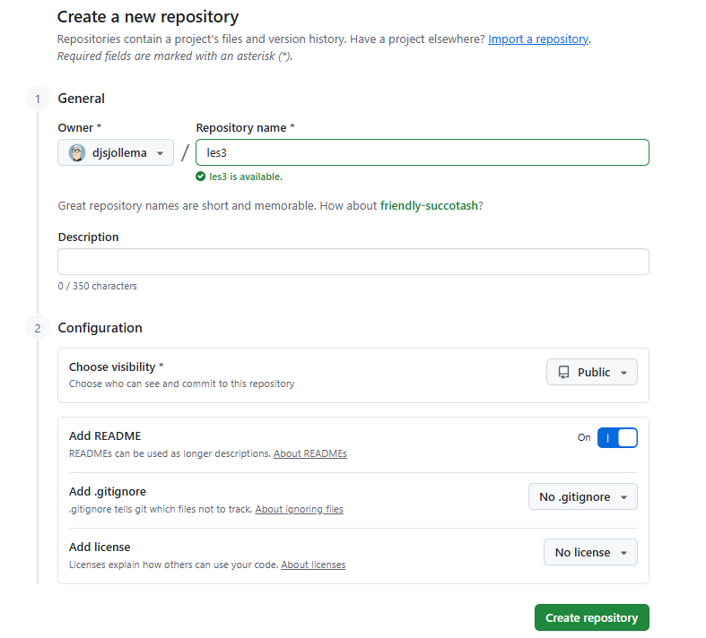
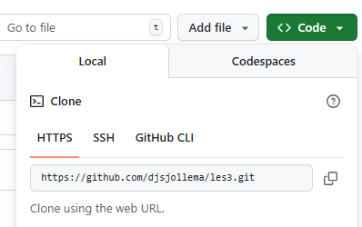

# skill-github-les3

## Doel van de les
Na deze les kun je:
- Op GitHub een nieuwe repository **skill-github-les3** aanmaken.
- De repo lokaal **klonen** in `C:/documents/ma/m1/skill-github/les3`.
- `README.md` **bewerken**, **committen** en **pushen** naar de **remote**.
- Veelvoorkomende fouten herkennen en oplossen.

---

## 1) Maak een nieuwe repository op GitHub
1. Log in op **GitHub**.
2. Klik rechtsboven op **+ → New **.



3. Vul in:
   - **Repository name**: `skill-github-les3`
   - **Description**: *(optioneel)*
   - **Public**
   - **Initialize this repository**: vink **Add a README file** aan *(aanbevolen)*.
4. Klik **Create repository**.



5. Klik op de groene knop **<> Code** en kopieer de **HTTPS**-URL, bijvoorbeeld:  
   `https://github.com/<jouw-gebruikersnaam>/skill-github-les3.git`

of gebruik de copy-url-knop




> *Waarom README aanvinken?* Dan heb je meteen een bestand om aan te passen en kun je zonder extra stappen pushen.

---

## 2) Repo lokaal klonen in de juiste map
We werken in de map `C:/documents/ma/m1/skill-github/les3`.

1. Open **Command Prompt** (Start → typ *cmd*).
2. Navigeer naar de werkmap (maak eventueel de map aan):
   ```bash
   cd C:/documents/ma/m1/skill-github
   mkdir les3
   cd les3
   ```
3. **Kloon** de repo en ga de map in:
   ```bash
   git clone https://github.com/<jouw-gebruikersnaam>/skill-github-les3.git
   cd skill-github-les3
   ```

*(Eenmalig per computer) Stel je Git-identiteit in als dat nog niet gebeurd is:*
```bash
git config --global user.name "Jouw Naam"
git config --global user.email "jij@example.com"
```

---

## 3) README.md aanpassen
1. Open het bestand in Kladblok (of je favoriete editor):
   ```bash
   notepad README.md
   ```
2. Voeg bijvoorbeeld onderaan toe:
   ```md
   ## Mijn aanpassing
   - README bijgewerkt op <vul datum in>
   ```
3. **Sla op** en sluit het bestand.

---

## 4) Wijzigingen opslaan (commit) en pushen
1. Controleer de status:
   ```bash
   git status
   ```
2. **Stage** de wijzigingen:
   ```bash
   git add README.md
   ```
3. **Commit** met duidelijke boodschap:
   ```bash
   git commit -m "Update README: eerste aanpassing"
   ```
4. **Push** naar GitHub:
   - Als de branch al een upstream heeft (meestal bij een repo met README):  
     ```bash
     git push
     ```
   - Eerste push vanaf je lokale branch (als upstream nog niet is ingesteld):  
     ```bash
     git push -u origin main
     ```

> **Authenticatie-tip (Windows):** Bij de eerste push kan Git vragen om in te loggen. Gebruik de browser-prompt of een **Personal Access Token (PAT)** als “wachtwoord”. Een PAT maak je via **GitHub → Settings → Developer settings → Personal access tokens**.

---

## 5) Extra: werken op een aparte branch (optioneel)
```bash
git checkout -b docs/update-readme
# pas README aan
git add README.md
git commit -m "Docs: README uitgebreid"
git push -u origin docs/update-readme
```
Maak vervolgens op GitHub een **Pull Request**, laat ’m reviewen en **merge**.

---

## 6) Veelvoorkomende problemen & oplossingen
- **“fatal: not a git repository”**  
  → Zorg dat je in de map `skill-github-les3` staat (`cd skill-github-les3`).

- **“destination path already exists and is not an empty directory”** bij `git clone`  
  → Verwijder of hernoem de bestaande map, of clone naar een **andere** doelmap:
  ```bash
  git clone https://github.com/<jouw-gebruikersnaam>/skill-github-les3.git skill-github-les3-kopie
  ```

- **“updates were rejected because the remote contains work that you do not have locally”**  
  → Haal eerst op en herprobeer:
  ```bash
  git pull --rebase
  git push
  ```

- **“permission denied” of login-problemen**  
  → Gebruik een **PAT** of log in via de credential prompt.

- **Verkeerde branch**  
  ```bash
  git branch
  git switch main
  ```

---

## 7) Samenvatting kerncommando’s
```bash
# Aanmaken: op GitHub -> New repository -> skill-github-les3 (met README)

# Lokaal klonen
cd C:/documents/ma/m1/skill-github
mkdir les3
cd les3
git clone https://github.com/<jouw-gebruikersnaam>/skill-github-les3.git
cd skill-github-les3

# README bewerken
notepad README.md

# Status, stage, commit, push
git status
git add README.md
git commit -m "Update README: eerste aanpassing"
git push            # of: git push -u origin main (eerste keer)
```

---

### Extra oefening
- Voeg `notes.md` toe met drie bullets, commit & push.
- Maak een branch `experiment/readme-badges`, voeg een badge toe en maak een Pull Request.
