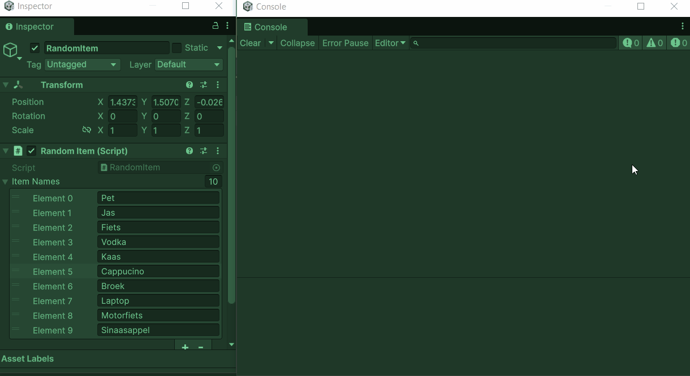

# M2 GDV les 1.2 (CODE) Herhaling Basis C#

Doel: korte en duidelijke herhaling van belangrijke programmeerconcepten in de context van Unity en C#.

Onderwerpen:

1. Variabelen en datatypes
2. Functies, argumenten en return values
3. If en switch statements
   Nieuw onderwerp:
4. Lists en Arrays

---

## 1) Variabelen en datatypes

- Variabelen zijn namen voor opslag van waarden.
- Veelgebruikte datatypes in Unity/C#:
  - `int` (gehele getallen), `float` (kommagetallen, e.g. 3.14f), `bool` (true/false), `string` (tekst)
  - `Vector2`, `Vector3`, `Quaternion` (Unity structs voor positie/rotatie)
- Declaratievoorbeeld:

```csharp
int score = 0;
float speed = 5.5f;
string playerName = "Hero";
bool isAlive = true;
```

Korte uitleg:

- `int` en `float` verschillen in precisie en gebruik; floats veel in games voor beweging.
- `string` is een reference type; primitives (int/float/bool) zijn value types.

Meerkeuzevragen (2x):

1. Welke datatype gebruik je voor een teller van behaalde punten?
   A) `float`
   B) `string`
   C) `int`
   D) `bool`

2. Welk datatype is geschikt voor de tekstnaam van een speler?
   A) `int`
   B) `string`
   C) `bool`
   D) `float`

---

## 2) Functies, argumenten en return values

- Functie (methode) is een blok code dat een taak uitvoert.
- Argumenten (parameters) zijn de inputs; return value is wat de functie teruggeeft.
- Voorbeeld:

```csharp
public int Add(int a, int b)
{
    return a + b;
}

void PrintName(string name)
{
    Debug.Log(name);
}
```

- `void` betekent: geen return value.

Korte uitleg:

- Gebruik functies om code te organiseren en herhaling te vermijden.
- Kies duidelijke parameter- en functienamen.

Meerkeuzevragen (2x): 3. Welke return-type gebruik je als een functie niets hoeft terug te geven?
A) `int`
B) `string`
C) `void`
D) `bool`

4. Wat doet deze functie?

```csharp
public float Multiply(float x, float y)
{
    return x * y;
}
```

A) Print twee getallen
B) Maakt een vector
C) Geeft de uitkomst van x maal y terug
D) Zet x en y naar 0

---

## 3) If en switch statements

- `if` gebruik je voor conditionele logica:

```csharp
if (health <= 0)
{
    Die();
}
else if (health < 20)
{
    PlayLowHealthWarning();
}
else
{
    // normaal gedrag
}
```

- `switch` is handig bij meerdere vergelijkbare cases:

```csharp
switch (weaponType)
{
    case "Melee":
        // melee logic
        break;
    case "Ranged":
        // ranged logic
        break;
    default:
        // fallback
        break;
}
```

Korte uitleg:

- `if` is meer algemeen en geschikt voor ranges en complexe voorwaarden.
- `switch` is overzichtelijker bij veel vaste opties.

Meerkeuzevragen (2x): 5. Wanneer gebruik je `switch` in plaats van meerdere `if/else`?
A) Voor continue reeksen met floats
B) Als je veel, vooraf bekende cases hebt
C) Voor random getallen
D) Als je altijd `else` wilt vermijden

6. Welke statement voert 1x code uit als de condition true is?
   A) `for`
   B) `while`
   C) `if`
   D) `switch`

---

## 4) Lists en Arrays

Arrays:

- Arrays zijn vaste-lengte collecties met elementen van hetzelfde type.
- Netjes en snel; handig als de grootte bekend en onveranderd is.
- C# voorbeeld:

```csharp
int[] scores = new int[5];
scores[0] = 10;
// of direct
int[] enemyValues = new int[] { 1, 2, 3 };

// Itereren
for (int i = 0; i < enemyValues.Length; i++)
{
    Debug.Log(enemyValues[i]);
}
```

Lists (`System.Collections.Generic.List<T>`):

- Dynamische grootte: je kunt items toevoegen/verwijderen tijdens runtime.
- Handiger voor variabele collecties.
- C# voorbeeld:

```csharp
using System.Collections.Generic;

public class Inventory : MonoBehaviour
{
    [SerializeField] private List<string> items = new List<string>();

    void Start()
    {
        items.Add("Sword");
        items.Add("Potion");
    }

    void PrintItems()
    {
        foreach (var it in items)
            Debug.Log(it);
    }
}
```

Belangrijkste verschillen en tips:

- Gebruik `array` als:
  - Je exacte lengte kent en die niet verandert.
  - Je maximale performance wilt (marginaal sneller voor vaste grootte).
- Gebruik `List<T>` als:
  - Je items wilt toevoegen, verwijderen of de lengte variabel is.
  - Je gemak wilt (methodes als `Add`, `Remove`, `Insert`).
- Unity Inspector: `List<T>` en arrays zijn beide serialiseerbaar en zichtbaar in Inspector als ze `public` of `[SerializeField] private` zijn (let op: sommige oude Unity-versies verschilden).

Voorbeeld: array vs list

```csharp
// Array
[SerializeField] private GameObject[] spawnPoints;

// List
[SerializeField] private List<GameObject> enemies = new List<GameObject>();

void SpawnAll()
{
    // array
    for (int i = 0; i < spawnPoints.Length; i++)
        Instantiate(prefab, spawnPoints[i].transform.position, Quaternion.identity);

    // list
    foreach (var e in enemies)
        e.SetActive(true);
}
```

---


---

## Praktijk opdracht — Array en List

### Opdracht 1A, Array:

maak een nieuw C# script `RandomItem.cs` (attach aan een GameObject).

Maak een array waarin 10 verschillende items als string opgeslagen kunnen worden. Zorg dat je deze array beschikbaar maakt in unity met `[SerializeField]` ervoor. Kijk goed in de uitleg hoe je een array kunt maken.

Vul deze array vanuit de inspector in unity met 10 verschillende items (strings).


Maak nu een functie die willekeurug 1 van deze 10 items op de console print als je op "Enter" drukt.

Tip: `Random.Range(0,9)` genereent een random int van 0 t/m 9

Maak ook een functie die alle items print in de console als je op Escape drukt.

```csharp
using UnityEngine;

public class RandomItem : MonoBehaviour
{
    //array maken voor 10 items

    void Update()
    {
        if(Input.GetKeyDown(KeyCode.Return))PrintRandomItem();
        if(Input.GetKeyDown(KeyCode.Escape))PrintAllItems();
    }
    private void PrintRandomItem() {
        //printen van 1 random item.

    }
    private void PrintAllItems() {
        //Printen van alle items
    }

}
```

Resultaat:



### Opdracht 1B, List:

Paats 3 3d objecten met verschillende kleuren in een level op de vloer.

Zorg voor een player object dat rond kan lopen. Gebruik hiervoor een script met de naam `PlayerMove.cs`. Gebruik een rigidbody op je player en zet `IsKinematic` op `true`

Maak nog een script met de naam `Inventory.cs` en plaats deze ook op je speler gameobject.

Zodra je speler een item raakt plaats je dit item in een List met de naam `itemInventory` en deactiveer je het item uit de scene met `SetActive(false)`. Gebruik `CompareTag()` om te checken of het een item betreft. (geef je items dus ook deze tag)

Zorg voor een functie met de naam `ReplaceItem` deze functie moet het laatste opgepakte item weer terugplaatsen (-R- key) in de wereld met de `SetActive(true)` functie. Verwijder het item ook weer uit je List als je hem terug plaatst.

Zorg dat je met `itemInventory.Count` controleert of er wel items in je inventory zitten.

Met `itemInventory[itemInventory.Count - 1]` kun je bij het laatste item dat je hebt toegevoegd.

Let op dat je het item vlak naast je player terugplaatst en niet op exact dezelfde plek. Want dan pak je hem gelijk weer op.

Resultaat:


---

## Oplevering / huiswerk

Maak een gif van je werkende prototype.
Plaats de titel, een omschrijving , je gifje en een link naar je scripts in je GDV Readme op github.

(Dezelfde readme als bij M1)
