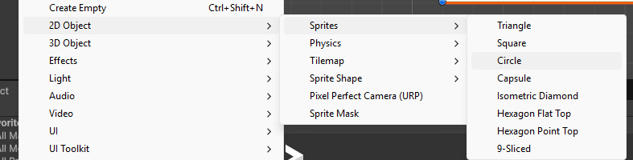

# Les 2.1 Week 2 – Forces & collision Stappenplan


## Inleiding

In deze les voeg je een nieuwe feature toe aan je project: een bal die je kunt afschieten met AddForce.  
Hieronder vind je een stappenplan dat je kunt volgen als je vastloopt of als je wilt controleren of je het goed hebt gedaan.  
Volg de stappen in je eigen tempo. Je mag het eerst zelf proberen, maar je kunt altijd terugvallen op dit stappenplan of de voorbeeldcode openen als je vastzit


---

## Waarom gebruiken we AddForce?

AddForce geeft een duw aan een Rigidbody.  
De Rigidbody is het onderdeel dat door Unity’s physics wordt bestuurd, dus daar moet de kracht naartoe.  
Wanneer je AddForce gebruikt, reageert de bal op zwaartekracht, massa en bouncen. Dat maakt de beweging natuurlijk.

Een Transform verplaatsen kan wel, maar dat is geen echte beweging. Je teleporteert de bal dan steeds een klein stukje. 
Dat ziet er onrealistisch uit en geeft geen botsingen, geen stuiteren en geen physics.

AddForce werkt samen met het physics-systeem. Daarom is het de juiste manier voor een Peggle-achtig spel waar één kracht wordt gegeven en daarna de natuurkunde het overneemt.


---

## Stap 1. 

- Maak een nieuw 2D project aan of open het project van vorige week. 


Geef je project een naam waar jij en je docent meteen uit kunnen afleiden wat het is en van wie het is, bijvoorbeeld FruityPeggle_KimVerweij.

## Stap 1 - Level


In deze stap bouw je de basis van je level. Je maakt een speelgebied waar de bal in kan vallen en tegenaan kan stuiteren. Dit doe je met colliders: een vloer, twee muren en een plafond.

### 1. Maak een vloer
- Maak een nieuw GameObject, kies **2D Object, Sprite,  Square**  
- Geef het de naam **Vloer** of **Floor** 
- Schaal het breder
- Plaats het onderaan je level  
- Voeg een **BoxCollider2D** toe (als die nog niet aanwezig is)

### 2. Maak een linker muur
- Dupliceer de vloer (Ctrl + D)  
- Hernoem naar **MuurLinks**  of **WallLeft**
- Draai of schaal het zodat het een verticale muur wordt
- Plaats deze links in het scherm  
- BoxCollider2D blijft staan

### 3. Maak een rechter muur
- Dupliceer MuurLinks  
- Hernoem naar **MuurRechts**  of **WallRight**
- Plaats deze rechts in het scherm

### 4. Maak een plafond
- Dupliceer de vloer  
- Hernoem naar **Plafond**  of **Ceiling**
- Plaats deze bovenaan het scherm (bijv. boven de bal)  
- Schaal de breedte zodat het gehele speelveld afgesloten is

### 5. Controleer de colliders
Alle vier de randen van je speelveld moeten een **BoxCollider2D** hebben.  
Zorg dat:
- Nergens een gat zit  
- Alles goed aansluit  
- De bal niet kan ontsnappen

Je basislevel is nu klaar.  
In de volgende stap ga je de bal laten schieten met AddForce.


## Stap 2 – Bal afschieten met AddForce

### 0. Maak een bal.

- Dat kun je doen door een nieuw 2D object te maken (kies sprite - circle)
- Geef dit GameObject een duidelijke naam, zoals Bal.

--- 

### 1. Controleer of je bal een Rigidbody2D heeft
- Selecteer je bal in de scene.  
- Ga naar **Add Component** en kies **Rigidbody2D**.  


---

### 2. Zorg dat de bal een Collider heeft
- Gebruik een **CircleCollider2D** of een andere 2D-collider.  
Zonder collider zijn er geen botsingen.


---

### 3. Voeg een 2D physics material toe
- Maak een folder aan genaamd Material.
- Open deze folder, right-click in deze folder en maak een Physics Material 2D aan.


Met een Physics Material 2D kun je de bounciness van je bal instellen.
Zonder material stuitert de bal meestal nauwelijks of heel weinig.

- Voeg de material toe aan de collider (NIET AAN de RIGIDBODY)

---

### 4. Maak een script om de bal te schieten
- Maak een nieuw script, bijvoorbeeld **ShootBall.cs**.
- Voeg het script toe aan de bal.

Je kunt de opdracht helemaal zelf maken door de stappen hieronder te volgen. Lukt het niet of wil je je werk controleren?  
Dan kun je verderop de voorbeeldcode openen.

### Stappen om je op weg te helpen
1. Zorg dat je bal een Rigidbody2D heeft.
2. Maak een script dat luistert naar een toets (bijvoorbeeld A of Spatie).
3. Haal in Start() de Rigidbody2D op met GetComponent.
4. In Update(): wanneer je op de toets drukt, geef je een AddForce.
5. Test verschillende waardes voor richting en kracht.


<details>
<summary>Klik om de voorbeeldcode te openen</summary>
    
```csharp


// Hoe hard de bal wordt weggeduwd
public float ShootForce = 500f;

// In welke richting de bal duwt krijgt (0,1,0 = omhoog)
public Vector3 Direction = new Vector3(0f,1f,0f);

private Rigidbody2D rb;

// Start is called once before the first execution of Update after the MonoBehaviour is created
void Start()
{
    // aalt automatisch de Rigidbody2D op van dit object
    rb = GetComponent<Rigidbody2D>();
}

// Update is called once per frame
void Update()
{
    if(Input.GetKeyDown(KeyCode.A))
    {
        // Geeft een kracht in de opgegeven richting * sterkte
        rb.AddForce(Direction * ShootForce);
        
    }
}
```
</details>


## Stap 3 – Targets & Collisions toevoegen

Nu je bal kan schieten, voeg je targets toe waarop de bal kan botsen.  
Daarna laat je Unity een melding geven wanneer de bal een target raakt.

---

### 1. Maak een target in je scene
- Maak een nieuw GameObject → **Sprite / 2D Object** (bijvoorbeeld een vierkant of eigen sprite).
- Geef het object een duidelijke naam, zoals **Target**.
- Schaal het naar wens en plaats het ergens onder je bal.

Waarom?
Dit is het object waar de bal straks tegenaan botst.

---

### 2. Voeg een Collider2D toe aan het target
- Selecteer het target.  
- Ga naar **Add Component**  kies **BoxCollider2D**, **CircleCollider2D** of iets anders dat past.  

Zonder Collider2D registreert Unity geen botsingen.

---

### 2.1 Geef je target een tag (aanbevolen)
Het is handig om je target een tag te geven, zodat je later in je project
kunt herkennen wat de bal precies raakt.

#### Zo doe je dat:
- Selecteer het target.
- Ga in de Inspector naar **Tag**.
- Kies **Add Tag…**.
- Voeg een nieuwe tag toe, bijvoorbeeld **Target**.
- Selecteer opnieuw je target en geef hem deze tag.

Je hebt dit nog niet nodig voor het loggen van botsingen,  
maar je hebt het wél nodig voor volgende lessen (scoring en triggers).


### 3. Zorg dat het target géén Rigidbody2D heeft
- Targets die stil moeten blijven **hebben geen Rigidbody nodig**.
- Unity laat een bal prima botsen op een object dat alleen een Collider heeft.

---

### 4. Collision-detectie toevoegen met OnCollisionEnter2D
- Voeg een nieuw script toe aan het target, bijvoorbeeld **TargetCollision.cs**.
- Plaats deze code in het script:

```csharp
void OnCollisionEnter2D(Collision2D collision)
{
    Debug.Log("Hit!");
}
```

### 5. Test je collisions

- Druk op **Play**.  
- Schiet de bal af.  
- Bekijk of er een **"Hit!"** verschijnt in de Console wanneer de bal je target raakt.

**Werkt het niet? Controleer:**
- Heeft de bal een **Rigidbody2D**?  
- Hebben beide objecten een **Collider2D**?  
- Staat het **script op het target**?  
- Raakt de bal het target echt?  

---

### 6. Breid je scene uit

- Maak meerdere targets en plaats ze op verschillende plekken.  
- Varieer in vorm, grootte en afstand.  
- Zo krijgt jouw Peggle-spel steeds meer vorm.

---

### 7. Voeg een GIF en uitleg toe aan je README

Maak een korte GIF van je schietende bal die een target raakt en voeg deze toe aan je README.


