# M2 GDV les 2.2 (CODE) Peggle Game, Mikken en Line Rendering


## Stappen voor het mikken

### 1. importeer een image

Imorteer een image van je kanon of wat je dan ook wil gebruiken om ballen mee af te vuren.

Maak in je Assets folder een graphics folder aan en sleep daar een .png bestand in.

Zorg dat je image een transparante achtergrond heeft.

In je project window selecteer je de image. In de het Inspector window verschijnen nu de import settings.

Stel het Texture Type in op `Sprite(2d and UI)`

Zet de Sprite Mode op `Single`


Scroll naar beneden en druk op apply.

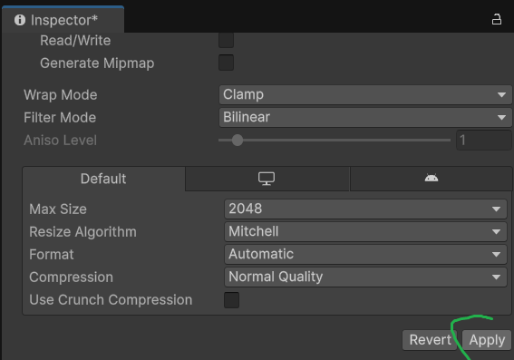

### 2. Maak je gameobject

Maak in je Hierarchy window een nieuw leeg gameobject aan. Dit is je "holder".

Sleep daar de sprite van je kanon in.

Roteer zonodig de sprite zodat deze naar rechts wijst.

Het punt waarop je kanon gaat draaien is het midden van je lege game object (holder). Zorg dus dat het punt waarop je sprite gaat draaien in het midden van je holder staat.

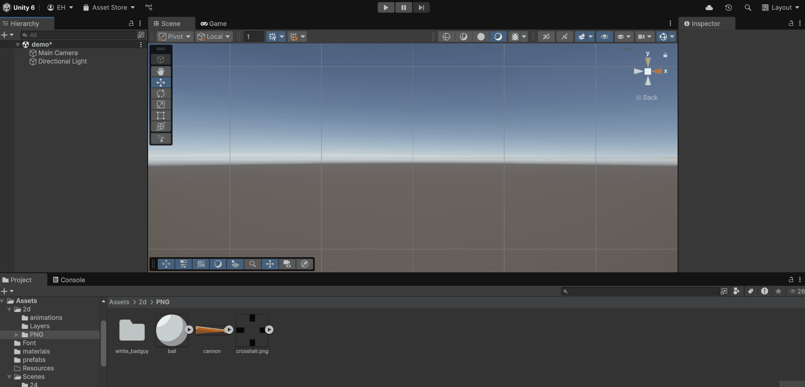

### 3. Scrijf je script

Maak een nieuwe map in je Assets folder met de naam `Scripts`

Maak een script met de naam `Aim.cs` en hang die aan je `cannon holder`

Open je script in Visual Studio en scrijf de volgende code:

Als je het zelf op een andere manier wilt proberen dan mag dat uiteraard ook.

```Csharp
using UnityEngine;
public class Aim : MonoBehaviour
{
    void Update()
    {
        //positie van het gameobject op het screen bepalen
        Vector3 pos = Camera.main.WorldToScreenPoint(transform.position);
        //Richting tussen het gameobject en je muiscursor bepalen
        Vector3 dir = Input.mousePosition - pos;
        //Bereken de hoek tussen het gameobject en de muiscursor in graden
        float angle = Mathf.Atan2(dir.y, dir.x) * Mathf.Rad2Deg;
        //Roteer het gameobject met deze hoek om de z-as
        transform.rotation = Quaternion.AngleAxis(angle, Vector3.forward);
    }
}
```

### Uitleg over de code:

1. `Vector3 pos = Camera.main.WorldToScreenPoint(transform.position);`

   - Doel: de wereldpositie van het GameObject (cannon-holder) omzetten naar schermcoördinaten (pixels).
   - Waarom: `Input.mousePosition` geeft de muispositie ook in schermpixels terug; beide moeten in hetzelfde coördinatenstelsel zijn om ze te kunnen vergelijken.
   - Belangrijk: `Camera.main` zoekt de camera met tag `MainCamera`. `WorldToScreenPoint` geeft een `Vector3` terug waarvan `x,y` schermcoördinaten zijn en `z` de afstand de tot de camera.

   

2. `Vector3 dir = Input.mousePosition - pos;`

   - Doel: bepaal de richtingvector van het object naar de muis in schermruimte.
   - Waarom: door de schermpositie van het object af te trekken van de muispositie krijg je een vector die zowel richting (x,y) als afstand geeft; deze vector gebruik je om de richting te berekenen.
   - Belangrijk: zorg dat beide waarden in schermruimte zijn (anders klopt de richting niet).

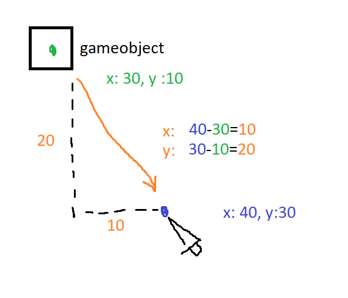

3. `float angle = Mathf.Atan2(dir.y, dir.x) * Mathf.Rad2Deg;`

   - Doel: bereken de hoek (in graden) van de `dir`-vector ten opzichte van de positieve X-as.
   - Waarom: `Mathf.Atan2(y, x)` geeft de hoek in radialen en houdt rekening met het teken van x en y zodat de hoek in alle kwadranten correct is. Vermenigvuldigen met `Mathf.Rad2Deg` zet radialen om naar graden, wat Unity-rotaties vaak gebruiken.
   - Belangrijk: `Atan2` retourneert waarden tussen -π en π;
     (Pi ~ 3.14)
     na conversie krijg je een hoek tussen -180° en 180°.

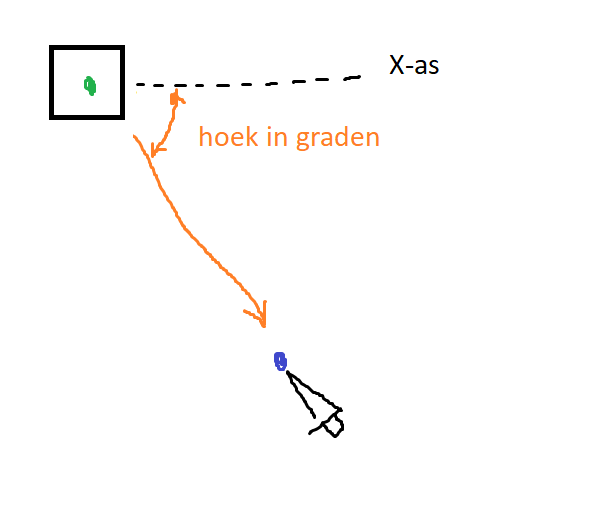

4. `transform.rotation = Quaternion.AngleAxis(angle, Vector3.forward);`
   - Doel: zet de rotatie van het GameObject zodat het wijst naar de berekende hoek.
   - Waarom: `Quaternion.AngleAxis(angle, Vector3.forward)` maakt een rotatie rond de Z-as (voor 2D-games is dat de as die uit het scherm komt). Door `transform.rotation` direct te zetten, roteer je het object onmiddellijk.
   - Belangrijk: zorg dat je sprite naar rechts wijst omdat dit 0 graden is.

### 4. Test je prototype

Als het goed is moet je dit resultaat hebben:


## Stappen voor het Schieten

### 1. Importeer een projectiel

Herhaal de stap zoals bij je kanon en zorg dat je een sprite van een projectiel in je hierarchy hebt staan. Gebruik voor je projectiel geen holder. Hij is rond dus het draaipunt komt gewoon in het midden.

### 2. Maak een prefab

Maak een map `Prefabs` aan in je `Assets` folder.

Sleep nu je gameobject naar deze map in je project window. Op deze manier maak je van je gameobject een zogenaamde "prefab". Dit zorgt ervoor dat je dit gameobject kunt gaan hergebruiken in je game.

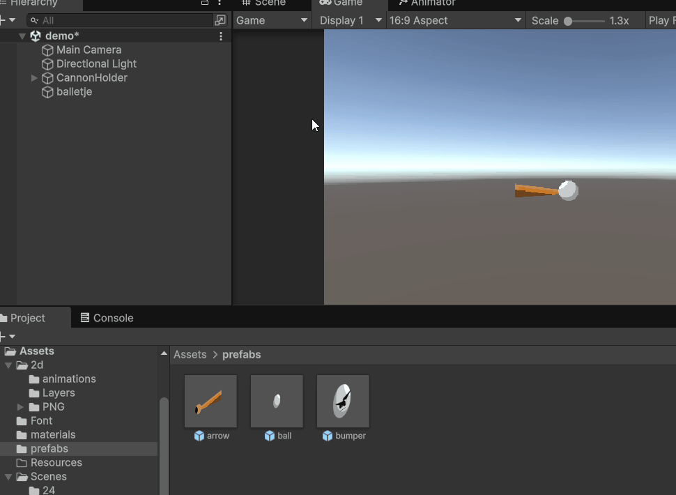

Verwijder nu de prefab uit de hierarchy! Deze ballen gaan we later weer vanuit ons script in de scene zetten.

### Prefab mode

Dubbelklik op de bal in je project window. Je komt nu in "prefab mode". Door op het pijltij links bovenin je hierarchy te drukken ga je weer terug naar je scene.


In prefab mode kun je je prefabs aanpassen. Zorg dus dat je in prefab mode zit van je bal en ga naar de inspector.

### 3. Components en Physics Material toevoegen

Voeg nu een `Rigidbody2D` component en een `CircleCollider2D` toe.


Maak ook een nieuw mapje `Materials` aan in je `Assets` folder. Maak hier een `Physics Material` aan.

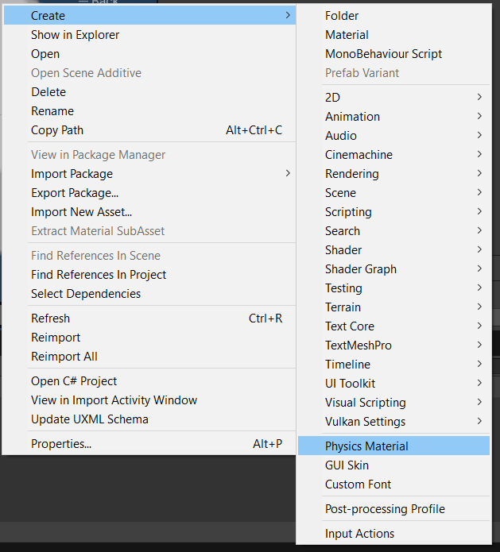

Sleep deze `physics material` in het `material` veld van je `Ridigbody 2D` component.

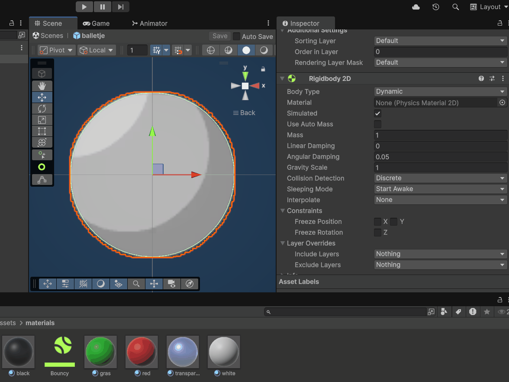

In deze material kun je instellen hoe erg je bal stuitert en hoeveel luchtweerstand deze tegenkomt.

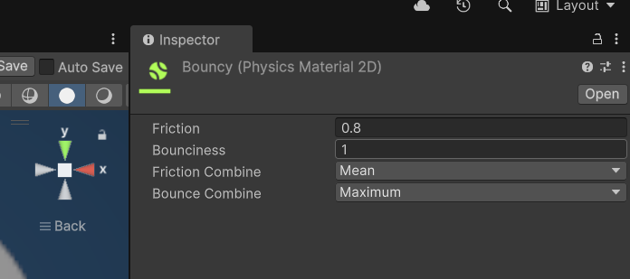

### 4. Scripten

We maken nu een script aan waarmee we de ballen gaan afvuren.

Maak in je `Scripts` folder een nieuw script aan met de naam `Shoot.cs`

Hang dit script als component aan je bal in de inspector.

Open het script na het compilen in Visual Studio.

Gebruik de volegende code en probeer te begrijpen wat deze doet door de comments te lezen:

```Csharp
using UnityEngine;
public class Shoot : MonoBehaviour
{
    //De waarden van deze variabelen kun je in de inspector editen

    //in de inspector moet de prefab van de bal in het veld gesleept worden.
    [SerializeField] private GameObject prefab;
    //kracht die de bal krijgt per seconde dat we de knop inhouden
    [SerializeField] private float forceBuild = 20f;
    //maximale tijd om bij te houden hoe lang we de knop hebben ingedrukt
    [SerializeField] private float maximumHoldTime = 5f;

    //Deze variabelen zijn niet zichtbaar in de inspector

    //Bijhouden hoe lang we de knop hebben ingedrukt (seconden)
    private float _pressTimer = 0f;
    //Totale kracht waarmee de bal wordt afgevoord
    private float _launchForce = 0f;

    //Elk frame voeren we een functie HandleShot uit
    private void Update(){
        HandleShot();
    }
    //Die functie scrijven we zelf
    private void HandleShot() {
        //Check of de linkermuisknop word ingedrukt (alleen het eerste moment van indrukken)
        if (Input.GetMouseButtonDown(0))
        {
            _pressTimer = 0; //reset de timer weer op 0. Verderop gaan we de tijd hierin bijhouden hoe lang we de knop hebben ingehouden

        }
        //Check of je de linkermuisknop loslaat.
        if (Input.GetMouseButtonUp(0))
        {
            /*bepaal de kracht die je bal moet krijgen. hoe langer je de knop hebt vastgehouden hoe meer kracht. Met forcebuild kun je deze kracht tweaken in de inspector. Dit is de kracht per seconde.*/
            _launchForce = _pressTimer * forceBuild;

            /*Instantiate maakt van een prefab een gameonject in je scene.
            Er wordt dus een nieuwe bal in je scene aangemaakt.
            Om nog meer met deze bal te kunnen in ons script slaan we hem op in een variabele*/
            GameObject ball = Instantiate(prefab, transform.parent);

            /*geef de bal dezelfde rotatie als ons kanon zodat we heb de juiste richting op kunnen schieten.*/
            ball.transform.rotation = transform.rotation;

            /*Geef de Rigidbody van de bal een kracht (_launchForce) naar rechts mee zijn eigen x-as. Doordat de bal goed geroteerd is gaat hij de goede kant op.*/
            ball.GetComponent<Rigidbody2D>().AddForce(ball.transform.right * _launchForce, ForceMode2D.Impulse);

            /*Plaats de bal op dezelfde plek als het kanon zodat deze vanaf die plek in de scene verschijnt*/
            ball.transform.position = transform.position;
        }
        /*Om te voorkomen dat we oneindige kracht mee kunnen geven beperken we de tijd die we maximaal bij gaan houden. Deze maximum tijd kunnen we in seconden instellen in de inspector (maximumHoldTime)*/
        if(_pressTimer < maximumHoldTime){
            /*Elk frame tellen we de duur van het frame op bij de verstreken tijd sinds we de knop in hebben gedrukt. Zodra we deze los laten weten we dus hoe lang dit duurde */
            _pressTimer += Time.deltaTime;
        }
    }
}
```

Sleep nu de prefab van je bal in het veld `prefab` van je script.

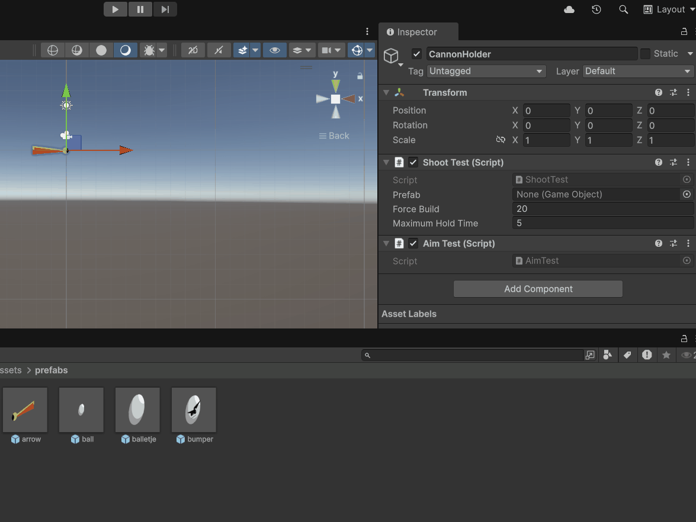

### 4. Test je prototype

Als het goed is moet je dit resultaat hebben:
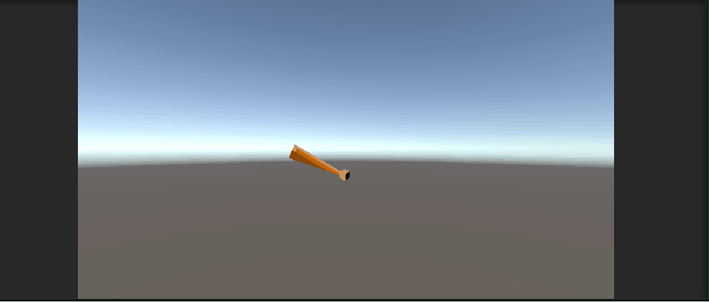

## Stappen voor het maken van een kracht lijn

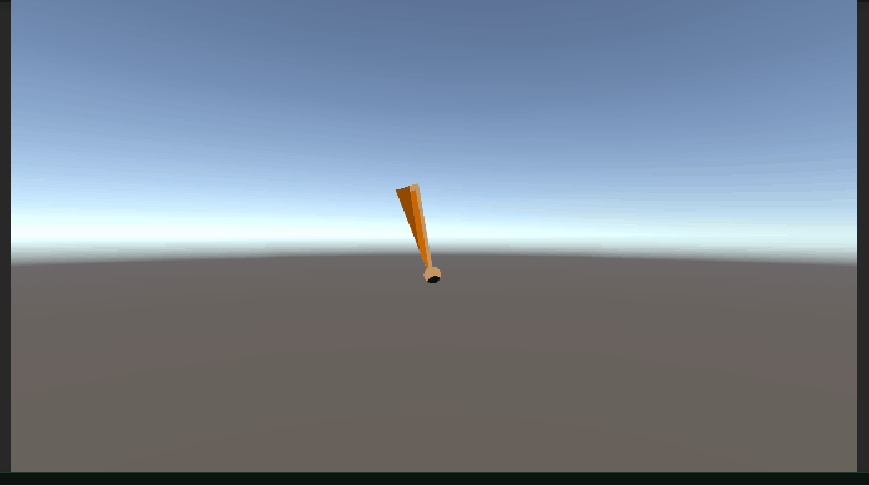

### 1. Voeg een LineRenderer toe

Voeg aan je kanon holder een `LineRenderer` component toe.


Pas de volgende velden aan:

Zet de `x` waarde van de 2e positie op 10 zodat je de lijn ziet verschijnen.
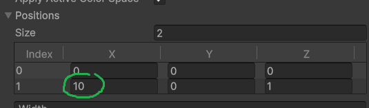

Pas de dikte van je lijn aan. Je kunt op de lijn klikken om een punt toe te voegen. Sleep je de punt naar beneden dan wordt de lijn op die plek dunner. Naar boven slepen maakt hem dikker.
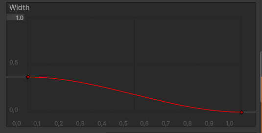

Je kunt een kleuren gradient maken door kleuren (onderste labels) toe te voegen en aan te passen. Ook kun je de doorzichtigheid (alpha) aanpassen met de bovenste labels.
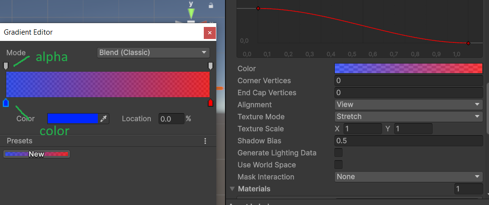

Zet het vinkje `Use World Space` uit!

Kies een `material` voor je line. Kies de `default-line` material.
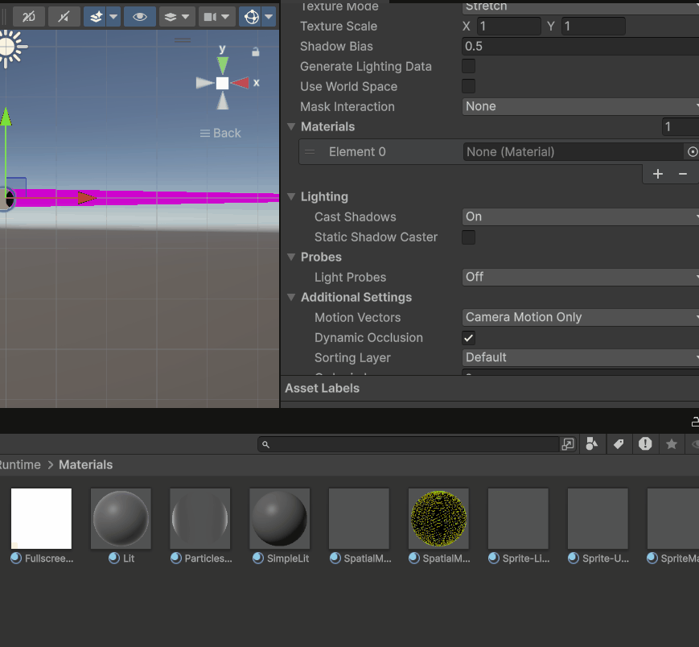

Je hebt nu een statische lijn getekend. Die zou er ongeveer zo uit moeten zien.
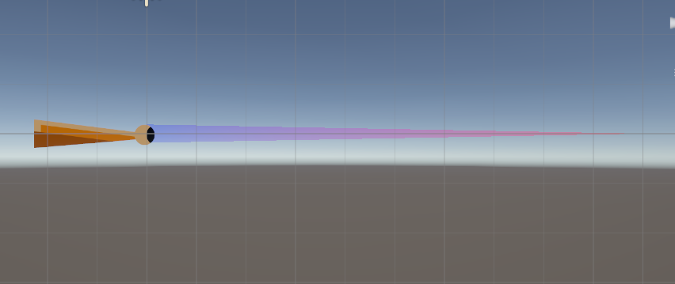

### 2. Scripten van de lijn

We geen nu de lijn scripten in het script `Shoot.cs` want daar is het een onderdeel van. We willen dat de lijn groter wordt als we de knop indrukken. Verder moet de lijn verdwijnen als we de knop loslaten. De lijn gaat aangeven hoe hard we schieten.

Voeg deze regels toe in je class `Shoot`. boven alle andere functies bij de rest van de variabelen.

```Csharp
    //snelheid waarmee de lijn groeit
    [SerializeField] private float lineSpeed = 10f;
    //verwijzing naar de linerenderer
    private LineRenderer _line;
    //we houden hiermee bij of de lijn actief is of niet
    private bool _lineActive = false;
```

Verder voeg je een `Start` functie toe als die er niet al is. In deze functie zet je de volgende code:

```Csharp
 private void Start()
 {
    //we vragen het Line Renderer comonent op en slaan deze op in een variabele
     _line = GetComponent<LineRenderer>();
     //We pakken het eindpunt van de lijn en zetten deze op positie 0,0,0 (zelfde plek als het beginpunt). Hierdoor word de lijn onzichtbaar.
     _line.SetPosition(1,Vector3.zero);

 }
```

In de functie `HandleShot` zorgen we dat de boolean `_lineActive` true wordt als de muisknop wordt ingedrukt.

```CSharp
    if (Input.GetMouseButtonDown(0))
    {
        _pressTimer = 0;
        _lineActive = true;
    }
```

Als de muisknop wordt losgelaten voeg je de volgende regels toe: `_lineActive = false;` en `_line.SetPosition(1, Vector3.zero);`.
We houden dus bij dat de lijn niet meer actief moet zijn en we maken hem weer onzichtbaar.

```Csharp
    if (Input.GetMouseButtonUp(0))
    {

        //andere code....


        _lineActive = false;
        _line.SetPosition(1, Vector3.zero);
    }
```

Helamaal onderin de functie `HandleShot` voeg je de volgende code toe:

```Csharp
    if (_lineActive) {
        _line.SetPosition(1, Vector3.right * _pressTimer * lineSpeed);
    }
```

Dit zorgt ervoor dat als de lijn actief is dat de positie van het eindpunt verder naar rechts gaat hoe langer de knop ingedrukt is (`_pressTimer`). De waarde van `lineSpeed` kun je instellen in de inspector. Hiermee kun je de lijn dus sneller of langzamer maken.

### 3. Test je prototype

Dit zou het ongeveer moeten zijn:


## Inleveren op je README

Zet in de titel **2.2 Aim, Shoot en Line**
Maak een korte GIF van je aim en shoot system met line renderer en zet deze op je readme. Zet hier ook een link naar de code.
