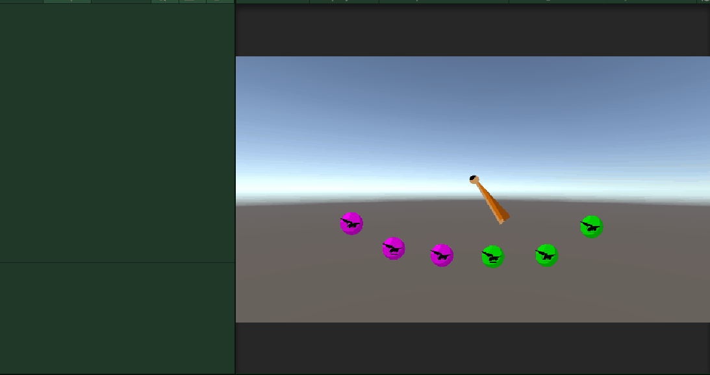
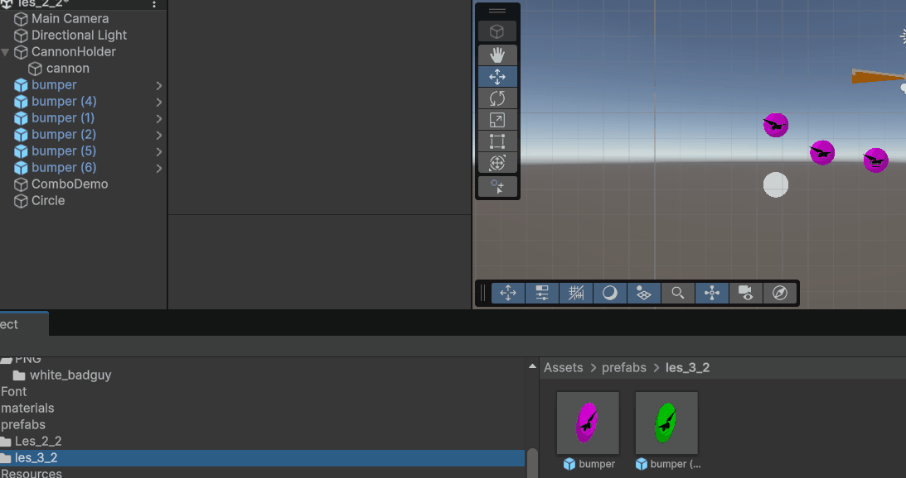
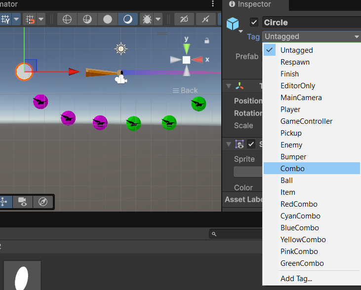
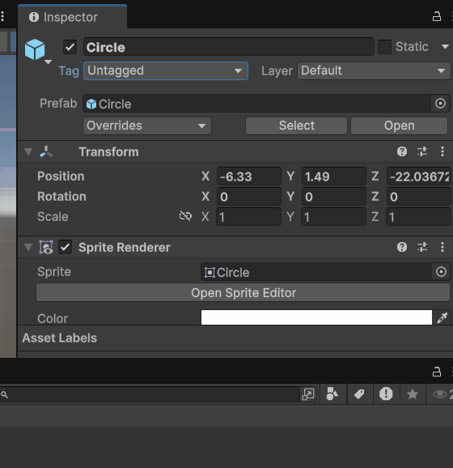
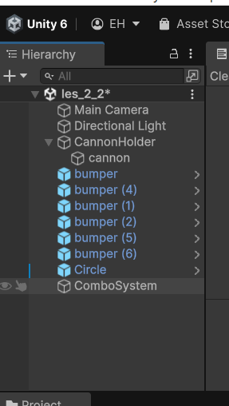
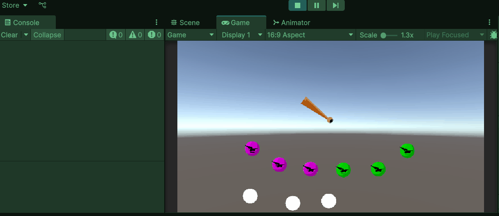

# M2 GDV les 3.2 (CODE) Peggle Game, Combos, Multiplier, Events

Wat we er uiteindelijk mee kunnen bouwen:


Wat we vandaag gaan bouwen:


We gaan een combo systeem maken op basis van tags.

## Bumpers maken

Om te beginnen plaatsen we een aantal bumpers in het level.

Hiervoor maken we eerst prefabs.

Maak prefabs voor minstens 2 soorten bumpers.

Start eerst met een ronde .png van een bumper. Je kunt ook een simpele circel gebruiken.


plaats deze eerst in je hierarchy hang er een `Circle Collider 2d` component aan en sleep hem vervolgens in je prefabs map om er een prefab van te maken.



## Tags toevoegen

Geef je prefab een tag zoals bijvoorbeeld `RedCombo` of `combo_1` iets waaraan je kunt herkennen bij welke combo deze bumper hoort en wat overeenkomt met het uiterlijk.

We gaan meerdere bumpers die bij elkaar horen dezelfde tag geven.

zodat we in de code kunnen zien of er wel of geen combo gemaakt is aan de hand van de tag van de bumper die geraakt is.



Maak nu een level met minimaal 2 soorten bumpers die hun eigen bijhorende tags hebben. De namen van de tags zijn niet heel belangrijk als de bumpers die bij elkaar horen maar dezelfde tags hebben.

## Nieuwe tags definieren

Standaard zijn er al wat vaste tags maar je kunt deze zelf ook toevoegen.



Geef nu ook de prefab van je bal de tag: `Ball`

## Scripts toevoegen

Maak 2 nieuwe scripts aan: `BumperHit.cs` en `ComboSystem.cs`
Hang `BumperHit.cs` als component aan de prefabs van je verschillende bumpers.

Sleep `ComboSystem.cs` in je hierarchy. Er zal dan vanzelf een nieuwe leeg gameobject gemaakt worden met het script erop.



Open beide scripts in Visual Studio

## BumperHit.cs

Laten we hiermee starten. Dit script gaat voor elke bumper bijhouden of hij door de bal geraakt is.

Hiervoor hebben we de unity methode `OnCollisionEnter2D` nodig.

```Csharp
    private void OnCollisionEnter2D(Collision2D collision)
    {

    }
```

Nu gaan we dus voor elke bumper bijhouden of hij geraakt wordt door de bal. Hiervoor controleren we de tag van alle objecten die de bumpers raken.

```Csharp
    private void OnCollisionEnter2D(Collision2D collision)
    {
        if (collision.gameObject.CompareTag("Ball")) {

        }
    }
```

Als we geraakt worden door de bal willen we eigenlijk iets doen in een ander script. Er zijn meer manieren om dit voor elkaar te krijgen maar een mooie manier is gebruik maken van `Action Events`. Zie dit als berichtjes die scripts kunnen versturen waar andere scripts naar kunnen luisteren. Een soort radiostation en radio ontvangers dus.

_Technish gezien werkt het iets anders maar zo is het makkelijk te begrijpen en te onthouden._


We gaan nu dus een radio bericht maken om te kunnen versturen. Een `Action Event` dus. Deze maken we in de `class` maar voor de functie `OnCollisionEnter2D`

Het bericht zetten we als volgt klaar voor gebruik:
`public static event Action<string, int> onBumperHit;`

- `public` zorgt dat andere scripts erbij mogen komen
- `static` zorgt dat hij niet bij 1 gameobject hoort en dat alle bumpers hetzelfde bericht kunnen sturen.
- `event` zorgt dat alleen de bumpers dit bericht kunnen sturen
- `Action` zorgt dat andere scripts iets kunnen doen met het bericht als ze het ontvangen
- `<string, int>` zorgt dat we extra informatie mee kunnen sturen in het bericht
- `onBumperHit` is de naam van het bericht

```Csharp
public class BumperHit : MonoBehaviour
{
    //dit is het action event , het bericht
    public static event Action<string, int> onBumperHit;
    private void OnCollisionEnter2D(Collision2D collision)
    {
        if (collision.gameObject.CompareTag("Ball")) {
            //straks gaan we hier het bericht versturen dat onze bumper geraakt is.
        }
    }
}
```

Om het bericht daadwerkelijk te versturen gebruiken we de `Invoke()` functie.
Dit ziet er dan zo uit `onBumperHit?.Invoke();`

Met het vraagteken checken we of er wel naar het bericht wordt geluisterd. Zo niet hoeven we hem niet te versturen. Met Invoke versturen we het bericht.

We gaan ook informatie met het bericht meesturen. Namenlijk de `tag` van onze bumper en het aantal punten dat onze bumper waard is.

voor de laatste moeten we nog een variabele maken die we ook in de unity inspector een waarde kunnen geven. Voor de zekerheid kun je hem ook een default waarde geven voor het geval je vergeet om dit in de inspector te doen.

`[SerializeField] private int scoreValue = 100;` Plaats deze bij de rest van de variabelen boven de `OnCollisionEnter` methode.

De scoreValue kunnen we nu dus net als de `tag` mee gaan geven met het bericht: `onBumperHit?.Invoke(gameObject.tag, scoreValue);`

De code ziet er nu als volgt uit:

```Csharp
public class BumperHit : MonoBehaviour
{
    [SerializeField] private int scoreValue = 100;
    public static event Action<string, int> onBumperHit;
    private void OnCollisionEnter2D(Collision2D collision)
    {
        if (collision.gameObject.CompareTag("Ball")) {
            onBumperHit?.Invoke(gameObject.tag, scoreValue);
        }
    }
}
```

We hebben nu dus een script dat bijhoud voor alle bumpers of ze geraakt worden. Zodra dat zo is versturen ze een bericht met daarbij ook de tag van de bumper en de waarde. Elk ander script in mijn project kan nu besluiten om naar dit bericht te gaan luisteren en er iets mee te gaan doen. Dat maakt voor dit script verder niet meer uit. Dit script is nu klaar met zijn werk.

## ComboSystem.cs

We gaan nu het systeem bouwen dat bijhoud welke bumpers er geraakt zijn en in welke volgorde. Zolang de bumpers die geraakt worden bij elkaar horen (zelfde tags) zal de combo oplopen en zo ook een multiplier waarmee de score vermenigvuldigd kan worden.

We gaan beginnen om te zorgen dat dit script gaat luisteren naar berichten van de bumpers.

Die doen we als volgt in de `Start` methode:

```Csharp
private void Start()
{
    BumperHit.onBumperHit += CheckForCombo;
}
```

Het script luistert naar alle berichten met de naam `onBumperHit` die verstuurd worden door alle `BumperHit` scripts die op de bumpers zitten.

zodra dit bericht binnenkomt voert de code de functie `CheckForCombo` uit die we ook gaan maken in dit script.

**Belangrijk** scripts die naar `Action Events` luisteren moeten hier ook mee stoppen als er bijvoorbeeld een nieuwe scene geladen wordt. Anders gaat het script 2x luisteren naar hetzelfde bericht en dan 3x enzovoort. Dit kan resulteren in `bugs` en zogenaamde `memory leaks`. Om dit te voorkomen gebruik je deze code:

```Csharp
private void OnDisable()
{
    BumperHit.onBumperHit -= CheckForCombo;
}
```

We gaan nu ook de `CheckForCombo()` functie maken. Hierin komt te staan wat het `ComboSystem` moet doen als er een bumper geraakt is.

```Csharp
private void CheckForCombo(string tag, int bumperValue){

}
```

De tags die meegestuurd worden in de berichten gaan we verzamelen in een List. We moeten dus ook een `List` maken. Dit doen we bovenin het script binnen de `class` maar voor de `functies`.

`private List<string> bumperTags = new List<string>();`

Onze code ziet er nu zo uit:

```Csharp
using System.Collections.Generic;
using UnityEngine;

public class ComboSystem : MonoBehaviour
{
    private List<string> bumperTags = new List<string>();

    private void Start()
    {
        BumperHit.onBumperHit += CheckForCombo;
    }
    private void OnDisable()
    {
        BumperHit.onBumperHit -= CheckForCombo;
    }
    private void CheckForCombo(string tag, int bumpervalue) {

    }
}

```

Nu gaan we in de `CheckForCombo` functie de binnengekomen tags verzamelen in de lijst.

`bumperTags.Add(tag);`

Zodra we meerdere berichten binnen hebben gehad hebben we dus ook meer tags in de lijst staan. Die kunnen we dan dus gaan vergelijken. We pakken steeds de laatste 2 tags. Zodoende kunnen we een hele chain bijhouden van tags die hetzelfde zijn. Zodra de laatste tag anders is dan de vorige kunnen we de lijst leeg maken en is de combo-chain verbroken.

De lijst kunnen we leeg maken met `bumperTags.Clear();`

```Csharp
    //check of er meer dan 1 tag in de lijst zitten
    if (bumperTags.Count > 1) {
        //check of de op 1 na laatste tag gelijk is aan de laatste
        if (bumperTags[bumperTags.Count - 2] == bumperTags[bumperTags.Count - 1])
        {
            //Zo ja? Combo Chain is nog heel
        }
        else
        {
            //Zo nee? Combo Chain is verbroken

        }
    }
```

Als beloning voor een ondoorbroken combo-chain willen we de speler een score multiplier geven die ervoor zorgt dat de score steeds sneller oploopt. We gaan hiervoor weer een variabele maken.
`private int scoreMultiplier = 1` wederom op de daarvoor bestemde plek. In de `class` maar boven alle `functies`.

Elke keer als we een bumper raken en de combo-chain nog heel is verhogen we deze multiplier waarde met 1.

Zodra we een verkeerde bumper raken resetten we de `scoreMultiplier` waarde weer naar `1`

Dit is nu onze code:

```Csharp
using System.Collections.Generic;
using UnityEngine;

public class ComboSystem : MonoBehaviour
{
    private List<string> bumperTags = new List<string>();
    private int scoreMultiplier = 1;
    private void Start()
    {
        BumperHit.onBumperHit += CheckForCombo;
    }
    private void OnDisable()
    {
        BumperHit.onBumperHit -= CheckForCombo;
    }
    private void CheckForCombo(string tag, int bumperValue) {
        if (bumperTags.Count > 1) {

            if (bumperTags[bumperTags.Count - 2] == bumperTags[bumperTags.Count - 1])
            {
                scoreMultiplier++;
            }
            else
            {
                scoreMultiplier = 1;
                bumperTags.Clear();
            }
        }
    }
}
```

Tot slot moeten we natuurlijk nog onze score op gaan tellen en bijhouden. Hiervoor maken we weer een variabele `private int score = 0;` weer op de juiste plek!

bij elke bumper die we raken gaan we de waarde van deze bumper optellen bij de score. Deze punten worden ook vermenigvuldigd met de `scoreMultiplier`.

Dit doen we nadat we gecheckt hebben of onze chain nog heel is of verbroken.
`score += value * scoreMultiplier;`

We printen onze score en de multiplier ook gelijk even naar de `console` met behulp van `Debug.Log`.

De code is nu compleet en ziet er als volgt uit:

```Csharp
using System.Collections.Generic;
using UnityEngine;
public class ComboSystem : MonoBehaviour
{
    private List<string> bumperTags = new List<string>();
    private int multiplier = 1;
    private int score = 0;
    private void Start()
    {
        BumperHit.onBumperHit += CheckForCombo;
    }
    private void OnDisable()
    {
        BumperHit.onBumperHit -= CheckForCombo;
    }
    private void CheckForCombo(string tag, int bumperValue)
    {
        bumperTags.Add(tag);
        if (bumperTags.Count > 1)
        {
            if (bumperTags[bumperTags.Count - 2] == bumperTags[bumperTags.Count - 1])
            {
                multiplier++;
            }
            else
            {
                multiplier = 1;
                bumperTags.Clear();
            }
        }
        score += bumperValue * multiplier;
        Debug.Log($"Score: {score} || Multiplier: {multiplier}X");
    }
}

```

## Testen

Als het goed is werkt je prototype nu ongeveer zo:



## Inleveren op je README

Zet in de titel **3.2 Combo System en Bumpers**
Maak een korte omschrijving en GIF van je prototype en zet deze op je readme. Zet hier ook de links naar de code.
