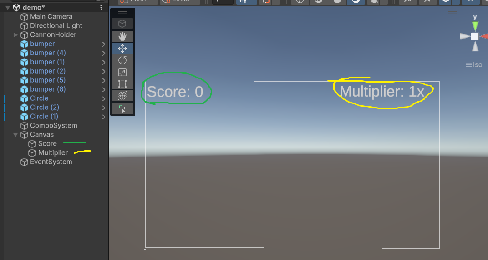
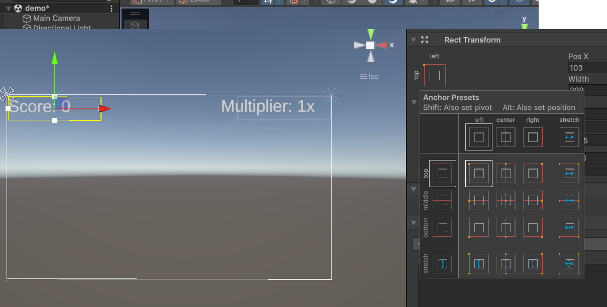
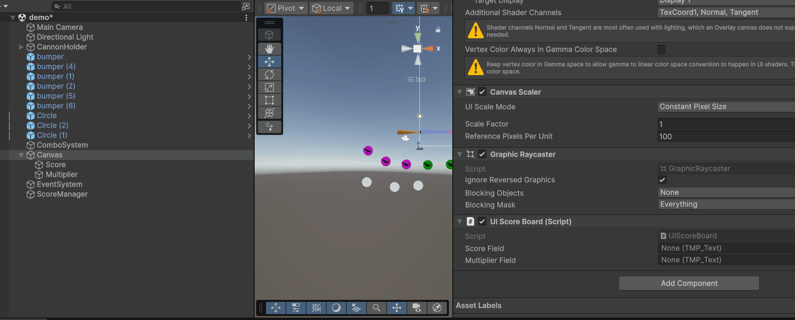
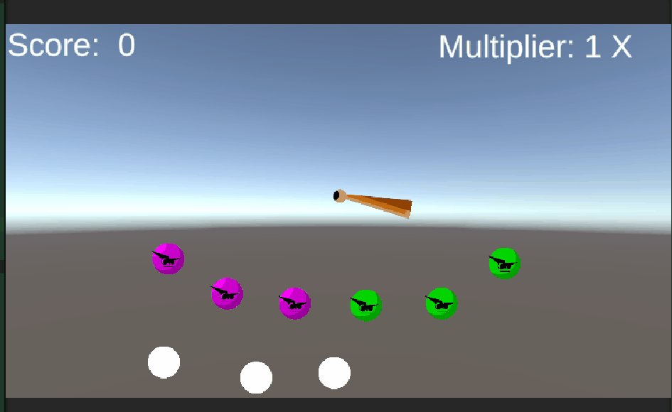
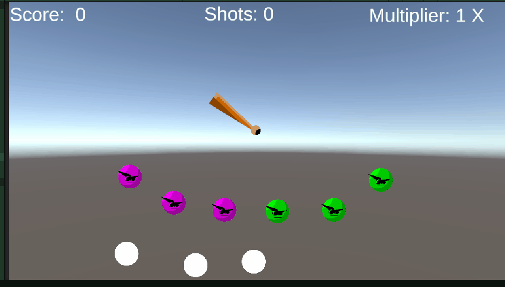

# M2 GDV les 4.2 (CODE) Peggle Game, Waardes (score) versturen naar de UI

Wat we vandaag gaan bouwen:


We gaan zorgen dat we onze score en de waarde van onze combo multiplier naar de UI kunnen sturen.

In les [4.1](../Les%204.1%20Leveldesign%20&%20UI/Lesmateriaal/AddFont.md) kun je terugkijken hoe je een UI element kunt toevoegen met je eigen gekozen font.

We gaan nu de `score` en `multiplier` waardes naar de UI sturen zodat we aan de speler kunnen communiceren hoe goed hij het doet!

Zoals jullie in [les 3.2](../Les%203.2%20Peggle_Combos_Multiplier_Events/#action-events) ook al konden lezen zijn er meerdere manieren om gegevens tussen scripts te versturen. In les 3.2 heb je al gebruik gemaakt van Action Events om als het ware berichtjes te sturen.

We gaan dit principe nu weer gebruiken om de score en de multiplier naar het script van de UI te sturen.

We maken ook een rechtstreekse koppeling tussen de textvelden en het UI script. Dit heet een **referentie**.

## Opbouw van je UI in de canvas

Zorg dat je `Canvas` 2 text mesh pro objecten bevat met beiden een eigen tekstveld.



Bedenk zelf op welke plek je ze in het scherm wil hebben en lijn ze uit op de randen met behulp van de **anchors**.



## UIScoreBoard script

We gaan nu een script maken voor ons **Score Bord UI**. Deze noemen we `UIScoreBoard.cs`. Met dit script gaan we de score en de multiplier ontvangen als deze van waarde verandert om ze vervolgens weer te geven in de tekstvelden van de UI.

Maak een nieuw script aan `UIScoreBoard.cs` en hang dit aan je `canvas`.

Voeg in je script 2 public variabelen toe van het type `TMP_Text`. Ze heten `scoreField` en `multiplierField`. Ze zullen de link bevatten naar de textvelden in je UI.

Als het goed is wordt de package `TMPro` vanzelf ge-import (`using TMPro;`), zo niet moet je dat zelf even toevoegen.

```Csharp
using UnityEngine;
using TMPro;

public class UIScoreBoard : MonoBehaviour
{
    public TMP_Text scoreField;
    public TMP_Text multiplierField;

    // Start is called once before the first execution of Update after the MonoBehaviour is created
    void Start()
    {

    }

    // Update is called once per frame
    void Update()
    {

    }
}
```

In les [3.2](../Les%203.2%20Peggle_Combos_Multiplier_Events/README.md#comboststem.cs) hebben we al gezorgd dat we onze `score` en `multiplier` verhoogden zodra de bal een bumper had geraakt. Ons script `ComboSystem.cs` regelt dit voor ons. We gaan nu een bericht sturen zodra de score en multiplier door het ComboSystem zijn bijgewerkt. Ook sturen we de score en de multiplier waarde mee aan dit bericht.

Dit zal plaatsvinden in de `CheckForCombo`-functie in de `ComboSystem`-class.

```Csharp
public class ComboSystem : MonoBehaviour
{

    //De reeds aanwezige variabelen heb ik voor het overzicht verwijderd

    //Voeg een nieuw Action Event toe met de naam OnScoreChange
    //Zorg ervoor dat deze 2 int waarden mee kan versturen voor de score en de multiplier
    public static event Action<int, int> OnScoreChange;

    //de Start() en OnDisable() functies heb ik voor het overzicht verwijderd, jij laat ze staan!

    private void CheckForCombo(string tag, int bumperValue) {
        bumperTags.Add(tag);
        if (bumperTags.Count > 1) {
            if (bumperTags[bumperTags.Count - 2] == bumperTags[bumperTags.Count - 1])
            {
                scoreMultiplier++;
            }
            else
            {
                scoreMultiplier = 1;
            }
        }
        ScoreManager.Instance.AddScore(bumperValue * scoreMultiplier);
        //in plaats van de score en de multiplier naar de console te sturen met debug.Log gaan we vanaf hier een Action Event Versturen en geven we de score em de multiplier mee als argument.
        OnScoreChange?.Invoke(ScoreManager.Instance.score, scoreMultiplier);
        //Verwijder de Debug.Log regel!
        //Debug.Log($"Score: {ScoreManager.Instance.score} || Multiplier: {scoreMultiplier}X");

    }
}
```

Nu we het `ComboSystem` een bericht met de score en de multiplier laten versturen moeten we zorgen dat onze UI naar deze berichten gaat luisteren en actie onderneemt als de berichten binnenkomen.

```Csharp
using UnityEngine;
using TMPro;

public class UIScoreBoard : MonoBehaviour
{
    public TMP_Text scoreField;
    public TMP_Text multiplierField;


    private void Start()
    {
        ComboSystem.OnScoreChange += UpdateUI;          //Luister naar bericht en voer dan de functie UpdateUI uit
    }
    private void OnDisable()
    {
        ComboSystem.OnScoreChange -= UpdateUI;          //Stop met luisteren
    }
    private void UpdateUI(int score, int multiplier)    //ontvang de score en de multiplier uit het bericht
    {

    }
}
```

We hebben nu een lege functie `UpdateUI` gemaakt. We hierin gaan we zorgen dat we de textvelden van de UI aan kunnen passen.

```Csharp
    private void UpdateUI(int score, int multiplier)    //ontvang de score en de multiplier uit het bericht
    {
        scoreField.text = "Score: "+score; //de text in het textveld (TMP_Text component) van de score aanpassen.
        multiplierField.text = "Multiplier: "+multiplier+"X"; //de text in het textveld (TMP_Text component) van de multiplier aanpassen.
    }

```

Sla je code op.

Selecteer nu de `canvas` in de hierarchy en sleep de gameobjecten met de textvelden, via de inspector, in de velden `ScoreField` en `MultiplierField`:


Dit zorgt ervoor dat er een link ("referentie") wordt gelegd tussen het script `UIScoreBoard` en de textvelden in je scene.

## Test je game:

Als het goed is werkt je prototype nu ongeveer zo:



## Extra uidraging (niet verplicht):

Lukt het jou nu ook om bij te houden hoeveel ballen je al hebt afgeschoten? En dit ook naar de UI te sturen?

_Tip: in de class `Shoot` kun je het moment van schieten bepalen. Je kunt dan weer een Action Event versturen._



## Inleveren op je README

Zet in de titel **4.2 Scores versturen**
Maak een korte omschrijving en GIF van je prototype en zet deze op je readme. Zet hier ook de links naar de code.
