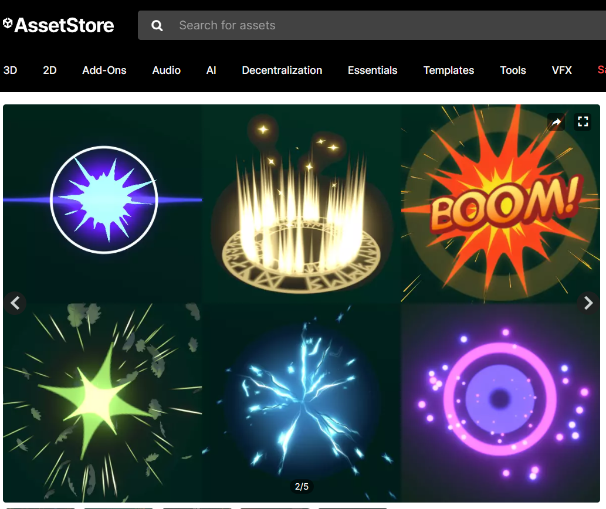

# M2 GDV les 5.2 (CODE) Particles , Sounds & Shakes

Deze les maken jullie kennis met particle effecten in unity. We gaan ook geluiden toevoegen en afspelen en tot slot programmeren we een lekkere screenshake, onmisbaar voor een goed gevoel tijdens het gamen.

## Particle System

In Unity kun je als component een Particle System toevoegen aan je gameobjecten.


Het maken van mooie visuele effecten met particles is het werk van game artists. Maar ook met een beetje moeite kun je als game developer hier iets leuks van maken.

Het 'explosie effectje' kun je namaken door aan een gameobject een `ParticleSystem` component te hangen.

De specifieke settings voor dit effect kun je in de screenshots terugzien:


Probeer zelf ook eens een beetje te spelen met de settings om het effect eigen te maken.

Je hebt nu ook code nodig om je particles te activeren. Dit doen we in het script `HitBumper.cs`.

```csharp
using System;
using UnityEngine;

public class HitBumper : MonoBehaviour
{

    [SerializeField] private int bumperValue = 50;

    //maak een variabele voor je Particle System aan
    private ParticleSystem ps;

    //Pas het datatype aan die je meegeeft met je action event van string naar Transform
    //public static event Action<string,int> onHitBumper;
    public static event Action<Transform,int> onHitBumper;


    private void Start()
    {
        //Vraag het Particle System Component op als de game start en bewaar hem in je variabele, zodat je er later dingen mee kunt doen
        ps = GetComponent<ParticleSystem>();

        //zet je particle system stil! (? checkt of er wel een particle system is.)
        ps?.Stop();
    }
    private void OnCollisionEnter2D(Collision2D collision)
    {
        if (collision.gameObject.CompareTag("Ball")) {

            //geef in plaats van de tag nu de transform mee aan het event. Dit is noodzakelijk voor de screenshake!
            onHitBumper?.Invoke(gameObject.transform, bumperValue);

            //zet je Particle System hem eerst weer stil voor het geval hij nog niet klaar was met de vorige loop
            ps?.Stop();

            //speel hem nu af vanaf het begin.
            ps?.Play();
        }
    }
}

```

Nu moet er in je comboscript ook een aanpassing gedaan worden omdat je de tag van de bumper niet meer rechtstreeks meegeeft. Je moet nu de tag via de transform van de bumper opvragen.

```csharp
using System.Collections.Generic;
using UnityEngine;
public class ComboSystem : MonoBehaviour
    //Vervang:
    //private void CheckForCombo(string tag, int bumperValue)
    //Met:
    private void CheckForCombo(Transform transform, int bumperValue)
    {
        //vervang
        //bumperTags.Add(tag);
        //Met:
        bumperTags.Add(transform.gameobject.tag);
        if (bumperTags.Count > 1)
        {
            if (bumperTags[bumperTags.Count - 2] == bumperTags[bumperTags.Count - 1])
            {
                scoreMultiplier++;                          //verhoog de multiplier
            }
            else                                            //als ze niet gelijk zijn
            {
                scoreMultiplier = 1;                        //reset multiplier
                bumperTags.Clear();                         //leeg de lijst met tags
            }
        }                                                   //voeg score toe aan de ScoreManager
        ScoreManager.Instance.AddScore(bumperValue * scoreMultiplier);
        OnScoreChange?.Invoke(ScoreManager.Instance.score, scoreMultiplier);
    }
}


```

Als je wat uitgebreidere effecten wilt hebben kun je ook kijken of je bijvoorbeeld [deze tutorial](https://youtu.be/cvQiQglPI18?si=o-1VHdu5lkJ1OMZa) kunt volgen om een meer realistische explosie te maken.

Kijk ook eens op de Unity Assetstore [](https://assetstore.unity.com/?category=vfx%2Fparticles&free=true&orderBy=1)

---

## Audio & Sounds


### Geluid importeren

Om geluid in Unity te gebruiken, plaats je je audio-bestanden (`.mp3`, `.wav`, `.ogg`) in de `Assets` folder van je project. Unity detecteert deze automatisch. Maak daar dus ook even een mapje met de naam **/Audio** of **/Sounds**. De audio-files verschijnen dan in je Project window waar je ze kunt selecteren en gebruiken.

### AudioSource Component

Om geluid af te spelen, moet je een `AudioSource` component aan je GameObject toevoegen:

1. Selecteer het GameObject in de Hierarchy
2. Klik op `Add Component` in de Inspector
3. Zoek naar `AudioSource` en voeg deze toe
4. Sleep je audio-bestand in het `AudioClip` veld van de AudioSource
5. **Belangrijk:** Zet `Play on Awake` uit in de Inspector

De `Play on Awake` optie zorgt ervoor dat het geluid automatisch afgespeeld wordt wanneer je game start. Dit willen we voorkomen omdat we het geluid vanuit code willen besturen. Zorg dat deze checkbox **uitgevinkt** is.

### Hoe kom je aan geluid?

Om aan geluiden te komen kun je een aantal dingen doen. Je kunt proberen om deze zelf op te nemen en te bewerken maar audio design is ook weer een vak apart.

Een goede resource om te hebben is een account bij de site [FreeSound.org](https://freesound.org/). Hier kun je rechtenvrije audio downloaden van een community van audio designers. Hier kun je verschillende geluiden terugvinden van een gevarieerde kwaliteit. Met een simpel audio bewerkingsprogramma zoals [Audacity](https://www.audacityteam.org/) kun je de geluiden simpel op maat knippen, eventueel nog wat bewerken en exporteren voor gebruik.

### Geluid afspelen vanuit code

Je kunt geluid afspelen met de `Play()` methode van de AudioSource. Hier is een voorbeeld:

```csharp
using UnityEngine;

public class SoundManager : MonoBehaviour
{
    private AudioSource audioSource;

    void Start()
    {
        audioSource = GetComponent<AudioSource>();
    }

    void Update()
    {
        if (Input.GetKeyDown(KeyCode.Space))
        {
            audioSource.Play();
        }
    }
}
```

**Waarom GetComponent()?**

In plaats van handmatig de AudioSource in te stellen via de Inspector, haal je deze op met `GetComponent<AudioSource>()`. Dit zoekt automatisch naar het AudioSource component op hetzelfde GameObject. Dit is schoner en je hoeft geen variabelen handmatig in de Inspector in te vullen.

Zet dit script op hetzelfde GameObject als je AudioSource. Nu zal het geluid afspelen wanneer je op Spatie drukt.

Je kunt ook `PlayOneShot()` gebruiken voor korte effectgeluiden, of `Stop()` om geluid te stoppen.

---

## Opdracht: Particles & Sound effect

Voeg met behulp van de bovenstaande uitleg particles en geluiden toe aan je bumpers als de bal deze raakt.

**Probeer nu zelf eens goed na te denken hoe je nu je geluidje kunt afspelen zodra je bal een bumper raakt!**

Je kunt hiervoor meerdere aanpakken hanteren:

**1.** De bal maakt het geluid elke keer als hij een bumper raakt. Dus de audioSource komt op de bal en je checkt met de OnCollisionEnter methode of je een gameobject met een bepaalde naam of tag (Bumper) hebt geraakt.

**2.** De Bumpers produceren het geluid. Elke bumper krijgt een audioSource en een script dat met OnCollisionEnter checkt of een gameobject met de tag "Ball" hem heeft geraakt. (tip : dit gebeurt nu ook al in je `HitBumper` script)

**3.** Je HitBumper script verstuurt al een event (`onHitBumper`) elke keer als de bal een bumper raakt. Je kunt dus ook een audioSource en script aan een leeg gameobject hangen en dit event afwachten en dan je geluidje afspelen.

Leg in de readme van de opdracht ook uit welke aanpak je hebt geprobeerd om geluiden af te spelen en waarom.

## Inleveren op je README

Zet in de titel **5.2 Particles & Sound effect**
Maak een korte omschrijving en GIF van je prototype en zet deze op je readme. Zet hier ook de links naar de code.

---

## Extra (Optioneel): Screenshake

Zorg ook dat het scherm gaat schudden als de bal de bumper raakt.

## Screen Shake


Een goede **Screen Shake** geeft je spel meer impact en feedback wanneer belangrijke gebeurtenissen plaatsvinden, zoals explosies of hits.

### Coroutines

In het script dat we gaan gebruiken voor de screen shake gaan we gebruik maken van een `Coroutine`.

**Wat is een Coroutine?**

Een coroutine is een functie die je **pauzeert** en later **hervat**. In tegenstelling tot normale functies die in één keer van begin tot eind uitvoeren, kan een coroutine de uitvoering onderbreken en wachten.

In ons geval:

- De `TrembleStep()` coroutine trilt de camera frame voor frame
- `yield return new WaitForEndOfFrame()` pauzeerde de coroutine tot de volgende frame
- Na 0.1 seconde stopt de shake en gaat het terug naar de originele positie

**Zonder coroutine** zou de trilling in één frame happerig zijn. **Met coroutine** spreid je de trilling over meerdere frames, wat veel vloeiender oogt!

### De ScreenShake code

```csharp
using System.Collections;
using UnityEngine;

public class Screenshake : MonoBehaviour
{
    // Originele positie van de camera (start positie)
    private Vector3 origin;
    // Hoelang de shake effect duurt in seconden
    private float shakeTime;
    // Hoe sterk/ver de camera beweegt
    private float shakeForce;
    // Telt hoe veel tijd is verstreken sinds de shake begon
    private float elapsedTime = 0f;

    void Start()
    {
        // Sla de originele positie op
        origin = transform.position;
        // Luister naar events van andere scripts
        HitBumper.onHitBumper += ShakeBumper;
    }

    // Verwijder event listeners wanneer dit script uitgeschakeld wordt
    private void OnDisable()
    {
        HitBumper.onHitBumper -= ShakeBumper;
    }

    // Wordt aangeroepen wanneer de bumper geraakt wordt
    private void ShakeBumper(Transform _, int points) {
        shakeTime = .1f;      // Korte shake: 0.1 seconde
        shakeForce = .04f;    // Kleine amplitude
        elapsedTime = 0f;     // Reset de timer
        StopCoroutine("TrembleStep");  // Stop eventueel lopende shake
        StartCoroutine("TrembleStep"); //Start de shake
    }
    // Coroutine die de camera aan het trillen zet
    private IEnumerator TrembleStep() {
        // Blijf trillen zolang we nog tijd over hebben
        while (elapsedTime < shakeTime)
        {
            // Verplaats de camera naar een willekeurige positie rond de origineel
            transform.position = new Vector3(
                origin.x + Random.Range(-shakeForce, shakeForce),  // Random x
                origin.y + Random.Range(-shakeForce, shakeForce),  // Random y
                origin.z                                            // Z blijft hetzelfde
            );
            // Update de verstreken tijd in de coroutine
            elapsedTime += Time.deltaTime;
            // Wacht tot volgende frame
            yield return new WaitForEndOfFrame();
        }
        // Zet de camera terug op de originele positie
        transform.position = origin;
    }
}
```

### Hoe werkt deze code?

**Events en callbacks:** De code luistert naar het event: `onHitBumper`. Wanneer dit event plaatsvindt, wordt de `ShakeBumper()` methode automatisch aangeroepen.

**Shake parameters:** Het event stelt verschillende parameters in:

- `shakeTime`: hoe lang de shake duurt
- `shakeForce`: hoe sterk de camera beweegt (amplitude)
- `elapsedTime`: houdt bij hoeveel tijd is verstreken

**StopCoroutine:** Voordat een nieuwe shake begint, wordt de vorige shake gestopt met `StopCoroutine("TrembleStep")`. Dit zorgt ervoor dat overlappende effects netjes worden afgehandeld en geen conflicten ontstaan.

**De TrembleStep coroutine:** Dit is de kern van het effect:

1. De loop herhaalt zich zolang `elapsedTime < shakeTime`
2. Elke frame wordt de camera naar een willekeurige positie verplaatst rond de originele positie
3. `Random.Range(-shakeForce, shakeForce)` zorgt voor random beweging in x en y
4. **`elapsedTime` wordt in de coroutine zelf geupdate**, niet in `Update()`. Dit voorkomt timing bugs die kunnen ontstaan wanneer meerdere shake effects tegelijk werken
5. `yield return new WaitForEndOfFrame()` pauzeert de coroutine tot de volgende frame
6. Na afloop gaat de camera terug naar de originele positie

Voeg deze code nu toe aan je camera!
