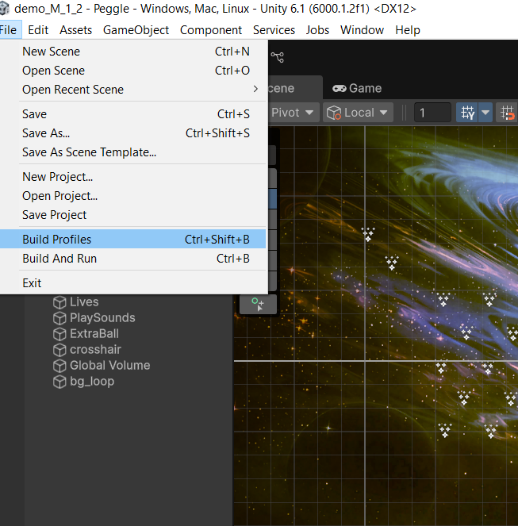
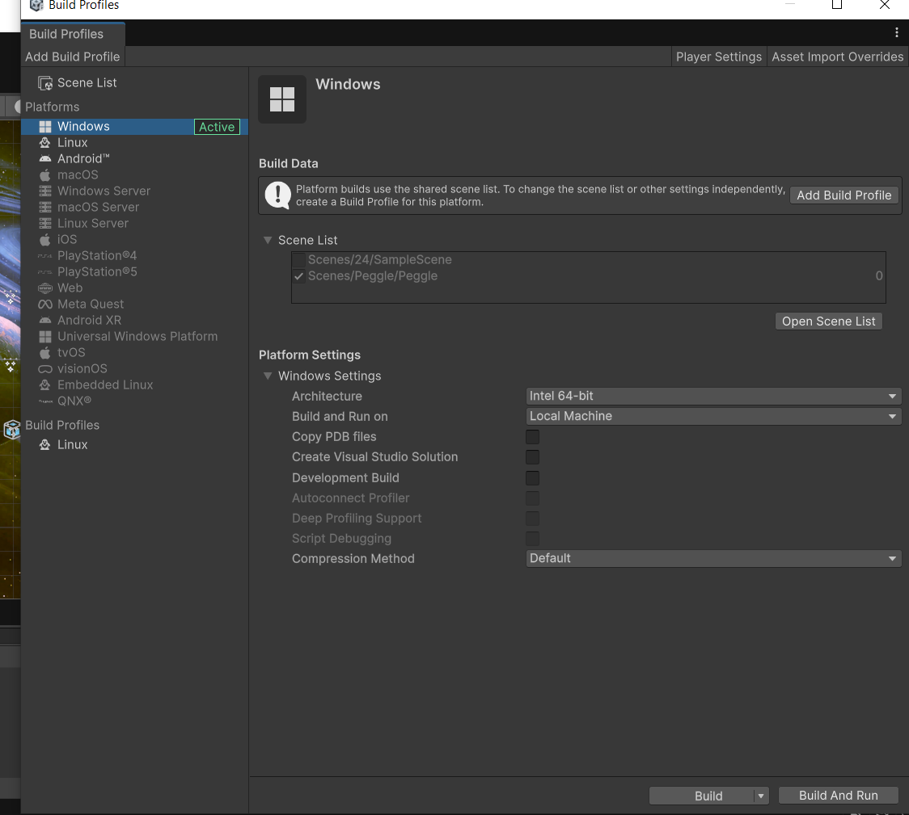
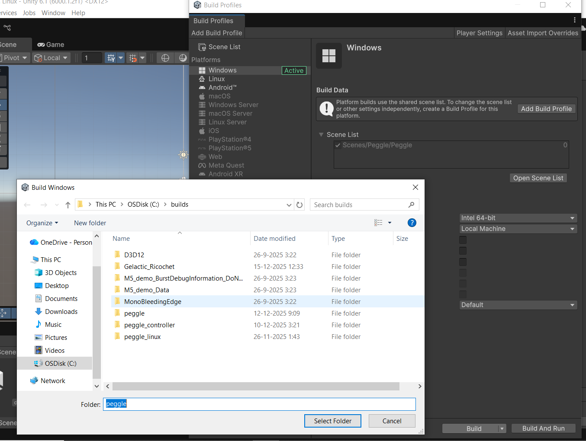
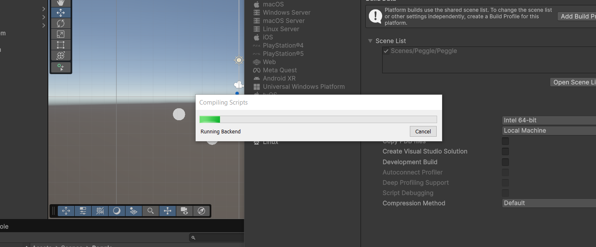
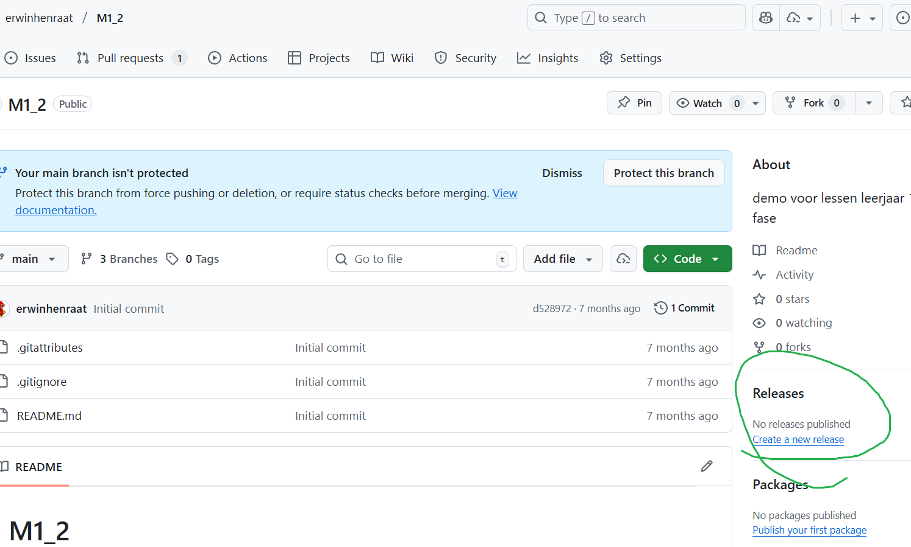
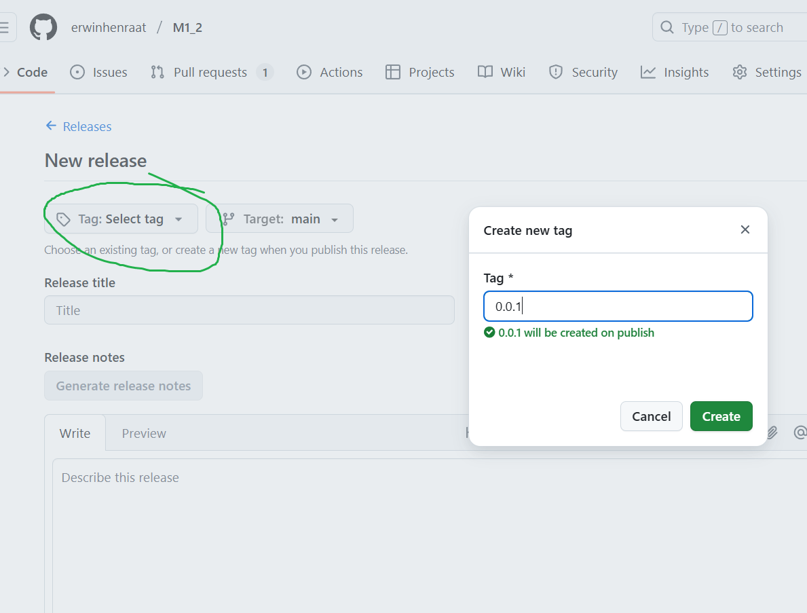
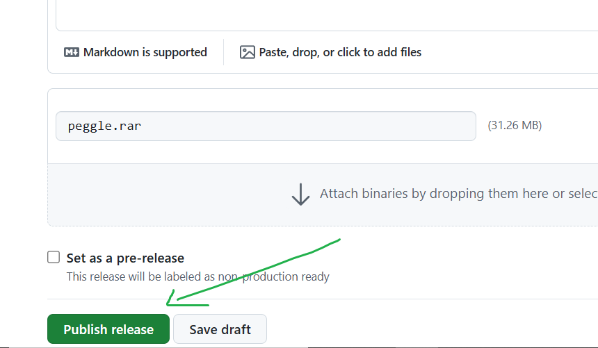

# Unity 6 Project Builden voor PC

## Inleiding

Deze handleiding beschrijft hoe je een gameproject in Unity 6 bouwt (build) voor Windows PC. Het buildproces zet je Unity-project om in een uitvoerbaar programma dat je op een computer kunt starten zonder Unity geïnstalleerd te hebben.

---

## Wat is Builden?

**Builden** is het proces waarbij Unity je game-project omzet in een **standalone applicatie** (een zelfstandig programma).

### Verschil tussen Editor en Build:

- **Unity Editor**: Waarin jij je game ontwikkelt. Vereist dat Unity geïnstalleerd is.
- **Build (executable)**: Een .exe-bestand dat direct uitvoerbaar is. Anderen kunnen je game spelen zonder Unity!

### Waarom Builden?

- Je game beschikbaar maken voor anderen (vrienden, spelers, internet)
- De performance testen in een echte omgeving (niet in de editor)
- Een uiteindelijke versie creëren voor distributie (Steam, itch.io, etc.)

---

## Waarom Platform-Specifieke Builds?

Computers gebruiken verschillende **besturingssystemen** en **processorarchitecturen**. Unity moet je game aanpassen aan het specifieke platform:

### PC (Windows)

- **Besturingssysteem**: Windows (7, 10, 11, etc.)
- **Processoren**: Intel, AMD (x86_64 architectuur)
- **Bestandsformaat**: .exe-bestand
- **Gebruik**: Thuiscomputers, gaming PC's, laptops

### Andere Platforms (ter referentie)

- **Mac**: Vereist aparte build voor macOS (anders .exe niet werkt)
- **Linux**: Eigen versie nodig voor Linux-gebruikers
- **Mobile**: iOS/Android vereisen volledig ander buildproces
- **Console**: PlayStation/Xbox hebben eigen build-systemen

### Waarom niet één universeel bestand?

1. **Processoren begrijpen verschillende talen**: Een Windows-processor snapt niet zomaar macOS-code
2. **Grafische drivers verschillen**: GPU's gebruiken verschillende instructies per OS
3. **Bestandssystemen verschillen**: Windows, Mac en Linux organiseren bestanden anders
4. **Performance**: Platform-specifieke builds zijn geoptimaliseerd en sneller

> **Simpel voorbeeld**: Je kunt een taarten recept voor een Duitse bakker niet zomaar geven aan een Japanse bakker - ze spreken andere talen! Net zo moet je game gebouwd in hun "taal" (platform).

---

## Stap 1: Build Profiles Openen

1. Ga naar het menu: **File → Build Profiles**
2. Het Build Profiles venster opent zich dan vanzelf



---

## Stap 2: Juiste Platform Selecteren

1. In het Build Profiles venster zie je een lijst met beschikbare platforms
2. Zoek **Windows\*** en klik erop
3. Zorg dat dit platform nu actief is
4. Als je van platform wisselt, wacht je tot Unity het platform geconverteerd heeft (dit kan enkele minuten duren)

## 

## Stap 3: Build Profile Configureren

1. Met het **Windows** platform geselecteerd, zie je de instellingen in het rechtergedeelte
2. Controleer de volgende instellingen:

### Scenes toevoegen:

- Zorg dat alle scenes die je in je game wilt gebruiken zijn toegevoegd in de **Scene List**
- Klik op **Open Scenes List** om scenes toe te voegen of te verwijderen
- Open in de unity editor alle scenes die je aan je **Build Profile** wilt toevoegen
- Druk dan op **Add Open Scenes**
- Om een **Scene** te verwijden klik je rechts op die scene en selecteer je de optie **Remove Selection**
- De volgorde van scenes is belangrijk: de eerste scene wordt eerst geladen


### Windows instellingen:

Kun je aanpassen als je bijvoorbeeld voor een hele oude windows machine zou willen builden (32-bit) of specifiek voor een ARM processor.

Je kunt alles setting in principe op de default laten staan.

---

## Stap 4: Build Uitvoeren

1. In het Build Profiles venster, klik op **Build** (rechtsonder)
2. Kies een locatie waar je je build wilt opslaan
3. Geef je build een naam (bijv. "MyGame")
4. Klik **Select Folder** om te bevestigen

## 

## Stap 7: Wachten op Build Compleet

1. Unity begint met het compileren en builden van je project
2. Je ziet een voortgangsbalk in het onderste paneel van de editor
3. Dit kan tussen enkele seconden en enkele minuten duren (afhankelijk van projectgrootte)
4. Wanneer klaar verschijnt bericht "Build complete!" in de console

## 

## Stap 8: Je Game Testen

1. Unity opent automatisch de map waar je je build hebt opgeslagen
2. Dubbelklik op het .exe-bestand (bijv. MyGame.exe)
3. Je game start nu als standalone applicatie

## 

## Voordelen van Unity 6's Build Profiles Systeem

- **Meerdere Profiles**: Je kunt nu verschillende build-configuraties opslaan (Debug, Release, etc.)
- **Eenvoudiger Platform Wisselen**: Sneller switchen tussen platforms zonder lange conversietijden
- **Beter Overzicht**: Alle instellingen zijn in één venster georganiseerd
- **Profile Templates**: Vooraf ingestelde configuraties voor verschillende soorten projecten

---

## Veelgestelde Problemen en Oplossingen

### Probleem: Build script fouten

**Oplossing**: Controleer de Console voor errors. Fix alle scripts voordat je build.

### Probleem: Game loopt traag

**Oplossing**:

- Reduceer textuurresoluties
- Optimaliseer je code (geen zware berekeningen per frame)
- Verminder het aantal objecten in de scene

### Probleem: Bestanden ontbreken na build

**Oplossing**: Zorg dat alle benodigde assets in je Assets map staan (geen externe mappen)

### Probleem: Build is erg groot (GB's)

**Oplossing**:

- Comprimeer texturen
- Verwijder ongebruikte assets
- Gebruik Texture Compression in Player Settings

---

## Build Files Zippen en Uploaden naar GitHub Releases

Nu je build klaar is, kun je deze delen via GitHub Releases. Dit is een professionele manier om je game beschikbaar te stellen.

---

## Stap 9: Build Folder Zippen

### Op Windows:

1. Ga een map naar boven zodat je alle bestanden in je build map kunt zippen
2. Rechtsklik op de **build folder** (bijv. "MyGame")
3. Selecteer: **Comprimeren naar ZIP** of iets wat daar in de buurt komt
4. Windows maakt automatisch een .zip-bestand aan (bijv. "MyGame.zip")
5. Dit .zip-bestand bevat je volledige game

**Let op!!** Alleen je .exe bestand is niet voldoende om op een andere PC de game te kunnen spelen. Je hebt altijd de complete inhoud van je build folder nodig.

### Op Mac/Linux:

1. Open Terminal in de build directory
2. Typ: `zip -r MyGame.zip MyGame/`
3. Dit maakt het .zip-bestand aan

---

## Stap 10: GitHub Repository Voorbereiden

1. Zorg dat je een GitHub account hebt (maak een account op [github.com](https://github.com) als je die nog niet hebt)
2. Open je game project repository op GitHub
3. Zorg dat je **schrijfrechten** hebt op de repository

---

## Stap 11: Release Aanmaken op GitHub

### Via Website:

1. Ga op GitHub naar je repository
2. Klik op **Releases** (in de rechterkant van de repository, onder "About")
3. Klik op **Create a new release** of **Draft a new release**
4. Vul in:
   - **Tag version**: Versienummer (bijv. `v1.0.0`, `v1.0.1`)
   - **Release title**: Naam van je release (bijv. "Game v1.0.0 - PC Build")
   - **Description**: Beschrijving van wat nieuw is (bijv. features, bugfixes)



## 

## Stap 12: Build File Uploaden naar Release

1. In het Release formulier, scroll naar **Attach binaries by dropping them here or selecting them**
2. Klik op het upload gebied of sleep je .zip-bestand erin
3. Wacht tot het bestand is geupload (dit kan enkele minuten duren voor grote bestanden)


### Bestandsinformatie toevoegen (optioneel):

Je kunt een beschrijving toevoegen bij je release, bijvoorbeeld:

```
## Download en Installatie

1. Download het .zip-bestand hieronder
2. Unzip het bestand ergens op je computer
3. Dubbelklik op MyGame.exe om de game te starten

## Systeemvereisten

- Windows 10 of hoger
- 4GB RAM minimum
- 2GB vrije schijfruimte
- Grafische kaart met DirectX 11 support
```

---

## Stap 13: Release Publiceren

1. Controleer dat alle informatie correct is
2. Klik op **Publish release** (geen "Draft" meer)
3. Je release is nu openbaar toegankelijk!



---

## Stap 14: Release Delen

Je release is nu beschikbaar op:

- `https://github.com/[jouwusername]/[repository]/releases`

Anderen kunnen nu:

- Je game direct downloaden van de Release pagina
- De installatiehandleiding lezen
- Updates zien wanneer je nieuwe versies publiceer

### Delen met vrienden:

- Stuur de directe link naar de release
- Of deel de GitHub repository link

---

## Tips voor releases

### Versienummering:

- `v1.0.0`: Eerste grote release
- `v1.0.1`: Bug fixes
- `v1.1.0`: Nieuwe features, backward compatible
- `v2.0.0`: Grote veranderingen, niet backward compatible

### Release Notes Template:

```
## v1.0.0 - First Release

### Features
- Player movement systeem
- Enemy AI
- Level system

### Bug Fixes
- Fixed collision issues
- Optimized performance

### Known Issues
- Menu animations soms traag op oude PC's
```

### Meerdere Builds:

Als je ook voor Mac of Linux wilt builden:

1. Maak aparte builds voor elk platform
2. Zip elke build apart
3. Upload alle .zip-bestanden naar dezelfde release
4. Label ze duidelijk: `MyGame-Windows.zip`, `MyGame-Mac.zip`, etc.

---

## Conclusie

Gefeliciteerd! Je game is nu:

- Gebuild als standalone applicatie
- Gezipt en klaar voor distributie
- Gepubliceerd op GitHub waar iedereen het kan downloaden

Je bent nu klaar om je game met de wereld te delen!
