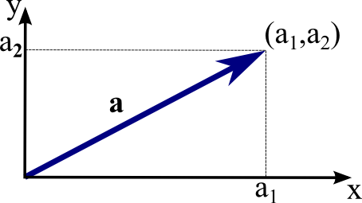
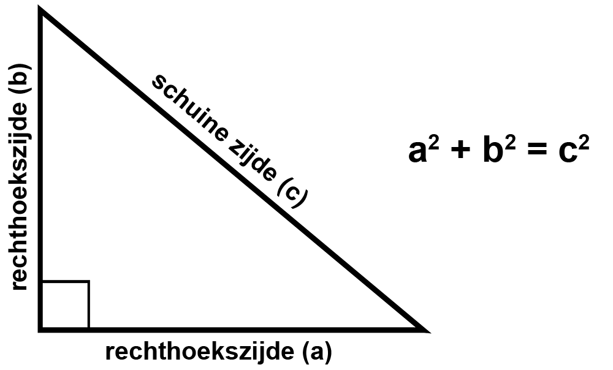
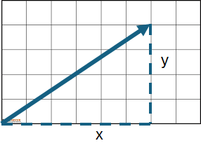
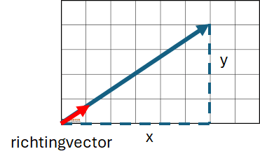

Les: Vector ontbinden in richting + scalair en omgekeerd

Na deze les kunnen studenten:

- Een vector ontbinden in:
  - een richting (eenheidsvector)
  - een scalair (lengte)
- Een gegeven richting en scalair combineren tot een vector.
- Het verband begrijpen tussen lengte, norm en eenheidsvector.

## Wat is een Vector?
Een vector is een grootheid met:
- een richting
- een grootte (lengte)

De notatie voor een vector is
$$ \vec{v} =  \begin{bmatrix}
a \\
b
\end{bmatrix}  $$

## De lengte of magnitude van een Vector

Om de lengte van een vector te berekenen gebruiken wij Pythagoras. Bij een rechthoekige driehoek geldt:

$$ c^2 = a^2 + b^2 $$

dus: 
$$ c = \sqrt{a^2 + b^2} $$  

In een rechthoekig rooster ziet het er alsvolgt uit:

De lengte van de vector wordt aangegeven met twee vertikale streepjes

$$ \text{De lengte van een vector} = || \vec{v}|| $$
Wil je de lengte (magnitude) van de vector weten:

$$ ||\vec{v}|| = \sqrt{x^2 + y^2} $$  

## De richting van een vector

De richting (direction) van een vector wordt aangeven met een zogenaamde richtingsvector of directionvector. Dat is een vector die dezelfde kan uitwijst, maar dan een lengte van 1 heeft

Als je van een vector de direction of richtingsvector wil bepalen, moet je eerst berekenen hoe lang de vector is en dan de vector delen door de lengte van de vector

$$ \vec{d} = \frac{\vec{v}}{|| \vec{v} ||}$$

### Voorbeeld:
neem vector 
$$ \vec{v} = \begin{bmatrix}
3\\
4
\end{bmatrix}  $$

de Magnitude of lengte van de vector is:

$$ ||\vec{v}|| = \sqrt{x^2 + y^2}= \\
\sqrt{3^2 + 4^2} = \\
\sqrt{9 + 16} = \\
\sqrt{25} = 5$$

dan is dus de direction of richtingsvector:

$$ \vec{d} = \frac{\vec{v}}{|| \vec{v} ||}$$

$$ = 
\frac{1}{5} \begin{bmatrix}
3\\
4
\end{bmatrix} = \begin{bmatrix}
0.600\\
0.800
\end{bmatrix} $$

## een vector samenstellen

Als van een vector de direction (richting) en magnitude (lengte) bekend zijn, kan je de vector samenstellen door de direction-vector te vermenigvuldigen met de magnitude

Voorbeeld:
een vector heeft een direction:
$$ \vec{d} = \begin{bmatrix}
  0.707 \\
  0.707
\end{bmatrix}$$

en een magnitude van:
$$ ||\vec{v}|| = 5 $$

dan is dit samen te stellen tot

$$ \vec{v} = 5 \cdot \begin{bmatrix}
  0.707 \\ 0.707
\end{bmatrix} = \begin{bmatrix}
  5 \cdot 0.707 \\ 5 \cdot0.707
\end{bmatrix} = \begin{bmatrix}
  3.54 \\ 3.54
\end{bmatrix}$$

## in 3 dimensies

Bij een 3-dimensionale vector is de lengte te berekenen met de uitgebreide pythagoras:

$$ \vec{v} = \begin{bmatrix}
  v_x \\ v_y \\v_z
\end{bmatrix}$$

$$ ||\vec{v}|| = \sqrt{v_x^2 + v_y^2 + v_z^2}$$

Bij voorbeeld:

$$
\vec{d} =
\begin{pmatrix}
0.267 \\
0.535 \\
0.802
\end{pmatrix}
$$
Is dit een richtingsvector? 

$$ ||\vec{v}|| = \sqrt{0.267^2 + 0.535^2 +0.802^2} =  1$$

Ja, de lengte van de vector is 1, dus een richtingsvector

