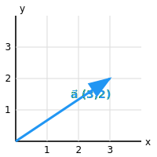
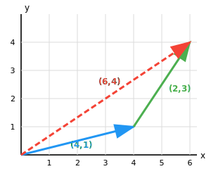
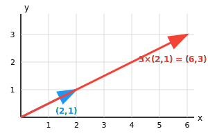
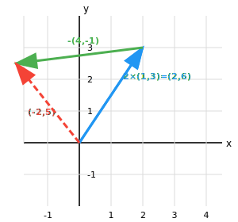

#  Optellen en scalair vermenigvuldigen

##  Lesdoelen

-   Vectoren bij elkaar optellen\
-   Een vector vermenigvuldigen met een scalair\
-   Een combinatie maken van beide bewerkingen\
-   Grafisch en rekenkundig werken met vectoren


------------------------------------------------------------------------

## Wat is een vector?

Een vector heeft:

-   een richting
-   een lengte

Voorbeeld:

```math
\vec{a}=
\begin{pmatrix}
3 \\
2
\end{pmatrix}
```



Betekenis:

-   3 naar rechts\
-   2 omhoog

------------------------------------------------------------------------

##  Vectoren optellen

### Regel

```math
\begin{pmatrix}
a\\
b
\end{pmatrix}
+
\begin{pmatrix}
c\\
d
\end{pmatrix}
=
\begin{pmatrix}
a+c\\
b+d
\end{pmatrix}
```

Dus:

-   x‑coördinaten optellen\
-   y‑coördinaten optellen

### Voorbeeld

```math
\begin{pmatrix}
4 \\
1
\end{pmatrix} +
\begin{pmatrix}
2 \\
3
\end{pmatrix}
=
\begin{pmatrix}
6 \\
4
\end{pmatrix}
```



###  Oefening

1.  

```math
\begin{pmatrix}1\\
5
\end{pmatrix}
+
\begin{pmatrix}3\\2\end{pmatrix}
```

2.  

```math
\begin{pmatrix}
-2\\
4
\end{pmatrix}
+
\begin{pmatrix}
5\\
-1
\end{pmatrix} 
```

------------------------------------------------------------------------

## Vermenigvuldigen met een scalair

Een scalair is een gewoon getal.

### Regel

```math
\begin{pmatrix}
a \\
b
\end{pmatrix}

=

\begin{pmatrix}
ka \\
kb
\end{pmatrix}
```

###  Voorbeeld

```math
3
\begin{pmatrix}
2 \\
1
\end{pmatrix}

=

\begin{pmatrix}
6 \\
3
\end{pmatrix}
```



### Belangrijk

-   positief → zelfde richting
-   negatief → omgekeerde richting

###  Oefeningen

1.  
```math
2
\begin{pmatrix}3\\4\end{pmatrix}
```


2.  
```math
-1
\begin{pmatrix}5\\-2\end{pmatrix}
```


------------------------------------------------------------------------

## Combinatie van beide

###  Voorbeeld

```math
2
\begin{pmatrix}
1 \\
3
\end{pmatrix}
-   
\begin{pmatrix}
4 \\
-1
\end{pmatrix}
```

**Stap 1 --- vermenigvuldigen**

```math
\begin{pmatrix}
2 \\
6
\end{pmatrix}
-   
\begin{pmatrix}
4 \\
-1
\end{pmatrix}
```

**Stap 2 --- optellen**

```math
=
\begin{pmatrix}
-2 \\
5
\end{pmatrix}
```



### Oefening

```math
\begin{pmatrix}
2 \\
-1
\end{pmatrix}
-   2
\begin{pmatrix}
-1 \\
4
\end{pmatrix}
```

------------------------------------------------------------------------