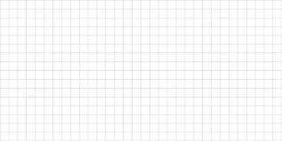

# 📐 Proefwerk Vectoren

## Opgave 1 — Optellen van vectoren  

Gegeven  

$$
\vec{a} = \begin{pmatrix} 3 \\ 
-2 \end{pmatrix}, \quad
\vec{b} = \begin{pmatrix} -1 \\ 
5 \end{pmatrix}
$$

Bereken  

$$
\vec{a} + \vec{b}
$$

Teken beide vectoren en de som. Gebruik een schaal van 1:1

---

## Opgave 2 — Optellen van vectoren  

Gegeven  

$$
\vec{u} = \begin{pmatrix} 4 \\ 
7 \end{pmatrix}, \quad
\vec{v} = \begin{pmatrix} 2 \\ 
-3 \end{pmatrix}
$$

Bereken  

$$
\vec{u} + \vec{v}
$$

Teken beide vectoren en de som. Gebruik een schaal van 1:1

---

## Opgave 3 — Scalaire vermenigvuldiging  

Gegeven  

$$
\vec{p} = \begin{pmatrix} -6 \\ 
2 \end{pmatrix}
$$

Bereken  

$$
3\vec{p}
$$

Teken de oorspronkelijke en de geschaalde vector. Gebruik een schaal van 1:1

---

## Opgave 4 — Scalaire vermenigvuldiging  

Gegeven  

$$
\vec{q} = \begin{pmatrix} 5 \\ 
-4 \end{pmatrix}
$$

Bereken  

$$
-2\vec{q}
$$

Teken de oorspronkelijke en de geschaalde vector. Gebruik een schaal van 1:1

---

## Opgave 5 — Combinatie  

Gegeven  

$$
\vec{a} = \begin{pmatrix} 1 \\ 
3 \end{pmatrix}, \quad
\vec{b} = \begin{pmatrix} 4 \\ 
-2 \end{pmatrix}
$$

Bereken  

$$
2\vec{a} + \vec{b}
$$

Teken de oorspronkelijke en de geschaalde vectoren. Gebruik een schaal van 1:1

---

## Opgave 6 — Combinatie  

Gegeven  

$$
\vec{u} = \begin{pmatrix} -3 \\ 
6 \end{pmatrix}, \quad
\vec{v} = \begin{pmatrix} 5 \\ 
1 \end{pmatrix}
$$

Bereken  

$$
\vec{u} - 3\vec{v}
$$

---

## Opgave 7 — Lineaire combinatie  

Gegeven  

$$
\vec{x} = \begin{pmatrix} 2 \\ 
-5 \end{pmatrix}, \quad
\vec{y} = \begin{pmatrix} -4 \\ 
3 \end{pmatrix}
$$

Bereken  

$$
4\vec{x} + 2\vec{y}
$$

---

## Opgave 8 — Lineaire combinatie  

Gegeven  

$$
\vec{m} = \begin{pmatrix} 7 \\ 
0 \end{pmatrix}, \quad
\vec{n} = \begin{pmatrix} -2 \\ 
9 \end{pmatrix}
$$

Bereken  

$$
\vec{m} + 5\vec{n}
$$

---

## Opgave 9 — Magnitude en richtingsvector  

Gegeven  

$$
\vec{a} = \begin{pmatrix} 2 \\ 
-1 \end{pmatrix}, \quad
\vec{b} = \begin{pmatrix} -3 \\ 
4 \end{pmatrix}
$$

1. Bereken eerst  

$$
\vec{v} = 3\vec{a} - 2\vec{b}
$$

2. Bereken de magnitude van $\vec{v}$

3. Bepaal de richtingsvector van $\vec{v}$

---

## Opgave 10 — Magnitude en richtingsvector  

Gegeven  

$$
\vec{u} = \begin{pmatrix} -1 \\ 
5 \end{pmatrix}, \quad
\vec{w} = \begin{pmatrix} 4 \\ 
2 \end{pmatrix}
$$

1. Bereken  

$$
\vec{z} = 2\vec{u} + \vec{w}
$$

2. Bereken de magnitude van $\vec{z}$

3. Bepaal de richtingsvector van $\vec{z}$

