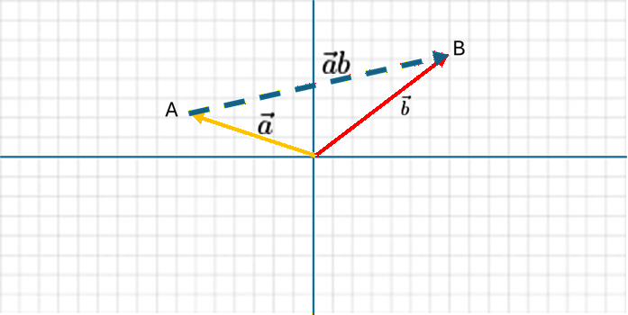
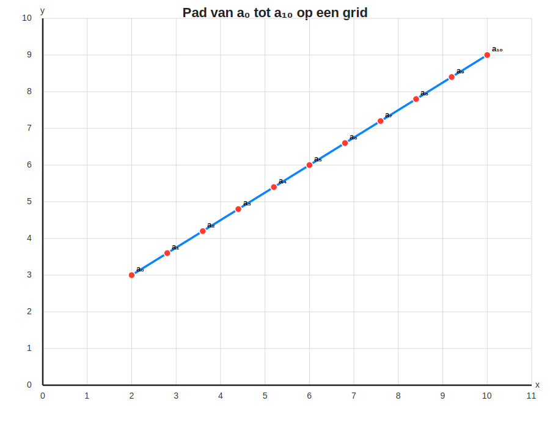

# 📘 Les — Verschilvector, normalisatie en snelheid

## 1. Punten en vectoren in ℝ²

Laat

```math
A = (x_a, y_a) \in \mathbb{R}^2
```

```math
B = (x_b, y_b) \in \mathbb{R}^2
```

Definieer de vectoren a en b die naar deze punten wijzen

```math
\vec a = \begin{pmatrix} 
x_a \\
y_a
\end{pmatrix}

```
en
```math
\vec b = \begin{pmatrix} 
x_b \\
y_b
\end{pmatrix}

```

De **vector van (A) naar (B)** is:

```math
\vec{ab} = \vec b - \vec{a}
```

dus

```math
\vec{ab} =
\begin{pmatrix}
x_a  \\
y_a
\end{pmatrix} - 
\begin{pmatrix}
x_b  \\
y_b
\end{pmatrix}

```

Deze vector heet de **verschilvector** of **differencevector**.


---


## 2. Lengte (norm) van een vector

Voor

```math
\vec v =
\begin{pmatrix}
x \\
y
\end{pmatrix}
```

is de lengte:

```math
\|\vec v\| = \sqrt{x^2 + y^2}
```

Dit is de **Euclidische norm**.

---

## 3. Normaliseren van een vector

Voor

```math
\vec v \neq \vec 0
```

definiëren we de **genormaliseerde vector**

```math
\hat v = \frac{\vec v}{\|\vec v\|}
```

Eigenschap:

```math
\|\hat v\| = 1
```

De genormaliseerde vector heeft **dezelfde richting**, maar **lengte 1**.

---

## 4. Richtingsvector tussen twee punten

Gegeven:

* positie A 
* doelpunt B 

De verschilvector is:

```math
\vec v = \vec a - \vec b
```

De **richtingsvector** wordt:

```math
\hat r = \frac{\vec v}{\| \vec v\|}
```

---

## Van A naar B

* Maak vector a die naar punt A wijst en een vector die naar punt B wijst
* Begin in punt A
* Tel richtingsvector v bij vector a op

````math
\vec a_1 = \vec a + \hat v
````

Doe dit nog een keer

````math
\vec a_2 = \vec a + \hat v
````

en nog een keer
````math
\vec a_3 = \vec a + \hat v
````

En als je dit blijft herhalen, kom je na verloop van tijd bij punt B uit

````math
\vec a_n = \vec a + \hat v
````

## 7. Volledig uitgewerkt voorbeeld

Gegeven:

```math
a =
\begin{pmatrix}
2 \\
3
\end{pmatrix},
\qquad
b =
\begin{pmatrix}
10 \\
9
\end{pmatrix},
\qquad

```

### Verschilvector

```math
\vec v =
\begin{pmatrix}
10-2 \\
9-3
\end{pmatrix}
=
\begin{pmatrix}
8 \\
6
\end{pmatrix}
```

### Lengte of Magnitude

```math
\|\vec d\|
=
\sqrt{8^2 + 6^2}
=
\sqrt{64+36}
=
10
```

### Genormaliseerde vector

```math
\hat d =
\begin{pmatrix}
0.8 \\
0.6
\end{pmatrix}
```

### algoritme

````math
\vec a_1 = a_0 + \hat d = 
\begin{pmatrix}
2 \\
3
\end{pmatrix} 
+
\begin{pmatrix}
0.8 \\
0.6
\end{pmatrix}
= 
\begin{pmatrix}
2.8 \\
3.6
\end{pmatrix}
````

````math
\vec a_2 = a_1 + \hat d = 
\begin{pmatrix}
2.8 \\
3.6
\end{pmatrix} 
+
\begin{pmatrix}
0.8 \\
0.6
\end{pmatrix}
= 
\begin{pmatrix}
3.6 \\
4.2
\end{pmatrix}
````

````math
\vec a_3 = a_2 + \hat d = 
\begin{pmatrix}
3.6\\
4.2
\end{pmatrix} 
+
\begin{pmatrix}
0.8 \\
0.6
\end{pmatrix}
= 
\begin{pmatrix}
4.4 \\
4.8
\end{pmatrix}
````

````math
\vec a_4 = a_3 + \hat d = 
\begin{pmatrix}
4.4\\
4.8
\end{pmatrix} 
+
\begin{pmatrix}
0.8 \\
0.6
\end{pmatrix}
= 
\begin{pmatrix}
5.2 \\
5.4
\end{pmatrix}
````

````math
\vec a_5 = a_4 + \hat d = 
\begin{pmatrix}
5.2\\
5.4
\end{pmatrix} 
+
\begin{pmatrix}
0.8 \\
0.6
\end{pmatrix}
= 
\begin{pmatrix}
6.0 \\
6.0
\end{pmatrix}
````

````math
\vec a_6 = a_5 + \hat d = 
\begin{pmatrix}
6.0\\
6.0
\end{pmatrix} 
+
\begin{pmatrix}
0.8 \\
0.6
\end{pmatrix}
= 
\begin{pmatrix}
6.8 \\
6.6
\end{pmatrix}
````

````math
\vec a_7 = a_6 + \hat d = 
\begin{pmatrix}
6.8\\
6.6
\end{pmatrix} 
+
\begin{pmatrix}
0.8 \\
0.6
\end{pmatrix}
= 
\begin{pmatrix}
7.6 \\
7.2
\end{pmatrix}
````

````math
\vec a_8 = a_7 + \hat d = 
\begin{pmatrix}
7.6\\
7.2
\end{pmatrix} 
+
\begin{pmatrix}
0.8 \\
0.6
\end{pmatrix}
= 
\begin{pmatrix}
8.4 \\
7.8
\end{pmatrix}
````

````math
\vec a_9 = a_8 + \hat d = 
\begin{pmatrix}
8.4\\
7.8
\end{pmatrix} 
+
\begin{pmatrix}
0.8 \\
0.6
\end{pmatrix}
= 
\begin{pmatrix}
9.2 \\
8.4
\end{pmatrix}
````

````math
\vec a_{10} = a_9 + \hat d = 
\begin{pmatrix}
9.2\\
8.4
\end{pmatrix} 
+
\begin{pmatrix}
0.8 \\
0.6
\end{pmatrix}
= 
\begin{pmatrix}
10.0 \\
9.0
\end{pmatrix}
````

### Grafiek van $a_0$ t/m $a_{10}$ op een grid



Je ziet dat we een beweging hebben van A naar B

````math
\vec a + 10 \cdot \hat d = \vec b
````