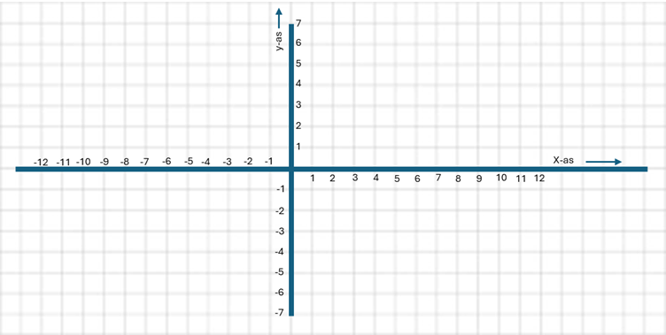

# opgave 4

Neem twee punten A(-4,-4) en B(8,5)

Maak twee vectoren $\vec a $ en $ \vec b$ die wijzen naar de punten A en B.

Wat is de waarde van $\vec a$?

Wat is de waarde van $\vec b$?

Wat is verschilvector $\vec v = \vec b - \vec a $

Teken vectoren $\vec a$ en $\vec b$ en $\vec v$ in onderstaand rooster 

Wat is de magnitude van $\vec v$ ?

 $\hat r$ is de richtingsvector bij de verschilvector $\vec v$. Wat is de richtingsvector?

 Teken de richtingsvector $\hat r$ in de grafiek uitgaande van punt A. 

 Hoe vaak kan je de richtingsvector $\hat r$ optellen bij $\vec a$ zodat je bij $\vec b$ uitkomt?

| Stap                             | Uitwerking |
|----------------------------------|------------|
| $\vec a_1 = \vec a_0 + \hat r $  | =          |
| $\vec a_2 = \vec a_1 + \hat r $  | =          |
| $\vec a_3 = \vec a_2 + \hat r $  | =          |
| $\vec a_4 = \vec a_3 + \hat r $  | =          |
| $\vec a_5 = \vec a_4 + \hat r $  | =          |
| $\vec a_6 = \vec a_5 + \hat r $  | =          |
| $\vec a_7 = \vec a_6 + \hat r $  | =          |
| $\vec a_8 = \vec a_7 + \hat r $  | =          |
| $\vec a_9 = \vec a_8 + \hat r $  | =          |
| $\vec a_{10} = \vec a_9 + \hat r $ | =          |
| $\vec a_{11} = \vec a_{10} + \hat r $ | =          |
| $\vec a_{12} = \vec a_{11} + \hat r $ | =          |
| $\vec a_{13} = \vec a_{12} + \hat r $ | =          |
| $\vec a_{14} = \vec a_{13} + \hat r $ | =          |
| $\vec a_{15} = \vec a_{14} + \hat r $ | =          |
| $\vec a_{16} = \vec a_{15} + \hat r $ | =          |
| $\vec a_{17} = \vec a_{16} + \hat r $ | =          |
| $\vec a_{18} = \vec a_{17} + \hat r $ | =          |
| $\vec a_{19} = \vec a_{18} + \hat r $ | =          |
| $\vec a_{20} = \vec a_{19} + \hat r $ | =          |
| $\vec a_{21} = \vec a_{20} + \hat r $ | =          |
| $\vec a_{22} = \vec a_{21} + \hat r $ | =          |
| $\vec a_{23} = \vec a_{22} + \hat r $ | =          |
| $\vec a_{24} = \vec a_{23} + \hat r $ | =          |
| $\vec a_{25} = \vec a_{24} + \hat r $ | =          |