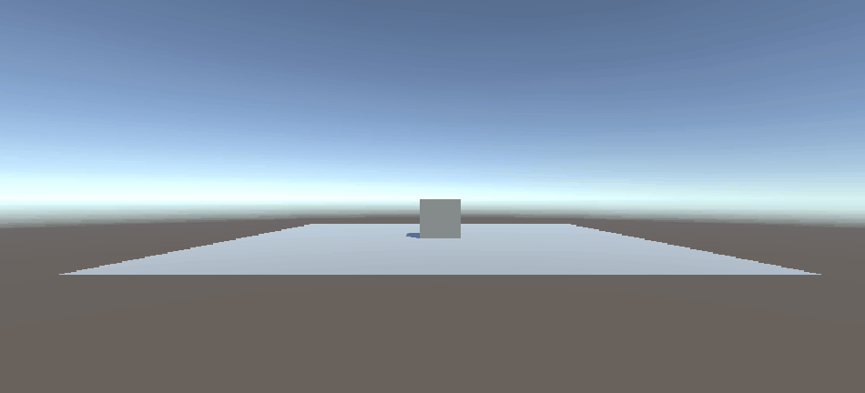

# M3 BO- arcade-mechanics Beroepsopdracht

In deze beroepsopdracht leren jullie, met behulp van verschillende game development tools (voornamelijk binnen Unity) kleine losse game mechanics bouwen en programmeren. Deze game mechanics vormen de basis van je eerste eigen simpele game.

Tijdens de **BO** en **FLEX** lessen zal er volop ruimte zijn om aan de opdracht te werken, vragen te stellen en hulp te krijgen. Tijdens de **SKIL** lessen leer je over game gerelateerde wiskunde en eigen 3d art assets te maken. Deze moeten bruikbaar zijn binnen je game. Bij **PROG** leer je programmeren in **C#** en **Unity**.

De beroepsopdracht doe je in 2 tallen.

Elke losse mechanic wordt door jullie gepushed naar jullie repository en de link ingeleverd in simulise.

Elke mechanic ontwikkelen jullie in een aparte branch.

De mechanics kun je maken door middel van het volgen van de onderstaande [**tutorials**](#tutorial-0).

Al deze tutorials voer je sowieso individueel een keer uit en lever je in op een repo "**Arcade_Mechanics_Tutorials**". De link naar deze repo lever je op via [deze opdracht op simulise](https://ma.simulise.com/school/assignment/87e524b0-a421-4b26-ae12-7496326ad035/view).

Je mag ook zelf andere bronnen zoeken of een eigen manier bedenken om een mechanic te bouwen.

Je moet samen in totaal minimaal 4 mechanics uitwerken tot losse prototypes.

Minimaal 3 van deze verschillende mechanics voeg je vervolgens samen en verwerk je tot een leuke kleine game.

Zorg ervoor dat je alle mechanics en de game zo mooi mogelijk afwerkt door gebruik te maken van 3d assets, visuele effecten en geluiden. **Tip:** [Hier kun je rechtenvrije geluiden vinden](https://freesound.org/)

Deze assets kun je uit de unity assetstore halen maar er moeten ook eigen gemaakte 3d assets uit de **SKIL** lessen in verwerkt zijn.

Naast de voorgestelde mechanics uit de [lijst](#game-development) mag je ook zelf eigen mechanics verzinnen. Doe dit echter wel in overleg met de docent. De mechanics moeten wel uitgebreid en uitdagend genoeg zijn en ook weer niet te complex of te moeilijk.

## Beoordeling

Je wordt voor je Beroepsopdracht beoordeeld op de volgende punten:

### Game Development:

_"Je gaat samenwerken met andere developers om gezamenlijk tot een speelbare game te komen en leert de belangrijkste disciplines kennen."_

- Jullie hebben samen minimaal 4 mechanics uitgewerkt en succesvol ingeleverd.

- Jullie game bevat minimaal 3 van de volgende mechancs:

  - Lopen of rennen (geanimeerd character 3rd person)
  - Schieten en vernietigen van obstakels / enemies (kogels en impact zijn mooi afgewerkt met effecten en geluiden)
  - Lekker springen (geanimeerd en niet "floaty")
  - Enemies schieten op de speler (netjes afgewerkt met animaties en effecten)
  - Mooi afgewerkt scoresysteem incl. UI waarbij er dmv effecten aandacht wordt getrokken naar het scorebord
  - Traps die worden getriggered als de speler deze raakt of langs loopt. inclusief effecten en animaties
  - Powerups/Pickups systeem waarbij er items opgepakt kunnen worden die zichtbaar een buff voor de speler opleveren. Inclusief effecten op de pickup en om de buff aan te tonen.
  - Timing systeem, waarbij er een UI is met een timer en de speler binnen de tijd een doel moet bereiken. Incl. effecten als de tijd bijna op is en op is. Het systeem moet spanning creeren.

- De game bevat een eigen gemaakte 3d model inclusief shader, material, unwrap en texture (leer je in de SKIL lessen)

### Game Engines:

_"Je gaat diverse tools ontdekken en toepassen welke game engines aanbieden."_

Jullie hebben aantoonbaar de volgende Unity systemen gebruikt:

- De animator en animator controller
- Een particle system
- Prefabs
- Unity Events (voor afspelen geluiden).
- Eigen scripts
- De package manager
- De skybox vervangen
- De URP renderpipeline gebruikt

### Professionaliseren:

_je leert niet te werken voor cijfers, maar voor je eigen leerontwikkeling en snapt hoe je schoolopdrachten effectief kunt inzetten om jezelf als developer te verbeteren. Je leert je werk visueel maken. en snapt hoe je dit toe moet passen voor al je toekomstige projecten._

Jullie hebben tijdens de BO en Flex lessen regelmatig vragen gesteld en om hulp gevraagd. Jullie hebben je aan de tussentijdse deadlines van het project gehouden , het werk op tijd ingeleverd en de eisen van het werk gehanteerd.

### Versiebeheer:

_"Je kunt git instellen zodat je versiebeheer systeem om kan gaan met game engines."_

Jullie hebben aan het eind van elke werkdag je gemaakte werk gecommit op de juiste branch in een gezamenlijke repository, zo toon je aan wat je elke dag hebt gedaan.

Je gebruikt goede inhoudelijke commit messages die duidelijk aangeven wat er die dag allemaal is gedaan.

## Deadlines:

### Donderdag 6 maart (week 3) voor 18:00:

Jullie eerste mechanic is af en afgewerkt met 3d art, effecten en geluid.

Je werk is ingeleverd:

- Merge de mechanic op jullie main branch op github.
- Zet een gifje van je mechanic op je README met daarbij je design
- Zet een build van je mechanic onder releases.
- Lever de link naar je repo in op Simulise.

### Vrijdag 14 maart (week 4) voor 18:00:

Jullie tweede mechanic is af en afgewerkt met 3d art, effecten en geluid.

Je werk is ingeleverd:

- Merge de mechanic op jullie main branch op github.
- Zet een gifje van je mechanic op je README met daarbij je design
- Zet een build van je mechanic onder releases.
- Lever de link naar je repo in op Simulise.

### Vrijdag 21 maart (week 5) voor 18:00:

Jullie derde mechanic is af en afgewerkt met 3d art, effecten en geluid.

Je werk is ingeleverd:

- Merge de mechanic op jullie main branch op github.
- Zet een gifje van je mechanic op je README met daarbij je design
- Zet een build van je mechanic onder releases.
- Lever de link naar je repo in op Simulise.

### Vrijdag 28 maart (week 6) voor 18:00:

Jullie vierde mechanic is af en afgewerkt met 3d art, effecten en geluid.

Je werk is ingeleverd:

- Merge de mechanic op jullie main branch op github.
- Zet een gifje van je mechanic op je README met daarbij je design
- Zet een build van je mechanic onder releases.
- Lever de link naar je repo in op Simulise.

### Vrijdag 4 april (week 7) voor 18:00:

Jullie game met minimaal 3 van de door jullie gemaakte mechanics is af. Afgewerkt met 3d art, effecten en geluiden.
De game bevat een voledige gameplay loop. Dit betekent dat je kunt verliezen, .evt winnen en herstarten.

Je werk is ingeleverd:

- Commit de game op jullie main branch op github.
- Zet een gifje van je complete game op je README.
- Plaats een omschrijving van jullie grootste technische uitdaging en de door jullie gebruikte oplossing. Ondersteun deze technische oplossing met visueel materiaal zoals screenshots.
- Zet een build van je game onder releases.
- Lever de link naar je repo in op Simulise.

## Inleveren van je werk

Check [hier de tutorial](inlever_tutorial/README.md) over hoe je je werk in moet leveren met een gifje op een readme.

## PROG Tutorials: Game Mechanics

### Tutorial 0

[Ontwikkelomgeving opzetten en simpele **launch** mechanic](./tutorial_0/README.md)

### Tutorial 1

[**_mixamo.com_** placeholder animaties aansturen](./tutorial_1/README.md)

### Tutorial 2

[Beweging en besturing van gameobjecten](./tutorial_2/README.md)

[Video tutorial rondlopen en draaien](https://www.youtube.com/watch?v=8mukeQPGyV8)

### Tutorial 3

[Springen op platforms (& traps)](./tutorial_3/README.md)

### Tutorial 4

[Verzamelen van pickups en score bijhouden](./tutorial_4/README.md)

### Tutorial 5

[Schieten van kogels en vernietigen van obstakels](./tutorial_5/README.md)

### Tutorial 6

[Bijhouden van levens en creeeren van vijanden](./tutorial_6/README.md)

### Tutorial 7

[Verdieping in het springen](./tutorial_7/README.md)

[Video tutorial springen met een aanpasbare gravity scale](https://youtu.be/Q35KLFQgL6c)

### Tutorial 8

[Maak een exploding trap](./tutorial_8/README.md)

### Tutorial 10

[Menu op de canvas (optioneel)](./tutorial_10/README.MD)
