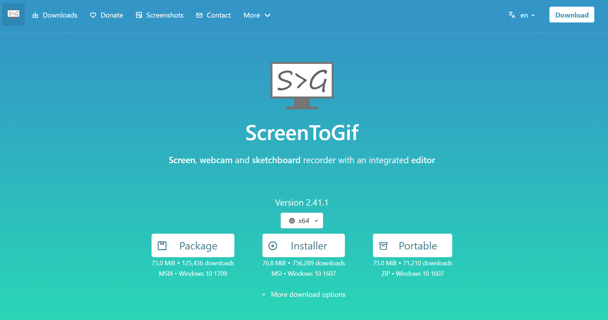
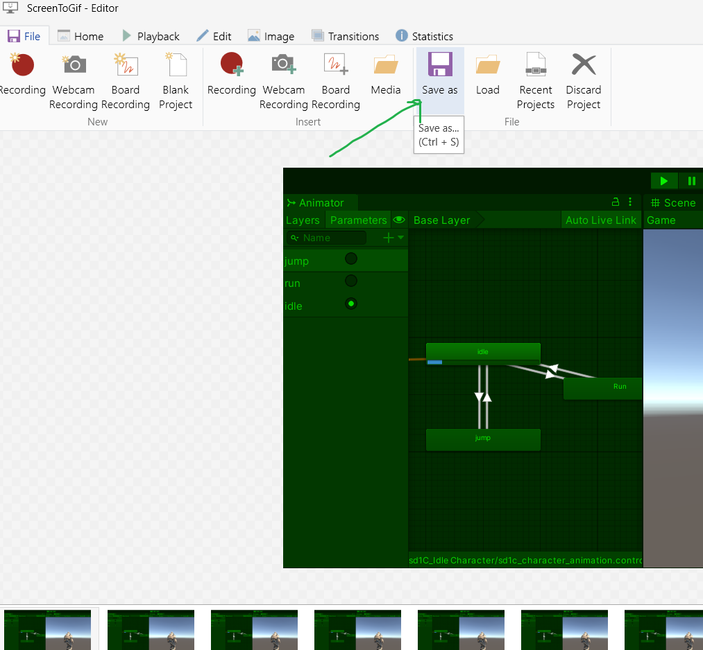

# Hoe lever ik mijn programmeer werk in?

### Commit en push je werk naar je eigen branch op github. Laat je Unity scene, je code en je repository zien aan de docent en lever een link in op simulise (lesplan : GD1.3 - PROG; Programmeren)

Om zelf een gifje te kunnen maken van je werk kun je het programma "ScreenToGif" [hier downloaden](https://www.screentogif.com/)

Start het prgramma op en druk op "Recorder"

Resize het window zodat je de game mooi in beeld krijgt.

Druk ook op "play" in unity om je game te starten.
Druk op "record" om te starten met opnemen.

Zorg dat alle functionaliteit die je gebouwd hebt goed demonstreert in de opname.

Druk op "Stop" als je klaar bent.

Delete eventueel nog overbodige frames waarin niets gebeurt of waarin de game nog wordt gecompiled. Dit doe je door ze te selecteren en op de delete knop op je toetsenbord te drukken.

Ga daarna naar het tabje **"File"**

Druk daar op **"Save As"**

Kies een map waar je de gif wil opslaan en vul een naam in.
Sla je gif op door op **"save"** te drukken.

Maak in repository voor alle tutorials een mapje aan: "tutorial 0", "tutorial 1" etc..

Maak in alle mappen een nieuwe file README.md aan. Dit kun je met elke code editor doen.

In de readme.md file zet je als titel "Tutorial 0" of "Tutorial 1" etc.

Een titel kun je maken door er `#` voor te zetten.

# Titel

Onder de titel zet je in een subtitel "door ..." met je naam en je klas.

Een subtitel kun je maken met `##`, `###`, `####` enzovoort.

## subtitel

### sub-subtitel

#### sub-sub-sub

Omschrijf je wat je hebt gemaakt en wat er dus gebeurt.

Zet daaronder je gifje in de readme.

Zorg dat je bewust bent van waar je gifje staat ten opzichte van je readme. Je hebt een zogenaamde relatieve link nodig die vanaf de plaats van de readme gaat zoeken naar je gif file.

Staan ze in dezelfde map is het het makkelijkst. Anders moet je de mappenstructuur ook meegeven.

Zo kun je in je readme een relatieve link maken naar een image of gif:
` `
dus bijvoorbeeld in dezelfde map:
``
of in een andere map:
``

test je readme door in visual studio een vieuwer extension te installeren.

Bijvoorbeeld de "markdown preview enhanced" extension voor VSCode.

Of de "Markdown Editor" voor MS Visual Studio.

Je kunt dan in je editor al zien hoe je markdown file eruit komt te zien op github als je op de preview knop drukt in VSCode.

De MS Visual studio extension opent automatisch een preview als je een readme file opent of maakt.

Add, Commit en Push nu je README.md file en je gifje naar je repo op github.

Ga naar de readme op github en kopieer de url uit de adresbalk. Deze link lever je vervolgens in op simulise.
