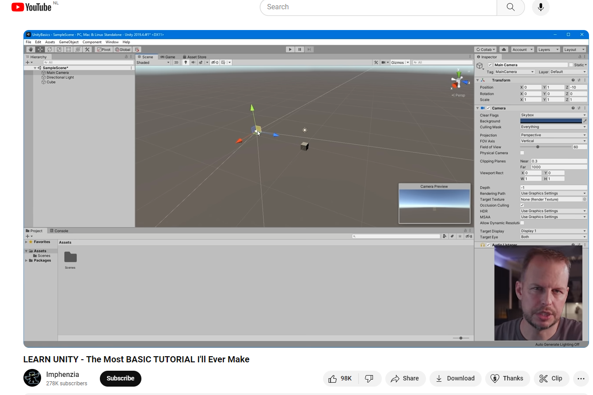
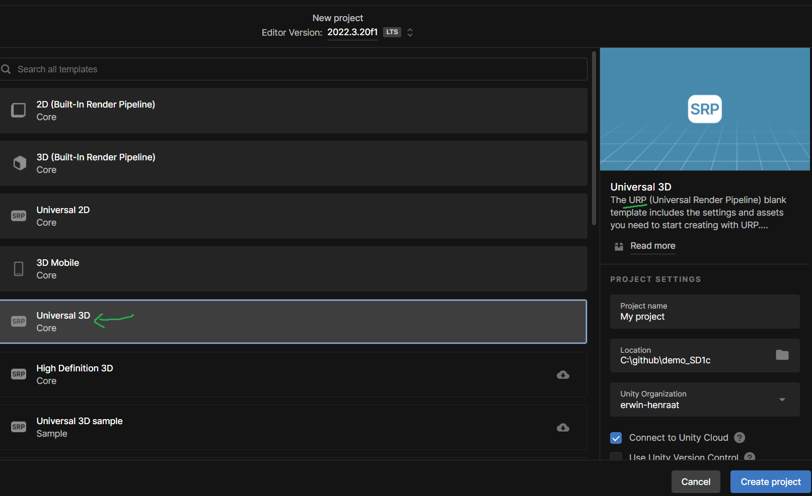
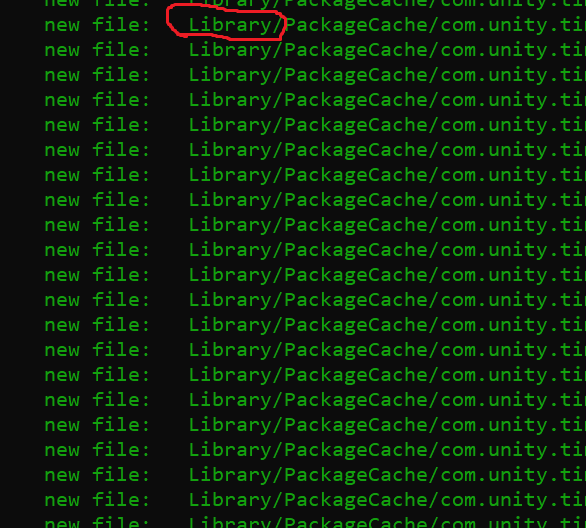
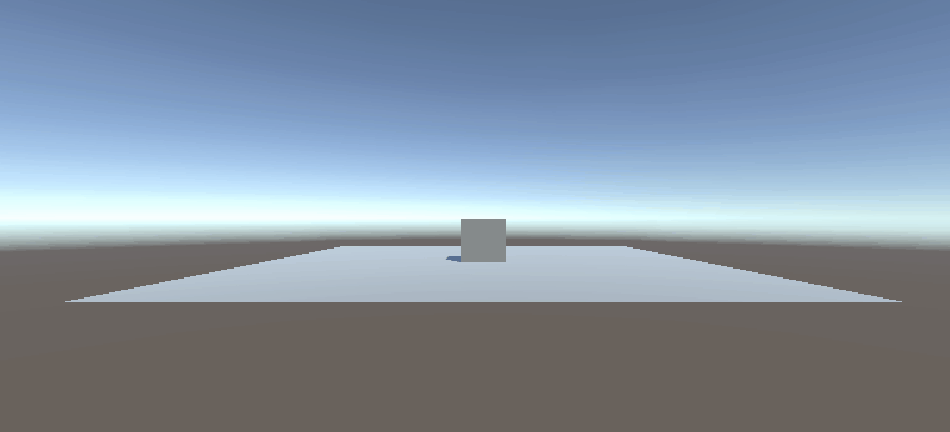

# Tutorial 0: Opzetten van je Ontwikkelomgeving

**Let op deze tutorial is enkel ter voorbereiding. Het telt niet mee voor de af te tekenen mechanics!**

**Ontwikkelomgeving opzetten en simpele launch mechanic**

## Leerdoelen:

- Jullie weten wat een IDE (integrated development environment) is en kunnen die opzetten voor Unity game projecten
- Jullie kunnen een unity project opzetten voor de arcade mechanics opdrachten
- Jullie kunnen simpele game objecten in de scene creeren
- Jullie kunnen de Rigidbody en Script components aan gameobjecten toevoegen
- Jullie weten waar je de Unity code reference kunt vinden en hoe je deze zelf kunt gebruiken als script ondersteuning
- Jullie kunnen simpele scripts schrijven om gameobjecten te manipuleren

## Stappenplan:

Voer de onderstaande stappen uit en laat in de volgende les zien hoe ver je bent gekomen.

Als je klaar bent lever je het in en laat je het ook zien aan je docent (BO/FLEX/PROG).

Als je vast zit vraag je om hulp!

### 0. Bekijk de eerste 31:35 minuten van deze video

Als je de basics van Unity nog even wil herhalen kun je deze video bekijken. Als het goed is hebben jullie deze kennis al opgedaan in de orienatiefase maar als je twijfelt over je basiskennis van unity kun je deze nog even bekijken.
[](https://youtu.be/pwZpJzpE2lQ?si=4GncqWjHaXYUy1kV)

### 1. installeer unity HUB

Als je nog geen Unity en Unity Hub hebt geinstalleerd kun je dit nu doen.


### 2. Installeer de laatste LTS versie van Unity


### 3. Creer een repo met readme en een unity .gitignore


### 4. Indien van toepassing : Installeer [MS Visual Studio Community 2022](https://visualstudio.microsoft.com/downloads/)

- Selecteer Game Development with Unity
  

- Installeer de **_Markdown Editor (64-bit)_** Extension
  

### 5. Clone de repo

Doe dit met github Desktop:


Of via de commandline:

`git clone https://github.com/user/ArcadeMechanics.git`

### 6. Maak een 3d Unity **"URP"** project aan binnen je Repo



Dit staat voor Universal Render Pipeline. Hier kun je later meer mee dan met de **"Built in"** render pipeline

Het kan zijn dat je deze eerst moet importen..


### 7. Verplaats de .gitignore file naar root van je unity project

De plek waar je ook de **Assets** folder tegenkomt!


Als je dit niet goed doet werkt je .gitignore niet. Dit herken je aan het feit dat git o.a. de **Library** folder gaat tracken als je `git add . ` gebruikt



### 8. Maak in Unity een **"Scripts"** folder


Die zul ja dan ook in je andere omgevingen terugzien. (Visual studio en windows verkenner)


### 9. Maak een eerste script: **HelloUnity.cs**

Die maak je natuurlijk in je "scripts" folder.


Dit script heeft het Monobehaviour template


### 10. Schrijf code:

```
  void Start(){
    Debug.Log("Hello Unity");
  }
```

### 11. Voeg het script als component toe aan het Main Camera object.

gewoon even erop slepen!


### 12. Run the game! en check de console.. Zie je een bericht?


### 13. Neem de uitleg over de layout van unity door (Klik op de onderstaande image):

[](https://docs.unity3d.com/Manual/UsingTheEditor.html)

### 14. Plaats een Plane en een Cube in de Scene.


### 15. Voeg een Rigidbody component toe aan de Cube via de optie Add Component.


### 16. Maak een nieuw LaunchCube.cs script aan en hang dat aan de Cube als component.


### 17. Ga naar de Rigidbody pagina van de Unity scripting manual.

- Bekijk hier de [scripting manual](https://docs.unity3d.com/ScriptReference/Rigidbody.html).
- Zoek naar de **AddForce** methode en bekijk het voorbeeld.
- Gebruik nu de methode **AddForce()** in je eigen script om de **Cube** te lanceren.
- Doe dit op het moment dat je de [spatie ingedrukt hebt](https://docs.unity3d.com/ScriptReference/Input.GetKeyDown.html)

Dit is ongeveer het resultaat


### Commit en push je werk naar je eigen branch op github. Laat je Unity scene, je code en je repository zien aan de docent en lever een link in op simulise (lesplan : GD1.3 - PROG; Programmeren).

[uitleg over inleveren](../inlever_tutorial/README.md)
