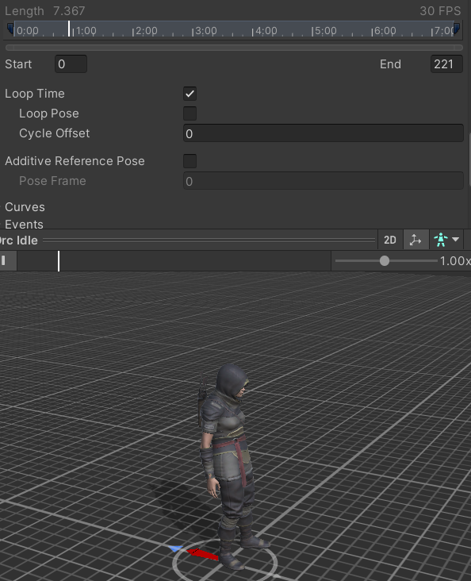

# Tutorial 1: Animaties aansturen

**Mixamo.com placeholder animaties aansturen**

## Leerdoelen:

- Jullie kunnen snel placeholder animaties implementeren
- Jullie weten hoe je animaties op een goede manier kunt importeren
- Jullie kunnen animaties en transitions maken met behulp van de Animator tool
- Jullie kunnen via scripts de juiste animaties triggeren

## Stappenplan:

Voer de onderstaande stappen uit en laat in de volgende les zien hoe ver je bent gekomen.

Als je klaar bent lever je het in en laat je het ook zien aan je docent (BO/FLEX/PROG).

Als je vast zit vraag je om hulp!

### 1. Ga naar Mixamo.com en maak een gratis account aan

Volg eventueel deze video tutorial!:

### 2. Selecteer een character

### 3. Selecteer een animatie

### 4. Download primaire animatie (idle) met skin

Kies FBX for Unity
With Skin!

### 5. Selecteer meer animaties en download deze zonder skin

Download alle andere animaties **zonder** skin.
Je hebt via de idle FBX je skin (mesh met materials en textures) al gekregen.

Let op dat je bij bewegende animaties **In Place** aan kunt zetten om de animatie op zijn plek te houden. Beweging gaan we later scripten.

### 6. zorg voor de juiste import settings van je idle FBX in Unity

#### Model settings:

Als de bones van je model verkeerd om staan is je model buggy. Zet dan **Bake Axis Conversion** aan. Anders niet!

#### Rig settings:

Bij Avatar Definition kies je "create from this model". Je avatar is een set van bones(rig) waarmee je animaties aan je skin kunt koppelen.

Druk op apply en er verschijnt een avatar in je idle fbx.

Deze kun je later naar andere fbx bestanden slepen om ze aan de animaties te koppelen.

#### Animation settings

Als je een animatie wil laten loopen zet je **Loop Time** aan.

Als je animatie vooruit beweegt terwijl je dat niet wilt dan zet je **Loop Pose** aan.

Je kunt dit ook in mixamo voor het downloaden goed instellen.

#### Materials settings

Click op Extract Textures en Materials en sla deze op in je project. Maak hier even netjes 2 mapjes met de namen "Textures" en "Materials" voor aan.

Als je een pop-up krijgt klik je "fix now".

### 7. Sleep je fbx in de scene

### 8. Voeg de animator controller toe

Maak een Animator Controller aan

Die ziet er zo uit :

Selecteer je character in de hierarchy

Voeg een animator component toe

Selecteer de nieuwe Animator Controller

### 9. Plaats je animaties in de Animator

Open het Animator Window

Sleep je animaties in het animator window

Voeg een trigger toe

Voeg transitions toe

zet als condition de trigger

### 10. Maak code om de animatie aan te roepen

- Hang een nieuw script als component aan je character

- Noem dit script bijvoorbeeld Animate.cs

- Gebruik de methode [SetTrigger()](https://docs.unity3d.com/ScriptReference/Animator.SetTrigger.html) van het Animator component.

- Laat de animatie afspelen als je op een specifieke toets drukt (Bijvoorbeeld ENTER)

Zorg ervoor dat er standaard een idle animatie afspeelt en dat je character iets anders doet als je op een knop drukt.

### Commit en push je werk naar je eigen branch op github. Laat je Unity scene, je code en je repository zien aan de docent en lever een link in op simulise (lesplan : GD1.3 - PROG; Programmeren).

[uitleg over inleveren](../inlever_tutorial/README.md)
