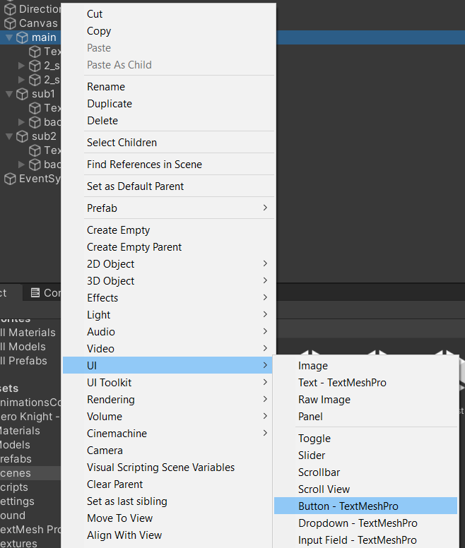
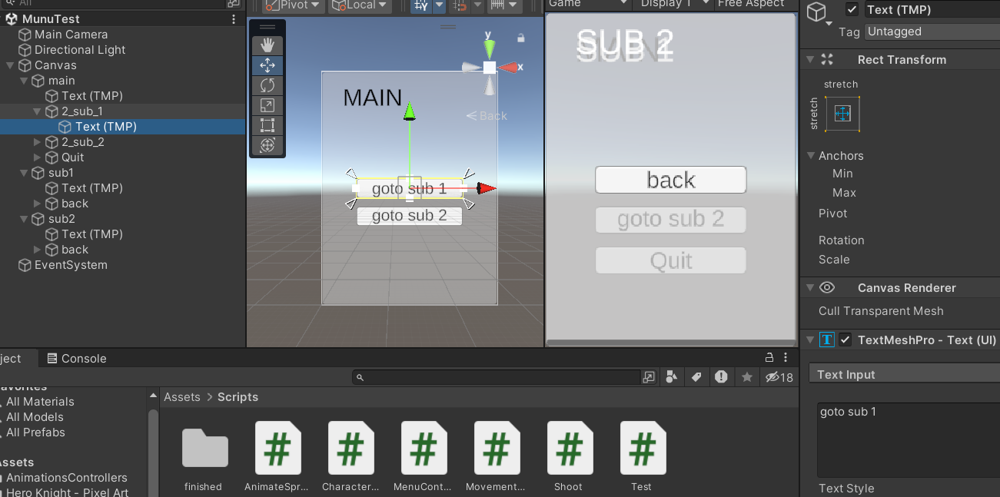

# Tutorial 10 (optioneel)

## Maak een simpel menu op de canvas


Om een simpele menu structuur met submenus te maken maak je een canvas aan met daarin een aantal panels. Voor elk menu scherm gebruik je een panel.


In dit voorbeeld maak ik een hoofdmenu met 2 submenus. Dat zijn dus 3 panels.


In dit voorbeeld heeft mijn hoofdmenu een titel en 2 knoppen.

Elk submenu heeft een titel en een "back" knop.

Voeg hiervoor aan elk panel een textfield en button(s) toe.




De teksten op je knoppen kun je aanpassen in het Text(TMP) gameobject dat in de knop zit via het TextMeshPro component.



Je kunt de panelen hiden door aan de linkerkant in de hierarchy op het oogje te klikken. Zo kun je 1 voor 1 je panelen mooi opmaken.


Je buttons hebben een Image en Button component. Hiermee kun je de vormgeving van je knoppen aanpassen.


Je button Component heeft ook de OnClick settings. Hiermee kun je gedrag aan je knop hangen via een script.


Door op het plusje te klikken kun je een script toevoegen.


Maak een nieuw script aan **"MenuController.cs"** en hang deze aan je canvas.

Maak een variabele aan voor een List die Transforms op kan slaan. Hierin gaan we alle transforms zetten van alle panelen uit ons menu.

```
public class MenuController : MonoBehaviour
{
    List<Transform> panels;

```

In de Start methode schrijven we code die:

Eerst een lege List aanmaakt.

En dan door alle children (panelen) van de canvas heen loopt en ze allemaal in de lijst zet.

```
void Start(){
    panels = new List<Transform>();
    foreach (Transform child in transform) {
        panels.Add(child);
    }
}
```

Voeg vervolgens code toe die alle panelen behalve het main paneel uitschakelt.

```
void Start(){
    panels = new List<Transform>();
    foreach (Transform child in transform) {
        panels.Add(child);
    }
    panels[1].gameObject.SetActive(false);
    panels[2].gameObject.SetActive(false);
}
```

Maak nu een nieuwe public methode aan met de naam **GoTo**. In deze methode gaan we panelen in en uitschakelen op basis van het index nummer wat hoort bij de positie in de lijst.

Door deze methode public te maken kunnen we hem later vanaf de knop aanroepen.

De methode krijgt als **parameter** een **integer** met de naam **panelIndex**. Dit is de index positie van het paneel dat we "aan" willen zetten.

```
 public void GoTo(int panelIndex) {

 }
```

We maken vervolgens een loop die door de lijst met alle panelen heen gaat. In plaats van een **foreach** loop gebruiken we een **for** loop.

door `panels.Count` te gebruiken kunnen we de lengte van de lijst gebruiken voor de loop.

```
 public void GoTo(int panelIndex) {
    for (int i = 0; i < panels.Count; i++) {

    }
 }
```

Nu gaan we onze positie in de loop (`i`) gebruiken om te vergelijken met de positie van het paneel dat we aan willen zetten (`panelIndex`).

```
    public void GoTo(int panelIndex) {

        for (int i = 0; i < panels.Count; i++) {
            if (i == panelIndex) {

            }
        }
    }
```

Zodra we het panel tegenkomen wat "aan" moet, zetten we deze actief via de code.

```
    public void GoTo(int panelIndex) {

        for (int i = 0; i < panels.Count; i++) {
            if (i == panelIndex) {
                panels[i].gameObject.SetActive(true);
            }
        }
    }
```

De rest van de panelen zetten we uit:

```
    public void GoTo(int panelIndex) {

        for (int i = 0; i < panels.Count; i++) {
            if (i == panelIndex) {
                panels[i].gameObject.SetActive(true);
            }
            else{
                panels[i].gameObject.SetActive(false);
            }
        }
    }
```

De methode **GoTo** moeten we nu aanroepen vanaf de verschillende knoppen.

Open in de inspector eerst de knoppen van het hoofdmenu.


Selecteer nu het slotje bovenin je inspector. Dit zorgt ervoor dat je inspector niet verandert als je een ander gameobject uit je hierarchy kiest.


Sleep nu de canvas uit je hierarchy in het vakje voor je onClick object.


Klik nu op het dropdown menu waar "No Function" staat.
Als het goed is staat de naam van je menu script er tussen. Deze hebben we `MenuController` genoemd. Selecteer dit script. In het submenu zie je als het goed is ook de methode GoTo(int) staan. Selecteer deze.


Je kunt nu in het textveldje eronder het index nummer aangeven van het paneel dat je wilt activeren.


In dit voorbeeld is `0` de index van het hoofdmenu. `1` de index van het eerste submenu en `2` de index van het 2e submenu. Deze knop moet dus naar `1` gaan.

De-activeer het slotje weer zodat je in je inspector de volgende knop kunt weergeven.

Herhaal de bovenstaande stap voor al je knoppen en zorg dus dat alle knoppen verwijzen naar het juiste paneel van het juiste (sub)menu.

Test of het goed werk en probeer een uit of je je menu leuk kun vormgeven.

Met de methode: ` Application.Quit();` kun je ook een knop proberen te maken die je game afsluit. Dit werkt alleen als je je game ook hebt gebuild!

Maak in het script op je canvas hier dus een eigen methode voor:

```
    public void Quit() {
        Application.Quit();
    }
```

Voeg in je hoofdmenu (paneel) nog een quit knop toe en koppel hieraan deze methode via de onClick optie.


Maak een build van je game en test of je Quit knop werkt.


