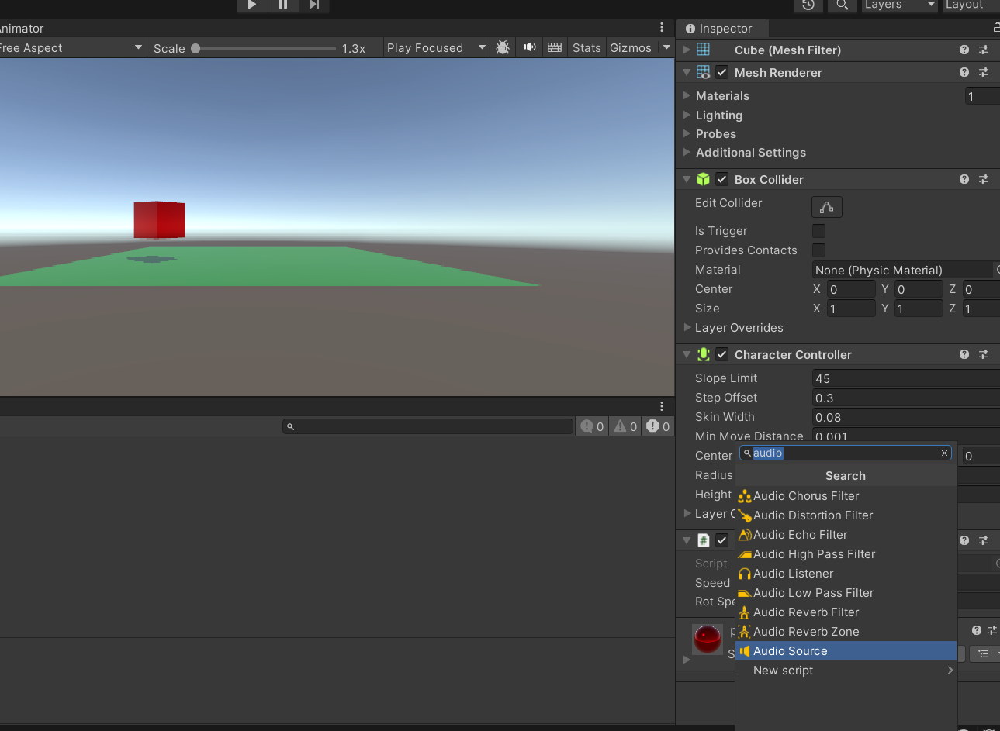

# Tutorial 9 (optioneel):

**Vuur een kogel af met geluid**

## Leerdoelen:

- Jullie leren werken met audio in Unity
- Jullie kunnen audio bewerken met een simpel audio pakket (Audacity)
- Jullie kunnen rechtenvrije audio vinden op Freesound.org
- Jullie kunnen geluid aansturen met script

## Stappenplan:

Zet op een gameobject wat geluid moet maken een audio source component.


Zoek een leuk geluidje uit op [freesound.org](https://freesound.org/) Download deze naar je Assets folder en zet deze in een **Sound** of **Audio** mapje.

Download [Audacity](https://www.audacityteam.org/) en open dit om je geluidje te bewerken en op te slaan als MP3.


Gooi eventueel oude onbewerkte audio files weg of zet ze buiten je repository.

Test of je geluidje werkt door deze in de audio clip van je audio source component te slepen. en play te drukken. Hoor je de audio nu afspelen?


Zet nu Play on Awake uit!

Bedenk nu wanneer je het geluidje wil afspelen. In dit voorbeeld ga ik een kogel schieten. Als ik op de schiet knop druk wil ik het geluidje afspelen.

Ik doe dit in mijn geval dus in een **Shoot.cs** script.

Zorg dat je script op je gameobject in de scene staat.

Ik gebruik de volgende regel code in mijn Update functie om te kijken of ik de schiet knop heb ingedrukt:

```
void Update()
{
    if (Input.GetButtonDown("Fire1") ){
        //Fire1 is de linker muis knop
    }
}
```

Omdat ik een kogel wil kunnen maken heb ik een variabele nodig waarin ik de prefab van mijn kogel kan slepen in Unity:

```
public GameObject prefab;
void Start()
{

}
```

Dan voeg ik de Instantiate Methode toe om een nieuwe kogel aan te maken die.

Deze kogel maak ik van mijn prefab en wordt los in de scene geplaatst. Ik sla hem tijdelijk op in de variabele bullet.

Daarna verander ik de positie van de bullet zodat deze gelijk is aan de "schutter" oftewel het object waar dit script op staat.

Daarna verander ik ook de rotatie van de bullet naar die van de schutter:

Ik wil ook dat de bullet weer wordt verwijderd na 3 seconden.

```
void Update()
{
    if (Input.GetButtonDown("Fire1") ){
        GameObject bullet = Instantiate(prefab, transform.parent);
        bullet.transform.position = transform.position;
        bullet.transform.rotation = transform.rotation;
        Destroy(bullet,3f);
    }
}
```

In mijn Start methode ga ik nu mijn AudioSource component ophalen:

```
private AudioSorce myAudioSource;
public GameObject prefab;

void Start()
{
    myAudioSource = GetComponent<AudioSource>();
}
```

In mijn Update methode ga ik nu het geluid op mijn audio source triggeren:

```
void Update()
{
    if (Input.GetButtonDown("Fire1") ){
        GameObject bullet = Instantiate(prefab, transform.parent);
        bullet.transform.position = transform.position;
        bullet.transform.rotation = transform.rotation;
        Destroy(bullet,3f);

        myAudioSource.Play();
    }
}
```

Ik voeg aan mijn script een een nieuwe class toe die ik via dit script aan elke bullet hang met **AddComponent**:

```
    void Update()
    {
        if (Input.GetButtonDown("Fire1") ){
            GameObject bullet = Instantiate(prefab, transform.parent);
            bullet.transform.position = transform.position;
            bullet.transform.rotation = transform.rotation;
            Destroy(bullet,3f);

            myAudioSource.Play();

            bullet.AddComponent<MoveBullet>();
        }
    }
}
public class MoveBullet : MonoBehaviour {
    private float speed = 400f;
    void Update() {
        transform.position +=  transform.forward * speed * Time.deltaTime;
    }
}
```

Zorg nu dat je de prefab van je bullet via de inspector aan je script koppelt.


Hang aan je bullet prefab ook nog een audio source component.
zet hier een geluidsclip in van een geluidje wat de bullet maakt als hij vliegt.
Laat play on awake aan staan.


Test je scene en kijk of alles goed werkt en of je het geluid hoort.

Je kunt ook een audiosource op je camera hangen met daarin een leuk loopend muziekje.
