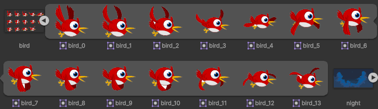
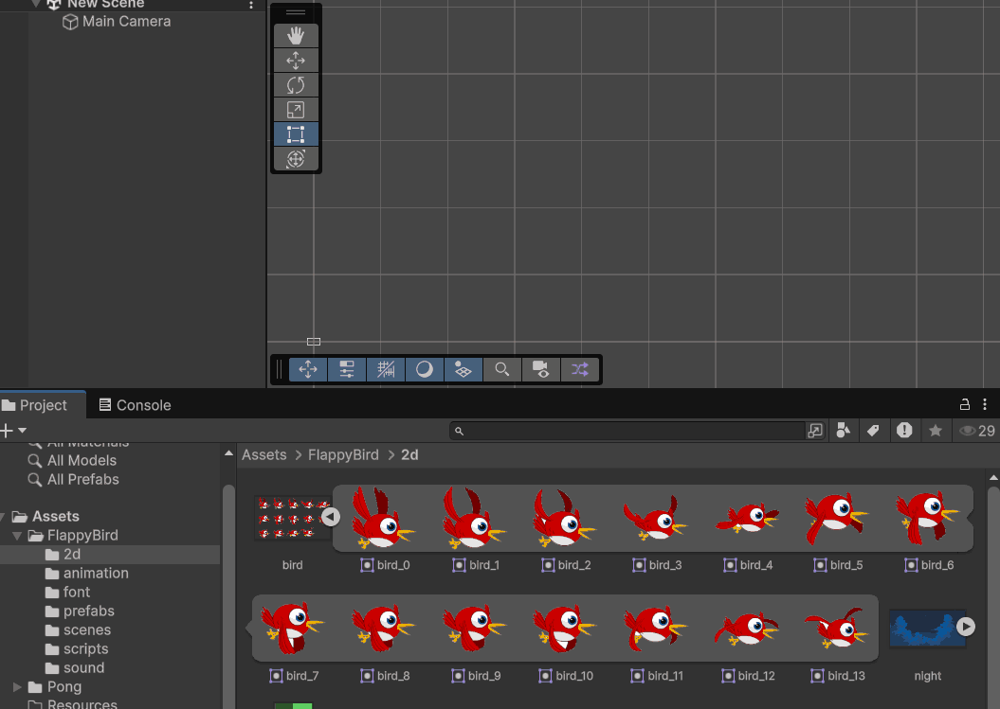
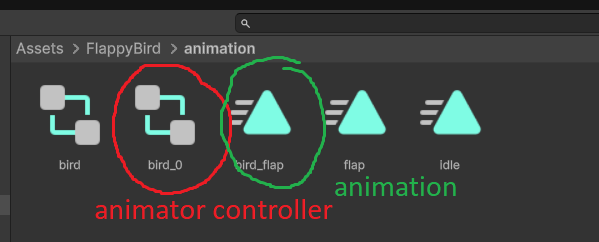
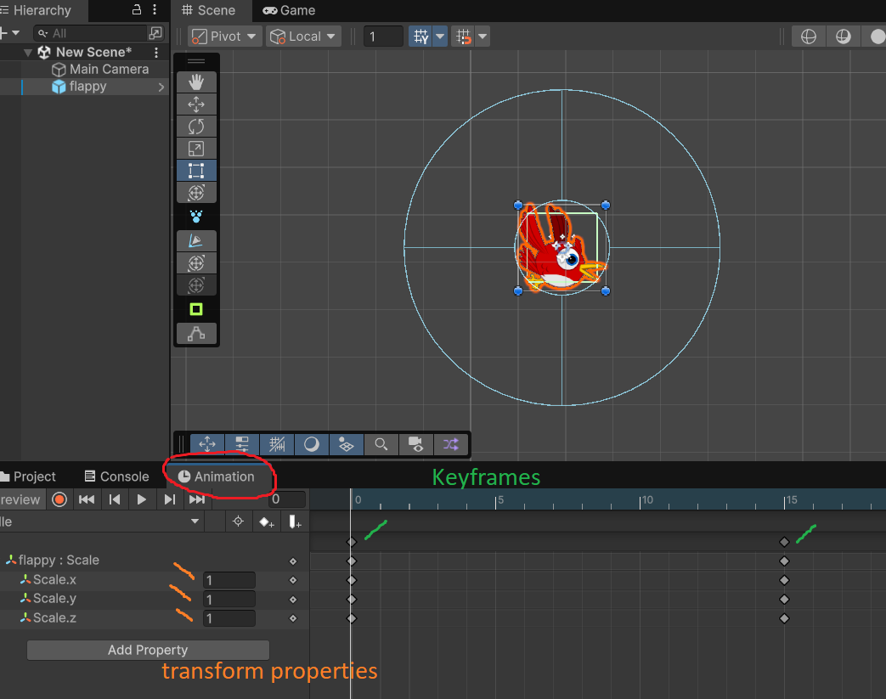
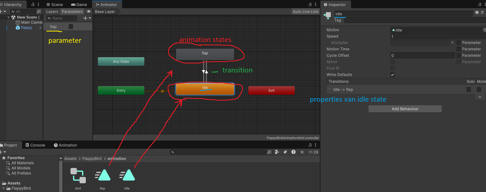
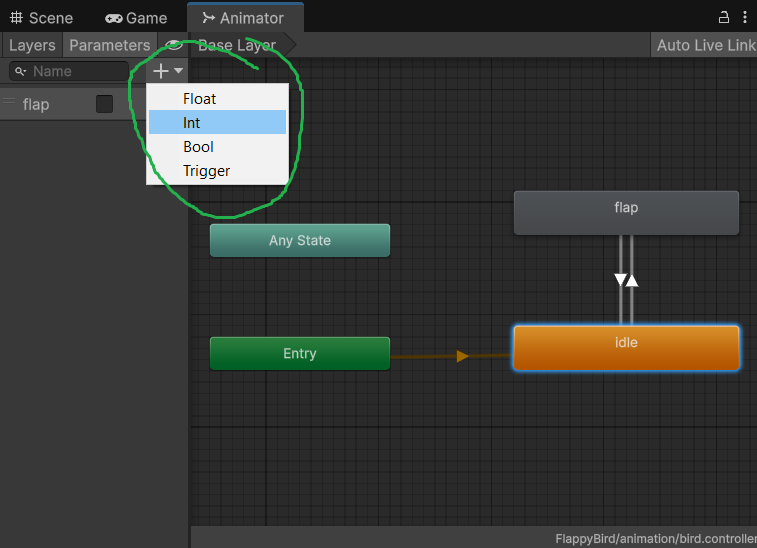
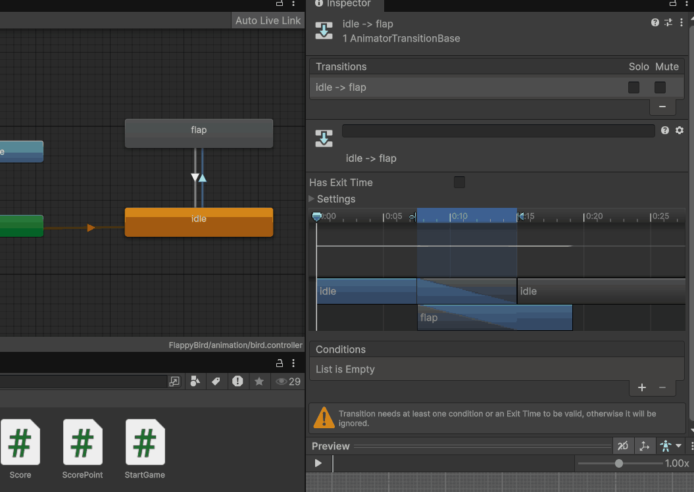

# Les 2: Animations, de Animator en deze aanroepen uit script

## Sprite Sheets

Om een animatie in Unity te maken heb je een zogenaamde **"sprite sheet"** nodig. Dit is een enkele image met daarop de verschillende frames van een animatie.

_voorbeeld van een spritesheet:_


Deze spritesheet kan 1 of meerdere animaties bevatten.

Om deze sprite sheet te kunnen gebruiken in unity is het van belang om deze op de juiste manier te importeren. Als het gaat om een spritesheet met 1 animatie erin is dat heel makkelijk en straight forward.

Sleep je image (.png) in je unity project in een map aan met de naam `/Sprites`, `/Spritesheets` of `/2d` of iets dergelijks.

Selecteer nu de image en kijk in de inspector.

Verander nu de Texture Type naar `Sprite (2d and UI)` en druk op `apply`

Je asset is nu goed geimporteerd en kan in het project window ook uitgeklapt worden. Unity heeft de verschillende frames in je animatie geidentificeerd.



## Animation en Animator Controller

Om je 2d animatie af te kunnen spelen heb je een game object nodig met een `Sprite Renderer` en een `Animator` component.

### Aanmaken animation en animation controller

Maar uiteraard kan unity het je ook makkelijk maken en kun je de frames van je animatie in de sprite asset in je scene slepen. Unity maakt dan voor jou een gameobject aan met alle noodzakelijke components om je animatie af te spelen.



Unity vraagt je dan ook om een `animation` asset op te slaan. Sla deze op in de map `/animations`. Naast deze `animation` wordt er door unity dan ook een `Animator Controller` opgeslagen.



Een `animation` is een asset die de bewegingen van je gameobject bevat. Dit kunnen meerdere frames uit een spritesheet zijn of het is informatie over de state van de transform (position, rotation, scale) op verschillende `keyframes` (momenten in tijd)



### Animeren in het Animation window

Met behulp van het `Animation` window in Unity zou je via deze keyframes je gameobjecten zelf kunnen animeren. Maar daar gaan we deze les niet op in.

### De Animator Controller

De `animator controller` is een asset waarmee je meerdere `animations` (states) kunt managen en dus kan bepalen wanneer welke animatie uitgevoerd moet worden en onder welke omstandigheden.

De `animator controller` voeg je via de inspector toe, aan het gameobject dat je wilt animeren. Je sleept hem dus in het `Animator` component van dat game object.


In het `Animator` window (openen via: **Window > Animation > Animator**) kun je je animaties vervolgens toevoegen aan de animator controller.



### Animation states wisselen via transitions

Tussen de `animations` of `animation states` kun je `transitions` toevoegen. Deze transitions bepalen onder welke omstandigheden er omgeschakeld moet worden tussen `animation states`.


Je kunt de transition activeren op 2 manieren. Je kunt kiezen voor `Has Exit Time`, dan maakt de Animator de animatie eerst helemaal af en schakelt dan automatisch over naar de gekoppelde `animation`. Je kunt ook `parameters` aanmaken. Dit zijn `triggers` en variabelen die je vanuit je code kunt aanpassen en activeren. Doordat deze parameters gekoppeld kunnen worden aan de `transitions` kun je op die manier vanuit je code de `animator controller` aansturen.

In het `Animator` window kun je zelf nieuwe `parameters` toevoegen.

Je hebt hierin de keuze uit:

- float
- int
- bool
- trigger



In de inspector kun je als je een `transition` geselecteerd hebt deze parameters instellen als voorwaarde om de transition te activeren en dus van `animation state` te wisselen.



Vanuit code kun je de `parameters` nu een waarde geven en `triggers` activeren via een aantal methoden van het type `Animator`

```Csharp

public class CallAnimation{
    private Animator anim;
    private void Start(){
        anim.SetBool("flap",false);
        anim.SetInt("count", 5);
        anim.SetFloat("value", 6.6f);
        anim.SetTrigger("activate");
    }
}
```

Dit doe je via het `Animator` window van unity.

Een gameobject dat geanimeerd moet worden

## Oefening: Idle en Jump animaties aansturen

### Doel

...

### Stappen

---

**Leerdoelen:** Begrijpen hoe je animaties maakt, deze met de Animator structureert en aanroept vanuit een script.
