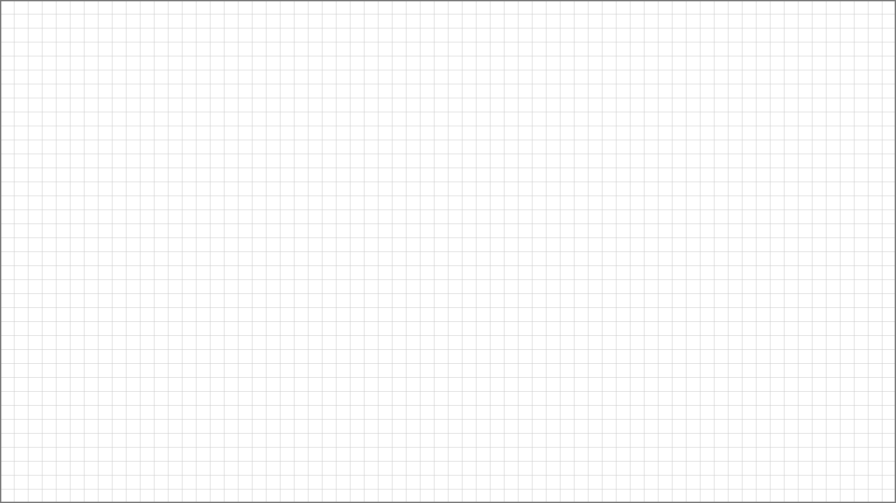

# Speler leren spelen
## Eerste 30 seconden van mijn game
De speler leert door te doen, niet door te lezen.

## Opdracht

Ontwerp de eerste 30 seconden van jouw game als een tutorial zonder tekst.

De speler moet in deze eerste momenten begrijpen:
- hoe hij kan bewegen,
- wat het doel van het level is,
- wat gevaarlijk is.

Je werkt in twee stappen:
1. Je beschrijft eerst je ontwerpkeuzes in tekst.
2. Daarna ontwerp je drie schetsen op een vaste grid.
3. Je voegt een legenda toe met consistente schaalverhoudingen.

Alles wordt toegevoegd aan deze README.

---

## Stap 1 – Ontwerpkeuzes (tekst)

Beantwoord de volgende vragen uitgebreid in zinnen:

### 1. Hoe communiceer ik dat de speler kan bewegen?

[Schrijf hier je antwoord.]

### 2. Hoe communiceer ik wat het doel van het level is?

[Schrijf hier je antwoord.]

### 3. Hoe communiceer ik wat gevaarlijk is?

[Schrijf hier je antwoord.]

### 4. In welke volgorde introduceer ik deze onderdelen en waarom?

[Beschrijf hier de volgorde en je motivatie.]

---

## Stap 2 – Schetsen (64x36 grid)

Maak drie losse schetsen van de eerste 30 seconden van jouw game.

Technische eisen:
- 64 tiles breed
- 36 tiles hoog
- 1 tile = 1 unit
- Werk consistent in schaal
- Geen tekst
- Geen pijlen
- Alleen leveldesign

---

### Schets 1 – Bewegen

Voeg hier je afbeelding toe:

Wat leert de speler hier?
[2–3 zinnen uitleg.]

---

### Schets 2 – Doel 

Voeg hier je afbeelding toe:

Wat leert de speler hier?
[2–3 zinnen uitleg.]

---

### Schets 3 – Gevaar

Voeg hier je afbeelding toe:

Wat leert de speler hier?
[2–3 zinnen uitleg.]

---

## Legenda

Beschrijf hier welke symbolen en vaste maten je gebruikt in je schetsen.

Voorbeeld:

- Speler = 2x2 tiles  
- Vijand = 2x2 tiles  
- Muur = 1x1 tile  
- Doel-object = 1x1 of 2x2 tiles  
- Power-up = 1x1 tile  

Alle objecten moeten:
- vaste afmetingen hebben
- consistent gebruikt worden
- schaalbaar zijn naar Unity

---

## Reflectie

Wat werkt goed in mijn ontwerp?

Wat zou ik verbeteren als ik dit opnieuw ontwerp?
