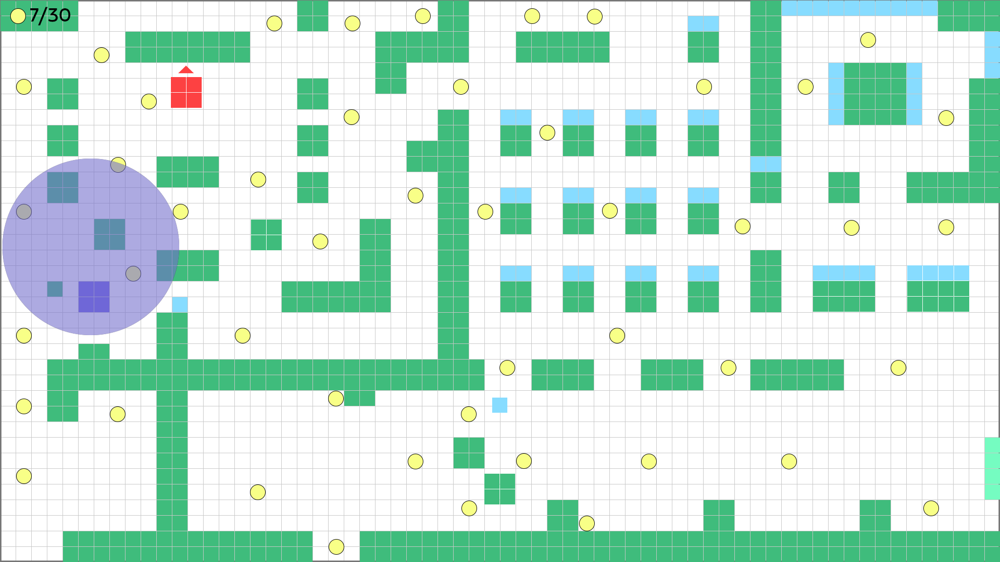

### Spelconcept

Speler verzamelt snoepjes in een kleuterklas.
Eén kind telt af en zoekt actief.
Andere kinderen lopen rond en verraden de speler wanneer zij de speler zien.

### Stap 1 – Ontwerpkeuzes 

1. Hoe communiceer ik dat de speler kan bewegen? 

De speler start links onderin het lokaal, in een rustige hoek bij de kapstokken.
Direct voor de startpositie ligt een snoepje op de looproute.

Om het lokaal in te gaan moet de speler automatisch over dit snoepje bewegen.
Daardoor gebeurt direct het volgende:

- De speler beweegt.
- Het snoepje wordt verzameld.
- De UI telt op.

Beweging en interactie worden dus niet uitgelegd, maar ervaren.

2. Hoe communiceer ik wat het doel van het level is? 
Het eerste snoepje ligt in een veilige zone zonder kinderen in de buurt.
Bij het oppakken verschijnt een korte visuele reactie, bijvoorbeeld een lichteffect of kleine animatie.

In de UI linksboven is zichtbaar: 1/30.

Daarna ziet de speler meerdere snoepjes verspreid door het lokaal liggen.
Sommige snoepjes liggen in open ruimtes, andere dichter bij kinderen of in smallere doorgangen.

Hierdoor wordt duidelijk:
- Snoepjes verzamelen is het doel.
- Positie en timing bepalen het risico.
- Niet elke route is even veilig.

Het doel wordt dus geleerd via plaatsing in het level.

3. Hoe communiceer ik wat gevaarlijk is?

Rechts in het lokaal staat één kind bij het bord.
Dit kind telt hardop af en beweegt niet. Tijdens het tellen is het veilig.

Het aftellen is het signaal dat er straks iets verandert.

Wanneer het tellen stopt:
- Het kind draait zich om.
- Het kind begint te zoeken.
- Open zichtlijnen worden "gevaarlijk".

Staat de speler in open ruimte binnen zicht van dit kind, dan beweegt het kind direct richting de speler.
Blijft de speler zichtbaar, dan is het level mislukt.

Andere kinderen zoeken niet actief, maar lopen rond in het lokaal.
Wanneer de speler in hun zicht staat zonder dekking, reageren zij zichtbaar.
Dit is het signaal dat de speler is verraden. Het zoekende kind beweegt dan naar die locatie.

De speler leert zo via het leveldesign:

- Tijdens het tellen is het veilig.
- Zicht van de zoeker betekent direct gevaar.
- Zicht van andere kinderen leidt tot verraad.
- Objecten en muren zijn functionele dekking.

Alles wordt geleerd door ruimte, timing en plaatsing.

De speler leert zo heel duidelijk:

Tijdens het tellen is het veilig.
Na het tellen is zicht van de zoeker direct gevaar.
Zicht van andere kinderen zorgt ervoor dat je verraden wordt.
