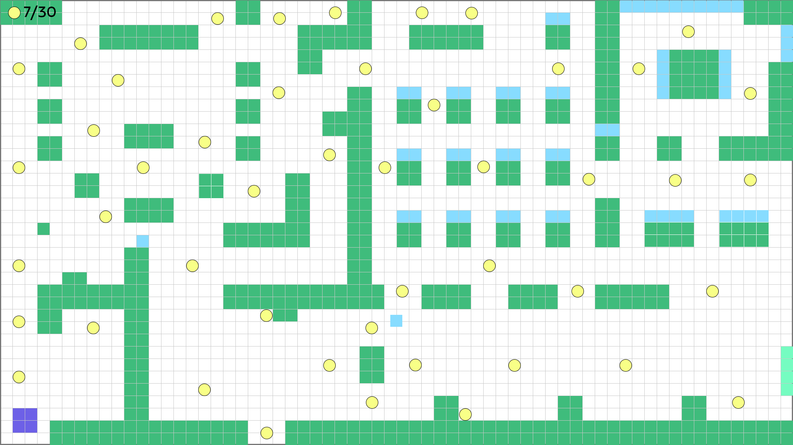
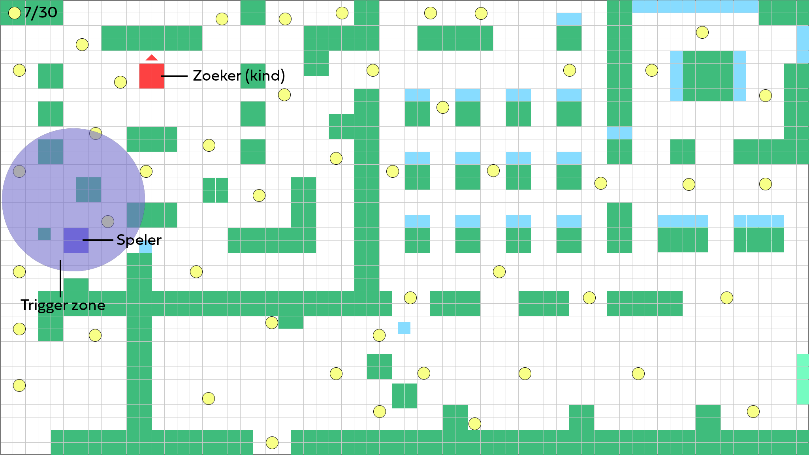

### Spelconcept

Speler verzamelt snoepjes in een kleuterklas.
Eén kind telt af en zoekt actief.
Andere kinderen lopen rond en verraden de speler wanneer zij de speler zien.

### Stap 1 – Ontwerpkeuzes 

1. Hoe communiceer ik dat de speler kan bewegen? 

De speler start links onderin het lokaal, in een rustige hoek bij de kapstokken.
Direct voor de startpositie ligt een snoepje op de looproute.

Om het lokaal in te gaan moet de speler automatisch over dit snoepje bewegen.
Daardoor gebeurt direct het volgende:

- De speler beweegt.
- Het snoepje wordt verzameld.
- De UI telt op.

Beweging en interactie worden dus niet uitgelegd, maar ervaren.

2. Hoe communiceer ik wat het doel van het level is? 
Het eerste snoepje ligt in een veilige zone zonder kinderen in de buurt.
Bij het oppakken verschijnt een korte visuele reactie, bijvoorbeeld een lichteffect of kleine animatie.

In de UI linksboven is zichtbaar: 1/30.

Daarna ziet de speler meerdere snoepjes verspreid door het lokaal liggen.
Sommige snoepjes liggen in open ruimtes, andere dichter bij kinderen of in smallere doorgangen.

Hierdoor wordt duidelijk:
- Snoepjes verzamelen is het doel.
- Positie en timing bepalen het risico.
- Niet elke route is even veilig.

Het doel wordt dus geleerd via plaatsing in het level.

3. Hoe communiceer ik wat gevaarlijk is?

Rechts in het lokaal staat één kind bij het bord. Wanneer de speler de triggerzone binnenkomt, begint dit kind hardop af te tellen. Tijdens het aftellen is het lokaal veilig.
Het aftellen markeert een overgang: er staat iets te veranderen.

Wanneer het aftellen stopt:
- Het kind draait zich om.
- Het kind begint  te zoeken.
- Open zichtlijnen worden gevaarlijk.

Staat de speler in open ruimte binnen de zichtlijn van dit kind, dan beweegt het kind direct richting de speler. Blijft de speler zichtbaar, dan mislukt het level.

De andere kinderen zoeken niet actief. Zij bewegen door het lokaal en gaan door met hun eigen activiteit.

Wanneer de speler zonder dekking in hun zicht komt, reageren zij zichtbaar.
Dat is het signaal van verraad. Het zoekende kind beweegt vervolgens naar die locatie.

De speler leert via het leveldesign:
- Tijdens het aftellen is er geen gevaar.
- Na het aftellen bepaalt zichtlijn de dreiging.
- Zicht van andere kinderen veroorzaakt verraad.
- Objecten en muren functioneren als dekking.

Alles wordt gecommuniceerd door ruimte, timing en plaatsing.

