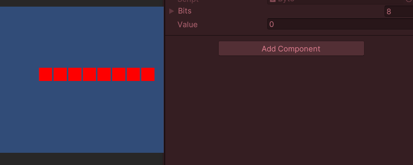

Hier is een lesplan gebaseerd op jouw originele code, zonder enige wijzigingen. De focus ligt op **begrip, analyse en experimenteren met de code in Unity**.

---

# **📚 Lesplan: Hoe werkt een byte in Unity?**
🎯 **Doelgroep:** Studenten met basiskennis van **C# en Unity**  
⏳ **Duur:** 45 - 60 minuten  
🎯 **Leerdoelen:**
- Begrijpen **wat een byte is** en hoe deze werkt in **binaire en decimale vorm**.
- **Analyseren** hoe de gegeven code een byte modelleert in Unity.
- **Experimenteren** met de code om te begrijpen hoe bits en bytes worden omgerekend.

---

## **📌 Deel 1: Introductie (10 min)**
### **Vraag aan de klas:**  
💡 *Wat is een byte? Waar worden bytes voor gebruikt?*

### **Uitleg:**  
- Een **byte** bestaat uit **8 bits**.  
- Elke **bit** kan **0** of **1** zijn.  
- Met **8 bits** kunnen waarden van **0 tot 255** worden weergegeven.  
- Computers slaan gegevens op in **binaire vorm**, omdat ze alleen met 0-en en 1-en werken.

---

## **📌 Deel 2: eindproduct Byte**
- Maak een GameObject met als naam Byte met als waarden een array van Bits een integer met als naam value

```csharp
public class Byte : MonoBehaviour
{
    [SerializeField] Bit[] bits = new Bit[8];
    [SerializeField] private int value = 0;

    void Update()
    {
        BinToDec();
    }

    private void BinToDec()
    {
        //
    }
}
```
- De Byte.bits[]-array bestaat uit 8 Bits
  - Maak een Array met als naam bits die bestaat uit 8 Bit-objecten
  - Importeer 8 Bit-objecten uit de vorige les
  - Neem voor bits[0] het meest rechter Bit, en plaats het volgende Bit links van de eerste
  - Doe dit voor alle Bit-objecten

| Plaats | 7   | 6   | 5  | 4  | 3  | 2  | 1  | 0 |
|--------|----|----|----|----|----|----|----|----|
| Value | 128 | 64 | 32 | 16 | 8 | 4 | 2  | 1 |

- Maak een functie waarbij de Array value van de Byte op nul wordt gezet 
- vervolgens van plaats 0 tot en met plaats 7 wordt gecontroleerd wat de aarde van de bits[i].state true is of niet. 
- Als de Bit true is, tel je de waarde uit de tabel bij de value van de Byte op





---

### **Vragen voor de studenten:**
1. **Wat is de rol van `bits[]` in deze code?**
2. **Wat doet de `BinToDec()` methode precies?**
3. **Waarom wordt `Update()` gebruikt om `BinToDec()` telkens aan te roepen?**
4. **Wat gebeurt er als `bits[3].state = true;` en alle andere `false` zijn?** *(Antwoord: De waarde wordt 8, omdat `bits[3]` = `2³` = 8.)*
5. **Wat is de maximale waarde die deze code kan berekenen?** *(Antwoord: 255, als alle bits op `true` staan.)*

---

## **📌 Deel 3: Code Uitvoeren en Begrijpen (15 min)**

🛠️ **Opdracht:**  
- **Open Unity en voeg de code toe in een script.**  
- **Maak een object aan met dit script en koppel het in de Inspector.**  
- **Pas handmatig enkele `Bit.state` waarden aan en bekijk wat er gebeurt met `value`.**  
- **Print de waarde in de Console (`Debug.Log(value);`).**  

🎯 **Doel:** Studenten **zien** hoe het binaire getal verandert naar een decimale waarde.

---

## **📌 Deel 4: Zelf Toepassen (20 min)**
🛠️ **Opdracht:**  
- **Experimenteer** met de code en verander **verschillende `Bit.state` waarden**.  
- **Beantwoord de volgende vragen:**
  - Wat gebeurt er als je alleen de eerste en laatste bits op `true` zet?
  - Wat gebeurt er als je alle bits **uit** zet?
  - Wat gebeurt er als je alleen `bits[4]` en `bits[6]` op `true` zet?

💡 *Tip: Gebruik de console (`Debug.Log()`) om de waarde te controleren.*

---

## **📌 Deel 5: Afronding en Bespreking (5 min)**

🎯 **Bespreek met de studenten:**
1. Maak in de map **Prefabs** een map aan met als naam Byte en plaats daar het GameObject en het script van de Byte-class in
2. Hoe werkt de conversie tussen binair en decimaal in deze code? 
3. Waarom zou je dit in games of software gebruiken?
4. Hoe zou je deze code uitbreiden naar een **16-bit of 32-bit systeem**?

✅ **Leerdoelen Behaald?**  
- ✅ Studenten begrijpen hoe een byte werkt.  
- ✅ Ze kunnen binaire en decimale waarden omzetten.  
- ✅ Ze hebben de code toegepast in Unity.  

🎯 **Met deze les hebben studenten niet alleen de theorie geleerd, maar ook een werkend Unity-project gebouwd waarin ze binaire getallen kunnen manipuleren! 🚀**