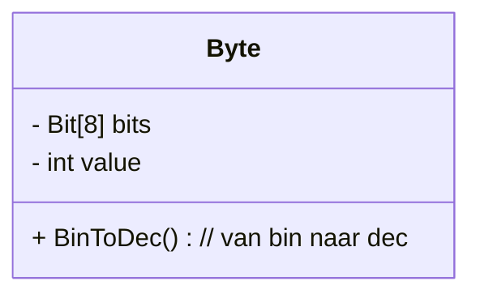
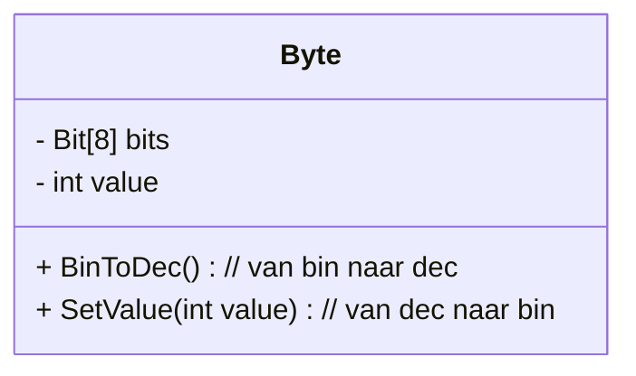
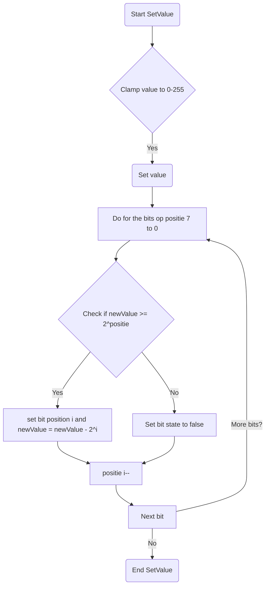

# Byte (set)
## **Uitbreiding Byte**  
**Benodigdheden:** 
Je moet voor deze opdracht hebben:
- een ```Class Bit``` met een boolean eigenschap ```code``` state
- een ```Class Byte``` met een array van 8 Bits en een eigenschap ```value```  

**Leerdoelen:**  
✅ Studenten breiden de **Byte** in Unity uit met een functie die value een waarde kan geven  
✅ Studenten leren hoe een decimaal getal kan worden geconverteerd in een binair getal. 

## Voorbereiding ##
1. Maak in Unity een nieuwe 2D scene aan met als naam ```SetByte```
2. Plaats een **Empty Gameobject** in de hierarchy met als naam ```SetByte```  
3. Maak in de map Scripts een nieuw script aan met als naam ```SetByte``` en koppel dit aan het gameObject met dezelfde naam
4.  Plaats in het gameObject setByte een instatie van de Prefab Byte

5. Gebruik vervolgens onderstaande script voor het GameObject SetByte


```csharp
using System.Collections;
using System.Collections.Generic;
using UnityEngine;

public class SetByte : MonoBehaviour
{
    [SerializeField] Byte myByte;
    [SerializeField] int myValue;

    void Update()
    {
        myByte.SetValue(myValue);     
    }
}
```

## De opdracht 
De Prefab Byte ziet er momenteel alsvolgt uit

Wij gaan de class Byte uitbreiden met een publieke funcie  ``` SetValue(int newValue) ```, zodat wij de byte een decimale waarde kunnen geven, deze waarde kunnen omrekenen naar de binaire waarde en Bits deze binaire waarde aangeven. 




De stappen die moeten worden uitgevoerd zijn volgens de flowchart



### 📌 **Uitleg van de flowchart:**
1. **Start van de methode** en initialisatie van `this.value` en `tempValue`.
2. Controle of `tempValue` groter is dan een bepaalde macht van 2 (`128, 64, 32, ..., 1`).
3. **Indien `true`**, zet de corresponderende bit op `true` en verminder `tempValue`.
4. **Indien `false`**, ga verder naar de volgende controle.
5. Herhaal dit proces voor alle 8 bits.
6. **Einde van de methode**.

🎯 **Doel:** Dit diagram helpt studenten **visueel** begrijpen hoe `SetValue(int value)` de binaire representatie instelt. Wil je nog extra verduidelijkingen of aanpassingen? 🚀

## extra verdieping (optioneel)
Maak met een eenvoudige Spawner die op willekeurige tijden de Byte een willekeurige waarde tussen de 0 en 255 geeft


Geef de Byte een geluidseffect mee, waarbij de bits worden afgegaan en er bij State==true een ander geluid klinkt ("bliep") als bij de State==false ("blap")