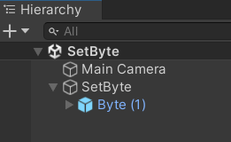
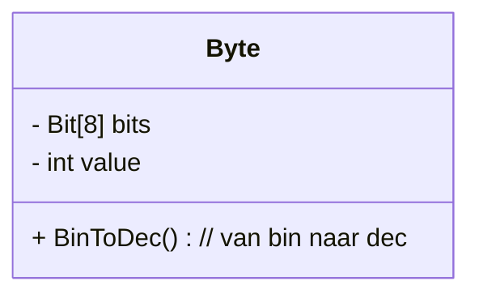
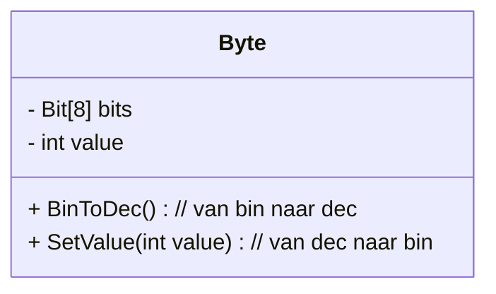

# Byte (set)
## **Uitbreiding Byte**  
**Benodigdheden:** 
Je moet voor deze opdracht hebben:
- een ```Class Bit``` met een boolean eigenschap ```state``` 
- een ```Class Byte``` met een array van 8 Bits en een eigenschap ```value```  

**Leerdoelen:**  
✅ Studenten breiden de **Byte** in Unity uit met een functie die value een waarde kan geven  
✅ Studenten leren hoe een decimaal getal kan worden geconverteerd in een binair getal. 

## Voorbereiding ##
1. Maak in Unity een nieuwe 2D scene aan met als naam ```SetByte```
2. Plaats een **Empty Gameobject** in de hierarchy met als naam ```SetByte```  
3. Maak in de map Scripts een nieuw script aan met als naam ```SetByte``` en koppel dit aan het gameObject met dezelfde naam
4.  Plaats in het gameObject setByte een instatie van de Prefab Byte

5. Gebruik vervolgens onderstaande script voor het GameObject SetByte


```csharp
using System.Collections;
using System.Collections.Generic;
using UnityEngine;

public class SetByte : MonoBehaviour
{
    [SerializeField] Byte myByte;
    [SerializeField] int myValue;

    void Update()
    {
        myByte.SetValue(myValue);     
    }

    public void SetValue(myValue){
        // hier ga je jouw script schrijven
    }
}
```

## De opdracht 
De Prefab Byte ziet er momenteel alsvolgt uit

Wij gaan de class Byte uitbreiden met een publieke funcie  ``` SetValue(int newValue) ```, zodat wij de byte een decimale waarde kunnen geven, deze waarde kunnen omrekenen naar de binaire waarde en Bits deze binaire waarde aangeven. 




## van decimaal naar binair
### **Uitleg van het script in woorden**
Het script neemt een geheel getal (**`newValue`**) tussen **0 en 255** en zet dit om in een **binaire representatie**. Dit wordt opgeslagen in een array van **booleans (`true` of `false`)**, waarbij elk element een bit voorstelt.

---

### **Stap-voor-stap werking**
1. **Beperk het getal tot 255:**
   - Als `newValue` groter is dan **255**, wordt het **op 255 gezet**. Dit voorkomt dat er grotere waarden worden gebruikt.

2. **Sla de waarde op in `this.value`:**
   - Dit betekent dat de aangepaste `newValue` behouden blijft.

3. **Bepaal de binaire waarden (bits):**
   - Het script gaat stap voor stap door **alle bits van een 8-bits getal** (128, 64, 32, 16, 8, 4, 2, 1).
   - **Voor elke bitcontrole:**
     - **Als `newValue` groter dan of gelijk is aan de bitwaarde** → zet het **corresponderende bit op `true`** en trek die waarde af van `newValue`.
     - **Anders wordt het bit op `false` gezet.**

4. **Het eindresultaat is een array `bits` waarin elk bit is opgeslagen als `true` (1) of `false` (0).**
   - Bijvoorbeeld: **`13` wordt `00001101`** → `[false, false, false, false, true, true, false, true]`.

---

### **Voorbeeldberekening**
#### **Invoer:** `newValue = 13`
| Stap | Bitwaarde | Vergelijking (`>=`) | Bit wordt | `newValue` update |
|------|----------|---------------------|-----------|-------------------|
| 1    | 128      | ❌ Nee               | `false`   | 13                |
| 2    | 64       | ❌ Nee               | `false`   | 13                |
| 3    | 32       | ❌ Nee               | `false`   | 13                |
| 4    | 16       | ❌ Nee               | `false`   | 13                |
| 5    | 8        | ✅ Ja                | `true`    | `13 - 8 = 5`      |
| 6    | 4        | ✅ Ja                | `true`    | `5 - 4 = 1`       |
| 7    | 2        | ❌ Nee               | `false`   | 1                 |
| 8    | 1        | ✅ Ja                | `true`    | `1 - 1 = 0`       |

#### **Uitvoer:** `00001101` als boolean array:
```csharp
[ false, false, false, false, true, true, false, true ]
```

---

### **Wat doet het script praktisch?**
✅ **Converteert een decimaal getal (0-255) naar binaire vorm.**  
✅ **Gebruikt een array van `true` (1) en `false` (0) om de bits op te slaan.**  
✅ **Voert handmatig de binair conversie uit, zonder `Convert.ToString(n, 2)`.**  
✅ **Zorgt ervoor dat de binaire getallen altijd 8 bits lang zijn.**  

Wil je verbeteringen of een alternatieve versie? 🚀
---
** de flowchart

Nu kunnen wij dit  algoritme omzetten in een flowchart

```mermaid
graph TD
    A[Start] --> B{Is newValue > 255?}
    B -- Ja --> C[newValue = 255]
    B -- Nee --> D[Ga verder]
    C --> D

    D --> E[Bewaar waarde in this.value]

    E --> F{Is newValue >= 128?}
    F -- Ja --> G[bits#7.state = true] --> H[newValue -= 128]
    F -- Nee --> I[bits#7.state = false]
    H --> J
    I --> J

    J{Is newValue >= 64?} 
    J -- Ja --> K[bits#6.state = true] --> L[newValue -= 64]
    J -- Nee --> M[bits#6.state = false]
    L --> N
    M --> N

    N{Is newValue >= 32?}
    N -- Ja --> O[bits#5.state = true] --> P[newValue -= 32]
    N -- Nee --> Q[bits#5.state = false]
    P --> R
    Q --> R

    R{Is newValue >= 16?}
    R -- Ja --> S[bits#4.state = true] --> T[newValue -= 16]
    R -- Nee --> U[bits#4.state = false]
    T --> V
    U --> V

    V{Is newValue >= 8?}
    V -- Ja --> W[bits#3.state = true] --> X[newValue -= 8]
    V -- Nee --> Y[bits#3.state = false]
    X --> Z
    Y --> Z

    Z{Is newValue >= 4?}
    Z -- Ja --> AA[bits#2.state = true] --> AB[newValue -= 4]
    Z -- Nee --> AC[bits#2.state = false]
    AB --> AD
    AC --> AD

    AD{Is newValue >= 2?}
    AD -- Ja --> AE[bits#1.state = true] --> AF[newValue -= 2]
    AD -- Nee --> AG[bits#1.state = false]
    AF --> AH
    AG --> AH

    AH{Is newValue >= 1?}
    AH -- Ja --> AI[bits#0.state = true] --> AJ[newValue -= 1]
    AH -- Nee --> AK[bits#0.state = false]
    AJ --> AL[Stop]
    AK --> AL
```

## het script

Nu kunnen wij de functie ontwikkelen

``` csharp
 public void SetValue(int newValue)
 {

     if (newValue > 255)
     {
         newValue = 255;
     }

     this.value = newValue;

    // voeg hier het algoritme toe

 }
```

### **Oefeningen: Zet de volgende getallen om in binair**
1. **25 → ?**
2. **54 → ?**
3. **100 → ?**
4. **200 → ?**
5. **255 → ?**

Probeer ze zelf op te lossen en controleer je antwoorden! 🚀💡


🎯 **Doel:** Dit diagram helpt studenten **visueel** begrijpen hoe `SetValue(int value)` de binaire representatie instelt. Wil je nog extra verduidelijkingen of aanpassingen? 🚀

## extra verdieping (optioneel)
Maak met een eenvoudige **spawner** die op willekeurige tijden de Byte een willekeurige waarde tussen de 0 en 255 geeft

``` csharp
if (Random.Range(0f, 1f) < 0.01f) {
    // maak een willekeurig geheel getal
    //  tussen 0 en 255 en
    //set de value van de Byte met dit getal
}
```


Andere mogelijke uitbreiding: Geef de Byte een geluidseffect mee, waarbij de bits worden afgegaan en er bij true ("bliep") als bij false ("blap")

Of bedenk zelf een uitbreiding