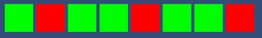

# Byte (set)
## **Uitbreiding Byte**  
**Benodigdheden:** 
Je moet voor deze opdracht hebben:
- een ```Class Bit``` met een boolean eigenschap ```state``` 
- een ```Class Byte``` met een array van 8 Bits en een eigenschap ```value```  

**Leerdoelen:**  
✅ Studenten breiden de **Byte** in Unity uit met een functie die value een waarde kan geven  
✅ Studenten leren hoe een decimaal getal kan worden geconverteerd in een binair getal. 

## Voorbereiding ##
1. Maak in Unity een nieuwe 2D scene aan met als naam ```SetByte```
2. Plaats een **Empty Gameobject** in de hierarchy met als naam ```SetByte```  
3. Maak in de map Scripts een nieuw script aan met als naam ```SetByte``` en koppel dit aan het gameObject met dezelfde naam
4.  Plaats in het gameObject setByte een instatie van de Prefab Byte

5. Gebruik vervolgens onderstaande script voor het GameObject SetByte


```csharp
using System.Collections;
using System.Collections.Generic;
using UnityEngine;

public class SetByte : MonoBehaviour
{
    [SerializeField] Byte myByte;
    [SerializeField] int myValue;

    void Update()
    {
        myByte.SetValue(myValue);     
    }
}
```

## De opdracht 
De Prefab Byte ziet er momenteel alsvolgt uit

Wij gaan de class Byte uitbreiden met een publieke funcie  ``` SetValue(int newValue) ```, zodat wij de byte een decimale waarde kunnen geven, deze waarde kunnen omrekenen naar de binaire waarde en Bits deze binaire waarde aangeven. 


## van decimaal naar binair

### **Instructie: Hoe zet je een getal (tot 255) om in een binair getal?**

Een getal omzetten naar binair betekent dat je het schrijft in een systeem met alleen de cijfers **0 en 1**. Dit doe je door het getal steeds door **2** te delen en de rest te noteren.

#### **Stap-voor-stap methode:**
1. **Schrijf het getal op.**
2. **Deel het getal door 2.** Noteer de **rest** (0 of 1). Dit wordt het **laatste** binaire cijfer.
3. **Neem de uitkomst (quotiënt) en deel opnieuw door 2.** Noteer de rest.
4. **Herhaal stap 3 totdat het quotiënt 0 is.**
5. **Lees de binaire cijfers van onder naar boven.** Dit is het binaire getal.

#### **Voorbeeld: Zet 13 om naar binair**
1. **13 ÷ 2** → **quotiënt =** 6, **rest =** 1
2. **6 ÷ 2** → **quotiënt =** 3, **rest =** 0
3. **3 ÷ 2** → **quotiënt =** 1, **rest =** 1
4. **1 ÷ 2** → **quotiënt =** 0, **rest =** 1 (stoppen hier)

**Van onder naar boven lezen:**
👉 **13 in binair is 1101**

---
** de flowchart

Nu kunnen wij dit  algoritme omzetten in een flowchart

## het script

Nu kunnen wij de functie ontwikkelen

``` csharp
 public void SetValue(int newValue)
 {

     if (newValue > 255)
     {
         newValue = 255;
     }

     this.value = newValue;

    // voeg hier het algoritme toe

 }
```

### **Oefeningen: Zet de volgende getallen om in binair**
1. **25 → ?**
2. **54 → ?**
3. **100 → ?**
4. **200 → ?**
5. **255 → ?**

Probeer ze zelf op te lossen en controleer je antwoorden! 🚀💡


🎯 **Doel:** Dit diagram helpt studenten **visueel** begrijpen hoe `SetValue(int value)` de binaire representatie instelt. Wil je nog extra verduidelijkingen of aanpassingen? 🚀

## extra verdieping (optioneel)
Maak met een eenvoudige **spawner** die op willekeurige tijden de Byte een willekeurige waarde tussen de 0 en 255 geeft

``` csharp
if (Random.Range(0f, 1f) < 0.01f) {
    // maak een willekeurig geheel getal
    //  tussen 0 en 255 en
    //set de value van de Byte met dit getal
}
```



Andere mogelijke uitbreiding: Geef de Byte een geluidseffect mee, waarbij de bits worden afgegaan en er bij true ("bliep") als bij false ("blap")

Of bedenk zelf een uitbreiding