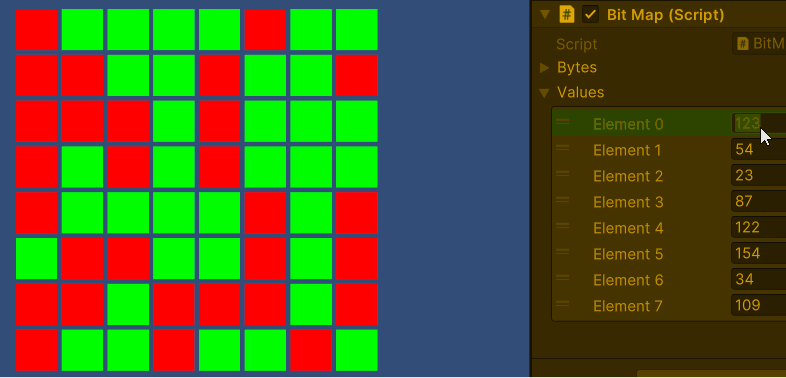

# Bitmap

## opdracht

### Scene 
- Maak een nieuwe 2D scene met als naam **TestBitmap**

### Bitmap
- Maak een nieuw GameObject en noem dit object **Bitmap**
  - Dit object bestaat uit een een Array van 8 Bytes die onder elkaar staan
- Maak een script aan met als naam **Bitmap**
  - maak een Array van 8 Bytes aan met als naam **bites**
  - Van elke Byte kan de waarde geset worden
- Maak van de Bitmap een Prefab
- Verwijder de ontwikkelde Bitmap uit de hierarchy

### testBitmap
- Maak een object **TestBitmap** 
- Maak twee variablen aan
  - ``` Bitmap bitmap``` het prefab Bitmap
  - ``` int[8] values``` een array van 8 testData  
- Sleep het Prefab **Bitmap** in het object **TestBitmap**
- Ontwerp nu dat in de scene waarin
  -  bij de start de Bitmap 8 waarden krijgt
  -  de waarden met behulp van de Unity Editor getest kunnen worden

## voorbeeld
