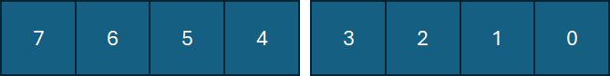
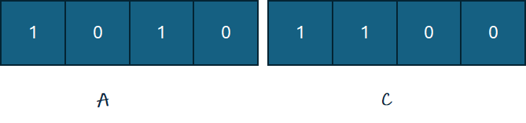
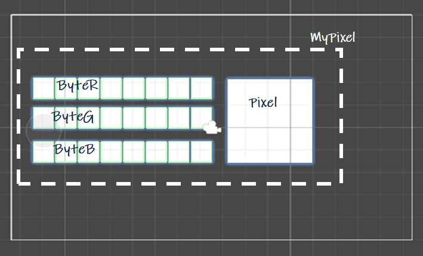
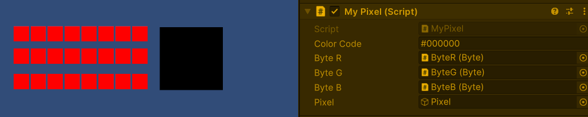

# 6 The Pixel

## werken met binaire getallen (bits)
- Het is nogal onhandig om met bits te werken, want getallen worden al snel erg lang. Daarom worden de bits meestal weergegeven in het 8-tallige (octale) of 16-tallige (hexadecimale) getallen.
- Het meeste wordt het 16-tallige stelsel gebruikt. Omdat ons tientallige stelsel maar 10 getallen kent (van 0 tot en met 9), wordt bij  de Hexadecimale getallen gebruik gemaakt van de letters van het alfabet. A=10, B=11, C=12, D=13 en E=15


### conversie decimaal - binair - hexadecimaal

| Decimal | Binary  | Hexadecimal |
|:--------:|:--------:|:------------:|
| 0         | 0000     | 0            |
| 1         | 0001     | 1            |
| 2         | 0010     | 2            |
| 3         | 0011     | 3            |
| 4         | 0100     | 4            |
| 5         | 0101     | 5            |
| 6         | 0110     | 6            |
| 7         | 0111     | 7            |
| 8         | 1000     | 8            |
| 9         | 1001     | 9            |
| 10        | 1010     | A            |
| 11        | 1011     | B            |
| 12        | 1100     | C            |
| 13        | 1101     | D            |
| 14        | 1110     | E            |
| 15        | 1111     | F            |

## de waarde van een byte in Hex 
een byte bestaat uit 8 bits. Bij hexadecimale getallen worden de bits in twee groepjes van 4 bits (een nibble) verdeeld


De rechtse nibble geeft de eenheden (zie tabel). De linkse nibbel vermenigvuldig je met 16

Bijvoorbeeld:


Om duidelijk te maken welk talstelsel wordt gebruikt, worden er bij binaire (tweetallige) getallen meestal een B gezet, bij decimale (10 tallig) getallen een D en bij Hexadecimale getallen voor het getal een **x**

Decimale waarde 

$$ 10101100_B = xCA $$

$$ xAC = A*16 + C = \\ 10 * 16 + 12 = \\ 160 + 12 = 172_d$$

## het gebruik van hexadecimale getallen
Bij developers wordt Hex gebruikt voor het aangeven van kleuren. Kleuren worden op een beeldscherm gemaakt door de basiskleuren Rood, Groen en Blauw (RGB) met elkaar te mengen. 

Er is een Byte beschikbaar voor Rood, een Byte voor Groen en een Byte voor blauw. Een byte wordt geconvereerd in 2 Hex-getallen, dus een kleur wordt uitgedrukt in een Hex-getal van 6 cijfers. Meestal wordt er voor de duidelijkheid nog een hashtag of hekje voor geplaatst. 

## de opdracht

- Maak een nieuwe 2D-scene met als naam MyPixel
- Plaats een nieuw empty GameObject in de Hierarchy en noem dit ook MyPixel
- Maak een script met ook als naam MyPixel en koppel dit aan het lege gameObject
- Plaats in het Object MyPixel drie Bytes
  - ByteR
  - ByteG
  - ByteB
- en plaats een sprite met als naam Pixel in MyPixel



Breidt de preFab Byte uit met publieke functie GetHex, die de waarde van de byte weergeeft als een Hexadecimaal getal (met altijd twee cijfers)

``` cs
    public string getHex() {
        string HexValue = value.ToString("X2");
        return HexValue;
    }
```

Voeg in het object MyPixel de drie Hexadecimale waarden van de Bytes bij elkaar tot een Hexadecimaal getal en plaats er een hashtag voor. 

Gebruik de ColorUtility van de UnityEngine om deze kleurcode aan de Pixel te geven

``` cs
        if (Pixel != null)
        {
            spriteRenderer = Pixel.GetComponent<SpriteRenderer>();
        }

        if (ByteR != null && ByteG != null && ByteB != null && Pixel != null)
        {
            colorCode = "#" + ByteR.getHex() + ByteG.getHex() + ByteB.getHex();
            
            if (UnityEngine.ColorUtility.TryParseHtmlString(colorCode, out Color newColor))
            {
                spriteRenderer.color = newColor; 
            }
            else
            {
                Debug.LogError("Ongeldige hex kleur: " + colorCode);
            }
        }
```

