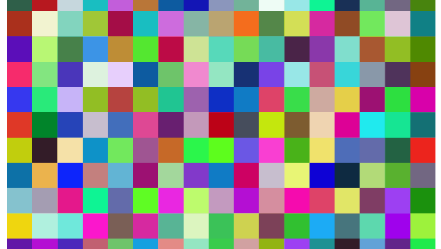
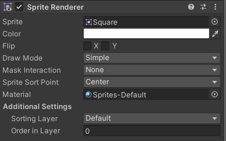

# TrueColors

## De opdracht
* Maak een prefab MyPixel, van een square sprite
* zorg dat de MyPixel een willekeurige kleur kan krijgen
* plaats de pixels in een array schermvullend op het speelveld via een 2D gridmapping
* update via een index de array dat de pixel per frame een nieuwe kleur krijgt

Het eindresultaat:




## De SpriteRenderer



De `SpriteRenderer` is een **component** in Unity die gebruikt wordt om **2D-afbeeldingen (sprites)** zichtbaar te maken in je spelwereld.

---


## 🖼️ Wat doet het?

- Het **tekent een sprite** op het scherm.
- Je kunt hiermee de **kleur, volgorde, schaal, spiegeling, en materiaal** van een sprite bepalen.
- Zonder een `SpriteRenderer` zou een sprite niet zichtbaar zijn in het spel.

---


## 🧱 Voorbeeld in de Editor

Als je een **2D GameObject** aanmaakt (zoals een "Sprite"), voegt Unity automatisch een `SpriteRenderer` toe aan dat object.

---

## 🔧 Belangrijkste eigenschappen

| Eigenschap          | Wat het doet                                           |
|---------------------|--------------------------------------------------------|
| `sprite`            | De afbeelding die getoond wordt                        |
| `color`             | De kleur of transparantie van de sprite                |
| `flipX` / `flipY`   | Spiegelt de sprite horizontaal of verticaal            |
| `sortingLayer`      | Bepaalt welke sprite boven of onder ligt               |
| `material`          | Het materiaal (shader) dat gebruikt wordt              |

---

## 💻 Voorbeeld in code

```csharp
SpriteRenderer sr = GetComponent<SpriteRenderer>();
sr.color = Color.red;
```


## 🖥️ Uitleg: kleurendiepte

In de wereld van computergraphics verwijzen deze termen naar verschillende manieren waarop kleuren op het scherm worden weergegeven, oftewel de **kleurendiepte** van een beeldscherm.

---

### 🎨 Wat is kleurendiepte?

**Kleurendiepte** bepaalt hoeveel verschillende kleuren een pixel op het scherm kan hebben. Hoe hoger de kleurendiepte, hoe realistischer en rijker de kleuren.

---

### 🟪 EGA (Enhanced Graphics Adapter)

- 📅 **Jaren '80**
- 🎨 **16 kleuren** tegelijk op het scherm
- 📦 Totaal 64 kleuren beschikbaar (waarvan 16 tegelijk)
- 🖼️ Resolutie: typisch 640×350
- 🧠 Gebruikt 4 bits per pixel (2⁴ = 16 kleuren)

> 🔹 Veel gebruikt in oude DOS-games

---

### 🟦 VGA (Video Graphics Array)

- 📅 **1987**, door IBM
- 🎨 **256 kleuren tegelijk** uit een palet van 262.144 kleuren
- 🖼️ Typische resolutie: 320×200 bij 256 kleuren
- 🧠 8 bits per pixel (2⁸ = 256 kleuren)

> 🔸 VGA betekende een enorme sprong t.o.v. EGA

---

### 🌈 High Color (ook wel "Real Color")

* 🎨 **32.768 tot 65.536 kleuren**
* 🧠 Meestal **15-bit of 16-bit** kleurendiepte
  * 5 bits voor R, 5 bits voor G, 5 bits voor B (of 5-6-5)
* ✔️ Gebruikt in oudere Windows-systemen en vroege 3D-games

### 🌟 True Color
🎨 **16.777.216 kleuren (24-bit)**

🧠 8 bits per kanaal (R, G, B):
* R: 0–255
* G: 0–255
* B: 0–255

✅ Meestgebruikte standaard tegenwoordig

📸 Geschikt voor foto's, moderne games, UI
# 🧩 Wat is een **SpriteRenderer** in Unity?

🧮 Overzicht kleurendieptes
Naam	Bits per pixel	Kleuren
EGA	4	16
VGA	8	256
High Color	15–16	~32.000–65.000
True Color	24	16.777.216

## 🎨 Tabel van kleurendieptes

| Naam         | Bits per pixel | Aantal kleuren         | Omschrijving                         |
|--------------|----------------|------------------------|--------------------------------------|
| **Monochroom** | 1              | 2                      | Zwart-wit                            |
| **CGA**        | 2              | 4                      | Eerste kleurensysteem voor PC's     |
| **EGA**        | 4              | 16                     | Uitgebreide kleuren (selectie uit 64)|
| **VGA**        | 8              | 256                    | Populair in DOS-games, 320x200 res. |
| **High Color** | 15–16          | ~32.000 – 65.536       | Betere kleurgradaties                |
| **True Color** | 24             | 16.777.216             | Standaard op moderne systemen        |
| **Deep Color** | 30–48+         | Miljarden              | Voor HDR en professionele video      |


# 🎨 Een Sprite een kleur geven via RGB in Unity (C#)

In Unity kun je een sprite een kleur geven via de `color` eigenschap van de `SpriteRenderer` component. RGB-waarden gebruik je in een `Color` object, waarbij de waarden tussen **0 en 1** liggen.

---

## 💡 Syntax

```csharp
Color kleur = new Color(r, g, b);
```
- r, g, en b zijn floats tussen 0f en 1f.
- 0f = geen kleur
- 1f = maximale intensiteit

## voorbeeld
Je moet eerst controleren of er wel een spriteRender is, daarna kan je via een script een sprite een kleur toekennen
``` csharp
using UnityEngine;

public class GeefKleurViaRGB : MonoBehaviour
{
    void Start()
    {
        SpriteRenderer sr = GetComponent<SpriteRenderer>();

        if (sr != null)
        {
            // Felgroen: RGB (0, 255, 0) → (0f, 1f, 0f)
            sr.color = new Color(0f, 1f, 0f);
        }
    }
}
```
# opdracht Pixel prefab

1. maak een nieuwe scene met als naam MyPixel
2. plaats een square sprite met naam MyPixel in de hierarchy en maak hiervan een prefab met dezelfde naam
   1. maak script met dezelfde naam en koppel dit
   2. plaats de MyPixel in de Assets/prefab-folder
3. Verwijder de MyPixel uit de hierarchy
4. plaats een Empty Gameobject in de hierarchy met als naam **TrueColor**
   1. maak een script met dezelfde naam en koppel dit aan het script
5. definieer via een [SerializeField] een MyPixel variabele met als naam myPixel en laat deze verwijzen naar de prefab MyPixel
6. instantieer deze pixel met een 2D gridmapping naar het scherm
7. plaats de instanties van MyPixel in een array met als naam **pixels**
8. laat in de game-loop de index oplopen geef de pixel een willekeurige kleur


``` csharp
public class MyPixel : MonoBehaviour
{
    SpriteRenderer spriteRenderer;
    public Color color = new Color(1f,1f,0f);

    void Start()
    {
        spriteRenderer = GetComponent<SpriteRenderer>();   
    }

    void Update()
    {
        spriteRenderer.color = color;
    }
}
```

Zeker! Hieronder vind je een duidelijke uitleg in **Markdown** over hoe je een prefab genaamd `MyPixel` kunt **instantiëren** in Unity via een script:

---

```markdown
# 🧱 Hoe instantieer je een prefab (`MyPixel`) in Unity

In Unity gebruik je `Instantiate()` om een **prefab** (zoals `MyPixel`) in je scène te plaatsen via een script.

---

## 📦 Stap 1: Zorg dat je prefab een veld is in je script

In je script definieer je een `public GameObject` voor de prefab:

```csharp
public class PixelSpawner : MonoBehaviour
{
    public MyPixel myPixel; // Sleep de prefab hierin via de Inspector

    void Start()
    {
        Instantiate(myPixel);
    }
}
```

> 🔄 Sleep in de **Inspector** de prefab `MyPixel` naar het script-veld op je GameObject.

---

## 🎯 Instantiëren op een specifieke positie

Je kunt de prefab plaatsen op een bepaalde locatie met rotatie:

```csharp
Vector3 spawnPositie = new Vector3(0, 0, 0);
Quaternion rotatie = Quaternion.identity;

Instantiate(MyPixel, spawnPositie, rotatie);
```

---

## 🧬 Instantieer en sla het object op

Als je in een array van MyPixel[] met als naam een object wil instantieren en een willekeurige kleur geven (als de prefab MyPixel een publieke eigenschap color heeft):

```csharp
MyPixel  pixels[i] = Instantiate(MyPixel, spawnPositie, rotatie);
pixels[i].color = new Color(r,g,b);
```

---

## ✅ Samenvatting

| Actie                                | Code voorbeeld                                 |
|-------------------------------------|------------------------------------------------|
| Prefab simpel instantiëren          | ```Instantiate(MyPixel);```                        |
| Instantiëren met positie en rotatie | ```Instantiate(MyPixel, positie, rotatie);```      |
| Referentie bewaren                  | ```MyPixel  array[i] = Instantiate(MyPixel);```         |

---

> 📝 Zorg dat je prefab in je **Resources** of in de **Scene/Project** staat en correct is toegekend in de **Inspector**.


## 📚 Wat is 2D Grid Mapping?

Stel je voor dat je een **tafel met hokjes** hebt, zoals een schaakbord. Elk vakje heeft een **rij** en een **kolom**.

Maar soms, in de computer, slaan we die hokjes op in één lange lijst — alsof je alle vakjes één voor één achter elkaar zet in een rij.

**2D grid mapping** is het idee dat je kunt **omrekenen** tussen:
- een **plek in de lijst** (zoals "nummer 17"), en
- een **plek op het bord** (zoals "rij 2, kolom 1").

---

## 🟦 Voorbeeld

Stel: je hebt een raster van **5 kolommen** (breedte = 5), en je vult het zo:

Index: 0 1 2 3 4 5 6 7 8 9 10 11 12 13 14


- Index **7** zit dan in:
  - **rij**: `7 / 5 = 1`
  - **kolom**: `7 % 5 = 2`

Dus index 7 zit op **rij 1, kolom 2**.

---

## 🔢 Formules (simpel gezegd)

**Van lijst naar rooster (1D → 2D):**
```csharp
rij = index / aantalKolommen
kolom = index % aantalKolommen
```
**Van rooster naar lijst (2D → 1D):**
```csharp
index = rij * aantalKolommen + kolom
```


