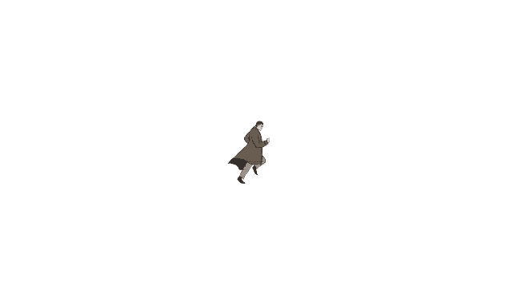
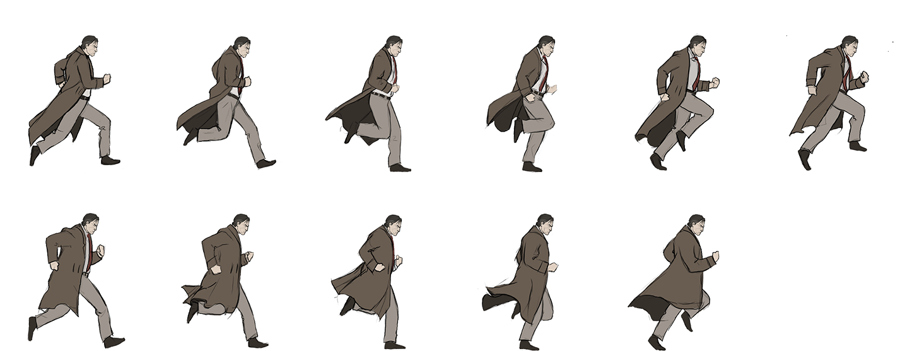

# De spritesheet

## opdracht

Maak in Unity van onderstaande spritesheet animatie van een rennende man

---

---

# 🎮 Unity Tutorial: Animatie maken van een Spritesheet

In deze tutorial leer je stap voor stap hoe je in Unity een **2D animatie maakt van een spritesheet**. We gebruiken de ingebouwde animator en sprite slicing functionaliteit van Unity.

---

## 📁 Stap 1: Importeer je spritesheet

1. Open je Unity-project.
2. Maak een nieuwe 2d Scene aan en noem deze Runningman
3. Maak in de 'Assets'-folder een nieuwe submap aan met als naam 'Animations'
4. Bewaar onderstaande spritesheet in de `Assets/Animations` folder.

1. Selecteer de spritesheet in je project en pas de volgende instellingen aan in het **Inspector** venster:

   - **Texture Type**: Sprite (2D and UI)
   - **Sprite Mode**: Multiple
   - **Pixels Per Unit**: afhankelijk van je sprite (meestal 100)
   - Klik op **Sprite Editor** om te slicen

---

## ✂️ Stap 2: Slice de spritesheet

1. Klik in de Sprite Editor op het pijltje naast **Slice**.
2. Kies **Type**: Grid By Cell Size (6 columns, 2 rows)
3. Klik op **Slice** en dan op **Apply**

Nu zijn de individuele frames los beschikbaar in je Project view.

---

## 🎬 Stap 3: Maak een animatie

1. Selecteer alle losse sprite-frames die je wilt gebruiken (Shift + klik).
2. Sleep deze naar de Scene of het Hierarchy venster.
3. Unity vraagt je nu om een nieuwe **Animation Clip** op te slaan, bijvoorbeeld: `Run.anim`.
4. Er wordt automatisch een Animator aangemaakt.

---

## ⚙️ Stap 4: Animatie en Animator controleren

1. Open het **Animator** venster (Window > Animator).
2. Je ziet dat je animatie automatisch als state is toegevoegd.
3. Open het **Animation** venster (Window > Animation > Animation).
4. Je kunt hier de framerate, volgorde en timing aanpassen.

---

## 🧪 Stap 5: Test je animatie

1. Druk op **Play** om je animatie te testen.
2. Je sprite zou nu in een loop moeten bewegen volgens de frames.

---

## ✅ Klaar!

Je hebt nu een werkende animatie gemaakt in Unity op basis van een spritesheet. 🎉

---
