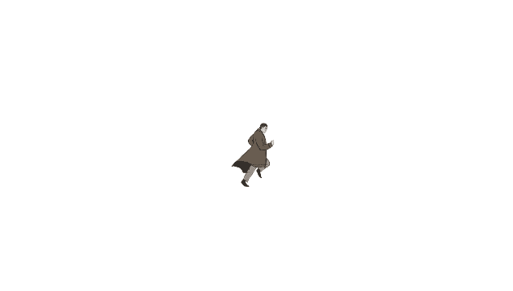
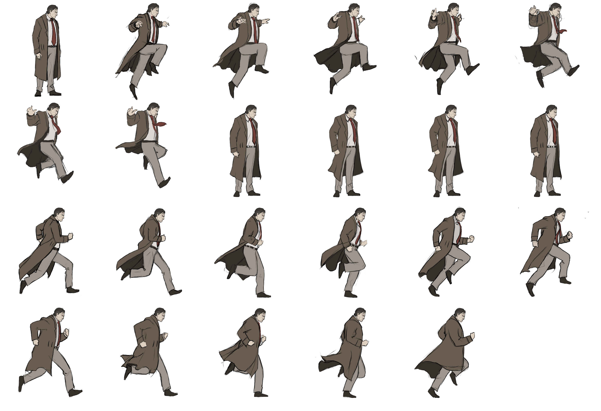
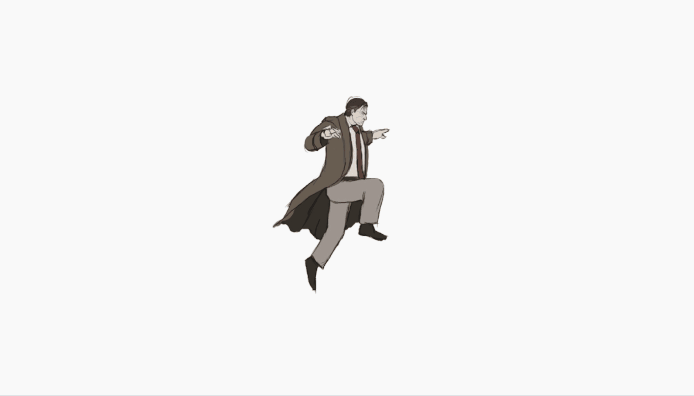
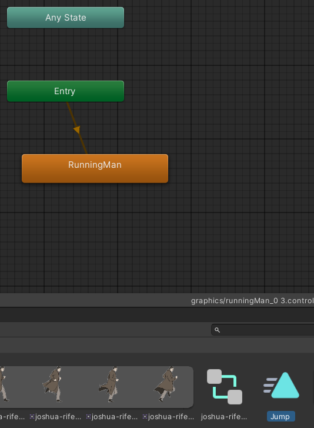
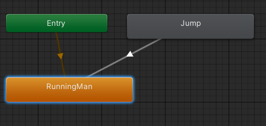
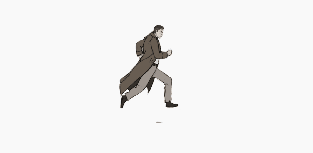
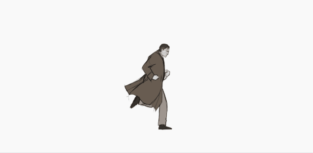
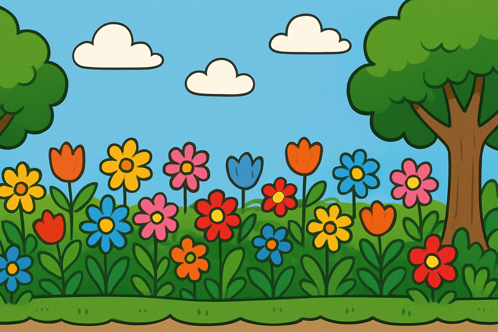
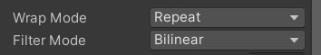

# Basic Runner 

## de opdracht
Maak een endless runner


⭐ maak een nieuwe 2D Scene met als naam **endless runner** 

Als het goed is, staat er nog een animatie van een rennende Joshua bij jouw animaties. Die gaan we gebruiken



In de Spritesheet van Joshua rife Redemption staat naast de animatie van de rennende Joshua ook een springende Joshua




⭐ save de spritesheet in de map Graphics en maak een animatie van de sprong (de eerste 8 plaatjes) En bewaar deze onder de naam **Jump**



Als het goed is, heb je nog een **Animator** waarin de rennende man staat



Daar sleep je de Jump-animatie in

Maak vervolgens een transitie naar de Running man



Nu heb je de volgende stappen
1. als de animatie begint, begint de animatie van RunningMan
2. Als de Jump-animatie wordt afgespeelt, wordt daarna automatisch weer de RunningMan afgegespeeld

Nu hoeven we enkel nog maar de Animatie van de Jump af te spelen. Daarvoor moeten wij in de programmacode een variabele voor de ** Animator** maken.

```csharp
public class RunningMan : MonoBehaviour
{
    Animator animator;

    void Start()
    {
        animator = GetComponent<Animator>();

    }

    void Update()
    {
        if(Input.GetKeyDown(KeyCode.Space))
        {
            print("jump");
            animator.Play("Jump");
        }
        
    }
}
```



## toevoegen snelheid en versnelling
``` csharp
public class RunningMan : MonoBehaviour
{

    Animator animator;

    Vector3 acceleration = Vector3.zero;
    Vector3 velocity = Vector3.zero;
    float h0;

    void Start()
    {
        animator = GetComponent<Animator>();
        h0 = transform.position.y;
    }

    void Update()
    {
        if(Input.GetKeyDown(KeyCode.Space))
        {
            print("jump");
            animator.Play("Jump");
            acceleration = new Vector3(0, -36, 0);
            velocity = new Vector3(0, 10, 0);
        }

        velocity += acceleration * Time.deltaTime;
        transform.position += velocity * Time.deltaTime;

        if(transform.position.y < h0)
        {
            acceleration = Vector3.zero;
            velocity = Vector3.zero;
            transform.position = new Vector3(transform.position.x, h0, 0);
        }

        
    }
}
```




## de achtergrond

Imprteer de achtergrond of maak zelf een achtergrond waarvan de linkerkant van de afbeelding aansluit op de rechterkant van de afbeelding



Zet bij de Sprite de Wrapmode op **Repeat**



## het script
```csharp
public class Background : MonoBehaviour
{
    [SerializeField] SpriteRenderer bgr;
    [SerializeField] float speed = 0.5f; 

    void Update()
    {
        bgr.material.mainTextureOffset += new Vector2(speed * Time.deltaTime, 0);
    }
}

```
## Eindproduct
