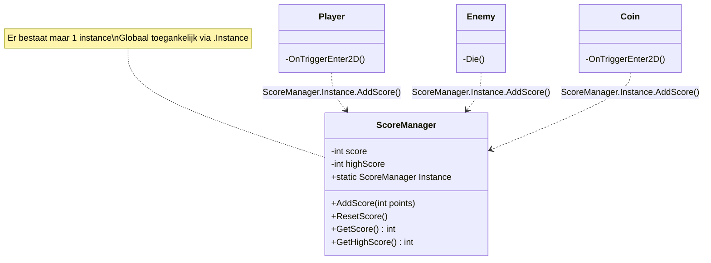
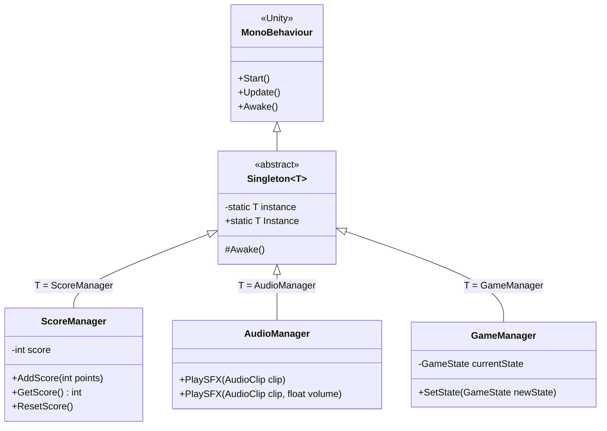

# M4 GDV Les 1 — Design Patterns: Singleton

## Leerdoel

Na deze les kun je:

- Uitleggen wat een design pattern is en waarom je ze gebruikt
- Het Singleton pattern toepassen in Unity
- Een robuuste Singleton bouwen met `DontDestroyOnLoad`
- Een generieke Singleton baseclass maken en hergebruiken
- Veelgemaakte fouten bij Singletons herkennen en vermijden

---

## Wat zijn Design Patterns?

Een **design pattern** is een beproefde oplossing voor een veelvoorkomend probleem in softwareontwikkeling. Het is geen kant-en-klare code, maar een **blauwdruk** die je kunt aanpassen aan je eigen situatie.

### Waarom Design Patterns?

| Zonder patterns                           | Met patterns                                 |
| ----------------------------------------- | -------------------------------------------- |
| Elke ontwikkelaar bedenkt eigen oplossing | Gestandaardiseerde, herkenbare structuur     |
| Moeilijk te begrijpen voor anderen        | Andere ontwikkelaars snappen de opzet direct |
| Vaak zelfde fouten opnieuw maken          | Bewezen oplossingen die fouten voorkomen     |
| Code groeit chaotisch mee                 | Schaalbare architectuur vanaf het begin      |

> **Analogie:** Design patterns zijn als recepten in de keuken. Je hoeft het wiel niet opnieuw uit te vinden — er is al een bewezen aanpak.

---

## Wat is een Instance?

Een **class** is een blauwdruk. Een **instance** is een concreet object gemaakt op basis van die blauwdruk.

> **Analogie:** Een class is een **koekjesvorm**, een instance is een **koekje**. Met één vorm maak je meerdere koekjes — elk koekje is een aparte instance.

```csharp
public class Enemy : MonoBehaviour
{
    public int health = 100;  // Elke instance heeft eigen waarden
}
// Vijand A: health = 100
// Vijand B: health = 50  ← onafhankelijk van A
```

**Instantiëren** = een nieuwe instance aanmaken. In Unity via de Editor (GameObject in scene plaatsen) of via code:

```csharp
GameObject vijand = Instantiate(enemyPrefab, positie, Quaternion.identity);
// Elke aanroep maakt een nieuwe, onafhankelijke instance
```

Het **Singleton pattern** beperkt dit tot **precies één instance** — meer daarover hieronder.

---

## Het Singleton Pattern

### Het probleem

In veel games heb je **managers** die er maar **één** mogen zijn:

- `GameManager` — beheert de game state
- `AudioManager` — speelt geluiden af
- `ScoreManager` — houdt de score bij
- `UIManager` — beheert alle UI-elementen

Wat gebeurt er als je per ongeluk **twee** ScoreManagers hebt? Scores worden dubbel geteld, of de ene overschrijft de andere. Chaos!

### De oplossing: Singleton

Het Singleton pattern garandeert dat:

1. Er **exact één instance** van een class bestaat
2. Die instance **globaal toegankelijk** is vanuit elk script



---

## Singleton stap voor stap

### Stap 1: Basis Singleton

```csharp
//Komt deze jullie nog bekend voor?
public class ScoreManager : MonoBehaviour
{
    // 1. Statische referentie naar de enige instance
    public static ScoreManager Instance;

    private int score = 0;

    void Awake()
    {
        // 2. Wijs deze instance toe
        Instance = this;
    }

    public void AddScore(int points)
    {
        score += points;
        Debug.Log("Score: " + score);
    }

    public int GetScore()
    {
        return score;
    }
}
```

**Aanroepen vanuit een ander script:**

```csharp
public class Coin : MonoBehaviour
{
    void OnTriggerEnter2D(Collider2D other)
    {
        if (other.CompareTag("Player"))
        {
            // Geen GetComponent nodig! Direct aanroepen:
            ScoreManager.Instance.AddScore(10);
            Destroy(gameObject);
        }
    }
}
```

### Stap 2: Duplicaat-beveiliging

De basis-versie heeft een probleem: als er per ongeluk twee ScoreManagers in de scene staan, overschrijft de tweede de eerste. Voeg daarom een **check** toe:

```csharp
void Awake()
{
    if (Instance == null)
    {
        Instance = this;
    }
    else
    {
        Debug.LogWarning("Dubbele ScoreManager gevonden! Wordt verwijderd.");
        Destroy(gameObject);
        return;
    }
}
```

### Stap 3: Persistent Singleton (DontDestroyOnLoad)

Als je een nieuwe scene laadt, worden alle GameObjects vernietigd — inclusief je Singleton. Met `DontDestroyOnLoad` blijft het object bestaan:

```csharp
public class ScoreManager : MonoBehaviour
{
    public static ScoreManager Instance;

    private int score = 0;
    private int highScore = 0;

    void Awake()
    {
        if (Instance == null)
        {
            Instance = this;
            DontDestroyOnLoad(gameObject);  // Blijft bestaan tussen scenes
        }
        else
        {
            Destroy(gameObject);  // Duplicaat? Weg ermee!
            return;
        }
    }

    public void AddScore(int points)
    {
        score += points;
        if (score > highScore) highScore = score;
    }

    public void ResetScore()
    {
        score = 0;
    }

    public int GetScore() => score;
    public int GetHighScore() => highScore;
}
```

---

## Generieke Singleton Baseclass

Als je meerdere managers hebt (ScoreManager, AudioManager, GameManager), wil je niet steeds dezelfde Awake-code kopiëren. Maak een **generieke baseclass** voor hergebruik:

```csharp
using UnityEngine;

public class Singleton<T> : MonoBehaviour where T : MonoBehaviour
{
    private static T instance;

    public static T Instance
    {
        get
        {
            if (instance == null)
            {
                instance = FindObjectOfType<T>();

                if (instance == null)
                {
                    Debug.LogError(typeof(T).Name + " niet gevonden in scene!");
                }
            }
            return instance;
        }
    }

    protected virtual void Awake()
    {
        if (instance == null)
        {
            instance = this as T;
            DontDestroyOnLoad(gameObject);
        }
        else if (instance != this)
        {
            Destroy(gameObject);
        }
    }
}
```

**Gebruik:**

```csharp
// ScoreManager erft van Singleton<ScoreManager>
public class ScoreManager : Singleton<ScoreManager>
{
    private int score = 0;

    // Geen Awake nodig! Die zit al in de baseclass.

    public void AddScore(int points)
    {
        score += points;
    }

    public int GetScore() => score;
}

// AudioManager erft van Singleton<AudioManager>
public class AudioManager : Singleton<AudioManager>
{
    public void PlaySFX(AudioClip clip)
    {
        GetComponent<AudioSource>().PlayOneShot(clip);
    }
}
```

Nu heb je met **één regel** (`Singleton<T>`) een volledig werkende Singleton.

### UML: Generieke Singleton hiërarchie

Onderstaand diagram toont hoe de generieke baseclass zich verhoudt tot de concrete managers:



> Elke manager erft de Singleton-logica (duplicaat-check, `DontDestroyOnLoad`) automatisch van de baseclass. Geen dubbele code!

---

## Wanneer WEL en NIET gebruiken

### ✅ Goed gebruik

| Manager        | Reden                                |
| -------------- | ------------------------------------ |
| `GameManager`  | Eén centraal punt voor game state    |
| `AudioManager` | Eén audio-systeem voor het hele spel |
| `ScoreManager` | Score moet overal toegankelijk zijn  |
| `InputManager` | Centraal punt voor input-afhandeling |

### ❌ Slecht gebruik

| Voorbeeld              | Waarom niet?                                     |
| ---------------------- | ------------------------------------------------ |
| `Enemy` als Singleton  | Er zijn meerdere vijanden!                       |
| `Bullet` als Singleton | Er zijn meerdere kogels!                         |
| `Alles` als Singleton  | Maakt code onoverzichtelijk en moeilijk testbaar |

> **Vuistregel:** Gebruik een Singleton alleen als er logisch gezien **maar één** van mag bestaan.

---

## Veelgemaakte fouten

### Fout 1: Volgorde van Awake()

```csharp
// ❌ FOUT: Ander script probeert Instance te gebruiken vóór Awake
public class Player : MonoBehaviour
{
    // Dit kan null zijn als Player.Awake() vóór ScoreManager.Awake() draait!
    void Start()
    {
        ScoreManager.Instance.AddScore(0); // Kan NullReferenceException geven
    }
}
```

**Oplossing:** Gebruik `Start()` in plaats van `Awake()` voor het aanroepen van andere Singletons, of gebruik de property met `FindObjectOfType` fallback (zoals in de generieke versie).

### Fout 2: Singleton zonder null-check

```csharp
// ❌ Geen check op duplicaten
void Awake()
{
    Instance = this; // Overschrijft zonder waarschuwing!
}
```

### Fout 3: Te veel Singletons

Als je 10+ Singletons hebt, is je architectuur waarschijnlijk niet goed. Overweeg dan het **Observer pattern** (Les 4) of **ScriptableObjects**.

---

## Oefeningen

### Oefening 1: AudioManager Singleton

Maak een `AudioManager` die geluidseffecten afspeelt vanuit elk script.

**Stappen:**

1. Maak een nieuw script `AudioManager.cs`
2. Maak er een Singleton van (met duplicaat-beveiliging en `DontDestroyOnLoad`)
3. Voeg een `AudioSource` component toe
4. Maak een publieke methode `PlaySFX(AudioClip clip)` die `PlayOneShot()` gebruikt
5. Maak een methode `PlaySFX(AudioClip clip, float volume)` met instelbaar volume
6. Roep `AudioManager.Instance.PlaySFX(clip)` aan vanuit een ander script (bijv. bij het oppakken van een coin)

**Verwacht resultaat:**

- AudioManager blijft bestaan tussen scenes
- Geluid speelt af wanneer een coin wordt opgepakt
- Duplicaten worden automatisch verwijderd

---

### Oefening 2: GameManager met States

Maak een `GameManager` Singleton die de game state beheert.

**Stappen:**

1. Maak een `GameManager.cs` met een `enum GameState { Menu, Playing, Paused, GameOver }`
2. Maak er een Singleton van
3. Maak een `SetState(GameState newState)` methode die:
   - De huidige state opslaat
   - Een `Debug.Log` toont met de nieuwe state
   - `Time.timeScale` op `0` zet bij Paused en GameOver, en op `1` bij Playing
4. Voeg in `Update()` toe: ESC drukt → toggle tussen Playing en Paused
5. Test door in de Console te kijken of de state-wisselingen kloppen

**Verwacht resultaat:**

- ESC pauzeert en hervat het spel
- `Time.timeScale` wordt correct aangepast
- `GameManager.Instance.SetState()` is overal aanroepbaar

---

### Oefening 3: Generieke Singleton Baseclass ⭐

Maak de generieke `Singleton<T>` baseclass en gebruik deze voor meerdere managers.

**Stappen:**

1. Maak `Singleton.cs` met de generieke baseclass (zie theorie)
2. Maak `ScoreManager : Singleton<ScoreManager>` met `AddScore()`, `GetScore()`, `ResetScore()`
3. Maak `AudioManager : Singleton<AudioManager>` met `PlaySFX()`
4. Maak `GameManager : Singleton<GameManager>` met `SetState()`
5. Test dat alle drie correct werken als Singleton
6. Test dat duplicaten automatisch worden verwijderd

**Verwacht resultaat:**

- Drie managers die elk van dezelfde baseclass erven
- Alle drie bereikbaar via `.Instance`
- Geen dubbele code in de Awake-methodes

---

## Samenvatting

| Concept             | Uitleg                                                       |
| ------------------- | ------------------------------------------------------------ |
| Design Pattern      | Bewezen oplossing voor veelvoorkomend probleem               |
| Singleton           | Garandeert één instance, globaal toegankelijk                |
| `static Instance`   | Statische referentie naar de enige instance                  |
| `DontDestroyOnLoad` | Object overleeft scene-wisselingen                           |
| Generieke Singleton | `Singleton<T>` baseclass voor hergebruik                     |
| Wanneer gebruiken   | Alleen voor objecten waarvan er logisch maar één mag bestaan |

---

## FAQ

**Q: Wat is het verschil met een `static class`?**
A: Een `static class` kan geen `MonoBehaviour` zijn, dus geen `Update()`, `Start()` of Unity-componenten. Een Singleton is een gewoon GameObject dat zich gedraagt als een static class.

**Q: Kan ik een Singleton ook zonder `DontDestroyOnLoad` maken?**
A: Ja, als je de manager niet nodig hebt tussen scenes. Laat dan `DontDestroyOnLoad` weg.

**Q: Wat als ik de Singleton wil resetten bij een nieuwe game?**
A: Maak een `Reset()` methode die alle waarden terugzet, in plaats van het object te vernietigen.
