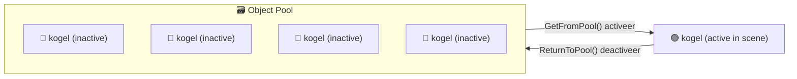

# M4 GDV Les 2 — Design Patterns: Object Pooling

## Leerdoel

Na deze les kun je:

- Uitleggen waarom `Instantiate()` en `Destroy()` duur zijn voor performance
- Het Object Pooling pattern toepassen in Unity
- Een herbruikbare Object Pool bouwen
- Pool-objecten activeren, deactiveren en resetten
- Object Pooling inzetten voor kogels, vijanden, particles en andere herhalende objecten

---

## Het probleem: Instantiate & Destroy

In M1–M3 heb je geleerd om objecten te spawnen met `Instantiate()` en te verwijderen met `Destroy()`:

```csharp
// Elke keer als de speler schiet:
GameObject bullet = Instantiate(bulletPrefab, firePoint.position, firePoint.rotation);
Destroy(bullet, 3f); // Na 3 seconden opruimen
```

**Wat is hier mis mee?**

Bij een game met veel kogels, vijanden of particles (denk aan een bullet hell of tower defense) creëer en vernietig je **honderden objecten per seconde**. Elk `Instantiate()` en `Destroy()`:

- **Alloceert geheugen** (nieuw object aanmaken)
- **Triggert de Garbage Collector** (oud object opruimen)
- **Veroorzaakt hierdoor frame drops** (stuttering)

```
Zonder pooling:
🔫 Schiet → [Instantiate] → 💨 leeft 3 sec → [Destroy] → 🗑️ Garbage Collector
🔫 Schiet → [Instantiate] → 💨 leeft 3 sec → [Destroy] → 🗑️ Garbage Collector
🔫 Schiet → [Instantiate] → 💨 leeft 3 sec → [Destroy] → 🗑️ Garbage Collector
... ×100 per seconde = 😵 STUTTER!
```

---

## De oplossing: Object Pooling

In plaats van objecten te maken en te vernietigen, maak je ze **één keer aan** bij het starten van het spel en **hergebruik** je ze:

```
Met pooling:
Start: Maak 20 kogels aan → [deactiveer ze allemaal]

🔫 Schiet → [activeer kogel uit pool] → 💨 leeft 3 sec → [deactiveer, terug in pool]
🔫 Schiet → [activeer kogel uit pool] → 💨 leeft 3 sec → [deactiveer, terug in pool]
... ×100 per seconde = 😎 SMOOTH!
```

> **Analogie:** Object Pooling is als een **uitleenbibliotheek**. Boeken worden niet elke keer gedrukt en verbrand — ze worden uitgeleend, teruggebracht en opnieuw uitgeleend.

### Hoe het werkt



1. **Bij Start:** Maak een voorraad objecten aan, allemaal **inactive**
2. **Nodig?** Pak een inactief object, zet het **active**, positioneer het
3. **Klaar?** Zet het object **inactive**, het gaat terug in de pool
4. **Pool leeg?** Optioneel: maak er een paar extra aan

---

## Object Pool stap voor stap

### Stap 1: Simpele Pool

```csharp
using System.Collections.Generic;
using UnityEngine;

public class BulletPool : MonoBehaviour
{
    [SerializeField] private GameObject bulletPrefab;
    [SerializeField] private int poolSize = 20;

    private List<GameObject> pool = new List<GameObject>();

    void Start()
    {
        // Maak alle kogels aan bij start
        for (int i = 0; i < poolSize; i++)
        {
            GameObject bullet = Instantiate(bulletPrefab, transform);
            bullet.SetActive(false);  // Start als inactive
            pool.Add(bullet);
        }
    }

    // Haal een kogel uit de pool
    public GameObject GetBullet()
    {
        foreach (GameObject bullet in pool)
        {
            if (!bullet.activeInHierarchy)  // Zoek een inactive kogel
            {
                bullet.SetActive(true);
                return bullet;
            }
        }

        Debug.LogWarning("Pool is leeg! Overweeg een grotere pool.");
        return null;
    }

    // Breng een kogel terug naar de pool
    public void ReturnBullet(GameObject bullet)
    {
        bullet.SetActive(false);
    }
}
```

### Stap 2: Kogels gebruiken

**Schieten (i.p.v. Instantiate):**

```csharp
public class PlayerShoot : MonoBehaviour
{
    [SerializeField] private BulletPool bulletPool;
    [SerializeField] private Transform firePoint;
    [SerializeField] private float bulletSpeed = 10f;

    void Update()
    {
        if (Input.GetKeyDown(KeyCode.Space))
        {
            Shoot();
        }
    }

    void Shoot()
    {
        // Haal kogel uit de pool (i.p.v. Instantiate!)
        GameObject bullet = bulletPool.GetBullet();

        if (bullet != null)
        {
            bullet.transform.position = firePoint.position;
            bullet.transform.rotation = firePoint.rotation;

            Rigidbody2D rb = bullet.GetComponent<Rigidbody2D>();
            rb.linearVelocity = Vector2.zero; // Reset velocity
            rb.AddForce(firePoint.up * bulletSpeed, ForceMode2D.Impulse);
        }
    }
}
```

**Kogel terugbrengen (i.p.v. Destroy):**

```csharp
public class Bullet : MonoBehaviour
{
    [SerializeField] private float lifetime = 3f;

    private float timer;

    void OnEnable()
    {
        // Reset timer elke keer dat kogel geactiveerd wordt
        timer = lifetime;
    }

    void Update()
    {
        timer -= Time.deltaTime;
        if (timer <= 0f)
        {
            // Terug naar pool (i.p.v. Destroy!)
            gameObject.SetActive(false);
        }
    }

    void OnTriggerEnter2D(Collider2D other)
    {
        if (other.CompareTag("Enemy"))
        {
            // Doe schade, dan terug naar pool
            gameObject.SetActive(false);
        }
    }
}
```

### Stap 3: Pool met automatisch groeien

Soms weet je niet precies hoeveel objecten je nodig hebt. Een pool die **automatisch groeit** lost dit op:

```csharp
public class ObjectPool : MonoBehaviour
{
    [SerializeField] private GameObject prefab;
    [SerializeField] private int startSize = 20;

    private List<GameObject> pool = new List<GameObject>();

    void Start()
    {
        for (int i = 0; i < startSize; i++)
        {
            CreateNewObject();
        }
    }

    private GameObject CreateNewObject()
    {
        GameObject obj = Instantiate(prefab, transform);
        obj.SetActive(false);
        pool.Add(obj);
        return obj;
    }

    public GameObject Get()
    {
        // Zoek een inactief object
        foreach (GameObject obj in pool)
        {
            if (!obj.activeInHierarchy)
            {
                obj.SetActive(true);
                return obj;
            }
        }

        // Pool is leeg? Maak een nieuw object aan
        Debug.Log("Pool uitgebreid! Nieuwe grootte: " + (pool.Count + 1));
        GameObject newObj = CreateNewObject();
        newObj.SetActive(true);
        return newObj;
    }

    public void Return(GameObject obj)
    {
        obj.SetActive(false);
    }
}
```

---

## Objecten correct resetten

Een veelgemaakte fout: je haalt een kogel uit de pool, maar die heeft nog de **snelheid en positie** van de vorige keer. Je moet objecten **resetten** bij hergebruik.

### Met een Reset-methode

```csharp
public class Bullet : MonoBehaviour
{
    private Rigidbody2D rb;
    private float timer;

    [SerializeField] private float lifetime = 3f;

    void Awake()
    {
        rb = GetComponent<Rigidbody2D>();
    }

    // OnEnable wordt aangeroepen wanneer SetActive(true) wordt gecallt
    void OnEnable()
    {
        // Reset alle waardes
        timer = lifetime;
        rb.linearVelocity = Vector2.zero;
        rb.angularVelocity = 0f;
    }

    void Update()
    {
        timer -= Time.deltaTime;
        if (timer <= 0f)
        {
            gameObject.SetActive(false);
        }
    }
}
```

> **Tip:** `OnEnable()` wordt automatisch aangeroepen wanneer `SetActive(true)` wordt gecallt. Gebruik dit als je "reset-moment"!

---

## Generieke Object Pool (Gevorderd)

Net als bij het Singleton pattern kun je een **herbruikbare** pool maken:

```csharp
using System.Collections.Generic;
using UnityEngine;

public class GenericPool : Singleton<GenericPool>
{
    private Dictionary<string, List<GameObject>> pools = new Dictionary<string, List<GameObject>>();

    // Maak een pool aan voor een specifiek prefab
    public void CreatePool(string poolName, GameObject prefab, int size)
    {
        if (pools.ContainsKey(poolName)) return;

        List<GameObject> newPool = new List<GameObject>();
        for (int i = 0; i < size; i++)
        {
            GameObject obj = Instantiate(prefab, transform);
            obj.SetActive(false);
            newPool.Add(obj);
        }
        pools.Add(poolName, newPool);
    }

    // Haal object uit een specifieke pool
    public GameObject Get(string poolName)
    {
        if (!pools.ContainsKey(poolName))
        {
            Debug.LogError("Pool '" + poolName + "' bestaat niet!");
            return null;
        }

        foreach (GameObject obj in pools[poolName])
        {
            if (!obj.activeInHierarchy)
            {
                obj.SetActive(true);
                return obj;
            }
        }

        Debug.LogWarning("Pool '" + poolName + "' is leeg!");
        return null;
    }

    // Breng object terug
    public void Return(GameObject obj)
    {
        obj.SetActive(false);
    }
}
```

**Gebruik:**

```csharp
void Start()
{
    GenericPool.Instance.CreatePool("Bullets", bulletPrefab, 30);
    GenericPool.Instance.CreatePool("Enemies", enemyPrefab, 10);
    GenericPool.Instance.CreatePool("Coins", coinPrefab, 50);
}

void Shoot()
{
    GameObject bullet = GenericPool.Instance.Get("Bullets");
    if (bullet != null)
    {
        bullet.transform.position = firePoint.position;
    }
}
```

---

## Wanneer Object Pooling gebruiken?

### ✅ Wel gebruiken

| Situatie                          | Voorbeeld                |
| --------------------------------- | ------------------------ |
| **Veel dezelfde objecten**        | Kogels, vijanden, munten |
| **Spawn & destroy in korte tijd** | Particles, projectielen  |
| **Performance-gevoelig**          | Mobiele games, VR        |
| **Voorspelbare hoeveelheden**     | Wave-based spawning      |

### ❌ Niet gebruiken

| Situatie                                | Waarom niet?                                |
| --------------------------------------- | ------------------------------------------- |
| **Objecten die het hele level bestaan** | Worden nooit hergebruikt                    |
| **Eenmalig gespawnde dingen**           | Overhead van pool is groter dan Instantiate |
| **Hele kleine aantallen**               | 2-3 objecten pooling is overkill            |

---

## Oefeningen

### Oefening 1: Bullet Pool

Maak een werkend schiet-systeem met Object Pooling.

**Stappen:**

1. Maak een `Bullet` prefab met een `SpriteRenderer`, `Rigidbody2D` en `CircleCollider2D`
2. Maak `BulletPool.cs` met een pool van 20 kogels
3. Maak `PlayerShoot.cs` die bij spatiebalk een kogel uit de pool haalt
4. De kogel beweegt vooruit en gaat na 3 seconden terug in de pool
5. Zorg dat de kogel correct gereset wordt (`OnEnable`)

**Test:**

- Schiet minstens 30 keer → geen errors, kogels worden hergebruikt
- Check de Hierarchy: er zijn nooit meer dan 20 bullet-objecten

---

### Oefening 2: Enemy Wave Spawner

Maak een wave-systeem dat vijanden spawnt vanuit een pool.

**Stappen:**

1. Maak een `Enemy` prefab met een simpele sprite en `Rigidbody2D`
2. Maak `EnemyPool.cs` met een pool van 15 vijanden
3. Maak `WaveSpawner.cs` die elke 5 seconden een wave van 5 vijanden spawnt
4. Vijanden bewegen naar beneden; als ze het scherm verlaten → terug in pool
5. Gebruik een Coroutine voor de wave-timing

**Verwacht resultaat:**

```
Wave 1: 5 vijanden spawnen bovenaan het scherm
         ↓ bewegen naar beneden
         → scherm verlaten → terug in pool
Wave 2: dezelfde 5 objecten worden hergebruikt!
```

---

### Oefening 3: Generieke Pool Manager ⭐

Combineer Object Pooling met het Singleton pattern uit Les 1.

**Stappen:**

1. Maak een `PoolManager : Singleton<PoolManager>` die meerdere pools beheert
2. Maak pools voor: Bullets (20), Enemies (10), Coins (30)
3. Maak een `PlayerShoot` script dat kogels uit de pool haalt
4. Maak een `CoinSpawner` dat elke 2 seconden een coin spawnt uit de pool
5. Alle objecten gaan terug in hun pool wanneer ze niet meer nodig zijn

**Verwacht resultaat:**

- Eén centraal punt voor alle pools
- Nooit meer `Instantiate()` of `Destroy()` in gameplay-code
- Smooth performance, geen stuttering

---

## Samenvatting

| Concept            | Uitleg                                                             |
| ------------------ | ------------------------------------------------------------------ |
| Object Pooling     | Objecten hergebruiken in plaats van steeds aanmaken en vernietigen |
| `SetActive(false)` | Object deactiveren (terug in pool)                                 |
| `SetActive(true)`  | Object activeren (uit pool halen)                                  |
| `OnEnable()`       | Reset-moment wanneer object geactiveerd wordt                      |
| Pool grootte       | Begin met een geschatte hoeveelheid, groei indien nodig            |
| Wanneer gebruiken  | Bij veel herhalende spawn/destroy cycli                            |

---

## FAQ

**Q: Hoeveel objecten moet ik in mijn pool stoppen?**
A: Schat het maximale aantal dat tegelijk actief is en voeg 20-30% extra toe. Je kunt altijd de pool laten groeien als fallback.

**Q: Kan ik ook particles poolen?**
A: Ja! Unity's `ParticleSystem` heeft zelfs een ingebouwde optie: zet `Stop Action` op `Disable` in plaats van `Destroy`.

**Q: Wat als ik vergeet een object terug te brengen naar de pool?**
A: Dan raakt de pool leeg. Voeg altijd een `lifetime` toe zodat objecten zichzelf automatisch deactiveren.

**Q: Heeft Unity een ingebouwd pooling-systeem?**
A: Ja — vanaf Unity 2021+ is er `UnityEngine.Pool.ObjectPool<T>`. De handmatige versie in deze les helpt je het concept te begrijpen; daarna kun je overstappen op de ingebouwde versie.
