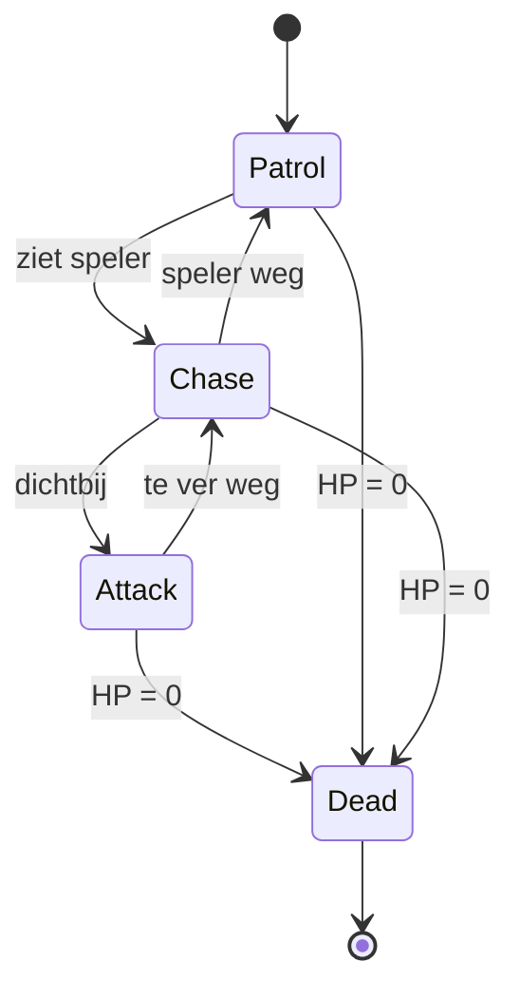
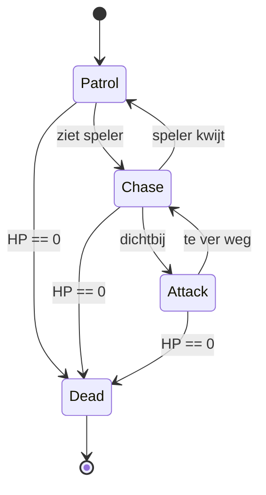

# M4 GDV Les 3 — Design Patterns: Finite State Machine (FSM)

## Leerdoel

Na deze les kun je:

- Uitleggen wat een Finite State Machine is en wanneer je deze inzet
- Het verschil beschrijven tussen een informele state-aanpak (enum + switch) en een formele FSM
- Een FSM bouwen met aparte state-klassen
- States maken met `Enter()`, `Execute()` en `Exit()` methoden
- Een FSM toepassen voor AI-vijandgedrag (Patrol → Chase → Attack)
- Een FSM toepassen voor player states (Idle → Walk → Jump → Attack)

---

## Herhaling: States tot nu toe

In M3 heb je game states beheerd met een **enum + switch**:

```csharp
public enum GameState { Menu, Playing, Paused, GameOver }

void SetState(GameState newState)
{
    currentState = newState;
    switch (newState)
    {
        case GameState.Playing: Time.timeScale = 1; break;
        case GameState.Paused:  Time.timeScale = 0; break;
        // ...
    }
}
```

**Dit werkt prima voor 3-4 states.** Maar wat als een vijand 8 verschillende gedragingen heeft?

```csharp
// ❌ Dit wordt snel onbeheersbaar:
switch (enemyState)
{
    case EnemyState.Idle:      /* 20 regels code */ break;
    case EnemyState.Patrol:    /* 30 regels code */ break;
    case EnemyState.Chase:     /* 25 regels code */ break;
    case EnemyState.Attack:    /* 35 regels code */ break;
    case EnemyState.Flee:      /* 20 regels code */ break;
    case EnemyState.Stunned:   /* 15 regels code */ break;
    case EnemyState.Dead:      /* 10 regels code */ break;
    case EnemyState.Searching: /* 20 regels code */ break;
}
// Eén script met 200+ regels code in één switch... 😵
```

---

## De oplossing: Finite State Machine

Een **Finite State Machine** (FSM) lost dit op door elke state in een **eigen klasse** te zetten. Het object (vijand, speler, NPC) is altijd in **precies één state** en kan **transities** maken naar andere states.



### Voordelen van een FSM

| Enum + Switch                    | FSM met klassen                           |
| -------------------------------- | ----------------------------------------- |
| Alle logica in één bestand       | Elke state is een apart bestand           |
| Groeit snel tot honderden regels | Elke state is klein en overzichtelijk     |
| Moeilijk om states toe te voegen | Nieuwe state = nieuw bestandje            |
| `Enter`/`Exit` logica is lastig  | Ingebouwde `Enter()` en `Exit()` methoden |
| Geen hergebruik mogelijk         | States zijn herbruikbaar tussen objecten  |

---

## FSM stap voor stap

### Stap 1: De State baseclass

Elke state heeft drie momenten:

- **Enter()** — wordt één keer aangeroepen bij het betreden van de state
- **Execute()** — wordt elke frame aangeroepen (zoals `Update()`)
- **Exit()** — wordt één keer aangeroepen bij het verlaten van de state

```csharp
public abstract class State
{
    protected StateMachine stateMachine;

    public State(StateMachine stateMachine)
    {
        this.stateMachine = stateMachine;
    }

    public virtual void Enter() { }
    public virtual void Execute() { }
    public virtual void Exit() { }
}
```

> **`abstract`** betekent: je kunt geen `State` object direct aanmaken — je moet een specifieke state maken (bijv. `PatrolState`) die ervan erft.

### Stap 2: De StateMachine

De StateMachine houdt bij welke state actief is en regelt transities:

```csharp
using UnityEngine;

public class StateMachine : MonoBehaviour
{
    private State currentState;

    public void ChangeState(State newState)
    {
        // Verlaat huidige state
        if (currentState != null)
        {
            currentState.Exit();
        }

        // Ga naar nieuwe state
        currentState = newState;
        currentState.Enter();

        Debug.Log("State changed to: " + newState.GetType().Name);
    }

    void Update()
    {
        // Voer huidige state uit
        if (currentState != null)
        {
            currentState.Execute();
        }
    }
}
```

### Stap 3: Concrete states maken

**PatrolState.cs:**

```csharp
using UnityEngine;

public class PatrolState : State
{
    private Transform enemy;
    private Transform[] waypoints;
    private int currentWaypoint = 0;
    private float moveSpeed = 3f;
    private Transform player;
    private float detectRange = 5f;

    public PatrolState(StateMachine sm, Transform enemy, Transform[] waypoints,
                       Transform player, float detectRange) : base(sm)
    {
        this.enemy = enemy;
        this.waypoints = waypoints;
        this.player = player;
        this.detectRange = detectRange;
    }

    public override void Enter()
    {
        Debug.Log("🚶 Patrol gestart");
        // Bijv. animatie starten: animator.SetBool("isWalking", true)
    }

    public override void Execute()
    {
        // Beweeg naar huidig waypoint
        Transform target = waypoints[currentWaypoint];
        enemy.position = Vector3.MoveTowards(
            enemy.position, target.position, moveSpeed * Time.deltaTime
        );

        // Waypoint bereikt? Ga naar volgende
        if (Vector3.Distance(enemy.position, target.position) < 0.2f)
        {
            currentWaypoint = (currentWaypoint + 1) % waypoints.Length;
        }

        // Speler in de buurt? Ga naar Chase!
        if (Vector3.Distance(enemy.position, player.position) < detectRange)
        {
            stateMachine.ChangeState(
                new ChaseState(stateMachine, enemy, player, waypoints, detectRange)
            );
        }
    }

    public override void Exit()
    {
        Debug.Log("🚶 Patrol gestopt");
    }
}
```

**ChaseState.cs:**

```csharp
using UnityEngine;

public class ChaseState : State
{
    private Transform enemy;
    private Transform player;
    private Transform[] waypoints;
    private float chaseSpeed = 5f;
    private float attackRange = 1.5f;
    private float detectRange;
    private float loseRange;

    public ChaseState(StateMachine sm, Transform enemy, Transform player,
                      Transform[] waypoints, float detectRange) : base(sm)
    {
        this.enemy = enemy;
        this.player = player;
        this.waypoints = waypoints;
        this.detectRange = detectRange;
        this.loseRange = detectRange * 1.5f; // Verlies speler op grotere afstand
    }

    public override void Enter()
    {
        Debug.Log("🏃 Chase gestart!");
        // Bijv. animator.SetBool("isRunning", true)
    }

    public override void Execute()
    {
        // Beweeg richting speler
        enemy.position = Vector3.MoveTowards(
            enemy.position, player.position, chaseSpeed * Time.deltaTime
        );

        float distance = Vector3.Distance(enemy.position, player.position);

        // Dichtbij genoeg? Aanvallen!
        if (distance < attackRange)
        {
            stateMachine.ChangeState(
                new AttackState(stateMachine, enemy, player, waypoints, detectRange)
            );
        }

        // Speler te ver weg? Terug naar patrol
        if (distance > loseRange)
        {
            stateMachine.ChangeState(
                new PatrolState(stateMachine, enemy, waypoints, player, detectRange)
            );
        }
    }

    public override void Exit()
    {
        Debug.Log("🏃 Chase gestopt");
    }
}
```

**AttackState.cs:**

```csharp
using UnityEngine;

public class AttackState : State
{
    private Transform enemy;
    private Transform player;
    private Transform[] waypoints;
    private float detectRange;
    private float attackCooldown = 1f;
    private float timer;
    private float attackRange = 2f;

    public AttackState(StateMachine sm, Transform enemy, Transform player,
                       Transform[] waypoints, float detectRange) : base(sm)
    {
        this.enemy = enemy;
        this.player = player;
        this.waypoints = waypoints;
        this.detectRange = detectRange;
    }

    public override void Enter()
    {
        Debug.Log("⚔️ Attack gestart!");
        timer = 0f;
        // Bijv. animator.SetTrigger("Attack")
    }

    public override void Execute()
    {
        timer += Time.deltaTime;

        // Kijk naar speler
        Vector3 direction = player.position - enemy.position;
        // Optioneel: enemy.up = direction.normalized;

        // Elke cooldown: aanvallen
        if (timer >= attackCooldown)
        {
            Debug.Log("⚔️ ATTACK! Schade aan speler!");
            timer = 0f;
        }

        // Speler te ver weg? Achtervolgen
        if (Vector3.Distance(enemy.position, player.position) > attackRange)
        {
            stateMachine.ChangeState(
                new ChaseState(stateMachine, enemy, player, waypoints, detectRange)
            );
        }
    }

    public override void Exit()
    {
        Debug.Log("⚔️ Attack gestopt");
    }
}
```

### Stap 4: De vijand opzetten

```csharp
using UnityEngine;

public class Enemy : MonoBehaviour
{
    [SerializeField] private Transform player;
    [SerializeField] private Transform[] waypoints;
    [SerializeField] private float detectRange = 5f;

    private StateMachine stateMachine;

    void Start()
    {
        stateMachine = gameObject.AddComponent<StateMachine>();

        // Start in Patrol state
        stateMachine.ChangeState(
            new PatrolState(stateMachine, transform, waypoints, player, detectRange)
        );
    }
}
```

---

## FSM Diagram tekenen

Voordat je code schrijft, is het handig om een **state diagram** te tekenen. Hiermee maak je duidelijk:

- Welke states er zijn
- Welke transities mogelijk zijn
- Onder welke **conditie** een transitie plaatsvindt



> **Tip:** Teken altijd eerst het diagram op papier of in een tool voordat je begint met coderen!

---

## FSM vs. Enum + Switch

| Kenmerk           | Enum + Switch (M3)    | FSM met klassen (M4)    |
| ----------------- | --------------------- | ----------------------- |
| Aantal states     | 3-4 (simpel)          | 5+ (complex)            |
| Code-organisatie  | Alles in één bestand  | Elk state apart bestand |
| Enter/Exit logica | Handmatig bijhouden   | Ingebouwd in pattern    |
| Herbruikbaarheid  | Laag                  | Hoog (states delen)     |
| Testbaarheid      | Lastig                | Per state testbaar      |
| Leesbaarheid      | Oké bij weinig states | Altijd overzichtelijk   |

> **Vuistregel:** Gebruik enum + switch voor simpele game states (Menu/Playing/Paused). Gebruik een FSM voor complex gedrag (AI, player states met veel variatie).

---

## Oefeningen

### Oefening 1: Vijand met 3 States

Maak een vijand met Patrol → Chase → Attack gedrag.

**Stappen:**

1. Maak de `State` baseclass en `StateMachine` component
2. Maak `PatrolState`: vijand loopt tussen waypoints
3. Maak `ChaseState`: vijand volgt de speler (als speler binnen bereik is)
4. Maak `AttackState`: vijand doet schade (als speler dichtbij is)
5. Zet 3-4 lege GameObjects als waypoints in de scene
6. Sleep de Player en waypoints in de Inspector

**Test:**

- Vijand patrouilleert rustig
- Loop dichtbij → vijand achtervolgt je
- Loop weg → vijand gaat terug patrouilleren
- Sta dichtbij → vijand valt aan

---

### Oefening 2: Player State Machine

Maak een speler met Idle → Walk → Jump states.

**Stappen:**

1. Maak `IdleState`: speler staat stil, wacht op input
   - Transitie naar `WalkState` bij WASD-input
   - Transitie naar `JumpState` bij spatiebalk
2. Maak `WalkState`: speler beweegt met WASD
   - Transitie naar `IdleState` als er geen input is
   - Transitie naar `JumpState` bij spatiebalk
3. Maak `JumpState`: speler springt, komt terug op de grond
   - Transitie naar `IdleState` bij landing
4. Voeg per state een `Debug.Log` toe in `Enter()` en `Exit()`

**Test:**

- Console toont duidelijk de state-wisselingen
- Speler gedraagt zich correct per state

---

### Oefening 3: FSM met Animaties ⭐

Breid oefening 1 of 2 uit met animaties.

**Stappen:**

1. Maak een Animator Controller met states: Idle, Walk, Run, Attack
2. Voeg een `Animator` referentie toe aan je State baseclass
3. In elke `Enter()`: zet de juiste animator-parameter (`SetBool`, `SetTrigger`)
4. In elke `Exit()`: reset de animator-parameter

**Verwacht resultaat:**

- Vijand/speler speelt de juiste animatie per state
- Transities tussen animaties zijn smooth

---

## Samenvatting

| Concept         | Uitleg                                                       |
| --------------- | ------------------------------------------------------------ |
| FSM             | Finite State Machine — object is altijd in precies één state |
| State baseclass | `abstract class` met `Enter()`, `Execute()`, `Exit()`        |
| StateMachine    | Component die de huidige state beheert en transities regelt  |
| Concrete state  | Klasse die erft van State (bijv. `PatrolState`)              |
| Transitie       | Wissel van state op basis van een conditie                   |
| State diagram   | Visueel overzicht van states en transities                   |

---

## FAQ

**Q: Moet ik voor elk object een aparte FSM maken?**
A: Nee, de `State` baseclass en `StateMachine` zijn herbruikbaar. Alleen de concrete states (PatrolState, ChaseState) zijn specifiek per object-type.

**Q: Kan ik de FSM ook gebruiken voor UI of game states?**
A: Absoluut! Een FSM is handig voor alles met meerdere toestanden: menu-flows, quest-systemen, wapen-modi, etc.

**Q: Wat is het verschil met Unity's Animator Controller?**
A: Unity's Animator is in feite óók een FSM, maar dan specifiek voor animaties. De FSM in deze les is voor **gameplay-logica**. Je kunt ze combineren: de gameplay-FSM stuurt de Animator aan.
