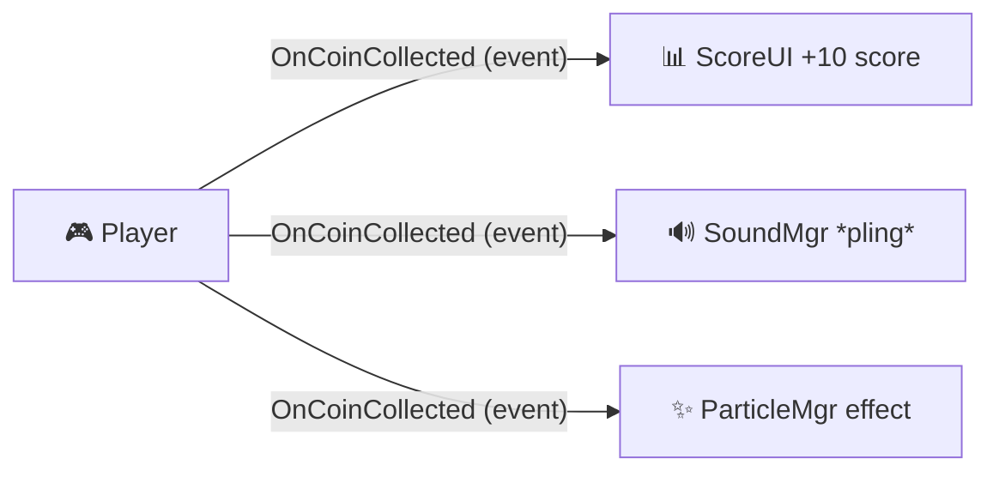

# M4 GDV Les 4 — Design Patterns: Observer Pattern

## Leerdoel

Na deze les kun je:

- Uitleggen wat het Observer pattern is en waarom het belangrijk is
- Het verschil beschrijven tussen tight coupling en loose coupling
- C# `event` en `Action<T>` gebruiken voor het Observer pattern
- `UnityEvent` gebruiken en configureren via de Inspector
- Een event-systeem bouwen voor score, health, UI en game-events
- Kiezen wanneer je C# events vs. UnityEvents gebruikt

---

## Herhaling: Events in M2 en M3

In M2 (Peggle) en M3 (PAC-MAN) heb je al met events gewerkt:

```csharp
// M2 — ScoreManager met Action Event
public static event Action<string, int> OnBumperHit;

// Ergens anders: luisteren naar het event
ScoreManager.OnBumperHit += HandleBumperHit;
```

Dit was het **Observer pattern** — maar je wist het misschien niet! In deze les gaan we het pattern formeel leren en uitbreiden.

---

## Het probleem: Tight Coupling

**Tight coupling** (strakke koppeling) betekent dat scripts direct naar elkaar verwijzen. Dit maakt code fragiel en moeilijk aan te passen.

```csharp
// ❌ TIGHT COUPLING: Player kent ScoreUI, SoundManager, ParticleManager, etc.
public class Player : MonoBehaviour
{
    [SerializeField] private ScoreUI scoreUI;
    [SerializeField] private SoundManager soundManager;
    [SerializeField] private ParticleManager particleManager;
    [SerializeField] private CameraShake cameraShake;
    [SerializeField] private ComboSystem comboSystem;

    void CollectCoin()
    {
        scoreUI.UpdateScore(10);
        soundManager.PlayCoinSound();
        particleManager.SpawnCoinEffect();
        cameraShake.Shake(0.1f);
        comboSystem.AddCombo();
    }
}
```

**Problemen:**

- Player moet **elk systeem kennen** dat reageert op een coin
- Nieuw systeem toevoegen? → Player-script aanpassen
- Systeem verwijderen? → Player-script aanpassen
- Player wordt een **God Object** dat overal verantwoordelijk voor is

---

## De oplossing: Observer Pattern

Met het Observer pattern **roept de Player alleen het event aan**. Alle geïnteresseerde systemen luisteren zelf:



De Player weet **niet** wie er luistert. Systemen melden zichzelf aan en af.

```csharp
// ✅ LOOSE COUPLING: Player weet niets over de luisteraars
public class Player : MonoBehaviour
{
    public static event Action<int> OnCoinCollected;

    void CollectCoin()
    {
        OnCoinCollected?.Invoke(10);  // "Er is een coin gepakt, waarde 10"
    }
}
```

```csharp
// Elk systeem luistert zelf
public class ScoreUI : MonoBehaviour
{
    void OnEnable()  { Player.OnCoinCollected += UpdateScore; }
    void OnDisable() { Player.OnCoinCollected -= UpdateScore; }

    void UpdateScore(int points) { /* update UI */ }
}

public class SoundManager : MonoBehaviour
{
    void OnEnable()  { Player.OnCoinCollected += PlayCoinSound; }
    void OnDisable() { Player.OnCoinCollected -= PlayCoinSound; }

    void PlayCoinSound(int points) { /* speel geluid */ }
}
```

### Voordelen

| Aspect                  | Zonder Observer          | Met Observer                                   |
| ----------------------- | ------------------------ | ---------------------------------------------- |
| Player-script           | Kent elk systeem         | Kent niemand                                   |
| Nieuw systeem toevoegen | Player aanpassen         | Alleen nieuw script, Player blijft ongewijzigd |
| Systeem verwijderen     | Player aanpassen         | Alleen script verwijderen                      |
| Testbaarheid            | Alles moet aanwezig zijn | Systemen werken onafhankelijk                  |

---

## Methode 1: C# Events met Action

### Basis: Event zonder data

```csharp
using System;
using UnityEngine;

public class Player : MonoBehaviour
{
    // Event declareren (static = globaal toegankelijk)
    public static event Action OnPlayerDied;

    public void Die()
    {
        Debug.Log("Player is dood!");
        OnPlayerDied?.Invoke();  // ?. = alleen uitvoeren als er luisteraars zijn
    }
}
```

```csharp
public class GameManager : MonoBehaviour
{
    void OnEnable()
    {
        Player.OnPlayerDied += HandlePlayerDeath;  // Aanmelden als luisteraar
    }

    void OnDisable()
    {
        Player.OnPlayerDied -= HandlePlayerDeath;  // Afmelden (BELANGRIJK!)
    }

    void HandlePlayerDeath()
    {
        Debug.Log("Game Over!");
        Time.timeScale = 0;
    }
}
```

### Event met data

```csharp
public class Player : MonoBehaviour
{
    // Event met 1 parameter
    public static event Action<int> OnScoreChanged;

    // Event met 2 parameters
    public static event Action<int, int> OnHealthChanged;  // current, max

    // Event met string parameter
    public static event Action<string> OnItemCollected;

    private int health = 100;
    private int maxHealth = 100;

    public void TakeDamage(int damage)
    {
        health -= damage;
        OnHealthChanged?.Invoke(health, maxHealth);

        if (health <= 0)
        {
            OnPlayerDied?.Invoke();
        }
    }

    public void CollectItem(string itemName)
    {
        OnItemCollected?.Invoke(itemName);
    }
}
```

### Luisteren met meerdere listeners

```csharp
// HealthBar luistert
public class HealthBar : MonoBehaviour
{
    void OnEnable()  { Player.OnHealthChanged += UpdateHealthBar; }
    void OnDisable() { Player.OnHealthChanged -= UpdateHealthBar; }

    void UpdateHealthBar(int current, int max)
    {
        float fillAmount = (float)current / max;
        // Update UI slider
    }
}

// SoundManager luistert naar hetzelfde event!
public class SoundManager : MonoBehaviour
{
    [SerializeField] private AudioClip hurtSound;

    void OnEnable()  { Player.OnHealthChanged += PlayHurtSound; }
    void OnDisable() { Player.OnHealthChanged -= PlayHurtSound; }

    void PlayHurtSound(int current, int max)
    {
        AudioManager.Instance.PlaySFX(hurtSound);
    }
}

// CameraShake luistert OOK naar hetzelfde event!
public class CameraShake : MonoBehaviour
{
    void OnEnable()  { Player.OnHealthChanged += ShakeOnDamage; }
    void OnDisable() { Player.OnHealthChanged -= ShakeOnDamage; }

    void ShakeOnDamage(int current, int max)
    {
        StartCoroutine(Shake(0.2f, 0.3f));
    }

    // ... shake coroutine
}
```

> **Drie systemen reageren op hetzelfde event, zonder dat Player iets van ze weet!**

---

## Methode 2: UnityEvent (Inspector-configureerbaar) (Gevorderd)

`UnityEvent` is Unity's eigen versie van events die je kunt configureren **via de Inspector** — zonder code!

```csharp
using UnityEngine;
using UnityEngine.Events;

public class HealthSystem : MonoBehaviour
{
    // Deze verschijnen in de Inspector
    public UnityEvent OnDamaged;
    public UnityEvent OnHealed;
    public UnityEvent OnDied;

    private int health = 100;

    public void TakeDamage(int damage)
    {
        health -= damage;
        OnDamaged?.Invoke();

        if (health <= 0)
        {
            OnDied?.Invoke();
        }
    }

    public void Heal(int amount)
    {
        health += amount;
        OnHealed?.Invoke();
    }
}
```

In de Inspector kun je nu per event **slepen welke methode** aangeroepen moet worden — net als bij UI Buttons!

### UnityEvent met parameters

```csharp
using UnityEngine.Events;

// Custom UnityEvent met int parameter
[System.Serializable]
public class IntEvent : UnityEvent<int> { }

public class ScoreSystem : MonoBehaviour
{
    public IntEvent OnScoreChanged;

    private int score = 0;

    public void AddScore(int points)
    {
        score += points;
        OnScoreChanged?.Invoke(score);
    }
}
```

---

## C# Events vs. UnityEvents

| Aspect        | C# `event Action` | `UnityEvent`                  |
| ------------- | ----------------- | ----------------------------- |
| Configuratie  | In code           | In Inspector (drag & drop)    |
| Performance   | Sneller           | Iets langzamer                |
| Serialisatie  | Niet serializable | Wordt opgeslagen in scene     |
| Flexibiliteit | Maximaal          | Beperkt tot Inspector         |
| Beste voor    | Programmeurs      | Designers / niet-programmeurs |
| Debugging     | Moeilijker        | Zichtbaar in Inspector        |

> **Vuistregel:** Gebruik C# events voor systeem-logica (score, health, game state). Gebruik UnityEvents wanneer designers dingen moeten kunnen koppelen in de Inspector (UI buttons, triggers, cutscenes).

---

## Belangrijk: Afmelden bij events!

Een veelgemaakte fout: **vergeten af te melden** bij een event. Dit veroorzaakt:

- **Memory leaks** — het object wordt niet opgeruimd
- **NullReferenceExceptions** — code wordt aangeroepen op een vernietigd object
- **Dubbele aanroepen** — na scene reload meldt object zich opnieuw aan

```csharp
// ❌ FOUT: Nooit afgemeld!
void Start()
{
    Player.OnCoinCollected += UpdateScore;
}

// ✅ GOED: Altijd afmelden in OnDisable of OnDestroy
void OnEnable()
{
    Player.OnCoinCollected += UpdateScore;
}

void OnDisable()
{
    Player.OnCoinCollected -= UpdateScore;
}
```

> **Regel:** Meld je aan in `OnEnable()` en af in `OnDisable()`. Altijd. Geen uitzonderingen.

---

## Praktijkvoorbeeld: Complete Event-flow

```csharp
// 1. EVENTS DECLAREREN (in relevante scripts)
public class Enemy : MonoBehaviour
{
    public static event Action<Enemy> OnEnemyKilled;
    public static event Action<int> OnEnemyDroppedLoot;

    public void Die()
    {
        OnEnemyKilled?.Invoke(this);
        OnEnemyDroppedLoot?.Invoke(Random.Range(5, 20));
        gameObject.SetActive(false);  // Object Pooling!
    }
}

// 2. LUISTERAARS (elk in eigen script)
public class ScoreManager : Singleton<ScoreManager>
{
    void OnEnable()  { Enemy.OnEnemyKilled += AddKillScore; }
    void OnDisable() { Enemy.OnEnemyKilled -= AddKillScore; }

    void AddKillScore(Enemy enemy)   { /* +100 score */ }
}

public class WaveManager : MonoBehaviour
{
    private int enemiesAlive;

    void OnEnable()  { Enemy.OnEnemyKilled += CheckWaveComplete; }
    void OnDisable() { Enemy.OnEnemyKilled -= CheckWaveComplete; }

    void CheckWaveComplete(Enemy enemy)
    {
        enemiesAlive--;
        if (enemiesAlive <= 0) { /* Start volgende wave */ }
    }
}

public class UIManager : MonoBehaviour
{
    void OnEnable()  { Enemy.OnEnemyDroppedLoot += ShowLootPopup; }
    void OnDisable() { Enemy.OnEnemyDroppedLoot -= ShowLootPopup; }

    void ShowLootPopup(int amount)   { /* Toon "+15 coins" op scherm */ }
}
```

---

## Oefeningen

### Oefening 1: Health Event Systeem

Maak een health-systeem dat events gebruikt om UI en effecten aan te sturen.

**Stappen:**

1. Maak `HealthSystem.cs` met:
   - `public static event Action<int, int> OnHealthChanged;` (current, max)
   - `public static event Action OnPlayerDied;`
   - `TakeDamage(int damage)` en `Heal(int amount)` methoden
2. Maak `HealthBar.cs` dat luistert naar `OnHealthChanged` en een UI Slider update
3. Maak `DamageFlash.cs` dat bij `OnHealthChanged` het scherm kort rood flitst
4. Maak `GameOverScreen.cs` dat bij `OnPlayerDied` een Game Over panel toont

**Test:**

- Neem schade → health bar, rode flits en eventueel game over reageren automatisch
- Verwijder `DamageFlash.cs` → alles werkt nog, alleen geen flits meer

---

### Oefening 2: Score & Combo Events

Maak een score-systeem met combo-tracking via events.

**Stappen:**

1. Maak `ScoreEvents.cs` met:
   - `public static event Action<int> OnScoreAdded;`
   - `public static event Action<int> OnComboChanged;`
   - `public static event Action OnComboReset;`
2. Maak `ScoreUI.cs` dat de score-tekst update bij `OnScoreAdded`
3. Maak `ComboUI.cs` dat de combo-teller toont bij `OnComboChanged`
4. Maak `ComboSound.cs` dat een steeds hoger geluid afspeelt naarmate de combo stijgt
5. Vernietig vijanden om score en combo's te triggeren

**Test:**

- Kill vijanden snel achter elkaar → combo stijgt, geluid wordt hoger
- Wacht te lang → combo reset, UI past zich aan

---

### Oefening 3: UnityEvent Pickup Systeem ⭐

Maak een herbruikbaar pickup-systeem met UnityEvents.

**Stappen:**

1. Maak `Pickup.cs` met:
   - `public UnityEvent OnPickedUp;`
   - `OnTriggerEnter2D` die het event afvuurt
2. Maak 3 pickup-prefabs: Coin, HealthPack, SpeedBoost
3. Configureer per prefab **in de Inspector** wat er moet gebeuren:
   - Coin → ScoreManager.AddScore(10)
   - HealthPack → Player.Heal(25)
   - SpeedBoost → Player.AddSpeedBuff()
4. Geen aanpassingen in `Pickup.cs` nodig voor verschillende types!

**Test:**

- Eén `Pickup.cs` script werkt voor alle pickup-types
- Functionaliteit is volledig configureerbaar via de Inspector

---

## Samenvatting

| Concept              | Uitleg                                                  |
| -------------------- | ------------------------------------------------------- |
| Observer Pattern     | Objecten luisteren naar events zonder directe koppeling |
| Loose Coupling       | Scripts kennen elkaar niet, communiceren via events     |
| `event Action<T>`    | C# event met optionele data-parameters                  |
| `UnityEvent`         | Inspector-configureerbare event                         |
| `OnEnable/OnDisable` | Aanmelden en afmelden bij events                        |
| `?.Invoke()`         | Veilig event aanroepen (null-check ingebouwd)           |

---

## FAQ

**Q: Kan ik events combineren met het Singleton pattern?**
A: Ja! Een Singleton manager die events afvuurt is een veelgebruikt patroon (bijv. `GameManager.OnStateChanged`).

**Q: Hoeveel events is te veel?**
A: Er is geen harde limiet, maar als je meer dan 5-6 events in één script hebt, overweeg dan om het script op te splitsen.

**Q: Wat als ik data wil sturen die niet past in Action<T>?**
A: Maak een custom class of struct: `public static event Action<DamageInfo> OnDamageDealt;` met `DamageInfo` als data-container.
