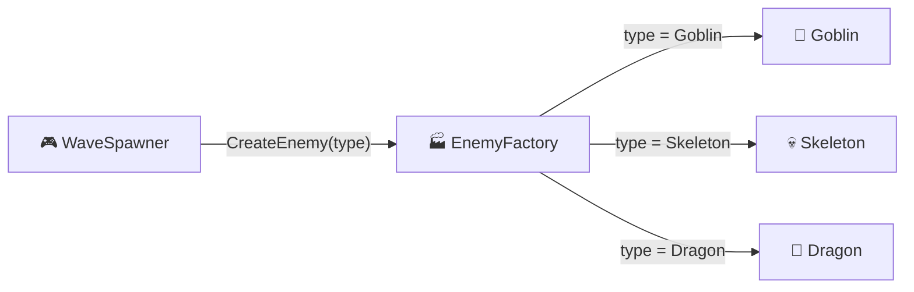
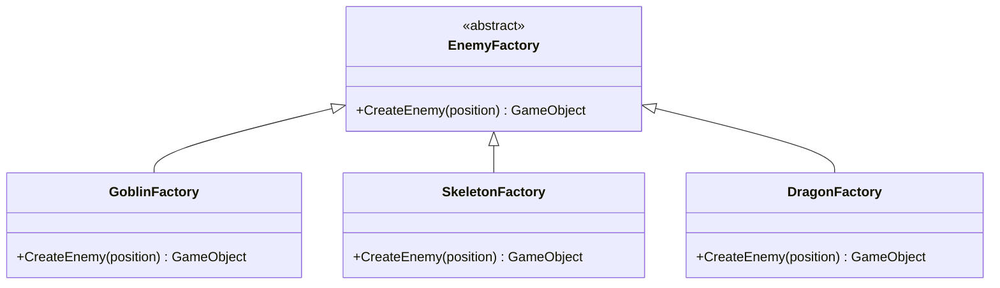
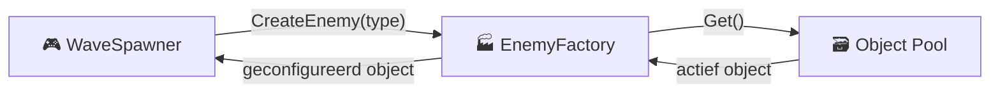

# M4 GDV Les 6 — Design Patterns: Factory Pattern

## Leerdoel

Na deze les kun je:

- Uitleggen wat het Factory pattern is en wanneer je het inzet
- Het verschil beschrijven tussen directe instantiatie en een Factory
- Een Simple Factory bouwen voor het aanmaken van game-objecten
- Een Factory Method implementeren met overerving
- Een Factory combineren met Object Pooling voor optimale performance
- Kiezen wanneer je een Factory gebruikt versus directe `Instantiate()`

---

## Het probleem: Directe object-creatie

In eerdere modules heb je objecten direct aangemaakt met `Instantiate()` en condities:

```csharp
// ❌ DIRECTE CREATIE: spawn-logica zit verspreid door de code
public class EnemySpawner : MonoBehaviour
{
    [SerializeField] private GameObject goblinPrefab;
    [SerializeField] private GameObject skeletonPrefab;
    [SerializeField] private GameObject dragonPrefab;

    void SpawnEnemy(string type)
    {
        GameObject enemy = null;

        if (type == "goblin")
            enemy = Instantiate(goblinPrefab, spawnPoint.position, Quaternion.identity);
        else if (type == "skeleton")
            enemy = Instantiate(skeletonPrefab, spawnPoint.position, Quaternion.identity);
        else if (type == "dragon")
            enemy = Instantiate(dragonPrefab, spawnPoint.position, Quaternion.identity);

        // Setup logica...
        enemy.GetComponent<Enemy>().SetDifficulty(currentWave);
    }
}
```

**Problemen:**

- **Nieuw enemy-type toevoegen?** → Elke spawner aanpassen met een extra `if`/`else`
- **Spawn-logica op meerdere plekken?** → Overal dezelfde `if`/`else` kopiëren
- **Moeilijk testbaar** → je kunt niet makkelijk een "test-enemy" injecteren
- **Verspreide verantwoordelijkheid** → het spawner-script moet weten _hoe_ elk type werkt

---

## De oplossing: Factory Pattern

Een **Factory** centraliseert de aanmaak-logica op **één plek**. De rest van je code vraagt alleen: "Geef mij een enemy van type X" — zonder te weten _hoe_ die gemaakt wordt.



> **Analogie:** Een Factory is als een **automaat**. Je drukt op een knop (type kiezen), en het juiste product komt eruit. Je hoeft niet te weten hoe de automaat het product maakt.

### Voordelen

| Zonder Factory                        | Met Factory                             |
| ------------------------------------- | --------------------------------------- |
| Creatie-logica verspreid over scripts | Eén centrale plek voor object-creatie   |
| if/else of switch overal gekopieerd   | Alleen de Factory bevat de keuze-logica |
| Nieuw type = overal aanpassen         | Nieuw type = alleen Factory aanpassen   |
| Moeilijk te testen                    | Factory is apart testbaar               |
| Client kent alle concrete types       | Client kent alleen de Factory           |

---

## Simple Factory

De eenvoudigste vorm: een klasse met een methode die op basis van input het juiste object aanmaakt.

### Stap 1: Enum voor types

```csharp
public enum EnemyType
{
    Goblin,
    Skeleton,
    Dragon
}
```

### Stap 2: De Factory

```csharp
using UnityEngine;

public class EnemyFactory : MonoBehaviour
{
    [SerializeField] private GameObject goblinPrefab;
    [SerializeField] private GameObject skeletonPrefab;
    [SerializeField] private GameObject dragonPrefab;

    public GameObject CreateEnemy(EnemyType type, Vector3 position)
    {
        GameObject prefab = type switch
        {
            EnemyType.Goblin   => goblinPrefab,
            EnemyType.Skeleton => skeletonPrefab,
            EnemyType.Dragon   => dragonPrefab,
            _ => null
        };

        if (prefab == null)
        {
            Debug.LogError("Onbekend enemy type: " + type);
            return null;
        }

        GameObject enemy = Instantiate(prefab, position, Quaternion.identity);
        return enemy;
    }
}
```

### Stap 3: De Factory gebruiken

```csharp
public class WaveSpawner : MonoBehaviour
{
    [SerializeField] private EnemyFactory enemyFactory;
    [SerializeField] private Transform[] spawnPoints;

    void SpawnWave(int waveNumber)
    {
        for (int i = 0; i < waveNumber * 3; i++)
        {
            // Kies willekeurig type
            EnemyType type = (EnemyType)Random.Range(0, 3);

            // Kies willekeurig spawnpoint
            Transform spawn = spawnPoints[Random.Range(0, spawnPoints.Length)];

            // Factory maakt het juiste enemy-type aan
            GameObject enemy = enemyFactory.CreateEnemy(type, spawn.position);
        }
    }
}
```

> De `WaveSpawner` weet **niets** over prefabs of hoe enemies gemaakt worden. Alleen de Factory kent die details.

---

## Factory met configuratie

Een Factory kan meer doen dan alleen instantiëren — het kan objecten ook **configureren** bij creatie:

```csharp
public class EnemyFactory : MonoBehaviour
{
    [SerializeField] private GameObject goblinPrefab;
    [SerializeField] private GameObject skeletonPrefab;
    [SerializeField] private GameObject dragonPrefab;

    public GameObject CreateEnemy(EnemyType type, Vector3 position, int wave)
    {
        GameObject prefab = type switch
        {
            EnemyType.Goblin   => goblinPrefab,
            EnemyType.Skeleton => skeletonPrefab,
            EnemyType.Dragon   => dragonPrefab,
            _ => null
        };

        if (prefab == null) return null;

        GameObject enemy = Instantiate(prefab, position, Quaternion.identity);

        // Configureer op basis van wave
        Enemy enemyScript = enemy.GetComponent<Enemy>();
        enemyScript.SetHealth(GetHealthForWave(type, wave));
        enemyScript.SetSpeed(GetSpeedForWave(type, wave));
        enemyScript.SetDamage(GetDamageForWave(type, wave));

        return enemy;
    }

    private int GetHealthForWave(EnemyType type, int wave)
    {
        int baseHealth = type switch
        {
            EnemyType.Goblin   => 30,
            EnemyType.Skeleton => 50,
            EnemyType.Dragon   => 150,
            _ => 30
        };

        // Elke wave 10% meer health
        return Mathf.RoundToInt(baseHealth * (1 + wave * 0.1f));
    }

    private float GetSpeedForWave(EnemyType type, int wave)
    {
        return type switch
        {
            EnemyType.Goblin   => 4f + wave * 0.2f,
            EnemyType.Skeleton => 2.5f + wave * 0.1f,
            EnemyType.Dragon   => 1.5f + wave * 0.05f,
            _ => 3f
        };
    }

    private int GetDamageForWave(EnemyType type, int wave)
    {
        return type switch
        {
            EnemyType.Goblin   => 5 + wave,
            EnemyType.Skeleton => 10 + wave * 2,
            EnemyType.Dragon   => 25 + wave * 3,
            _ => 5
        };
    }
}
```

> Alle balans-logica zit nu in de Factory. Wil je een enemy sterker of zwakker maken? Eén plek aanpassen.

---

## Factory Method met overerving

Voor meer flexibiliteit kun je de Factory Method gebruiken: een **abstracte Factory** waarvan concrete Factories erven. Elke concrete Factory bepaalt zelf hoe objecten aangemaakt worden.



### Implementatie

```csharp
// Abstracte Factory
public abstract class EnemyFactoryBase : MonoBehaviour
{
    public abstract GameObject CreateEnemy(Vector3 position);
}
```

```csharp
// Concrete Factory: Goblin
public class GoblinFactory : EnemyFactoryBase
{
    [SerializeField] private GameObject goblinPrefab;

    public override GameObject CreateEnemy(Vector3 position)
    {
        GameObject goblin = Instantiate(goblinPrefab, position, Quaternion.identity);

        Enemy enemy = goblin.GetComponent<Enemy>();
        enemy.SetHealth(30);
        enemy.SetSpeed(4f);

        Debug.Log("🏭 Goblin aangemaakt!");
        return goblin;
    }
}
```

```csharp
// Concrete Factory: Dragon
public class DragonFactory : EnemyFactoryBase
{
    [SerializeField] private GameObject dragonPrefab;
    [SerializeField] private GameObject fireEffectPrefab;

    public override GameObject CreateEnemy(Vector3 position)
    {
        GameObject dragon = Instantiate(dragonPrefab, position, Quaternion.identity);

        Enemy enemy = dragon.GetComponent<Enemy>();
        enemy.SetHealth(150);
        enemy.SetSpeed(1.5f);

        // Dragon krijgt een extra fire-effect
        Instantiate(fireEffectPrefab, dragon.transform);

        Debug.Log("🏭 Dragon aangemaakt met vuur-effect!");
        return dragon;
    }
}
```

```csharp
// Gebruik: de spawner kent alleen de basis-Factory
public class WaveSpawner : MonoBehaviour
{
    [SerializeField] private EnemyFactoryBase[] factories;

    void SpawnRandomEnemy(Vector3 position)
    {
        int index = Random.Range(0, factories.Length);
        factories[index].CreateEnemy(position);
    }
}
```

> In de Inspector sleep je de gewenste Factory-scripts op de `factories`-array. Nieuwe enemy? Maak een nieuwe Factory-klasse — de Spawner hoeft niet te veranderen.

---

## Factory + Object Pooling

De Factory en Object Pooling patterns werken uitstekend samen. In plaats van `Instantiate()` haalt de Factory objecten **uit een pool**:



### Implementatie

```csharp
public class PooledEnemyFactory : MonoBehaviour
{
    [SerializeField] private ObjectPool goblinPool;
    [SerializeField] private ObjectPool skeletonPool;
    [SerializeField] private ObjectPool dragonPool;

    public GameObject CreateEnemy(EnemyType type, Vector3 position)
    {
        // Haal uit pool i.p.v. Instantiate
        GameObject enemy = type switch
        {
            EnemyType.Goblin   => goblinPool.Get(),
            EnemyType.Skeleton => skeletonPool.Get(),
            EnemyType.Dragon   => dragonPool.Get(),
            _ => null
        };

        if (enemy == null) return null;

        // Positioneer en configureer
        enemy.transform.position = position;
        ConfigureEnemy(enemy, type);

        return enemy;
    }

    private void ConfigureEnemy(GameObject enemy, EnemyType type)
    {
        Enemy script = enemy.GetComponent<Enemy>();
        switch (type)
        {
            case EnemyType.Goblin:
                script.SetHealth(30);
                script.SetSpeed(4f);
                break;
            case EnemyType.Skeleton:
                script.SetHealth(50);
                script.SetSpeed(2.5f);
                break;
            case EnemyType.Dragon:
                script.SetHealth(150);
                script.SetSpeed(1.5f);
                break;
        }
    }

    // Breng enemy terug naar de juiste pool
    public void ReturnEnemy(GameObject enemy, EnemyType type)
    {
        switch (type)
        {
            case EnemyType.Goblin:   goblinPool.Return(enemy); break;
            case EnemyType.Skeleton: skeletonPool.Return(enemy); break;
            case EnemyType.Dragon:   dragonPool.Return(enemy); break;
        }
    }
}
```

> **Beste van twee werelden:** de Factory bepaalt _wat_ er gemaakt wordt, de Pool zorgt voor _efficiënt hergebruik_.

---

## Factory met ScriptableObjects

Voor maximale flexibiliteit kun je enemy-configuratie opslaan in **ScriptableObjects**. Zo kunnen designers nieuwe types toevoegen zonder code aan te passen:

### EnemyData ScriptableObject

```csharp
using UnityEngine;

[CreateAssetMenu(fileName = "NewEnemy", menuName = "Game/Enemy Data")]
public class EnemyData : ScriptableObject
{
    public string enemyName;
    public GameObject prefab;
    public int health;
    public float speed;
    public int damage;
    public Color color;
}
```

### Factory met ScriptableObjects

```csharp
public class DataDrivenEnemyFactory : MonoBehaviour
{
    [SerializeField] private EnemyData[] enemyTypes;

    public GameObject CreateEnemy(string enemyName, Vector3 position)
    {
        // Zoek het juiste data-object
        EnemyData data = System.Array.Find(enemyTypes, e => e.enemyName == enemyName);

        if (data == null)
        {
            Debug.LogError("Enemy type niet gevonden: " + enemyName);
            return null;
        }

        // Maak aan en configureer
        GameObject enemy = Instantiate(data.prefab, position, Quaternion.identity);

        Enemy script = enemy.GetComponent<Enemy>();
        script.SetHealth(data.health);
        script.SetSpeed(data.speed);
        script.SetDamage(data.damage);

        // Optioneel: visuele aanpassing
        SpriteRenderer sr = enemy.GetComponent<SpriteRenderer>();
        if (sr != null) sr.color = data.color;

        return enemy;
    }
}
```

> **Voordeel:** nieuwe enemy-types toevoegen = een nieuw ScriptableObject aanmaken in de Editor. Geen code nodig!

---

## Wanneer Factory Pattern gebruiken?

### ✅ Goed gebruik

| Situatie                                 | Voorbeeld                                    |
| ---------------------------------------- | -------------------------------------------- |
| **Meerdere types van hetzelfde concept** | Enemies, pickups, projectielen               |
| **Complexe creatie-logica**              | Object aanmaken + configureren + effects     |
| **Creatie-logica op meerdere plekken**   | Enemies spawnen vanuit waves én triggers     |
| **Types uitbreidbaar houden**            | Nieuwe enemy toevoegen zonder code te breken |

### ❌ Niet nodig

| Situatie                              | Waarom niet?                       |
| ------------------------------------- | ---------------------------------- |
| **Maar één type object**              | Factory voegt niets toe            |
| **Simpele Instantiate zonder config** | Overkill, directe aanroep volstaat |
| **Eenmalige objecten**                | Geen herhalend creatie-patroon     |

---

## Oefeningen

### Oefening 1: Simple Enemy Factory

Maak een Factory die drie soorten vijanden kan aanmaken.

**Stappen:**

1. Maak een `EnemyType` enum met minstens 3 types (bijv. Goblin, Skeleton, Dragon)
2. Maak voor elk type een prefab met een `SpriteRenderer` en een `Enemy`-script
3. Maak `EnemyFactory.cs` met een `CreateEnemy(EnemyType type, Vector3 position)` methode
4. Maak `WaveSpawner.cs` die elke 3 seconden een willekeurige vijand spawnt via de Factory
5. De Factory configureert health en speed per type

**Test:**

- Er verschijnen verschillende enemy-types op willekeurige spawnpoints
- De WaveSpawner bevat **geen** verwijzingen naar prefabs — alleen naar de Factory
- Voeg een 4e type toe → alleen de Factory en enum aanpassen

---

### Oefening 2: Factory + Object Pooling

Combineer het Factory pattern met Object Pooling uit Les 2.

**Stappen:**

1. Maak een `ObjectPool` per enemy-type (of gebruik de generieke pool uit Les 2)
2. Maak `PooledEnemyFactory.cs` die enemies uit de pool haalt in plaats van te Instantiaten
3. Maak `WaveSpawner.cs` die waves spawnt via de Factory
4. Enemies gaan terug naar de pool wanneer ze dood gaan
5. Voeg een `ReturnEnemy()` methode toe aan de Factory

**Test:**

- Spawn meerdere waves → enemies worden hergebruikt (check Hierarchy)
- Geen `Instantiate()` of `Destroy()` meer tijdens gameplay
- Performance blijft smooth, zelfs bij veel enemies

---

### Oefening 3: Data-Driven Factory met ScriptableObjects ⭐

Maak een Factory die volledig gestuurd wordt door ScriptableObjects.

**Stappen:**

1. Maak een `EnemyData` ScriptableObject met velden: name, prefab, health, speed, damage, color
2. Maak minstens 4 `EnemyData`-assets aan in de Editor (via Create → Game → Enemy Data)
3. Maak `DataDrivenEnemyFactory.cs` die een array van `EnemyData` accepteert
4. De Factory zoekt het juiste data-object op en maakt de bijbehorende enemy aan
5. Maak een `WaveConfig` ScriptableObject dat per wave definieert welke enemies spawnen

**Verwacht resultaat:**

- Nieuwe enemy-types toevoegen zonder code aan te passen
- Designers kunnen enemy-stats wijzigen in de Inspector
- Wave-samenstelling is configureerbaar via ScriptableObjects

---

## Samenvatting

| Concept           | Uitleg                                                       |
| ----------------- | ------------------------------------------------------------ |
| Factory Pattern   | Centraliseert object-creatie op één plek                     |
| Simple Factory    | Klasse met een create-methode die het juiste type teruggeeft |
| Factory Method    | Abstracte Factory met concrete subclasses per type           |
| Factory + Pool    | Factory haalt uit een pool i.p.v. te Instantiaten            |
| Factory + SO      | ScriptableObjects voor data-driven configuratie              |
| Wanneer gebruiken | Bij meerdere types, complexe creatie, of uitbreidbaarheid    |

---

## FAQ

**Q: Wat is het verschil tussen een Factory en Object Pooling?**
A: Een Factory bepaalt _welk_ object aangemaakt wordt (beslissingslogica). Object Pooling bepaalt _hoe efficiënt_ objecten beheerd worden (hergebruik). Ze vullen elkaar aan: een Factory kan objecten uit een Pool halen.

**Q: Moet ik altijd een Factory gebruiken voor het spawnen van objecten?**
A: Nee. Als je maar één type object spawnt en geen configuratie nodig hebt, is een directe `Instantiate()` prima. Gebruik een Factory als je meerdere types hebt of de creatie-logica wilt centraliseren.

**Q: Kan ik een Factory combineren met het Singleton pattern?**
A: Ja! Een `EnemyFactory : Singleton<EnemyFactory>` is een veelgebruikt patroon. Zo kun je overal in je code `EnemyFactory.Instance.CreateEnemy(...)` aanroepen.

**Q: Hoe kies ik tussen Simple Factory en Factory Method?**
A: Gebruik een Simple Factory als alle creatie-logica in één methode past (switch/if). Gebruik Factory Method als elk type complexe, eigen creatie-logica heeft die je in aparte klassen wilt organiseren.
