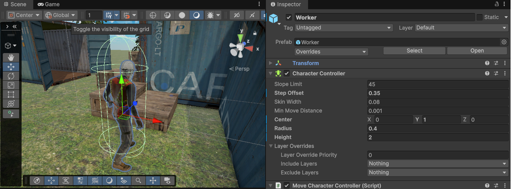
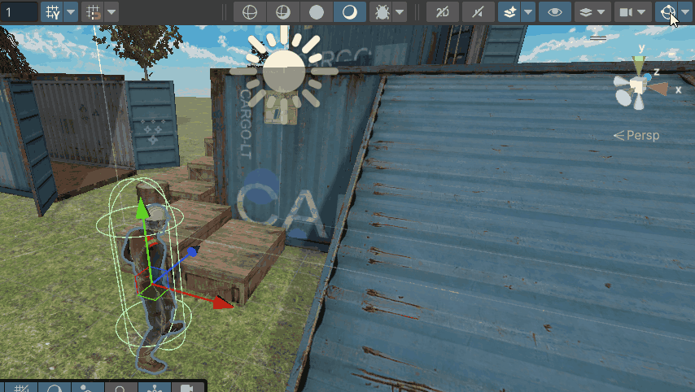

# M4 GDV HNR LES 4: CharacterController — Bewegen & Springen

Deze les leren jullie het volgende:

- Je begrijpt het verschil tussen `CharacterController` en `Rigidbody` beweging
- Je kunt `CharacterController.Move()` correct gebruiken
- Je kunt zwaartekracht zelf implementeren in een script
- Je kunt de sprong-formule toepassen voor een instelbare springhoogte

In deze les laat ik zien hoe je een CharacterController opzet voor een geanimeerd karakter. Je kunt direct meedoen of kijken en aantekeningen maken.

De uitgebreide stap-voor-stap instructie staat hier: [Les04_StepByStep.md](../Uitleg/stepbystep/Les04_CharacterController_Springen.md)

---

## CharacterController vs. Rigidbody

| Eigenschap        | CharacterController             | Rigidbody                            |
| ----------------- | ------------------------------- | ------------------------------------ |
| Bewegingscontrole | Direct, volledig in jouw code   | Indirect via krachten                |
| Botsingen         | Ingebouwd (schuift langs muren) | Via PhysX engine                     |
| Zwaartekracht     | Zelf implementeren              | Automatisch                          |
| Gebruik           | Speler-characters               | Physische objecten (barrels, ballen) |

**Kies CharacterController** als je volledige controle wilt over hoe de speler beweegt.  
**Kies Rigidbody** als een object realistisch moet reageren op botsingen en krachten.


---

## Oefening 1 — CharacterController toevoegen (~5 min)

Ik laat zien hoe je de CharacterController instelt op een karakter:

1. Selecteer het karakter in de Hierarchy.
2. **Add Component > Physics > Character Controller**
3. Stel in:
   - **Center Y:** `1.0`
   - **Radius:** `0.4`
   - **Height:** `2.0`

De groene capsule in de Scene view moet het karakter netjes omhullen.



> Zie je de capsule niet? Klik op **Gizmos** (rechtsboven in Scene view) en zorg dat Physics aangevinkt is.
> 

---

## Oefening 2 — Script schrijven: MoveCharacterController.cs (~20 min)

Ik schrijf live het script `MoveCharacterController.cs` op basis van het eerdere script `InputPlayer.cs`.

**Beweging en rotatie:**

```csharp
Vector2 movementInput = moveAction.ReadValue<Vector2>();

float speed = movementInput.y * moveSpeed;
if (sprintAction.IsPressed()) speed *= 2; //sprinten

Vector3 move = transform.forward * speed * Time.deltaTime; //De move variabele gebruiken we later in de Move() functie
transform.Rotate(Vector3.up * movementInput.x * rotationSpeed * Time.deltaTime);
```

**Zwaartekracht zelf implementeren:**

> Let op het `CharacterController` component heeft zelf ook al de eigenschap `.isGrounded` die automatisch wordt bijgehouden. Deze hoeven we dus niet meer zelf bij te houden in het script.

```csharp
if (characterController.isGrounded)
{
    verticalVelocity = -1f; // kleine downward force om grounded te blijven

    if (jumpAction.WasPressedThisFrame())
    {
        verticalVelocity = Mathf.Sqrt(2f * Mathf.Abs(gravity) * jumpHeight); //hoeveel kracht moet je geven om op de juiste hoogte uit te komen?
        animator.SetTrigger("JumpTrigger");
    }
}
else
{
    verticalVelocity += gravity * Time.deltaTime; // zwaartekracht trekt mij naar beneden
}

move.y = verticalVelocity * Time.deltaTime; //verticale berekening word meegegeven aan de move variabele
characterController.Move(move); //hier geven we de uiteindelijke move variabele mee aan de Move functie
```

**Animator aansturen:**

```csharp
animator.SetFloat("Speed", movementInput.y);
animator.SetBool("Grounded", characterController.isGrounded);
```

> `characterController.isGrounded` werkt hier in plaats van een tag-check — de CharacterController houdt dit zelf bij.

---

## De sprong-formule

De beginsnelheid voor een sprong van precies `h` meter hoog bereken je met:

$$u = \sqrt{2 \times |g| \times h}$$

**Voorbeeld** met `gravity = -20` en `jumpHeight = 2`:

$$u = \sqrt{2 \times 20 \times 2} = \sqrt{80} \approx 8.94$$

Dit geeft precies genoeg beginsnelheid om 2 meter hoog te springen. Hoe hoger de zwaartekracht, hoe sneller de speler terugvalt.

> [Hier](../Uitleg/SprongFormule.md) vind je meer uitleg over de sprong formule als je deze echt goed wilt begrijpen

---

## Oefening 3 — Script koppelen en testen (~10 min)

1. Sleep `MoveCharacterController` op het karakter in de Hierarchy.
2. Koppel het `InputSystem_Actions.inputactions`-bestand en stel **Map Name** in.
3. Stel de Inspector-waarden in:
   - Move Speed: `5`, Sprint Multiplier: `2`, Rotation Speed: `100`
   - Jump Height: `2`, Gravity: `-20`
4. Druk op **Play** en test het springen.

**Experimenteer met de waarden:**

| Gevoel               | Jump Height | Gravity |
| -------------------- | ----------- | ------- |
| Maansprong           | `5`         | `-10`   |
| Normale sprong       | `2`         | `-20`   |
| Snelle aardse sprong | `1`         | `-30`   |

---

## Huiswerk: CharacterController in je 3D Gym


Voeg het nieuwe karaker met CharacterController toe in je 3D Gym. Zorg dat alle animaties weer worden uitgevoerd.

Zorg dat:

- Het karakter beweegt en draait via de CharacterController
- Het karakter springt met de juiste springhoogte
- Idle, Walk, Run en Jump animaties correct werken
- De sprong goed aanvoelt (tweaken van Jump Height en Gravity)
- Experimenteer eens met de `slope limit` en `step offset` wat heeft dit te maken met schuine oppervlakten en traplopen?

Optioneel (voor snelle werkers):

- Voeg een **sprint** toe die ook de animatie versnelt

Commit en push je voortgang naar je GitHub-repository en lever de link in op Simulise: `GD - M4 - GDV - HNR : CharacterController`
