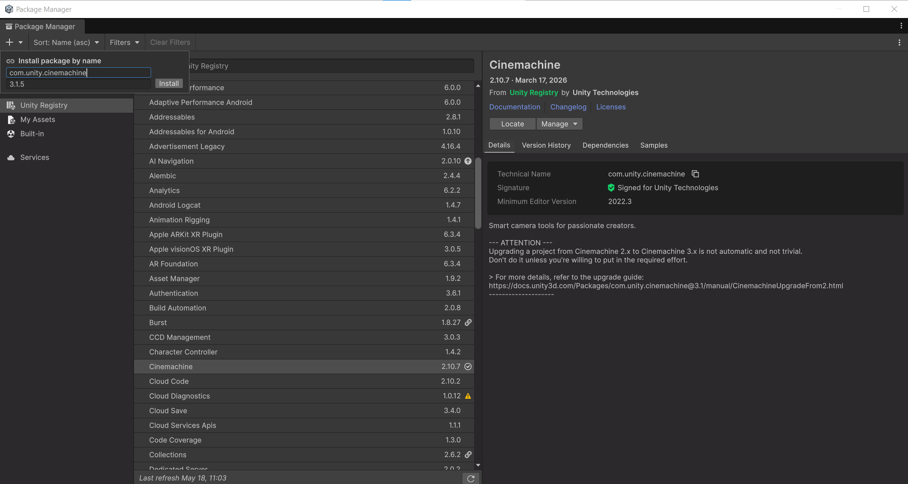
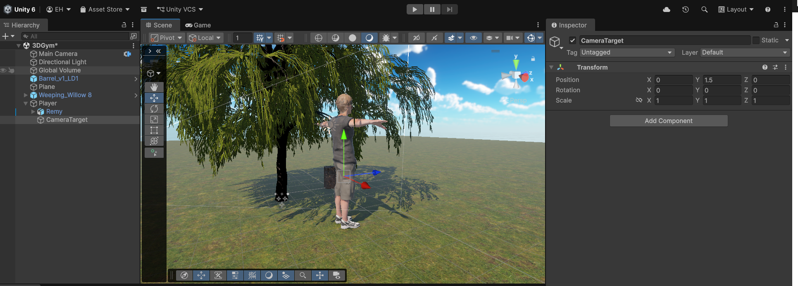
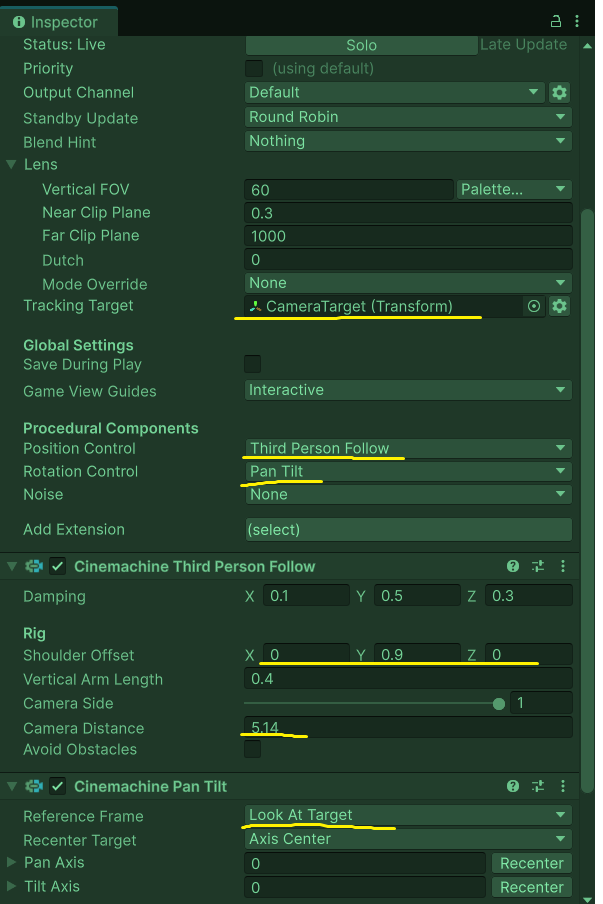
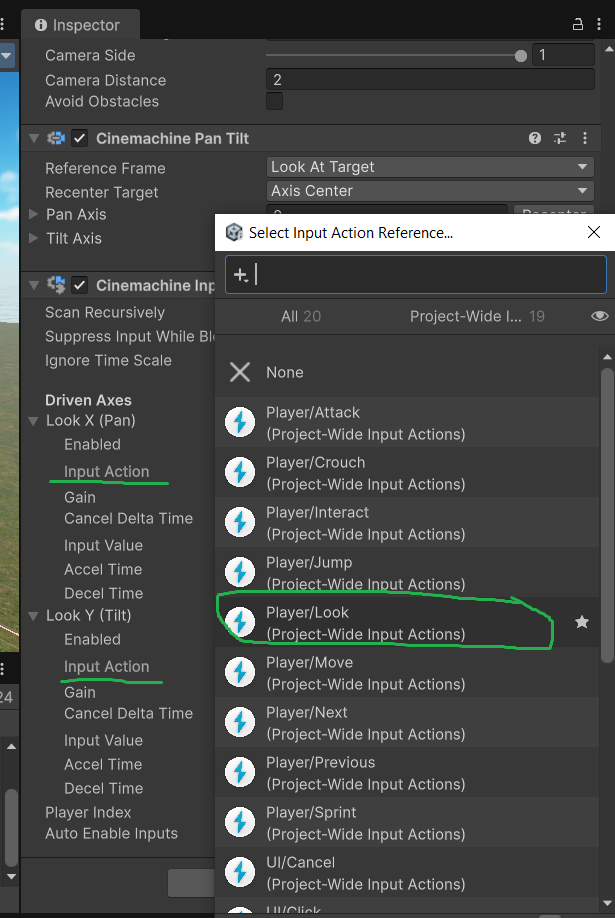

# M4 GDV HNR LES 5: Cinemachine — Follow Camera met Pan & Tilt

Deze les leren jullie het volgende:

- Je kunt Cinemachine installeren en de `CinemachineBrain` instellen op de Main Camera
- Je begrijpt het verschil tussen `CinemachineBrain` en een `CinemachineCamera` (Virtual Camera)
- Je kunt een follow-camera instellen met `CinemachineOrbitalFollow` voor pan & tilt besturing
- Je kunt de `Look`-actie uit het Input System koppelen aan Cinemachine
- Je kunt wisselen tussen twee Virtual Cameras via een knop

In deze les laat ik zien hoe je een professionele third-person camera opzet met Cinemachine. Je kunt direct meedoen of kijken en aantekeningen maken.

De uitgebreide stap-voor-stap instructie staat hier: [Les07_StepByStep.md](../Uitleg/stepbystep/Les07_Cinemachine_PanTilt.md)

---

## Hoe werkt Cinemachine?

Cinemachine werkt met twee onderdelen:

| Onderdeel                            | Zit op           | Taak                                                          |
| ------------------------------------ | ---------------- | ------------------------------------------------------------- |
| `CinemachineBrain`                   | Main Camera      | Luistert naar alle Virtual Cameras en beslist welke actief is |
| `CinemachineCamera` (Virtual Camera) | Eigen GameObject | Definieert hoe de camera beweegt en kijkt                     |

Je kunt meerdere Virtual Cameras maken (follow-cam, overview-cam, cutscene-cam) en ze wisselen via **prioriteit** of vanuit **code**. De CinemachineBrain zorgt voor soepele overgangen (blends) tussen de camera's.

**Pan** = horizontale draaiing (links/rechts om de speler draaien)  
**Tilt** = verticale draaiing (omhoog/omlaag kijken)

---

## Oefening 1 — Cinemachine installeren & Brain instellen (~5 min)

Ik laat zien hoe je Cinemachine installeert en de brain koppelt:

> Cinemachine 3 is niet zomaar beschikbaar in de package manager. Gebruik het plusje en installeer cinemachine 3 via 'install by name'. Vul als naam in : `com.unity.cinemachine` en bij versie `3.1.5`. Druk op `install`. Je hoeft Cinemachine versie 2 niet eerst te installeren.



1. Ga naar **Window > Package Manager** → **Unity Registry** → zoek **Cinemachine** → installeer versie **3.1.5**.
2. Selecteer de **Main Camera** in de Hierarchy.
3. Controleer of `CinemachineBrain` automatisch is toegevoegd. Zo niet: **Add Component > Cinemachine > CinemachineBrain**.

---

## Oefening 2 — Virtual Camera aanmaken met ThirdPersonFollow (~15 min)

Ik laat zien hoe je een follow-camera instelt die de speler kan volgen:

**CameraTarget aanmaken op de speler:**

1. Selecteer het karakter in de Hierarchy → **rechtermuisknop > Create Empty** → noem het `CameraTarget`.
2. Zet de positie op Y = `1.5` (borsthoogte).



**Virtual Camera aanmaken:**

3. Ga naar **GameObject > Cinemachine > CinemachineCamera** → noem hem `VC_Follow`.
4. Sleep je `CameraTarget` object in het **Tracking Target** veld
5. Stel in onder `procedural components`:
   - **Position Control:** `Third Person Follow`
   - **Rotation Control:** `Pan Tilt`
6. Pas de settings van je **Third Person Follow** component aan:
   - **Shoulder Offset**: `x:0`, `y:1`, `z:0`
   - **Camera Distance**: `5.14`
     7.Pas de settings van je **Pan Tilt** component aan:
   - **Reference Frame**: `LookAtTarget`



> Speel met de verschillende opties om te kijken wat voor effect het heeft. Je hebt met de cinemachine alle vrijheid om zelf je camera gedrag in te stellen.


---

## Oefening 3 — Input System koppelen aan Cinemachine (~15 min)

Cinemachine 3 gebruikt de `CinemachineInputAxisController` voor musinput.

**Look-actie toevoegen aan het InputActionAsset:**

1. Open `InputSystem_Actions.inputactions`.
2. Voeg in de **Player** Action Map een actie toe: `Look`, **Action Type: Value**, **Control Type: Vector2**.
3. Voeg als binding toe: **Mouse/Delta** → **Save Asset**.

**Koppelen in Cinemachine:**

4. Selecteer `VC_Follow` → **Add Component > Cinemachine > CinemachineInputAxisController**.
5. In de Inspector: koppel **Look X** en **Look Y** aan de `Look`-actie.
6. Zet de waarde **Gain** bij **Look X** op `1` en bij **Look Y** op `-5`.



> Beweeg je muis in Play mode: de camera kijkt nog extra in de richting van je muisbeweging


---

## Oefening 4 — Camera tweaken: damping, recentering & De-occluding (~10 min)

Ik laat zien hoe je de camera een professioneler gevoel geeft:

**Damping** (soepel volgen):

In het `CinemachineThirdPersonFollow`-component:

- **Damping:** X = `0.5`, Y = `0.5`, Z = `0.5`

**Recentering** (camera keert automatisch terug achter de speler):

In het `CinemachinePanTilt`-component:

- **Recenter Target:** `Axis Center`

**Deoccluder** (camera gaat niet door muren):

- **Add Extension > CinemachineDeoccluder**
- **Strategy:** Pull Camera Forward, **Camera Radius:** `0.3`

---

## Oefening 5 — Tweede camera + wisselen via Tab (~20 min)

Ik maak een overview-camera en een script om tussen de twee te wisselen:

**Overview camera aanmaken:**

1. **GameObject > Cinemachine > CinemachineCamera** → noem hem `VC_Overview`.
2. Positioneer hoog boven de scene: Y = `20`, Rotation X = `90`.
3. Stel **Priority** in op `0` (follow-cam staat op `10`).

**CameraSwitch script:**

```csharp
using UnityEngine;
using UnityEngine.InputSystem;
using Unity.Cinemachine;

public class CameraSwitch : MonoBehaviour
{
    [SerializeField] private CinemachineCamera followCam;
    [SerializeField] private CinemachineCamera overviewCam;
    [SerializeField] private InputActionAsset inputAsset;
    private InputAction switchAction;
    private bool overviewActive = false;

    void Awake()
    {
        switchAction = inputAsset.FindActionMap("Player").FindAction("SwitchCamera");
    }

    void OnEnable()  { inputAsset.FindActionMap("Player").Enable(); }
    void OnDisable() { inputAsset.FindActionMap("Player").Disable(); }

    void Update()
    {
        if (switchAction.WasPressedThisFrame())
        {
            overviewActive = !overviewActive;
            followCam.Priority   = overviewActive ? 0  : 10;
            overviewCam.Priority = overviewActive ? 10 : 0;
        }
    }
}
```

4. Voeg `SwitchCamera` toe aan de InputActionAsset met binding **Keyboard/Tab**.
5. Stel in `CinemachineBrain` de **Default Blend** in op `EaseInOut`, `0.8` seconden.


---

## Huiswerk: Cinemachine in je 3D Gym

Voeg een werkende follow-camera toe aan je 3D Gym met het karakter uit les 4.

Zorg dat:

- De camera de speler volgt met pan & tilt via de muis
- Damping zorgt voor een soepel gevoel
- Recentering actief is
- De camera niet door muren gaat (Deoccluder)

Optioneel (voor snelle werkers):

- Er een tweede camera (overview) is die je kunt activeren via **Tab**
- De blend tussen de twee camera's soepel verloopt

Commit en push je voortgang naar je GitHub-repository en lever de link in op Simulise: `GD - M4 - GDV - HNR : Cinemachine Camera`
