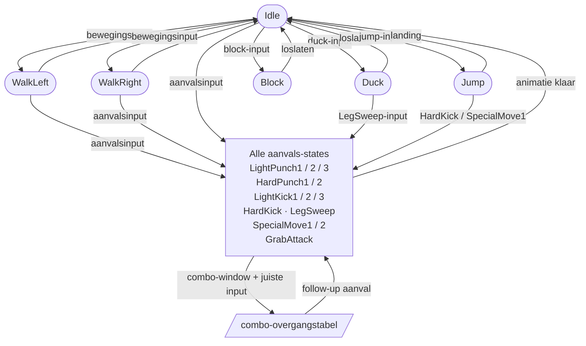
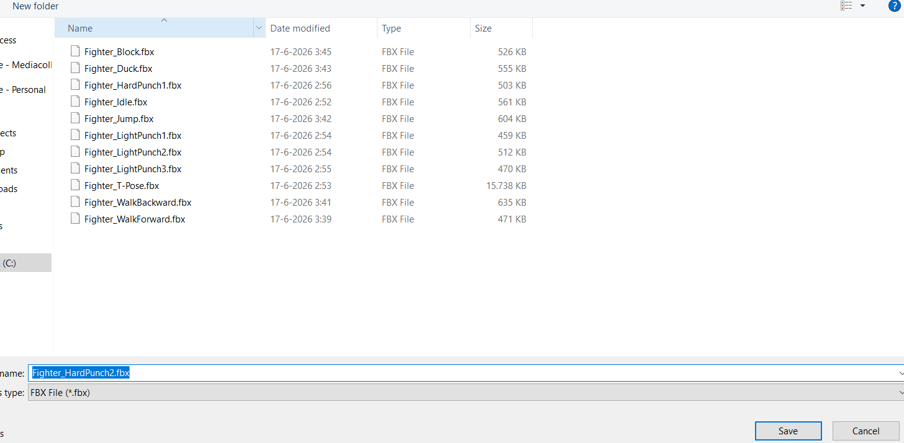
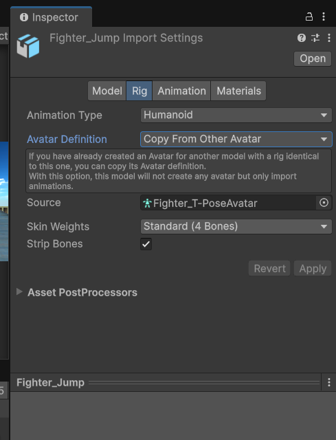
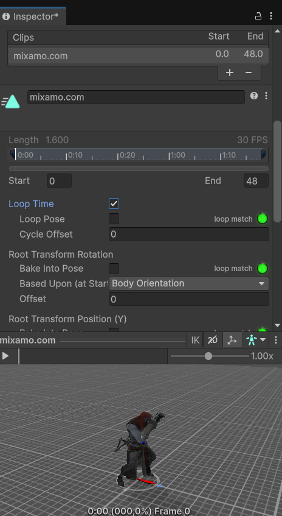
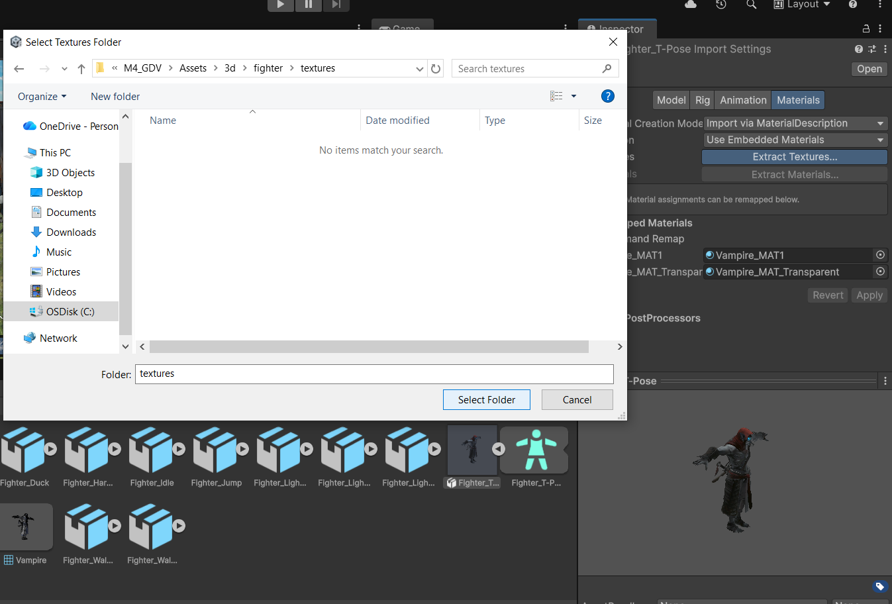
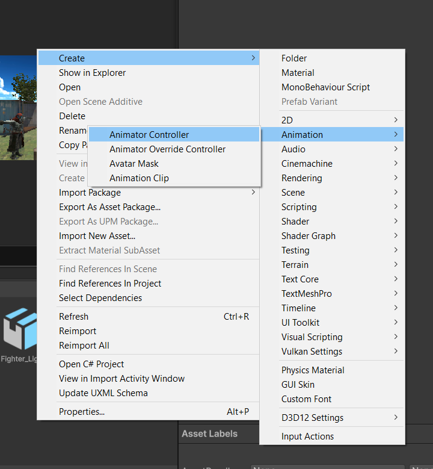
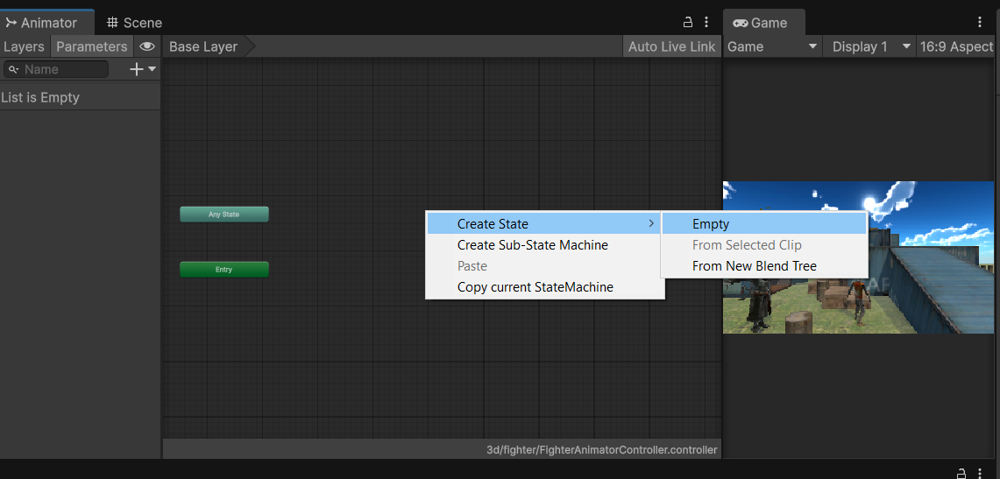
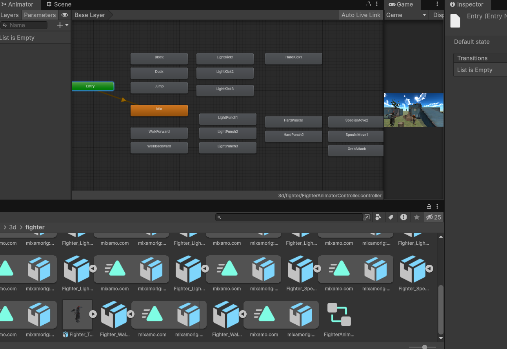

# State Machine voor Vecht-Animaties (Mortal Kombat stijl)

**Zelfstandige stap-voor-stap instructie**

---

## Leerdoelen

- Je begrijpt waarom een state machine essentieel is voor vecht-animaties
- Je kunt alle benodigde 3D-animaties downloaden van Mixamo (T-pose karakter + losse motion assets)
- Je kunt een Animator Controller opzetten met states voor elke aanval
- Je bouwt een modulair, herbruikbaar state machine systeem in C#
- Je implementeert een combo-systeem op basis van een overgangstabel
- Je koppelt alles aan een Input Controller voor beweging en aanvallen

---

## Projectopzet

Dit project simuleert de animatielaag van een 2.5D vecht-game (beweging links/rechts, aanvallen naar voren). Er wordt **geen tegenstander of volledige gameplay** gebouwd — de focus ligt op het aanroepen van animaties via een correcte state machine.

**Scripts die je bouwt:**

| Script                      | Verantwoordelijkheid                               |
| --------------------------- | -------------------------------------------------- |
| `FighterTypes.cs`           | Enums: alle states en aanvalsinputs                |
| `FighterStateMachine.cs`    | Beheert de actieve state en stuurt de Animator aan |
| `FighterComboSystem.cs`     | Houdt de combo-overgangstabel bij                  |
| `FighterInputController.cs` | Leest input en roept de state machine aan          |

---

## Waarom een State Machine? — Het probleem uitgelegd

Stel je schrijft aanvals-code zonder enige structuur:

```csharp
// SLECHT VOORBEELD — niet zo doen!
void Update()
{
    if (Input.GetKeyDown(KeyCode.U))
        animator.SetTrigger("LightPunch");

    if (Input.GetKeyDown(KeyCode.I))
        animator.SetTrigger("HardPunch");

    if (Input.GetKey(KeyCode.B))
        animator.SetBool("IsBlocking", true);
    else
        animator.SetBool("IsBlocking", false);
}
```

Probeer dit uit: druk snel meerdere keren op U en I. Je ziet direct meerdere bugs:

| Bug                           | Wat er misgaat                                                                                                                                                                                                             |
| ----------------------------- | -------------------------------------------------------------------------------------------------------------------------------------------------------------------------------------------------------------------------- |
| **Trigger-stapeling**         | Unity's Animator onthoudt triggers totdat ze zijn verwerkt. Druk je snel twee keer op U, dan worden beide triggers opgeslagen in een queue. Je karakter slaat twee keer achter elkaar — ook al was dat nooit de bedoeling. |
| **Tegenstrijdige states**     | Houd B ingedrukt en druk op U: je karakter blokkeert én slaat tegelijk, want er is geen controle die dit verbiedt.                                                                                                         |
| **Geen combo-context**        | Er is geen systeem dat bijhoudt op welke plek in een combo de speler zit. Elke druk op U start altijd Punch 1, nooit Punch 2 of 3 als vervolg.                                                                             |
| **Doorlekken van parameters** | Als je naar een andere scene laadt of het karakter hergebruikt, kunnen trigger-parameters actief blijven en meteen afgaan.                                                                                                 |
| **Geen herstelzekerheid**     | Als je code halverwege een animatie de flow onderbreekt (bijv. door een script-herstart), weet niets meer in welke state het karakter zit.                                                                                 |

**De oplossing: één centraal systeem** dat:

1. Bijhoudt welke state **actief** is (de _huidige_ state)
2. Controleert of een overgang **geldig** is (mag ik slaan terwijl ik spring?)
3. Bijhoudt wanneer een overgang **toegestaan** is (ben ik in het combo-window?)
4. De Animator **aanroept** op basis van die beslissing

---

## Overzicht van de State Machine



---

## Stap 1 — Karakter downloaden van Mixamo (T-pose)

1. Ga naar [mixamo.com](https://www.mixamo.com) en log in (gratis Adobe-account).
2. Klik bovenaan op **Characters** en kies een karakter (bijv. **Xbot** of een humanoid naar keuze).
3. Klik op **Use This Character**.
4. Klik op **Download**:
   - **Format:** FBX for Unity
   - **Skin:** With Skin
   - **Pose:** T-pose ← **belangrijk!**
5. Sla het bestand op als `Fighter_Model.fbx`.

> **T-pose is vereist** omdat Unity het Avatar-systeem (Humanoid Rig) gebruikt om animaties te hergebruiken op elk karakter. Het karakter moet in T-pose zijn zodat Unity de bones correct kan mappen.

> 📸 **Screenshot suggestie:** Mixamo website met het gekozen karakter in T-pose en de downloadinstellingen (Format: FBX for Unity, Skin: With Skin, Pose: T-pose) zichtbaar in het downloadvenster.

---

## Stap 2 — Animaties downloaden van Mixamo

Download voor **elke** animatie hieronder een apart FBX-bestand. Gebruik steeds dezelfde instellingen:

- **Format:** FBX for Unity
- **Skin:** Without Skin ← want je hebt het model al
- **Frames per Second:** 30
- **Keyframe Reduction:** None

Zoek in Mixamo op de zoekterm in de tabel en kies de animatie die het beste bij een vecht-karakter past. Sla elk bestand op met de gegeven naam — die namen komen later terug in de Animator Controller.

| Bestandsnaam               | Mixamo zoekterm               | Loop | Notitie                    |
| -------------------------- | ----------------------------- | ---- | -------------------------- |
| `Fighter_Idle.fbx`         | `Idle` of `Standing Idle`     | AAN  | Rustig staan               |
| `Fighter_WalkForward.fbx`  | `Walking`                     | AAN  | Stap naar voren            |
| `Fighter_WalkBackward.fbx` | `Walking Backward`            | AAN  | Stap achteruit             |
| `Fighter_Jump.fbx`         | `Standing Jump` of `Jump`     | UIT  | Sprong omhoog              |
| `Fighter_Duck.fbx`         | `Crouching` of `Crouch Idle`  | AAN  | Ingedoken houding          |
| `Fighter_Block.fbx`        | `Blocking` of `Guard`         | AAN  | Blok-houding               |
| `Fighter_LightPunch1.fbx`  | `Jab` of `Punching`           | UIT  | Snelle directe stoot (A1)  |
| `Fighter_LightPunch2.fbx`  | `Hook`                        | UIT  | Haak-stoot (A2)            |
| `Fighter_LightPunch3.fbx`  | `Uppercut`                    | UIT  | Opwaartse stoot (A3)       |
| `Fighter_HardPunch1.fbx`   | `Strong Punch` of `Big Punch` | UIT  | Zware stoot (B1)           |
| `Fighter_HardPunch2.fbx`   | `Cross` of `Spin Punch`       | UIT  | Draaiende stoot (B2)       |
| `Fighter_LegSweep.fbx`     | `Leg Sweep`                   | UIT  | Beenveeg (vanuit duck)     |
| `Fighter_LightKick1.fbx`   | `Front Kick` of `Kicking`     | UIT  | Snelle trap (LK1)          |
| `Fighter_LightKick2.fbx`   | `Roundhouse Kick`             | UIT  | Rondzwaaiende trap (B3/C1) |
| `Fighter_LightKick3.fbx`   | `Side Kick` of `Low Kick`     | UIT  | Zijwaartse trap (C2)       |
| `Fighter_HardKick.fbx`     | `Spin Kick` of `Jump Kick`    | UIT  | Zware trap (B4/C3)         |
| `Fighter_SpecialMove1.fbx` | `Spinning Kick` of `360 Kick` | UIT  | Speciale move 1            |
| `Fighter_SpecialMove2.fbx` | `Backflip` of `Flying Kick`   | UIT  | Speciale move 2            |
| `Fighter_GrabAttack.fbx`   | `Strangling` of `Choke`       | UIT  | Greep-aanval (C4)          |

> 📸 **Screenshot suggestie:** Mixamo animatiepagina met de zoekopdracht "Roundhouse Kick" ingevuld, de animatie geselecteerd op het karakter, en de downloadinstellingen (Without Skin, 30fps) zichtbaar.



---

## Stap 3 — FBX-bestanden importeren in Unity

1. Maak een mapstructuur aan in je Project view:
   ```
   Assets/
   └── Fighter/
       ├── Models/       ← Fighter_Model.fbx
       └── Animations/   ← alle animatie-FBX-bestanden
   ```
2. Sleep `Fighter_Model.fbx` naar `Assets/Fighter/Models/`.
3. Sleep alle animatie-FBX-bestanden naar `Assets/Fighter/Animations/`.

### Rig instellen op het karakter-model

1. Selecteer `Fighter_Model.fbx` in de Project view.
2. Ga in de Inspector naar het tabblad **Rig**.
3. Stel **Animation Type** in op **Humanoid**.
4. Klik **Apply**.
5. Klik op **Configure...** en controleer of alle botten groen zijn. Klik **Done**.

### Rig instellen op alle animatie-FBX-bestanden

Herhaal dit voor elke animatie-FBX (bijv. `Fighter_LightPunch1.fbx`):

1. Selecteer de animatie-FBX.
2. Rig → Animation Type → **Humanoid**.
3. **Avatar Definition** → **Copy From Other Avatar**.
4. Sleep het Avatar van `Fighter_Model.fbx` naar het **Source**-veld.
5. Klik **Apply**.

> 📸 **Screenshot suggestie:** Inspector van een animatie-FBX (bijv. Fighter_LightPunch1.fbx), tabblad Rig, met Animation Type = Humanoid en Avatar Definition = Copy From Other Avatar ingesteld, en het karakter-avatar gekoppeld.



### Loop Time instellen per animatie

Voor elke animatie-FBX:

1. Selecteer de FBX.
2. Ga naar het tabblad **Animation**.
3. Selecteer de clip in de lijst onderin.
4. Stel **Loop Time** in:
   - **Idle, WalkForward, WalkBackward, Duck, Block:** AAN Loop Time aan, AAN Loop Pose aan
   - **Alle aanvals-animaties, Jump:** UIT Loop Time uit
5. Vink bij in-place animaties ook aan:
   - Root Transform Rotation → Bake Into Pose AAN
   - Root Transform Position (XZ) → Bake Into Pose AAN
6. Klik **Apply**.



### Materials uitpakken (alleen Fighter_Model.fbx)

1. Selecteer `Fighter_Model.fbx`.
2. Tabblad **Materials** → **Extract Textures...** → kies `Assets/Fighter/Textures/`.
3. **Extract Materials...** → kies `Assets/Fighter/Materials/`.
4. Klik **Apply**.



---

## Stap 4 — Animator Controller opzetten

In dit project gebruiken we `animator.CrossFade()` vanuit code om direct naar een state te springen. Dit betekent dat je **geen transitions of parameters** nodig hebt in de Animator Controller — alleen de states met de juiste namen en animaties.

### Animator Controller aanmaken

1. Klik rechts in de Project view → **Create → Animator Controller**.
2. Noem het `FighterAnimatorController`.
3. Sleep het naar het `Assets/Fighter/` mapje.



### States aanmaken

1. Dubbelklik op `FighterAnimatorController` om de **Animator**-window te openen.
2. Klik rechts in het venster → **Create State → Empty** voor elke state in de tabel.
3. Hernoem elke state **exact** zoals in de onderstaande kolom "State naam" (rechtermuisknop → **Rename**). Hoofdletters tellen!
4. Sleep de bijbehorende animatie-clip vanuit de Project view naar het **Motion**-veld van de state.



| State naam     | Animatie-clip (uit FBX) | Loop Time |
| -------------- | ----------------------- | --------- |
| `Idle`         | Fighter_Idle            | AAN       |
| `WalkForward`  | Fighter_WalkForward     | AAN       |
| `WalkBackward` | Fighter_WalkBackward    | AAN       |
| `Jump`         | Fighter_Jump            | UIT       |
| `Duck`         | Fighter_Duck            | AAN       |
| `Block`        | Fighter_Block           | AAN       |
| `LightPunch1`  | Fighter_LightPunch1     | UIT       |
| `LightPunch2`  | Fighter_LightPunch2     | UIT       |
| `LightPunch3`  | Fighter_LightPunch3     | UIT       |
| `HardPunch1`   | Fighter_HardPunch1      | UIT       |
| `HardPunch2`   | Fighter_HardPunch2      | UIT       |
| `LegSweep`     | Fighter_LegSweep        | UIT       |
| `LightKick1`   | Fighter_LightKick1      | UIT       |
| `LightKick2`   | Fighter_LightKick2      | UIT       |
| `LightKick3`   | Fighter_LightKick3      | UIT       |
| `HardKick`     | Fighter_HardKick        | UIT       |
| `SpecialMove1` | Fighter_SpecialMove1 >  | UIT       |
| `SpecialMove2` | Fighter_SpecialMove2    | UIT       |
| `GrabAttack`   | Fighter_GrabAttack      | UIT       |

> De state `Idle` wordt automatisch de **default state** (oranje). Is dat niet zo, klik dan rechts op Idle → **Set as Layer Default State**.

> Er zijn **geen transitions** nodig tussen states. De code gebruikt `CrossFade()` om direct naar elke state te springen.



> 📸 **Screenshot suggestie:** Animator Controller window met alle 19 states zichtbaar als blokken in het raster, de Idle-state oranje gemarkeerd als default. Geen pijlen/transitions tussen de states.

> 📸 **Screenshot suggestie:** Inspector van de state `LightPunch1` in de Animator Controller, met de animatie-clip ingesteld in het Motion-veld en Loop Time uitgevinkt.

---

## Stap 5 — Script: `FighterTypes.cs`

Dit bestand bevat de twee enums die door alle andere scripts worden gebruikt. Maak het aan in `Assets/Fighter/Scripts/`.

```csharp
// FighterTypes.cs
// Centrale definitie van alle states en aanvalsinputs.
// Voeg hier nieuwe states toe wanneer je het systeem uitbreidt.

public enum FighterState
{
    Idle         = 0,
    WalkForward  = 1,
    WalkBackward = 2,
    Jump         = 3,
    Duck         = 4,
    Block        = 5,
    LightPunch1  = 6,   // Combo A1
    LightPunch2  = 7,   // Combo A2
    LightPunch3  = 8,   // Combo A3
    HardPunch1   = 9,   // Combo B1
    HardPunch2   = 10,  // Combo B2
    LegSweep     = 11,
    LightKick1   = 12,
    LightKick2   = 13,  // Combo B3 / C1
    LightKick3   = 14,  // Combo C2
    HardKick     = 15,  // Combo B4 / C3
    SpecialMove1 = 16,
    SpecialMove2 = 17,
    GrabAttack   = 18   // Combo C4
}

public enum AttackInput
{
    LightPunch,
    HardPunch,
    LightKick,
    HardKick,
    LegSweep,
    Grab,
    SpecialMove1,
    SpecialMove2
}
```

> De namen in `FighterState` moeten **exact** overeenkomen met de state-namen in de Animator Controller — inclusief hoofdletters. De code gebruikt `state.ToString()` om de juiste state op te zoeken.

---

## Stap 6 — Script: `FighterStateMachine.cs`

Dit is het kern-script. Het:

- Houdt de actieve state bij
- Valideert of een overgang geldig is
- Stuurt de Animator aan via `CrossFade`
- Detecteert wanneer een aanvals-animatie klaar is en keert terug naar Idle

```csharp
// FighterStateMachine.cs
using UnityEngine;
using System.Collections.Generic;

public class FighterStateMachine : MonoBehaviour
{
    [Header("Componenten")]
    [SerializeField] private Animator animator;

    [Header("Timing")]
    [Tooltip("Vanaf welk punt in de animatie (0-1) de volgende combo-input wordt geaccepteerd.")]
    [SerializeField, Range(0.3f, 0.95f)] private float comboWindowStart = 0.55f;

    [Tooltip("Blend-tijd in seconden voor de CrossFade-overgang.")]
    [SerializeField, Range(0f, 0.2f)] private float transitionDuration = 0.05f;

    private FighterState _currentState = FighterState.Idle;

    // States waarbij de animatie eenmalig afgespeeld wordt en daarna teruggaat naar Idle
    private static readonly HashSet<FighterState> AttackStates = new HashSet<FighterState>
    {
        FighterState.LightPunch1, FighterState.LightPunch2, FighterState.LightPunch3,
        FighterState.HardPunch1,  FighterState.HardPunch2,
        FighterState.LegSweep,
        FighterState.LightKick1,  FighterState.LightKick2, FighterState.LightKick3,
        FighterState.HardKick,
        FighterState.SpecialMove1, FighterState.SpecialMove2,
        FighterState.GrabAttack
    };

    // States vanwaaruit elke overgang is toegestaan (vrije bewegingsstates)
    private static readonly HashSet<FighterState> InterruptibleStates = new HashSet<FighterState>
    {
        FighterState.Idle,
        FighterState.WalkForward,
        FighterState.WalkBackward
    };

    public FighterState CurrentState => _currentState;

    private void Awake()
    {
        if (animator == null)
            animator = GetComponent<Animator>();
    }

    private void Update()
    {
        CheckAttackAnimationEnd();
    }

    // Detecteert wanneer een aanvals-animatie klaar is en keert terug naar Idle
    private void CheckAttackAnimationEnd()
    {
        if (!IsAttack(_currentState)) return;
        if (animator.IsInTransition(0)) return;

        AnimatorStateInfo info = animator.GetCurrentAnimatorStateInfo(0);
        if (info.normalizedTime >= 0.95f)
            ForceTransition(FighterState.Idle);
    }

    /// <summary>
    /// Probeert een state-overgang. Geeft true terug als de overgang is gelukt.
    /// Roep dit aan vanuit de InputController of het ComboSystem.
    /// </summary>
    public bool TryTransition(FighterState targetState)
    {
        if (_currentState == targetState) return false;

        // Vanuit vrij bewegende states: vrijwel alles is toegestaan
        if (IsInterruptible(_currentState))
        {
            ForceTransition(targetState);
            return true;
        }

        // Aanvals-state → combo-follow-up: alleen in het combo-window
        if (IsAttack(_currentState) && IsAttack(targetState))
        {
            if (IsInComboWindow())
            {
                ForceTransition(targetState);
                return true;
            }
            return false; // Animatie is nog niet ver genoeg voor combo-input
        }

        // Duck: alleen LegSweep of terugkeer naar Idle toegestaan
        if (_currentState == FighterState.Duck)
        {
            if (targetState == FighterState.LegSweep || targetState == FighterState.Idle)
            {
                ForceTransition(targetState);
                return true;
            }
            return false;
        }

        // Jump: alleen HardKick of SpecialMove1 als luchtaanval
        if (_currentState == FighterState.Jump)
        {
            if (targetState == FighterState.HardKick || targetState == FighterState.SpecialMove1)
            {
                ForceTransition(targetState);
                return true;
            }
            return false;
        }

        // Block: kan alleen worden vrijgelaten (→ Idle, WalkForward, WalkBackward)
        if (_currentState == FighterState.Block)
        {
            if (!IsAttack(targetState))
            {
                ForceTransition(targetState);
                return true;
            }
            return false;
        }

        return false;
    }

    /// <summary>
    /// Geeft true als de actieve aanvals-animatie in het combo-window zit.
    /// </summary>
    public bool IsInComboWindow()
    {
        if (!IsAttack(_currentState)) return false;
        if (animator.IsInTransition(0)) return false;

        AnimatorStateInfo info = animator.GetCurrentAnimatorStateInfo(0);
        return info.normalizedTime >= comboWindowStart && info.normalizedTime < 0.95f;
    }

    public bool IsAttack(FighterState state)       => AttackStates.Contains(state);
    public bool IsInterruptible(FighterState state) => InterruptibleStates.Contains(state);

    // Voert de overgang daadwerkelijk uit: update de interne state en stuur de Animator aan
    private void ForceTransition(FighterState newState)
    {
        _currentState = newState;
        animator.CrossFade(newState.ToString(), transitionDuration, 0);
    }
}
```

### Hoe CrossFade werkt

`animator.CrossFade("LightPunch1", 0.05f, 0)` instrueert de Animator om in **0.05 seconden** te blenden naar de state met de naam `"LightPunch1"` op layer 0. Er zijn geen parameters of transitions in de Animator Controller nodig — de state-naam is voldoende.

> **Tip:** Houd `transitionDuration` laag (0.05–0.1) voor scherpe, vecht-game-achtige overgangen. Te hoge waarden geven een "trage" indruk.

---

## Stap 7 — Script: `FighterComboSystem.cs`

Dit script bevat de **combo-overgangstabel**: een opzoektabel die bepaalt wat er moet gebeuren als de speler een aanvalsinput geeft terwijl hij al een aanval uitvoert.

De tabel is volledig configureerbaar vanuit de Inspector — je hoeft geen code aan te passen om een combo toe te voegen of te verwijderen.

```csharp
// FighterComboSystem.cs
using UnityEngine;
using System.Collections.Generic;

[System.Serializable]
public class ComboTransition
{
    [Tooltip("De state die momenteel actief is.")]
    public FighterState fromState;

    [Tooltip("De aanvalsinput die de speler geeft in het combo-window.")]
    public AttackInput input;

    [Tooltip("De state die wordt uitgevoerd als combo-follow-up.")]
    public FighterState toState;
}

public class FighterComboSystem : MonoBehaviour
{
    [Header("Combo-overgangstabel")]
    [Tooltip("Definieer hier alle combo-verbindingen. Elke rij is: huidige state + input → volgende state.")]
    [SerializeField] private List<ComboTransition> comboTable = new List<ComboTransition>();

    private Dictionary<(FighterState, AttackInput), FighterState> _comboDict;

    private void Awake()
    {
        BuildDictionary();
    }

    private void BuildDictionary()
    {
        _comboDict = new Dictionary<(FighterState, AttackInput), FighterState>();

        foreach (ComboTransition entry in comboTable)
        {
            var key = (entry.fromState, entry.input);
            if (!_comboDict.ContainsKey(key))
                _comboDict.Add(key, entry.toState);
            else
                Debug.LogWarning($"[ComboSystem] Dubbele combo-entry genegeerd: {entry.fromState} + {entry.input}");
        }
    }

    /// <summary>
    /// Zoekt op of er een combo-follow-up bestaat voor de huidige state en input.
    /// Geeft null terug als er geen combo-overgang is gedefinieerd.
    /// </summary>
    public FighterState? GetComboFollowUp(FighterState currentState, AttackInput input)
    {
        if (_comboDict.TryGetValue((currentState, input), out FighterState nextState))
            return nextState;
        return null;
    }

#if UNITY_EDITOR
    // Herbouwt de dictionary ook bij Inspector-wijzigingen in de Editor
    private void OnValidate()
    {
        BuildDictionary();
    }
#endif
}
```

---

## Stap 8 — Script: `FighterInputController.cs`

Dit script leest de input van de speler en vertaalt die naar state-overgangen via de state machine en het combo-systeem.

```csharp
// FighterInputController.cs
using UnityEngine;
using System.Collections.Generic;

[RequireComponent(typeof(FighterStateMachine))]
[RequireComponent(typeof(FighterComboSystem))]
[RequireComponent(typeof(Rigidbody))]
public class FighterInputController : MonoBehaviour
{
    [Header("Beweging")]
    [SerializeField] private float moveSpeed = 3f;
    [SerializeField] private float jumpForce = 6f;

    // Welke state wordt standaard geactiveerd per aanvalsinput (buiten combo-context)
    private static readonly Dictionary<AttackInput, FighterState> DefaultAttacks =
        new Dictionary<AttackInput, FighterState>
        {
            { AttackInput.LightPunch,  FighterState.LightPunch1 },
            { AttackInput.HardPunch,   FighterState.HardPunch1  },
            { AttackInput.LightKick,   FighterState.LightKick1  },
            { AttackInput.HardKick,    FighterState.HardKick    },
            { AttackInput.LegSweep,    FighterState.LegSweep    },
            { AttackInput.Grab,        FighterState.GrabAttack  },
            { AttackInput.SpecialMove1, FighterState.SpecialMove1 },
            { AttackInput.SpecialMove2, FighterState.SpecialMove2 },
        };

    private FighterStateMachine _stateMachine;
    private FighterComboSystem  _comboSystem;
    private Rigidbody           _rb;
    private bool                _isGrounded = true;

    private void Awake()
    {
        _stateMachine = GetComponent<FighterStateMachine>();
        _comboSystem  = GetComponent<FighterComboSystem>();
        _rb           = GetComponent<Rigidbody>();
    }

    private void Update()
    {
        HandleMovement();
        HandleAttacks();
    }

    private void HandleMovement()
    {
        // Beweging is alleen toegestaan vanuit vrij-bewegende states
        bool canMove = _stateMachine.IsInterruptible(_stateMachine.CurrentState);
        float h = canMove ? Input.GetAxisRaw("Horizontal") : 0f;

        // Horizontale snelheid instellen via Rigidbody (behoudt verticale zwaartekracht)
        Vector3 velocity = _rb.velocity;
        velocity.x = h * moveSpeed;
        _rb.velocity = velocity;

        // Duck (ingedrukt houden)
        if (canMove && (Input.GetKey(KeyCode.DownArrow) || Input.GetKey(KeyCode.S)))
        {
            _stateMachine.TryTransition(FighterState.Duck);
            return;
        }

        // Block (ingedrukt houden)
        if (canMove && Input.GetKey(KeyCode.B))
        {
            _stateMachine.TryTransition(FighterState.Block);
            return;
        }

        // Beweging staat-overgang
        if (canMove)
        {
            if (h > 0.1f)       _stateMachine.TryTransition(FighterState.WalkForward);
            else if (h < -0.1f) _stateMachine.TryTransition(FighterState.WalkBackward);
            else                _stateMachine.TryTransition(FighterState.Idle);
        }

        // Springen
        if (Input.GetKeyDown(KeyCode.Space) && _isGrounded &&
            _stateMachine.IsInterruptible(_stateMachine.CurrentState))
        {
            _stateMachine.TryTransition(FighterState.Jump);
            _rb.AddForce(Vector3.up * jumpForce, ForceMode.Impulse);
            _isGrounded = false;
        }
    }

    private void HandleAttacks()
    {
        // Aanvalsinputs — pas de keybindings hier aan naar wens
        if (Input.GetKeyDown(KeyCode.U))      TryAttack(AttackInput.LightPunch);
        if (Input.GetKeyDown(KeyCode.I))      TryAttack(AttackInput.HardPunch);
        if (Input.GetKeyDown(KeyCode.J))      TryAttack(AttackInput.LightKick);
        if (Input.GetKeyDown(KeyCode.K))      TryAttack(AttackInput.HardKick);
        if (Input.GetKeyDown(KeyCode.L))      TryAttack(AttackInput.LegSweep);
        if (Input.GetKeyDown(KeyCode.G))      TryAttack(AttackInput.Grab);
        if (Input.GetKeyDown(KeyCode.Alpha1)) TryAttack(AttackInput.SpecialMove1);
        if (Input.GetKeyDown(KeyCode.Alpha2)) TryAttack(AttackInput.SpecialMove2);
    }

    private void TryAttack(AttackInput input)
    {
        // 1. Controleer of we in een combo-window zitten en er een follow-up bestaat
        if (_stateMachine.IsInComboWindow())
        {
            FighterState? followUp = _comboSystem.GetComboFollowUp(_stateMachine.CurrentState, input);
            if (followUp.HasValue)
            {
                _stateMachine.TryTransition(followUp.Value);
                return;
            }
        }

        // 2. Geen combo of buiten het window: gebruik de standaard aanval voor deze input
        if (DefaultAttacks.TryGetValue(input, out FighterState defaultState))
            _stateMachine.TryTransition(defaultState);
    }

    private void OnCollisionEnter(Collision collision)
    {
        if (collision.gameObject.CompareTag("Ground"))
        {
            _isGrounded = true;
            if (_stateMachine.CurrentState == FighterState.Jump)
                _stateMachine.TryTransition(FighterState.Idle);
        }
    }
}
```

### Toetsenbordindeling

| Toets      | Actie                    |
| ---------- | ------------------------ |
| ← / →      | Bewegen links / rechts   |
| `S` of `↓` | Duck (ingedrukt houden)  |
| `B`        | Block (ingedrukt houden) |
| `Space`    | Springen                 |
| `U`        | Light Punch              |
| `I`        | Hard Punch               |
| `J`        | Light Kick               |
| `K`        | Hard Kick                |
| `L`        | Leg Sweep                |
| `G`        | Grab                     |
| `1`        | Special Move 1           |
| `2`        | Special Move 2           |

---

## Stap 9 — Scene opzetten

### Karakter toevoegen

1. Sleep `Fighter_Model.fbx` vanuit de Project view naar de **Hierarchy**.
2. Stel de Transform in:
   - Position: `(0, 0, 0)`
   - Rotation: `(0, 90, 0)` ← karakter kijkt naar rechts (richting tegenstander)
3. Voeg een **Rigidbody**-component toe:
   - Constraints → Freeze Rotation: AAN X, AAN Z (voorkomt omvallen)
   - Constraints → Freeze Position: AAN Z (beweegt alleen op X-as)
4. Voeg een **Capsule Collider** toe (past hem aan de grootte van het karakter aan).

### Animator Controller koppelen

1. Selecteer het karakter in de Hierarchy.
2. In het **Animator**-component: sleep `FighterAnimatorController` naar het **Controller**-veld.

### Scripts toevoegen

Voeg deze scripts toe als componenten op het karakter GameObject (klik **Add Component**):

1. `FighterStateMachine`
2. `FighterComboSystem`
3. `FighterInputController`

In de Inspector van `FighterStateMachine`:

- Sleep het **Animator**-component naar het veld **Animator** (of laat het leeg — het script vindt het automatisch via `GetComponent`).

### Vloer toevoegen

1. Maak een **Plane** aan (GameObject → 3D Object → Plane).
2. Schaal: `(3, 1, 3)`, positie: `(0, 0, 0)`.
3. Voeg een **Box Collider** toe.
4. Geef het de tag **Ground** (bovenaan in de Inspector → Tag → Add Tag → "Ground").

> 📸 **Screenshot suggestie:** Hierarchy met het Fighter-karakter geselecteerd, Inspector rechts met de Animator-component (FighterAnimatorController ingesteld), Rigidbody (constraints ingesteld), Capsule Collider, en de drie fighter-scripts zichtbaar als componenten.

---

## Stap 10 — Combo-definities instellen in de Inspector

Selecteer het karakter in de Hierarchy en zoek het **FighterComboSystem**-component op. Klik op het **+** in de **Combo Table**-lijst om rijen toe te voegen.

Vul de volgende combo-overgangen in:

### Combo A — Light Punch keten (A1 → A2 → A3)

| #   | From State  | Input      | To State    |
| --- | ----------- | ---------- | ----------- |
| 1   | LightPunch1 | LightPunch | LightPunch2 |
| 2   | LightPunch2 | LightPunch | LightPunch3 |

**Uitvoering:** Druk drie keer op `U` (elke keer in het combo-window).

### Combo B — Zware keten (B1 → B2 → B3 → B4)

| #   | From State | Input     | To State   |
| --- | ---------- | --------- | ---------- |
| 3   | HardPunch1 | HardPunch | HardPunch2 |
| 4   | HardPunch2 | LightKick | LightKick2 |
| 5   | LightKick2 | HardKick  | HardKick   |

**Uitvoering:** `I` → `I` → `J` → `K` (elk in het combo-window).

### Combo C — Trap keten (C1 → C2 → C3 → C4)

| #   | From State | Input     | To State   |
| --- | ---------- | --------- | ---------- |
| 6   | LightKick1 | LightKick | LightKick2 |
| 7   | LightKick2 | LightKick | LightKick3 |
| 8   | LightKick3 | HardKick  | HardKick   |
| 9   | HardKick   | Grab      | GrabAttack |

**Uitvoering:** `J` → `J` → `J` → `K` → `G` (elk in het combo-window).

> **Let op:** `LightKick2` komt zowel in Combo B (als B3) als in Combo C (als C1) voor. De overgang is onverduidelijk omdat de inputs verschillend zijn: vanuit `LightKick2` geeft `J` (LightKick) combo C-vervolg (`LightKick3`), terwijl `K` (HardKick) combo B afsluit (`HardKick`). Geen conflict.

> 📸 **Screenshot suggestie:** Inspector van het Fighter-karakter met het FighterComboSystem-component open, alle 9 rijen van de Combo Table ingevuld met From State, Input en To State.

---

## Stap 11 — Testen en debuggen

### Basistest

1. Druk op **Play**.
2. Druk op `←` / `→`: het karakter loopt links en rechts.
3. Druk op `U`: LightPunch1 speelt af en keert terug naar Idle.
4. Druk snel drie keer op `U`: je ziet LightPunch1 → LightPunch2 → LightPunch3 als combo.
5. Houd `B` ingedrukt: Block-animatie speelt. Laat los: terug naar Idle.
6. Houd `S` ingedrukt: Duck-animatie. Druk dan op `L`: LegSweep.

### Animator-window als debugtool

1. Open **Window → Animation → Animator** terwijl de game in Play-mode is.
2. Selecteer het karakter in de Hierarchy.
3. Je ziet de actieve state groen oplichten en kunt animatie-overgangen live volgen.

> 📸 **Screenshot suggestie:** Unity in Play-modus, Animator-window geopend naast de Game-view, met de staat `LightPunch2` groen gemarkeerd (midden in de animatie), en de normalizedTime voortgangsbalk zichtbaar.

### Veelvoorkomende problemen

| Probleem                | Mogelijke oorzaak                                                | Oplossing                                                           |
| ----------------------- | ---------------------------------------------------------------- | ------------------------------------------------------------------- |
| Karakter beweegt niet   | Rigidbody Freeze Position Z niet ingesteld                       | Freeze Z in Rigidbody Constraints                                   |
| Animatie speelt niet af | State-naam klopt niet (bijv. `Lightpunch1` i.p.v. `LightPunch1`) | Controleer hoofdletters in Animator Controller                      |
| Combo werkt niet        | `comboWindowStart` te hoog of te laag                            | Verlaag naar 0.4 voor een groter window                             |
| Karakter valt om        | Rigidbody Freeze Rotation X/Z niet aangevinkt                    | Vink beide rotation constraints aan                                 |
| LegSweep werkt niet     | Duck-state wordt niet herkend                                    | Controleer of duck-toets `S` of `↓` is en de state `Duck` heet      |
| T-pose zichtbaar        | Avatar niet correct gekoppeld                                    | Herhaal Stap 3: kopieer Avatar van het model naar elke animatie-FBX |

---

## Overzicht van de complete keybindings en statemachine-regels

```
INPUT               HUIDIGE STATE         RESULTAAT
──────────────────────────────────────────────────────────────────
U (LightPunch)      Idle/Walk             → LightPunch1
U                   LightPunch1 + window  → LightPunch2  (Combo A)
U                   LightPunch2 + window  → LightPunch3  (Combo A)
I (HardPunch)       Idle/Walk             → HardPunch1
I                   HardPunch1 + window   → HardPunch2   (Combo B)
J (LightKick)       Idle/Walk             → LightKick1
J                   LightKick1 + window   → LightKick2   (Combo C)
J                   LightKick2 + window   → LightKick3   (Combo C)
I (na B2)           HardPunch2 + window   → LightKick2   (Combo B)
K (HardKick)        Idle/Walk             → HardKick
K                   LightKick2 + window   → HardKick     (Combo B/C)
K                   LightKick3 + window   → HardKick     (Combo C)
G (Grab)            HardKick + window     → GrabAttack   (Combo C)
L (LegSweep)        Duck                  → LegSweep
Space               Idle/Walk (grond)     → Jump
K of 1              Jump                  → HardKick / SpecialMove1
1, 2                Idle/Walk             → SpecialMove1 / SpecialMove2
S / ↓ (houden)      Idle/Walk             → Duck
B (houden)          Idle/Walk             → Block
```

---

## Uitbreidingsideeën

| Uitbreiding                         | Aanpak                                                                                                                                              |
| ----------------------------------- | --------------------------------------------------------------------------------------------------------------------------------------------------- |
| **Tweede speler**                   | Maak een tweede GameObject met dezelfde scripts. Geef het een aparte `PlayerIndex` en pas de keybindings aan in `FighterInputController`.           |
| **Treffersdetectie**                | Voeg hitboxen toe als child-GameObjects op de vuist/voet. Activeer ze alleen tijdens de actieve aanvals-frames via een AnimationEvent.              |
| **Schade en health bar**            | Voeg een `FighterHealth`-script toe dat luistert naar hitbox-overlap events.                                                                        |
| **Gezichtsrichting**                | Vergelijk X-positie van beide spelers en draai het karakter met `transform.localScale.x = -1` / `1`.                                                |
| **Input System (nieuw)**            | Vervang de `Input.GetKeyDown`-aanroepen door Unity's **Input System Package** met een `PlayerInput`-component voor betere controller-ondersteuning. |
| **Animatie-events voor sounds/VFX** | Voeg `AnimationEvent`s toe op aanvals-clips om op het juiste frame een inslag-geluid of particle-effect te starten.                                 |
